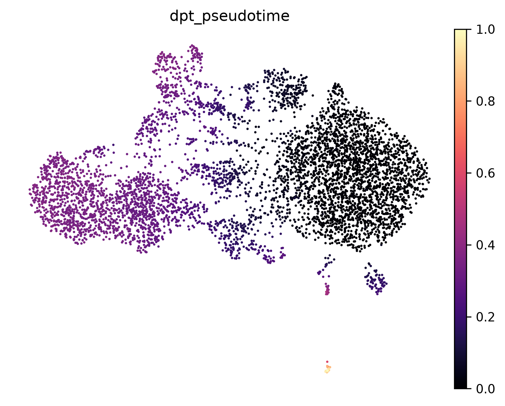
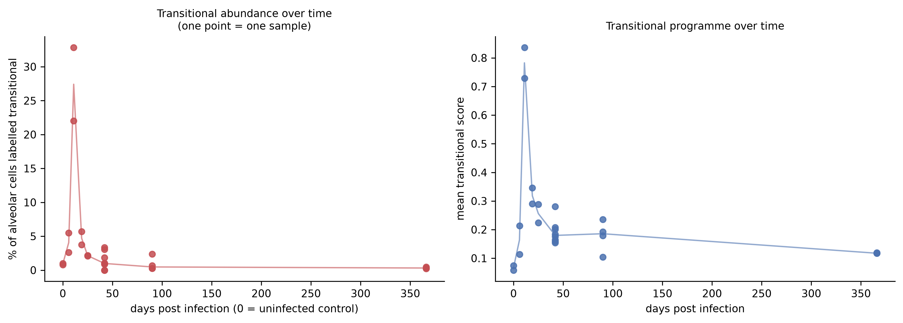
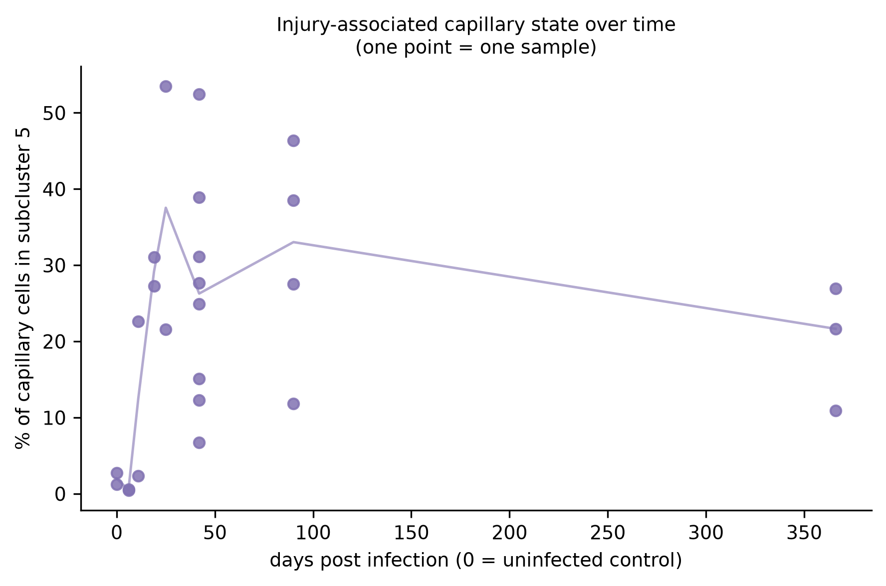
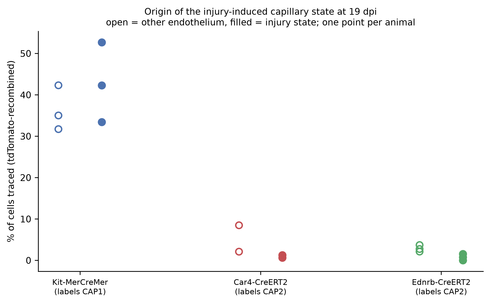
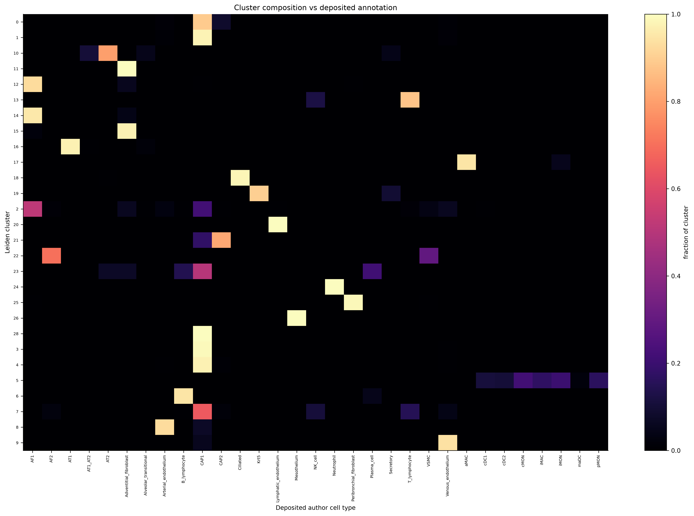
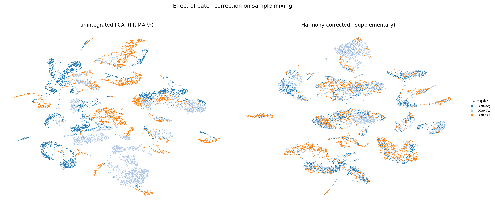

# Findings

An independent Python/scanpy reanalysis of two public single-cell RNA-seq
datasets of lung biology, built from the deposited raw count matrices with no
use of the authors' processed objects. The central question throughout: **can
the published biology be recovered from the raw data by an independent
pipeline — and where it can't, why not?**

| Dataset | Species | Design | Cells analysed | Source paper |
|---|---|---|---|---|
| [GSE262927](https://www.ncbi.nlm.nih.gov/geo/query/acc.cgi?acc=GSE262927) | mouse | H1N1 influenza injury, 33 samples, uninjured → 366 dpi | 162,175 | Niethamer et al., *Cell Stem Cell* 2025 |
| [GSE178360](https://www.ncbi.nlm.nih.gov/geo/query/acc.cgi?acc=GSE178360) | human | healthy distal lung, 3 donors | 27,729 | Kadur Lakshminarasimha Murthy et al., *Nature* 2022 |

The deposited author annotations were **held out of every clustering and
trajectory step** and used only afterwards, as an answer key. Full methods:
[`docs/PIPELINE_AS_RUN.md`](docs/PIPELINE_AS_RUN.md). Full per-dataset reports:
[`analysis/GSE262927/`](analysis/GSE262927/README.md) ·
[`analysis/GSE178360/`](analysis/GSE178360/README.md).

---

## 1 · The alveolar regeneration trajectory is recoverable from raw counts

The paper's central regeneration claim is that AT2 progenitor cells transit
through a Krt8⁺ transitional state on their way to becoming AT1 cells after
influenza injury. Re-derived here on the 25-sample annotated cohort
(5,694 alveolar epithelial cells) with PAGA topology and diffusion pseudotime
rooted in AT2:

With the deposited labels held out, pseudotime orders them exactly as the
model predicts: **AT2 0.013 → transitional 0.179 → AT1/AT2 0.237 → AT1
0.327** (median diffusion pseudotime per label). The transitional state behaves
like a true intermediate in time as well: its abundance **peaks at 27.4% of
alveolar epithelium at 11 dpi and collapses to 0.3% by 366 dpi**.

Detail: [`analysis/GSE262927/regeneration_focus/`](analysis/GSE262927/regeneration_focus/) ·
script [`06_regeneration_focus.py`](analysis/scripts/06_regeneration_focus.py)

## 2 · The capillary injury state never resolves

The paper's second headline is an injury-associated capillary endothelial
state (iCAP) that, unlike the transitional epithelium, persists. The
sub-analysis of 43,359 capillary cells reproduces exactly that shape: the
state is nearly absent in homeostasis (**2.0%**), surges to **37.5% at
25 dpi**, and is still at **21.7% one year after infection** — the
transitional state's mirror image.

## 3 · Lineage tracing supports a CAP1 origin for the injury state

Eight samples in the series are a separate lineage-tracing experiment (Kit,
Car4 and Ednrb Cre drivers, pre-labelled before injury, 19 dpi) and were
analysed as their own cohort — merging them into the atlas would conflate two
incompatible designs. Two results:

- The reporter-based trace-call rule reproduces the authors' own trace labels
  at **100.0000% over 107,626 annotated atlas cells** — the calling logic is
  exact, not approximate.
- In the Kit line (which labels CAP1 capillaries), the injury state is traced
  at **33–53% per animal**, supporting a CAP1 origin. The CAP2-specific lines
  (Car4, Ednrb) label only 2–8% of endothelium, so their near-zero trace rates
  are **uninformative rather than negative** — a distinction the numbers force
  and the report states explicitly.

Detail: [`analysis/GSE262927/lineage_tracing_cohort/`](analysis/GSE262927/lineage_tracing_cohort/) ·
script [`07_lineage_tracing_cohort.py`](analysis/scripts/07_lineage_tracing_cohort.py)

## 4 · Unsupervised clustering recovers the published cell types

The whole-atlas mouse analysis (162,175 cells, Leiden resolution 0.3 → 29
clusters) was annotated blind, from curated marker panels only. Scored against
the deposited author cell-type labels afterwards, **median cluster purity is
0.947** across the 107,626 labelled cells.

The disagreements are reported as prominently as the agreements: the
marker-panel annotation is **contradicted by the deposited labels for 3 of 29
clusters**, and those proposals are flagged `[CONTRADICTED]` in the
annotation table and on the UMAP. The instructive case is cluster 0 — its
panel score said "transitional epithelium", but it is 89.2% CAP1 capillary
endothelium whose top markers are interferon-stimulated genes: an
infection-response *state* masquerading as a cell *type*.

## 5 · Batch correction is a decision, not a default — and the two datasets decide it differently

**Mouse: no correction.** Every sample belongs to exactly one experimental
group, so sample identity and the influenza time course are the same variable
— correcting on sample would delete the experiment. The test was therefore
reframed: do biological replicates *within* a group fail to mix? Measured
within-group replicate enrichment was **1.374** (1.0 = perfect mixing), so no
correction was applied. Reading the paper afterwards confirmed the call: the
authors integrated nothing.

**Human: Harmony.** The three donors are healthy biological replicates of the
same tissue, so donor separation *is* technical. In the uncorrected embedding,
single proposed cell types fragmented into donor-private clusters
(`qc/celltype_split_by_sample.csv`) — one cell type is not several cell types
in several donors. With Harmony as the primary embedding, **4 of 31 clusters
are >75% single-donor** and the automated donor-driven-clustering check
reports **false**. Notably, the pipeline's own automated rule did *not*
recommend integration here (donor, batch and biology are confounded with no
condition metadata); Harmony was an explicit, recorded override on the
fragmentation evidence, with the unintegrated embedding retained for
comparison.

Reasoning in full, including what the papers changed:
[`docs/ANALYSIS_RATIONALE.md`](docs/ANALYSIS_RATIONALE.md)

## 6 · Negative results and self-audits

These are kept deliberately — an analysis that cannot show its failed checks
cannot be trusted on its passed ones.

- **The Scrublet bias scare, run to ground.** A crude co-expression gate
  suggested Scrublet was removing the human paper's novel AT0 population at up
  to 2× the background rate. A stricter gate that can actually separate real
  AT0 from AT2+club doublets (SFTPC⁺ SCGB3A2⁺ EPCAM⁺, lineage-negative)
  overturned it: AT0 flagged at **3.9% vs a 6.3% baseline**, and the cells the
  crude gate "lost" carry 1.8× the UMIs of their neighbours — they were
  doublets. Lesson recorded: a co-expression gate cannot audit a co-expression
  detector. [`docs/DOUBLETS_AND_SCRUBLET.md`](docs/DOUBLETS_AND_SCRUBLET.md)
- **Doublet thresholds are a ranking cut here, not a detection.** Scrublet's
  automatic threshold was acceptable in only 1 of 33 mouse samples; elsewhere
  the expected-rate quantile was substituted, and every substitution is logged
  per sample in `qc/doublet_summary.csv`.
- **The MAD upper bounds never bind.** Zero cells were removed for excess
  counts/genes in either dataset; the reports say so rather than presenting
  the ceilings as an applied filter.
- **The marker-panel annotator fails on states.** See cluster 0 above — kept
  as a documented failure mode rather than silently corrected.

---

## Known limitations

Stated in full in [`docs/PIPELINE_AS_RUN.md`](docs/PIPELINE_AS_RUN.md) and
[`PROGRESS.md`](PROGRESS.md); the ones that most constrain interpretation:

1. **No ambient-RNA correction** (SoupX needs raw droplet matrices that
   GSE262927 does not deposit). Matters most for soup-prone markers like
   *SFTPC* and for the haemoglobin-heavy human sample DD046Q.
2. **Mouse composition reflects a MACS sort ratio** (85–90% CD45⁻ recombined),
   not the lung — composition is only compared within a compartment.
3. **The whole-atlas mouse object merges two experiments**; every
   condition- or trace-related claim above therefore comes from the focused
   analyses, which restrict to the correct cohort.
4. **No formal trajectory DE** (tradeSeq-style) was fitted; programme changes
   along pseudotime are shown as binned marker summaries.
