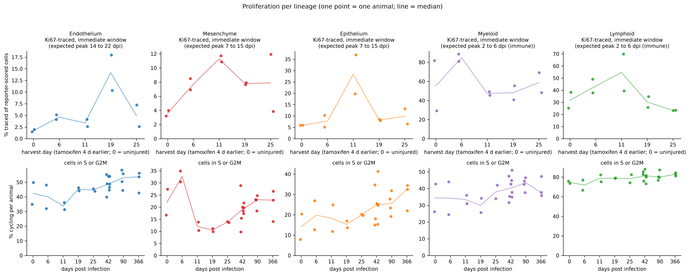
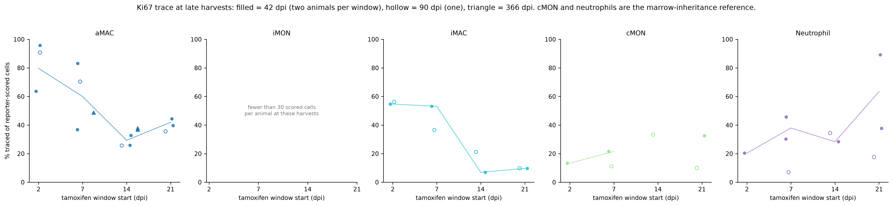
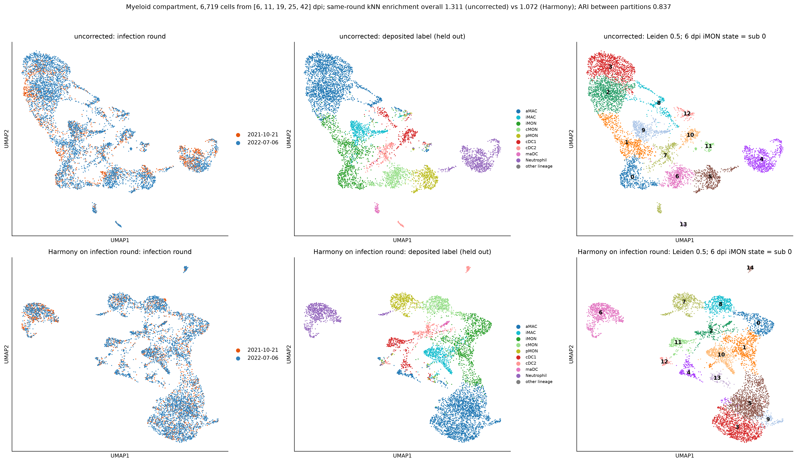

# Findings

An independent Python/scanpy reanalysis of two public single-cell RNA-seq
datasets of lung biology, built from the deposited raw count matrices with no
use of the authors' processed objects. This file is an analysis log. The
working question it moves toward is: **which epithelial and immune-state
programmes distinguish productive lung repair from persistent remodelling
after injury?** The Stage 0 question, asked first and answered in August 2026,
was narrower: can the published biology be recovered from the raw data by an
independent pipeline, and where it cannot, why not. Later stages build on the
Stage 0 answer rather than repeating it.

| Dataset | Species | Design | Cells analysed | Source paper |
|---|---|---|---|---|
| [GSE262927](https://www.ncbi.nlm.nih.gov/geo/query/acc.cgi?acc=GSE262927) | mouse | viral injury time course (H1N1), 33 samples, uninjured to 366 dpi | 162,175 | Niethamer et al., *Cell Stem Cell* 2025 |
| [GSE178360](https://www.ncbi.nlm.nih.gov/geo/query/acc.cgi?acc=GSE178360) | human | healthy distal lung, 3 donors | 27,729 | Kadur Lakshminarasimha Murthy et al., *Nature* 2022 |

The deposited author annotations were **held out of every clustering and
trajectory step** and used only afterwards, as an answer key. Full methods:
[`docs/PIPELINE_AS_RUN.md`](docs/PIPELINE_AS_RUN.md). Full per-dataset reports:
[`analysis/GSE262927/`](analysis/GSE262927/README.md) ·
[`analysis/GSE178360/`](analysis/GSE178360/README.md).

---

## Displaced

The alveolar regeneration trajectory (AT2 to Krt8-high transitional to AT1,
with its transitional time course and score) and the reference-aligned human
epithelial panels (KRT8, CLDN4, KRT17, SFN, with the AT0 candidate subcluster)
were part of this file until 2026-09-10 and now live in
[`archive/DISPLACED.md`](archive/DISPLACED.md), because they are established
outside this repository. Their artefacts and scripts stay under `analysis/` and
are still validated; the narrative is not extended here.

## 1 · The capillary injury state has not resolved by 366 dpi

The paper's second claim is an injury-associated capillary endothelial
state (iCAP) that persists. The sub-analysis of 43,359 capillary cells shows
the same shape: the median per-animal proportion is nearly absent in
homeostasis (**2.0%**), rises to **37.5% at 25 dpi**, and is **21.7% at
366 dpi**.

Detail: [`analysis/GSE262927/regeneration_focus/`](analysis/GSE262927/regeneration_focus/) ·
script [`06_regeneration_focus.py`](analysis/scripts/06_regeneration_focus.py)

## 2 · Lineage tracing supports a CAP1 origin for the injury state

Eight samples in the series are a separate lineage-tracing experiment (Kit,
Car4 and Ednrb Cre drivers, pre-labelled before injury, 19 dpi) and were
analysed as their own cohort; merging them into the atlas would conflate two
incompatible designs. Two results:

- The reporter-based trace-call rule reproduces the authors' own trace labels
  at **100.0000% over 107,626 annotated atlas cells**; the calling logic is
  exact, not approximate.
- In the Kit line (which labels CAP1 capillaries), the injury state is traced
  at **33 to 53% per animal**, supporting a CAP1 origin. The CAP2-specific lines
  (Car4, Ednrb) label only 2 to 8% of endothelium, so their near-zero trace rates
  are **uninformative rather than negative**, a distinction the numbers force
  and the report states explicitly.

Detail: [`analysis/GSE262927/lineage_tracing_cohort/`](analysis/GSE262927/lineage_tracing_cohort/) ·
script [`07_lineage_tracing_cohort.py`](analysis/scripts/07_lineage_tracing_cohort.py)

## 3 · Unsupervised clustering recovers the published cell types

The whole-atlas mouse analysis (162,175 cells, Leiden resolution 0.3 → 29
clusters) was annotated blind, from curated marker panels only. Scored against
the deposited author cell-type labels afterwards, **median cluster purity is
0.947** across the 107,626 labelled cells.

The disagreements are reported as prominently as the agreements: the
marker-panel annotation is **contradicted by the deposited labels for 3 of 29
clusters**, and those proposals are flagged `[CONTRADICTED]` in the
annotation table and on the UMAP. The instructive case is cluster 0: its
panel score said "transitional epithelium", but it is 89.2% CAP1 capillary
endothelium whose top markers are interferon-stimulated genes: an
infection-response *state* masquerading as a cell *type*.

## 4 · Batch correction is a decision, not a default; the two datasets decide it differently

**Mouse: no correction.** Every sample belongs to exactly one experimental
group, so sample identity and the injury time course are the same variable;
correcting on sample would delete the experiment. The test was therefore
reframed: do biological replicates *within* a group fail to mix? Measured
within-group replicate enrichment was **1.374** (1.0 = perfect mixing), so no
correction was applied. Reading the paper afterwards confirmed the call: the
authors integrated nothing.

**Human: Harmony.** The three donors are healthy biological replicates of the
same tissue, so donor separation *is* technical. In the uncorrected embedding,
single proposed cell types fragmented into donor-private clusters
(`qc/celltype_split_by_sample.csv`); one cell type is not several cell types
in several donors. With Harmony as the primary embedding, **4 of 31 clusters
are >75% single-donor** and the automated donor-driven-clustering check
reports **false**. Notably, the pipeline's own automated rule did *not*
recommend integration here (donor, batch and biology are confounded with no
condition metadata); Harmony was an explicit, recorded override on the
fragmentation evidence, with the unintegrated embedding retained for
comparison.

Reasoning in full, including what the papers changed:
[`docs/ANALYSIS_RATIONALE.md`](docs/ANALYSIS_RATIONALE.md)

## Stage 1 follow-ups (Descriptive only, owner review pending)

Four follow-ups were run in September 2026 on the paper's phase structure and
myeloid compartment, using the 25-sample Ki67 atlas only. The animal is the
unit, medians are reported, and no P value is computed (two animals per
active-repair day). Each run has a record with its rules frozen before the data
were opened; the claims register ([`CLAIMS.md`](CLAIMS.md), rows C9 to C18)
carries the status of every claim drawn from them.

**Phase-wise proliferation.** The Ki67 trace, read per lineage in each
cohort's immediate window, reproduces the paper's asynchronous phases
descriptively; the deposited lineage labels are used as given.

Trace peaks fall at 6 dpi for myeloid cells (median per-animal 84.85% traced),
at 11 dpi for epithelium (28.35%) and mesenchyme (11.29%), and at 19 dpi for
endothelium (14.16%), agreeing with the paper's expected window for 4 of 5
lineages; lymphoid cells peak at 11 dpi (54.7%) rather than 6, and the
deposited cell-cycle call agrees for 1 of 5 lineages and is a cross-check only.
Detail: [`analysis/GSE262927/phase_timecourse/`](analysis/GSE262927/phase_timecourse/README.md)

**Myeloid compartment by day.** Atlas clusters 5, 17 and 24 were re-embedded
without the deposited labels and graded against them afterwards; composition
per animal is then read from the labels.

In 9,997 cells, 16 subclusters at Leiden 0.5 place a fraction of 0.8723 of the
labelled cells in subclusters of purity at least 0.75 (0.4837 at Leiden 0.2,
0.923 at 1.0); median per-animal alveolar macrophages fall from 30.84% of
myeloid cells at baseline to 4.6% at 6 dpi and rebuild to 49.01% by 42 dpi,
inflammatory monocytes rise from 1.94% to 55.97% and return to 1.79%, and
interstitial macrophages rise from 2.76% at baseline to 10.28% at 42 dpi and
13.97% at 90 dpi before 7.66% at 366 dpi.
Detail: [`analysis/GSE262927/myeloid_focus/`](analysis/GSE262927/myeloid_focus/README.md)

**Origin of the rebuilt alveolar macrophage pool.** The Ki67 trace is read by
tamoxifen window at the common 42 dpi harvest (two animals per window), with
each animal's classical monocytes and neutrophils as the reference for
labelling inherited from marrow progenitors.

The 2 to 3 dpi window labels the largest share of the 42 dpi alveolar
macrophage pool (median per-animal traced fraction 79.72%, against 59.95%,
29.31% and 41.99% for the 7 to 8, 14 to 15 and 21 to 22 dpi windows); the
marrow-reference check was evaluable in 3 of 8 animals and the within-pool
split criterion was met in no window, so both checks are Not established under
the frozen 30-cell floor.
Detail: [`analysis/GSE262927/myeloid_focus/amac_origin/`](analysis/GSE262927/myeloid_focus/amac_origin/README.md)

**Batch sensitivity of the myeloid embedding.** The infection round (the
paper's Table S3) crosses time within every tested day, so the compartment was
embedded uncorrected and after Harmony on round and the two were compared; 0,
90 and 366 dpi carry a single round and were not tested.

Across 6,719 cells from 16 animals, same-round kNN enrichment per day is 1.105
to 1.459 uncorrected and 1.053 to 1.286 after Harmony (1 = mixed; failure
threshold 2), and after Harmony the 6 dpi inflammatory-monocyte state remains
one subcluster of 411 cells, 92.0% of them from 6 dpi at iMON purity 0.859,
holding 0.765 and 0.742 of the two 6 dpi animals' iMON cells (adjusted Rand
index between the partitions 0.837); the frozen definition of the state
selected the 11 to 19 dpi monocyte state instead, and the post hoc definition
anchored on the 6 dpi cells is disclosed alongside it.
Detail: [`analysis/GSE262927/myeloid_focus/batch_sensitivity/`](analysis/GSE262927/myeloid_focus/batch_sensitivity/README.md)

## 5 · Negative results and self-audits

These are kept deliberately; an analysis that cannot show its failed checks
cannot be trusted on its passed ones.

- **The Scrublet bias scare, run to ground.** A crude co-expression gate
  suggested Scrublet was removing the human paper's novel AT0 population at up
  to 2× the background rate. A stricter gate that can actually separate real
  AT0 from AT2+club doublets (SFTPC⁺ SCGB3A2⁺ EPCAM⁺, lineage-negative)
  overturned it: AT0 flagged at **3.9% vs a 6.3% baseline**, and the cells the
  crude gate "lost" carry 1.8× the UMIs of their neighbours; they were
  doublets. Lesson recorded: a co-expression gate cannot audit a co-expression
  detector. [`docs/DOUBLETS_AND_SCRUBLET.md`](docs/DOUBLETS_AND_SCRUBLET.md)
- **Doublet thresholds are a ranking cut here, not a detection.** Scrublet's
  automatic threshold was acceptable in only 1 of 33 mouse samples; elsewhere
  the expected-rate quantile was substituted, and every substitution is logged
  per sample in `qc/doublet_summary.csv`.
- **The MAD upper bounds never bind.** Zero cells were removed for excess
  counts/genes in either dataset; the reports say so rather than presenting
  the ceilings as an applied filter.
- **The marker-panel annotator fails on states.** See cluster 0 above, kept
  as a documented failure mode rather than silently corrected.

---

## Known limitations

Stated in full in [`docs/PIPELINE_AS_RUN.md`](docs/PIPELINE_AS_RUN.md) and
[`PROGRESS.md`](PROGRESS.md); the ones that most constrain interpretation:

1. **No ambient-RNA correction** (SoupX needs raw droplet matrices that
   GSE262927 does not deposit). Matters most for soup-prone markers like
   *SFTPC* and for the haemoglobin-heavy human sample DD046Q.
2. **Mouse composition reflects a MACS sort ratio** (85 to 90% CD45⁻ recombined),
   not the lung; composition is only compared within a compartment.
3. **The whole-atlas mouse object merges two experiments**; every
   condition- or trace-related claim above therefore comes from the focused
   analyses, which restrict to the correct cohort.
4. **No formal trajectory DE** (tradeSeq-style) was fitted; programme changes
   along pseudotime are shown as binned marker summaries.
