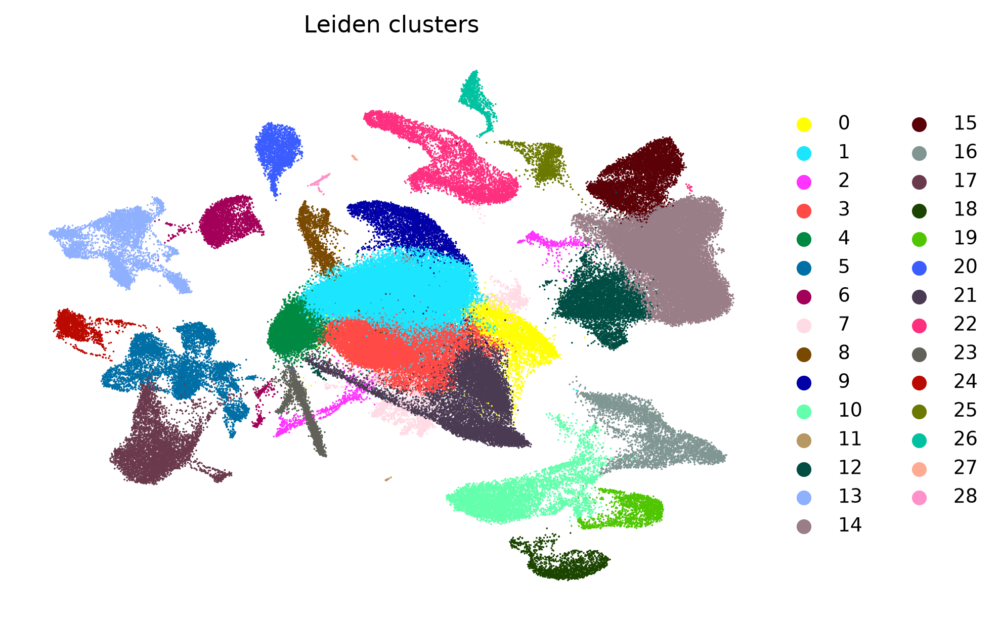

# Lung injury and repair states from public single-cell RNA-seq

[](https://github.com/xorca0711/scRNA_seq/actions/workflows/repository-checks.yml)
[](https://www.python.org/)

This repository is an analysis log. Public lung single-cell RNA-seq series
are re-analysed from the deposited count matrices, with the authors'
annotations held out of every model-fitting step and used only afterwards as
an answer key, to work on one question:

> Which epithelial and immune-state programmes distinguish productive lung
> repair from persistent remodelling after injury?

Two series are analysed in full under [`analysis/`](analysis/LAYOUT.md): a
mouse injury time course (H1N1 is the injury model; the analysis reads cell
states, niches, and macrophage and monocyte states, not the infection) and a
human distal-lung reference. Further series are added one paper at a time
along the roadmap in [`Thesis/`](Thesis/README.md), where each paper owns a
folder and its analyses sit beneath it; the most recent is a five-accession
deposit on early tumour niches, read in gates under
[`Thesis/gate2_05_cardoso_2026/`](Thesis/gate2_05_cardoso_2026/README.md). Material that is established elsewhere is
displaced to [`archive/`](archive/DISPLACED.md) rather than extended here.

## Claims

Status vocabulary: Validated (held-out labels or artefact-checked numbers),
Descriptive only, Exploratory, Retracted-superseded, Not established. Every
number below is read from a tracked artefact; the full register with the
analyses behind each claim, its artefact and its potential is
[`CLAIMS.md`](CLAIMS.md). Rows marked pending await the owner's retain or
reject decision in [`PROGRESS.md`](PROGRESS.md).

| Status | Claim | Where |
|---|---|---|
| Validated | Blind clustering recovers the deposited mouse cell types: median purity 0.947 over 107,626 labelled cells, with 3 of 29 marker-panel annotations contradicted and kept on display | [`analysis/GSE262927/`](analysis/GSE262927/README.md) |
| Validated | An injury-associated capillary state is still present at 366 dpi: median per-animal share 2.0% at baseline, 37.5% at 25 dpi, 21.7% at 366 dpi | [`regeneration_focus/`](analysis/GSE262927/regeneration_focus/) |
| Validated | The Kit lineage traces that state at 33 to 53% per animal (CAP1 origin); the CAP2 lines are uninformative, not negative | [`lineage_tracing_cohort/`](analysis/GSE262927/lineage_tracing_cohort/) |
| Validated (decision record) | Batch correction is decided per dataset from measured replicate mixing: none for the mouse series, Harmony for the human series | [`qc/batch_assessment.json`](analysis/GSE262927/qc/batch_assessment.json) |
| Descriptive only, pending | Proliferation runs in three phases in the Ki67 trace: myeloid cells at 6 dpi, epithelium and mesenchyme at 11, endothelium at 19 (4 of 5 lineages in the source paper's window) | [`phase_timecourse/`](analysis/GSE262927/phase_timecourse/README.md) |
| Descriptive only, pending | Alveolar macrophages fall from 30.8% to 4.6% of myeloid cells at 6 dpi and rebuild to 49.0% by 42 dpi while inflammatory monocytes rise from 1.9% to 56.0%; the 2 to 3 dpi window labels most of the rebuilt pool; the 6 dpi state survives Harmony on infection round | [`myeloid_focus/`](analysis/GSE262927/myeloid_focus/README.md) |
| Descriptive only, re-wording pending | The human distal-lung series carries an AT0-like minority; the earlier candidate subcluster is mostly AT2 or uncertain | [`Thesis/gate1_04_sikkema_2023_hlca/`](Thesis/gate1_04_sikkema_2023_hlca/README.md) |
| Exploratory | Interstitial macrophages keep rising through 90 dpi instead of resolving | [`myeloid_focus/`](analysis/GSE262927/myeloid_focus/README.md) |
| Retracted-superseded | Scrublet over-removes AT0-like cells (refuted by a stricter gate; the refutation is kept) | [`docs/DOUBLETS_AND_SCRUBLET.md`](docs/DOUBLETS_AND_SCRUBLET.md) |
| Not established | The marrow-inheritance and two-source checks on the rebuilt macrophage pool; the deposited cell-cycle call as a proliferation measure | [`amac_origin/`](analysis/GSE262927/myeloid_focus/amac_origin/README.md) |
| Descriptive only, pending | In a second paper's deposit, deleting the ligand Areg reproduces the published epithelial collapse from a blind pipeline: the regenerative-like state falls from 46.6% to 22.0% of lineage-labelled cells while AT2 rises from 29.2% to 59.1% | [`Thesis/gate2_05_cardoso_2026/`](Thesis/gate2_05_cardoso_2026/ANALYSIS_TRIAL_PLAN.md) |
| Descriptive only, pending | Areg is the top EGFR ligand of that state in all four mutant libraries by both abundance and enrichment over AT2 cells, and the state is nearly absent from wild-type clones of the same animals | [`gate2_05_cardoso_2026/`](Thesis/gate2_05_cardoso_2026/ANALYSIS_TRIAL_PLAN.md) |
| Exploratory, reading refuted | The fibrotic marker set responds to ligand deletion in three tiers rather than as one unit: Runx1 and Pdgfrb are retained, Fst and Runx2 lose most of their detection. The tiers stand; the second-signal reading of them is refuted, because both retained genes rise with bleomycin alone | [`gate2_05_cardoso_2026/`](Thesis/gate2_05_cardoso_2026/ANALYSIS_TRIAL_PLAN.md) |
| Validated | In human lung adenocarcinoma, AREG detection is higher in epithelial than in myeloid cells within the same donor: 0.336 against 0.215 over 11 donors, paired Wilcoxon p = 0.0020. The first claim in the Cardoso work whose unit allows a test | [`gate2_05_cardoso_2026/`](Thesis/gate2_05_cardoso_2026/ANALYSIS_TRIAL_PLAN.md) |
| Descriptive only, pending | Dendritic cells and monocytes carry AREG and HBEGF at or above the epithelial states in three human lung datasets across two diseases, a source no sort of labelled epithelium can see | [`gate2_05_cardoso_2026/`](Thesis/gate2_05_cardoso_2026/DIVERGENCES_AND_NEXT.md) |
| Not established | Neither AREG nor HBEGF is enriched in diseased human lung relative to matched normal or control lung, in either adenocarcinoma or fibrosis | [`gate2_05_cardoso_2026/`](Thesis/gate2_05_cardoso_2026/ANALYSIS_TRIAL_PLAN.md) |
| Not established | A pre-registered rule did not recover that paper's fibrotic fibroblast subset; the population is present, and the rule failed in four disclosed ways | [`gate2_05_cardoso_2026/`](Thesis/gate2_05_cardoso_2026/ANALYSIS_TRIAL_PLAN.md) |
| Displaced | The Krt8-high transitional trajectory and the human KRT8 reference panels are established elsewhere; artefacts stay, the narrative is archived | [`archive/DISPLACED.md`](archive/DISPLACED.md) |



## Datasets

| Series | What it is | Cells analysed | Source study |
|---|---|---|---|
| [GSE262927](https://www.ncbi.nlm.nih.gov/geo/query/acc.cgi?acc=GSE262927) | mouse lung injury time course (H1N1 as the injury model), uninjured to 366 dpi, 33 samples: a 25-sample Ki67 lineage atlas and an 8-sample Cre cohort | 162,175 | Niethamer et al., *Cell Stem Cell* 2025 |
| [GSE178360](https://www.ncbi.nlm.nih.gov/geo/query/acc.cgi?acc=GSE178360) | human distal lung, 3 healthy donors | 27,729 | Kadur Lakshminarasimha Murthy et al., *Nature* 2022 |

| | |
|---|---|
| Stack | Python 3.12, scanpy/AnnData, Scrublet, harmonypy, PAGA and diffusion pseudotime, scvi-tools for reference mapping |
| Unit and statistics | The animal or donor is the unit; medians per group; no P value where a group holds two animals |
| Provenance | Rules frozen in run records before data are opened; reports generated from artefacts |
| Checks | Dependency-free artefact validator, pinned environment, CI on every push |

## Where to go

| Question | Read |
|---|---|
| What has been claimed, what stands behind each claim, and which results have potential? | [`CLAIMS.md`](CLAIMS.md) |
| What was found, with figures? | [`FINDINGS.md`](FINDINGS.md) |
| How do the analyses relate, from the initial run to the follow-ups? | [`Thesis/gate1_01_niethamer_2025/ANALYSIS_TRIAL_PLAN.md`](Thesis/gate1_01_niethamer_2025/ANALYSIS_TRIAL_PLAN.md) |
| What exactly ran, with parameters? | [`docs/PIPELINE_AS_RUN.md`](docs/PIPELINE_AS_RUN.md) (generated) |
| How can I validate or reproduce it? | [`REPRODUCIBILITY.md`](REPRODUCIBILITY.md) |
| Why each analytical decision? | [`docs/ANALYSIS_RATIONALE.md`](docs/ANALYSIS_RATIONALE.md) |
| Who decided what, and what was rejected? | [`DEVELOPMENT.md`](DEVELOPMENT.md) |
| Machine context for AI sessions | [`AI_CONTEXT.md`](AI_CONTEXT.md) |
| Per-dataset reports, figures, QC | [`analysis/GSE262927/`](analysis/GSE262927/README.md), [`analysis/GSE178360/`](analysis/GSE178360/README.md) |
| Current state, known issues, pending decisions | [`PROGRESS.md`](PROGRESS.md) |
| The paper roadmap: study notes, extracted criteria, per-paper trials | [`Thesis/README.md`](Thesis/README.md) |
| What was displaced and why | [`archive/`](archive/DISPLACED.md) |

## Repository map

```
CLAIMS.md                    claims register: evidence, status, potential
FINDINGS.md                  findings with figures
DEVELOPMENT.md               who decided what; rejected output stays visible
PROGRESS.md                  living handoff: state, known issues, pending decisions
AI_CONTEXT.md                machine-oriented context for AI sessions
REPRODUCIBILITY.md           input layout, validation tiers, re-run guide
REFERENCES.md                papers, DOIs, data accessions
analysis/
  GSE262927/                 mouse series: report, figures, tables, QC, logs
    regeneration_focus/        capillary injury state (alveolar trajectory displaced)
    lineage_tracing_cohort/    the 8-sample Cre cohort
    phase_timecourse/          per-day atlas view, composition, proliferation (pending)
    myeloid_focus/             myeloid compartment; amac_origin/ and batch_sensitivity/ (pending)
    epithelial_subanalysis/
  GSE178360/                 human series: report, figures, tables, QC, logs
  scripts/                   the pipeline and the focused analyses
  LAYOUT.md                  what lives where, and why the cohorts differ
docs/                        rationale, background, generated pipeline record, source-study notes
Thesis/                      paper roadmap: study notes, extracted criteria, per-paper trials
archive/                     displaced material: what moved, when, and why
```

`raw_data/` (7.8 GB of GEO downloads) and all regenerable `.h5ad` objects are
gitignored; figures and small tables are tracked. No sequencing data, count
matrices or paper PDFs are committed.

## Reproducing

The tracked artefacts can be checked without downloading data or installing
scanpy:

```bash
python analysis/scripts/validate_repository.py
python -m compileall -q analysis/scripts
```

For a complete re-run, create a Python 3.12 environment, install the pinned
dependencies, and place the GEO downloads under `raw_data/<accession>/`:

```bash
python -m venv .venv
# Windows: .venv\Scripts\activate
# macOS/Linux: source .venv/bin/activate
python -m pip install -r analysis/requirements.txt

python analysis/scripts/01_scan_raw_data.py
python analysis/scripts/run_scrna_analysis.py --dataset GSE262927
python analysis/scripts/run_scrna_analysis.py --dataset GSE178360 --integration harmony
python analysis/scripts/06_regeneration_focus.py
python analysis/scripts/07_lineage_tracing_cohort.py
python analysis/scripts/10_phase_timecourse.py
python analysis/scripts/11_myeloid_focus.py
python analysis/scripts/12_amac_trace_by_window.py
python analysis/scripts/13_myeloid_batch_sensitivity.py
python analysis/scripts/03_write_report.py --dataset GSE262927
python analysis/scripts/03_write_report.py --dataset GSE178360
python analysis/scripts/08_reference_aligned_epithelial_umap.py
python analysis/scripts/05_write_pipeline_as_run.py
```

Exact inputs, expected directory layout, validation tiers, resource notes and
the output contract are in [`REPRODUCIBILITY.md`](REPRODUCIBILITY.md). Seeds
are fixed at 0 throughout; `--stages` resumes from checkpoints. The Windows
ARM64 execution constraints are documented in [`AI_CONTEXT.md`](AI_CONTEXT.md).

## Source studies

The mouse series' own published workflow (STARsolo, SoupX, scds and Scrublet,
Seurat, Slingshot, tradeSeq, in R) is documented as reference material in
[`docs/WORKFLOW_Niethamer2025.md`](docs/WORKFLOW_Niethamer2025.md) and
[`docs/scRNAseq_workflow_Niethamer2025.md`](docs/scRNAseq_workflow_Niethamer2025.md).
The analysis here is not a port of that workflow: it was built from the
deposited data alone and compared with the papers afterwards. The
tool-by-tool record of what was used and every divergence is
[`docs/PIPELINE_AS_RUN.md`](docs/PIPELINE_AS_RUN.md).

## Licence

Code and original written material are copyright 2026 Xorca; no reuse licence
is granted. See [`LICENSE`](LICENSE). The source papers and public datasets
remain the property of their respective authors and publishers; citations and
open-access links are in [`REFERENCES.md`](REFERENCES.md).
