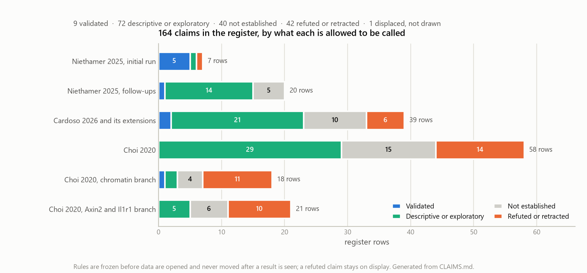

# Hypothesis generation from public lung single-cell and multiome data

[](https://github.com/xorca0711/scRNA_seq/actions/workflows/repository-checks.yml)
[](https://www.python.org/)

This repository is an analysis log with one purpose: hypothesis generation
from an integrative reanalysis of public lung data. Fifteen public lung
single-cell and multiome deposits from eleven studies, in mouse and human, are
re-analysed from the deposited count matrices with frameworks newer than the
source papers, with the authors' annotations held out of every model-fitting
step and used only afterwards as an answer key, to surface phenotypes and data
distributions the original analyses did not report. The hypotheses sit inside
one biological theme:

> Which epithelial and immune-state programmes distinguish productive lung
> repair from persistent remodelling after injury?

Rules are frozen in a run record before data are opened and never moved after
a result is seen. Where a rule was wrong, its first outcome stays and a
corrected pass sits beside it. The statistical unit is the animal or donor,
never the cell. A refuted claim stays on display. The product of all this is
the shape of the register below, not any single bar in it.



*161 register rows: 9 validated, 70 descriptive or exploratory, 39 not
established, 42 refuted or retracted, 1 displaced. Drawn from `CLAIMS.md` by
[`15_claims_ledger_figure.py`](analysis/scripts/15_claims_ledger_figure.py).*

**Start with [`RESEARCH_QUESTIONS.md`](RESEARCH_QUESTIONS.md)**: the science
organised by question rather than by trial, with the phenotypes and data
distributions the reanalysis surfaced and three follow-up analyses specified
on public data. The full register with every claim's evidence, artefact and status
is [`CLAIMS.md`](CLAIMS.md); everything refuted, retracted or unestablished is
[`NEGATIVE_RESULTS.md`](NEGATIVE_RESULTS.md), generated from the register so it
cannot drift.

## What stands

Status vocabulary: Validated (held-out labels or artefact-checked numbers),
Descriptive only, Exploratory, Retracted-superseded, Not established, Not establishable, Refuted.
Rows marked pending await the owner's retain or reject decision recorded in
[`DEVELOPMENT.md`](DEVELOPMENT.md).

| Status | Claim | Row |
|---|---|---|
| Validated | Blind clustering recovers the deposited mouse cell types: median purity 0.947 over 107,626 labelled cells, with 3 of 29 annotations contradicted and kept on display | C1, C8 |
| Validated | An injury-associated capillary state is still present at 366 dpi: median per-animal share 2.0% at baseline, 37.5% at 25 dpi, 21.7% at 366 dpi; the Kit lineage traces it at 33 to 53% per animal | C3, C4 |
| Validated | In human lung adenocarcinoma, AREG is higher in epithelial than in myeloid cells within donor: 0.336 against 0.215, 11 donors, paired p = 0.0020 | C37 |
| Validated | A multiome deposit's barcode-suffix order is inverted relative to its GEO sample order; the knockout carries 4.5 to 14.5 times more of its own target than its control in all three files | C116 |
| Descriptive only, pending | Alveolar macrophages fall from 30.8% to 4.6% of myeloid cells at 6 dpi and rebuild to 49.0% by 42 dpi; the 2 to 3 dpi window labels most of the rebuilt pool | C12, C15 |
| Exploratory, pending | Interstitial macrophages keep rising through 90 dpi (2.8% at baseline, 10.3% at 42, 14.0% at 90, 7.7% at 366; three to four animals) | C13 |
| Descriptive only, pending | Deleting the ligand Areg reproduces a published epithelial collapse from a blind pipeline: the regenerative-like state falls from 46.6% to 22.0% while AT2 rises from 29.2% to 59.1%; Areg is the top EGFR ligand of that state in all four mutant libraries | C27, C32 |
| Descriptive only, pending | Dendritic cells and monocytes carry AREG and HBEGF at or above the epithelial states in three human lung datasets, a source no sort of labelled epithelium can see | C45 |
| Descriptive only | AREG ranks first among the EGFR ligands in every curated ligand-receptor resource that contains them; the head of the ranking is otherwise a property of the resource (CellChatDB shares 0 of its top 15 pairs with italk) | C112, C113 |
| Descriptive only, pending | Four of the DATP paper's five states, the DATP time course (0.3, 18.2, 6.3% of alveolar lineage-labelled cells), and IL-1beta's shift of the organoid epithelium reproduce blind | C87, C89, C96 |
| Descriptive only | The Cldn4-positive Krt8-positive alveolar group loses the AT2 identity programme in RNA by 12.3 to 16.7 detection points at every one of four downsampling seeds in both injured wells (12.6 and 17.1 at M1e's single budget), across five or more genes, with the AT1 programme flat, in two multiome deposits that share a laboratory | C118 |
| Exploratory | The same group's AT2 distal chromatin sits at percentile 0.000, 0.007 and 0.000 of 300 matched random gene sets in the three wells that reached the statistic, one of them the uninjured control; a lean toward closing that the register does not settle, and no well is a clean positive | C131 |
| Not established | Whether AT2 chromatin closes in the transitional state; whether the primed AT2 state exists as a discrete cluster; whether Wnt-responsive and IL-1-responsive AT2 cells are distinct subsets at all, and whether their loci are open together in the same nuclei; the epithelium-to-fibroblast axis in human fibrosis at the donor level | C121, C88, C134, C135, C142, C49 |
| Refuted | A whole-resource ligand-receptor scan always surfaces matrix pairs on dissociated tissue (the domination is CellChatDB's, not the tissue's); the second-signal reading of a fibrotic marker signature (Runx1 and Pdgfrb rise with bleomycin alone); a Cldn4-positive Krt8-positive transcript call identifies an injury-induced state (two uninjured neonatal wells label 3.69% and 8.07% against at most 5.09% in any injured adult well, so the marker set is shared with normal development) | C111, C42, C119 |
| Retracted-superseded | "Silenced but not closed": the reading that the AT2 identity programme is silenced in RNA while its chromatin stays open, withdrawn when its positive control cleared in only five of eight resampling combinations | C120 |
| Refuted, and disclosed | Fourteen register rows were written from artefacts they did not match, found by an eight-adversary audit with independent verification and corrected with figures read from the tables | C151 |

## Datasets

Every deposit the log has opened, with the study it came from and where in
this repository it was read. Deposits are analysed under the roadmap paper
that motivated them. The two series that predate the roadmap sit beside their
source papers too: GSE262927 under paper 1, and GSE178360 under a folder for
its source paper, which is outside the reading list.

| Accession | Species and design | Source study | Read under | Unit and ceiling |
|---|---|---|---|---|
| [GSE262927](https://www.ncbi.nlm.nih.gov/geo/query/acc.cgi?acc=GSE262927) | mouse, respiratory-virus (H1N1) injury time course, uninjured to 366 dpi, 33 samples, 162,175 cells | Niethamer et al., *Cell Stem Cell* 2025 | [`Thesis/gate1_01_niethamer_2025/GSE262927/`](Thesis/gate1_01_niethamer_2025/GSE262927/README.md), [Stage 1 follow-ups](Thesis/gate1_01_niethamer_2025/ANALYSIS_TRIAL_PLAN.md), [HLCA trials S4, S5](Thesis/gate1_04_sikkema_2023_hlca/ANALYSIS_TRIAL_PLAN.md) | animal; 2 per active-repair day, 8 at 42 dpi |
| [GSE178360](https://www.ncbi.nlm.nih.gov/geo/query/acc.cgi?acc=GSE178360) | human, healthy distal lung, 3 donors, 27,729 cells | Kadur Lakshminarasimha Murthy et al., *Nature* 2022 | [`Thesis/ungated_murthy_2022/GSE178360/`](Thesis/ungated_murthy_2022/GSE178360/README.md), [HLCA trials S1 to S3](Thesis/gate1_04_sikkema_2023_hlca/ANALYSIS_TRIAL_PLAN.md) | donor; 3 |
| [GSE145031](https://www.ncbi.nlm.nih.gov/geo/query/acc.cgi?acc=GSE145031) | mouse, AT2 lineage-traced epithelium, PBS and bleomycin day 14 and 28, 6 libraries | Choi et al., *Cell Stem Cell* 2020 | [trials D0 to D7](Thesis/gate1_02_choi_2020/ANALYSIS_TRIAL_PLAN.md) | one library per condition; six matrices are raw barcode whitelists |
| [GSE144468](https://www.ncbi.nlm.nih.gov/geo/query/acc.cgi?acc=GSE144468) | mouse, AT2 organoids with and without IL-1beta, 2 libraries | Choi et al., *Cell Stem Cell* 2020 | [trials D5, D5b](Thesis/gate1_02_choi_2020/ANALYSIS_TRIAL_PLAN.md) | one library per arm |
| [GSE316241](https://www.ncbi.nlm.nih.gov/geo/query/acc.cgi?acc=GSE316241), [GSE316243](https://www.ncbi.nlm.nih.gov/geo/query/acc.cgi?acc=GSE316243), [GSE316244](https://www.ncbi.nlm.nih.gov/geo/query/acc.cgi?acc=GSE316244) | mouse, Confetti against Red2Kras mesenchyme and niche, and the Areg-flox arm; 8 libraries, 3 mice pooled each | Cardoso, Lee et al., *Nature* 2026 | [trials C0 to C2b, C5 to C11, C13](Thesis/gate2_05_cardoso_2026/trials/README.md) | one library per genotype; nothing between genotypes is testable |
| [GSE310335](https://www.ncbi.nlm.nih.gov/geo/query/acc.cgi?acc=GSE310335) | human, KRAS G12D alveolar organoids, 2 libraries | Cardoso, Lee et al., *Nature* 2026 | [trial C0](Thesis/gate2_05_cardoso_2026/trials/README.md) | one library per arm |
| [GSE247505](https://www.ncbi.nlm.nih.gov/geo/query/acc.cgi?acc=GSE247505) | mouse, Red2Kras clones by time and Il1r1 dosage, 20 libraries, 2 per timed or genotype group | England et al., *Cell Stem Cell* 2025 | [trial C3](Thesis/gate2_05_cardoso_2026/trials/README.md), [trial A2, on the GSE247504 sub-series](Thesis/gate1_02_choi_2020/axin2_il1r1/trials/README.md) | library; the Il1r1 deletion is not visible in the deposited counts, so genotype rests on metadata (C149) |
| [GSE131907](https://www.ncbi.nlm.nih.gov/geo/query/acc.cgi?acc=GSE131907) | human, lung adenocarcinoma and normal lung, 11 paired donors | Kim et al., *Nature Communications* 2020 | [trials E1, E1b](Thesis/gate2_05_cardoso_2026/trials/README.md) | donor; the one tested claim |
| [GSE136831](https://www.ncbi.nlm.nih.gov/geo/query/acc.cgi?acc=GSE136831) | human, idiopathic pulmonary fibrosis and control, 312,928 cells | Adams et al., *Science Advances* 2020 | [trials E2, E6, C12, C14](Thesis/gate2_05_cardoso_2026/trials/README.md) | donor; 26 in the resource scans, 22 in the coupling test, 7 and 3 in the rare-state comparisons |
| [GSE135893](https://www.ncbi.nlm.nih.gov/geo/query/acc.cgi?acc=GSE135893) | human, pulmonary fibrosis and control, 114,396 cells | Habermann et al., *Science Advances* 2020 | [trial E3](Thesis/gate2_05_cardoso_2026/trials/README.md) | donor |
| [GSE132771](https://www.ncbi.nlm.nih.gov/geo/query/acc.cgi?acc=GSE132771) | mouse, bleomycin against uninjured, collagen-producing cells | Tsukui et al., *Nature Communications* 2020 | [trial E4](Thesis/gate2_05_cardoso_2026/trials/README.md) | animal |
| [GSE310539](https://www.ncbi.nlm.nih.gov/geo/query/acc.cgi?acc=GSE310539) | mouse, 10x multiome, sorted epithelium 14 days after Sendai virus or PBS, wildtype and AP-1 mutant, 4 wells, 39,849 nuclei | Lynch et al., *Am J Respir Cell Mol Biol* 2026 | [trials M0 to M4](Thesis/gate1_02_choi_2020/datp_epigenetics/trials/README.md), [A1 to A1c](Thesis/gate1_02_choi_2020/axin2_il1r1/trials/README.md) | one well per condition, two mice pooled |
| [GSE247130](https://www.ncbi.nlm.nih.gov/geo/query/acc.cgi?acc=GSE247130) | mouse, 10x multiome, AT2 lineage, Cebpa mutant against control at P9, 7 weeks and after Sendai virus, 6 wells, 64,294 nuclei | Hassan and Chen, *Nature Communications* 2024 | [trials M0 to M4](Thesis/gate1_02_choi_2020/datp_epigenetics/trials/README.md), [A1 to A1c](Thesis/gate1_02_choi_2020/axin2_il1r1/trials/README.md) | one well per condition; **deposited suffix order inverted** |

Assessed and not opened: [GSE144598](https://www.ncbi.nlm.nih.gov/geo/query/acc.cgi?acc=GSE144598)
(the DATP paper's ATAC-seq, coverage tracks only, unusable);
[GSE309751](https://www.ncbi.nlm.nih.gov/geo/query/acc.cgi?acc=GSE309751)
(bulk ATAC-seq companion to GSE310539, 2 to 3 mice per group at 14 and 49
days, the only replicated chromatin contrast in reach). GSE150957 was never
opened and is recorded only in row C146, withdrawn as out of focus because bulk
cannot answer a co-occurrence question. Every opened deposit's citation is in
[`REFERENCES.md`](REFERENCES.md).

| | |
|---|---|
| Stack | Python 3.12, scanpy and AnnData, Scrublet, harmonypy, PAGA and diffusion pseudotime, scvi-tools and scArches for reference mapping, LIANA+ for ligand-receptor inference, h5py streaming for multiome matrices |
| Unit and statistics | The animal or donor is the unit; medians per group; no P value where a group holds two animals; sham bands and matched-gene-set nulls where cells are the only replicate |
| Provenance | Rules frozen in run records before data are opened; every summary generated from a tracked table; an audit of the register against its own artefacts is itself a register row |
| Checks | Dependency-free artefact validator, pinned environments for both the native and the emulated x86-64 interpreter, CI on every push |

## Where to go

| Question | Read |
|---|---|
| What are the questions, what do the data say, what would move them? | [`RESEARCH_QUESTIONS.md`](RESEARCH_QUESTIONS.md) |
| What has been claimed, what stands behind each claim, and what is its status? | [`CLAIMS.md`](CLAIMS.md) |
| What was refuted, retracted or could not be established? | [`NEGATIVE_RESULTS.md`](NEGATIVE_RESULTS.md) (generated) |
| The original two-series analysis, with figures | [`FINDINGS.md`](FINDINGS.md) |
| The paper roadmap: study notes, extracted criteria, per-paper trials | [`Thesis/README.md`](Thesis/README.md) |
| What exactly ran, with parameters? | [`docs/PIPELINE_AS_RUN.md`](docs/PIPELINE_AS_RUN.md) (generated) |
| How can I validate or reproduce it? | [`REPRODUCIBILITY.md`](REPRODUCIBILITY.md) |
| Why each analytical decision? | [`docs/ANALYSIS_RATIONALE.md`](docs/ANALYSIS_RATIONALE.md) |
| Who decided what, and what was rejected? | [`DEVELOPMENT.md`](DEVELOPMENT.md) |
| Current state, known issues, pending decisions | [`PROGRESS.md`](PROGRESS.md) |
| Machine context for AI sessions | [`AI_CONTEXT.md`](AI_CONTEXT.md) |
| Per-dataset reports, figures, QC for the two original series | [`Thesis/gate1_01_niethamer_2025/GSE262927/`](Thesis/gate1_01_niethamer_2025/GSE262927/README.md), [`Thesis/ungated_murthy_2022/GSE178360/`](Thesis/ungated_murthy_2022/GSE178360/README.md) |
| What was displaced and why | [`archive/`](archive/DISPLACED.md) |

## Repository map

```
RESEARCH_QUESTIONS.md        the hypotheses by question; phenotypes; specified follow-up analyses
CLAIMS.md                    claims register: evidence, status, potential (161 rows)
NEGATIVE_RESULTS.md          generated from the register: refuted, retracted, unestablished
FINDINGS.md                  the original two-series analysis with figures
DEVELOPMENT.md               who decided what; rejected output stays visible
PROGRESS.md                  living handoff: state, known issues, pending decisions
AI_CONTEXT.md                machine-oriented context for AI sessions
REPRODUCIBILITY.md           input layout, validation tiers, re-run guide
REFERENCES.md                every source and roadmap paper, DOIs, data accessions
analysis/
  scripts/                   the pipeline, the focused analyses, the generators, the validator
  config/                    the one validated palette; the x86-64 environment lock
  figures/                   repository-level figures: the claims ledger from the register, and rq/,
                             one paper-style figure per research question from the analysed objects
  LAYOUT.md                  what lives where, and why the mouse cohorts differ
Thesis/                      paper roadmap, one folder per paper, in reading order; each deposit beside its paper
  gate1_01_niethamer_2025/     phase and myeloid follow-ups (N1 to N4); Stage 2 proposals
    GSE262927/                   the mouse series: report, figures, tables, QC, focused analyses
  gate1_02_choi_2020/          trials D0 to D7; two branches:
    datp_epigenetics/            the transitional state in chromatin (M0 to M4)
    axin2_il1r1/                 the paper's own closing question (A1 to A2)
  gate1_04_sikkema_2023_hlca/  reference mapping to the HLCA (S1 to S5)
  gate2_05_cardoso_2026/       early fibrotic niches (C0 to C14, E1 to E6)
  ungated_murthy_2022/         a source paper outside the roadmap; pointer note only
    GSE178360/                   the human series: report, figures, tables, QC
docs/                        rationale, background, generated pipeline record, source-study notes
archive/                     displaced material: what moved, when, and why
```

`raw_data/` (GEO downloads, about 11 GB) and all regenerable `.h5ad` and
`.npz` objects are gitignored; figures, small tables and run records are
tracked. No sequencing data, count matrices or paper PDFs are committed.

## Reproducing

The tracked artefacts can be checked without downloading data or installing
scanpy:

```bash
python analysis/scripts/validate_repository.py
python -m compileall -q analysis/scripts
```

For a complete re-run of the two original series, create a Python 3.12
environment, install the pinned dependencies, and place the GEO downloads
under `raw_data/<accession>/`:

```bash
python -m venv .venv
# Windows: .venv\Scripts\activate
# macOS/Linux: source .venv/bin/activate
python -m pip install -r analysis/requirements.txt

python analysis/scripts/01_scan_raw_data.py
python analysis/scripts/run_scrna_analysis.py --dataset GSE262927
python analysis/scripts/run_scrna_analysis.py --dataset GSE178360 --integration harmony
python analysis/scripts/06_regeneration_focus.py
python analysis/scripts/07_lineage_tracing_cohort.py
python analysis/scripts/10_phase_timecourse.py
python analysis/scripts/11_myeloid_focus.py
python analysis/scripts/12_amac_trace_by_window.py
python analysis/scripts/13_myeloid_batch_sensitivity.py
python analysis/scripts/03_write_report.py --dataset GSE262927
python analysis/scripts/03_write_report.py --dataset GSE178360
python analysis/scripts/08_reference_aligned_epithelial_umap.py
python analysis/scripts/05_write_pipeline_as_run.py
python analysis/scripts/14_write_negative_results.py
python analysis/scripts/15_claims_ledger_figure.py
python analysis/scripts/16_research_question_figures.py   # needs raw_data/ and the processed objects
```

Each roadmap trial is a standalone script under its paper folder whose
docstring is its pre-registration; run it from the repository root. The
multiome trials need the emulated x86-64 environment described in
[`AI_CONTEXT.md`](AI_CONTEXT.md) and locked in
[`analysis/config/requirements-x64.txt`](analysis/config/requirements-x64.txt).
Exact inputs, expected directory layout, validation tiers and the output
contract are in [`REPRODUCIBILITY.md`](REPRODUCIBILITY.md). Seeds are fixed at 0
throughout.

## Still open

This log is not finished, and the ledger above is a state, not a conclusion.
Of the roadmap in [`Thesis/README.md`](Thesis/README.md), papers 1, 2, 4 and 5
have been entered; Nabhan 2018 is next, the Wagner branch has not been opened,
and Gate 3 is paused. The proposals written against paper 1 (W1, S1, Nb1, D1,
V1) are not run, the three follow-up analyses in
[`RESEARCH_QUESTIONS.md`](RESEARCH_QUESTIONS.md) Part D are specified and not
started, and rows C116 to C154 await the owner's retain-or-reject review. The
date of the state is in [`PROGRESS.md`](PROGRESS.md).

## Source studies

The mouse series' own published workflow (STARsolo, SoupX, scds and Scrublet,
Seurat, Slingshot, tradeSeq, in R) is documented as reference material in
[`docs/WORKFLOW_Niethamer2025.md`](docs/WORKFLOW_Niethamer2025.md) and
[`docs/scRNAseq_workflow_Niethamer2025.md`](docs/scRNAseq_workflow_Niethamer2025.md).
The analysis here is not a port of that workflow: it was built from the
deposited data alone and compared with the papers afterwards. The
tool-by-tool record of what was used and every divergence is
[`docs/PIPELINE_AS_RUN.md`](docs/PIPELINE_AS_RUN.md). Each roadmap paper's
study note records what that paper did and which of its claims this
repository could and could not re-ask.

## Licence

Code and original written material are copyright 2026 Xorca; no reuse licence
is granted. See [`LICENSE`](LICENSE). The source papers and public datasets
remain the property of their respective authors and publishers; citations and
open-access links are in [`REFERENCES.md`](REFERENCES.md).
