# Research questions

This repository reanalyses public lung single-cell RNA-seq and multiome
(RNA + ATAC) data, applying and evaluating analysis frameworks to characterize
molecular phenotypes, cell-state programmes and data distributions that can be
framed as testable research questions about injury and repair.

The organising biological question is:

> Which epithelial and immune-state programmes distinguish productive lung
> repair from persistent remodelling after injury?

Embeddings, expression and accessibility distributions, programme scores and
sample-level contrasts provide starting observations. Each question specifies
the biological interpretation, plausible alternative explanations, and a
measurement or experiment that could distinguish them. Reproducibility and
sensitivity analysis establish how much weight an observation can carry.

The computational question is:

> Which epithelial and macrophage programme changes repeat across independent
> samples after accounting for cell-state composition, genotype and measurement quality?

The outcome-linked question is:

> Which of those changes associate with mature AT1 contribution or persistent
> pathological remodelling in cohorts with independently measured outcomes?

These questions have different evidence requirements. The current collections
have no shared, independently measured repair outcome. A late time point is
not proof of recovery, and a persistent transcriptional state is not proof of
pathology. Fibrosis, tumour initiation and viral injury are separate contexts.

Deposited counts are used where available; E1 instead uses deposited normalized
expression. Author labels were held out of the unsupervised atlas fits, but are
explicitly used in compartment pseudobulks and annotation sensitivity analyses.

The [claim register](CLAIMS.md) records the evidence and limitations for each
observation. The [methods and reproduction guide](REPRODUCIBILITY.md) describes
sample definitions, measurements and analysis requirements. Figures show either
observed data or a labelled conceptual study design; design schematics do not
represent demonstrated biological mechanisms.

The completed [IL-1beta review analysis](Thesis/gate2_C3_yu_lee_choi_min_2026/EVIDENCE_REVIEW.md)
informs A11–A14 below. Paper-specific plans and completed trial records stay
with their source study; this file is the canonical repository-wide RQ register.

## Part A. Questions, evidence and decision limits

### A1. Which RNA and chromatin changes accompany transitional epithelial states?

Epithelial-state specificity has two linked parts: measuring identity and state
programmes across injury, development and genotype (A1/A5), and testing their
association with independently observed fate. Accessibility cannot substitute
for that fate measurement: productive AT2-to-AT1 differentiation can also lose
AT2 identity, while disappearance of a transitional state can reflect
maturation, death or replacement rather than reversal into AT2.

Across GSE310539 and GSE247130, the operational Cldn4/Krt8-labelled group loses
AT2 RNA detection under the specified depth-budget rules (C118). These deposits
share a laboratory, so their agreement is consistency rather than independent
confirmation. The M3 background-centered distal-accessibility contrasts are
approximately -37.8%, -18.3% and -15.5% of reference accessibility; raw contrasts
are -31.8%, -16.0% and -8.5%. These are different estimands (C131).
The uninjured comparator is a **7-week Cebpa mutant**, not healthy wild type.
Its response can reflect genuine genetic plasticity. No well passes all the
prespecified gates, and reference-cell split intervals do not provide animal-level
uncertainty (C133). Chromatin closure, cellular arrest and reversibility remain
unestablished here.

The [epithelial specificity analysis](Thesis/epithelial_state_specificity/README.md)
freezes source definitions, separates full signatures from short marker panels,
compares age and genotype explicitly, and records eligibility for independent
confirmation. One well per age/genotype condition supports descriptive
contrasts; thousands of cells do not supply missing biological replication.

GSE309751 bulk ATAC peak calls could test time-associated peak detection at
frozen loci in different mice. They cannot directly test reopening in the same
cells, and binary peak absence is sensitive to sequencing and peak calling.
Quantitative differential accessibility needs suitable quantitative data;
cellular reversibility additionally needs fate information.

<!-- rq-figure:A1 -->
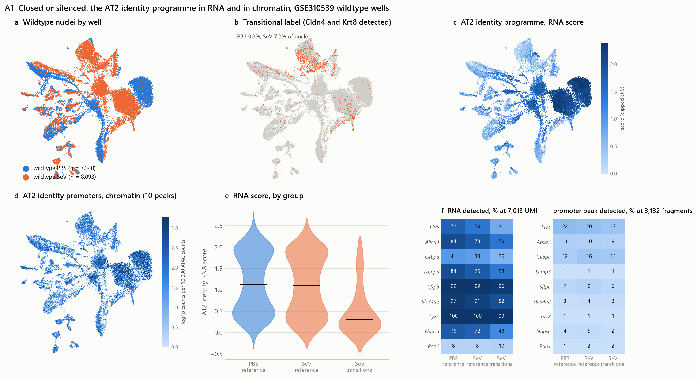

*Figure A1. GSE310539 wild-type nuclei: PBS n = 7,340 and SeV n = 8,093. Panels a–d show well, Cldn4/Krt8 co-detection, AT2 RNA score and promoter accessibility on an RNA embedding. Panels e–f compare group scores and detection at matched depth (7,013 RNA UMIs; 3,132 ATAC fragments). Across nine genes with annotated promoter peaks, mean RNA detection is 73% in PBS reference and 57% in SeV transitional nuclei; promoter detection is 7% and 6%. Panels g–i show why per-nucleus accessibility needs depth controls: transitional nuclei have more fragments and fewer zero-signal observations, despite lower accessibility among nuclei with detected signal. These descriptive panels accompany the matched-gene-set and per-well tests for C118/C121/C127; they do not measure cellular fate. Generated by `analysis/scripts/16_research_question_figures.py`; data in `analysis/figures/rq/rq_a1_groups.csv` and `rq_a1_detection_at_budget.csv`.*
<!-- /rq-figure:A1 -->

### A2. Which cells express AREG, and how sensitive are candidate rankings to the resource?

Source expression and database sensitivity are separate questions. Source
comparisons use deposited cell types, donors as the paired sample units and
explicit molecule-depth sensitivity (C37). With deposited labels,
the unadjusted direction is epithelial-higher in all 10 donors (0.4591 versus
0.2715, p = 0.001953). At the prespecified primary 1,000-UMI expected-detection
budget only 6/10 retain that direction (0.1224 versus 0.0999, p = 0.130859).
The 500/2,000-UMI sensitivities give p = 0.322266/0.019531. Thus the source
contrast is measurement-dependent. All 10 donors and all 16,064 selected cells
remain at 500 and 1,000 UMIs; only the 2,000-UMI sensitivity excludes cells (1,188).

The [ligand analysis](analysis/corrections/ligand/README.md) uses an explicit
epithelial allowlist, cell-count floors for the actual fibroblast targets,
source/target provenance and a shared eligible donor set. Pericytes and smooth
muscle cells are excluded as senders. In the 22-donor CellChatDB analysis,
AREG's donor-median rank is 10.5 among 312 retained
pairs, and it remains first among the prespecified canonical exact-EGFR ligands.
Consensus contains AREG–EGFR_ERBB2 but it is scored in only 7/22 donors, below
the 11-donor retention rule. Resource encoding and sample coverage both matter.

Expression-derived ranks nominate hypotheses. They do not establish secretion,
ligand processing, receptor activation or functional necessity. Agreement among
resources is not biological replication because the expression data, score and
underlying curation overlap. Coverage and ranking effects should be distinguished.

E6's pooled correlation (rho 0.348, p 0.112, 22 donors) did not meet its
significance criterion. The approximately 0.43 calculation was a significance
threshold, not a bound on undetected coupling or an 80%-power calculation.
The state-resolved question has fewer eligible donors. Future spatial work
should test proximity and activation in replicated samples; proximity alone
still does not establish signalling. Literature novelty requires a dated search.

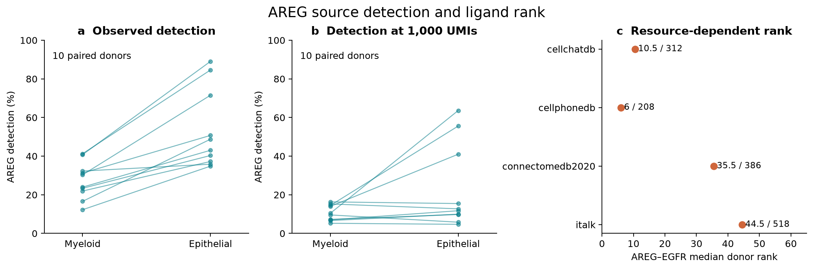

*Figure A2. Panels a–b connect epithelial and myeloid measurements within each of the ten eligible tumour donors, before and after standardization to 1,000 UMIs. Panel c shows AREG–EGFR median donor ranks across four resources in the 22-donor ligand analysis; labels give rank and retained pair-universe size, not a normalized probability. Source detection and ligand ranking use different cohorts. The plots describe expression and resource sensitivity, not secretion or activation. Sources: [per-donor detection](analysis/corrections/ligand/results/c37/per_donor.csv) and [resource summaries](analysis/corrections/ligand/results/lr/resource_summary.csv).*

### A3. Which macrophage programmes vary with phase, and what explains the differences?

The time course and per-animal fractions remain valuable descriptions of
population composition. Relative fractions do not demonstrate absolute
expansion, and the same state at a later time need not consist of the same
persisting cells. Broad macrophage pseudobulks mix subtype proportions with
within-subtype changes.

G1's resolution-versus-long-term ranking is confounded by age, infection round,
sex and genotype as well as composition (C158). W1 excludes some genotype
variation and narrows to deposited aMACs, but its late contrast retains age and
processing limitations. An adjustment cannot identify an injury-time effect
when age-matched uninjured controls are absent.

The [sample-level enrichment analysis](analysis/corrections/statistics/README.md)
separates reference-method verification, sample-level sensitivity, leave-one-out
stability and subtype contributions using reference limma CAMERA. W1's
seven-gene ornithine set was not tested under its minimum-size rule: this is an unfilled part of
the ARG1/ornithine circuit question, not evidence against that circuit. Reference
CAMERA finds no significant W1 sets. G1's DNA-replication lead does
not pass confound-aware sensitivities. G2 supports 30 frozen candidates across
cohorts with fixed correlation 0.01, but none with estimated correlation; C161
is exploratory and method-sensitive. Neither
metabolite flux nor receiver-side functional response was measured.

<!-- rq-figure:A3 -->
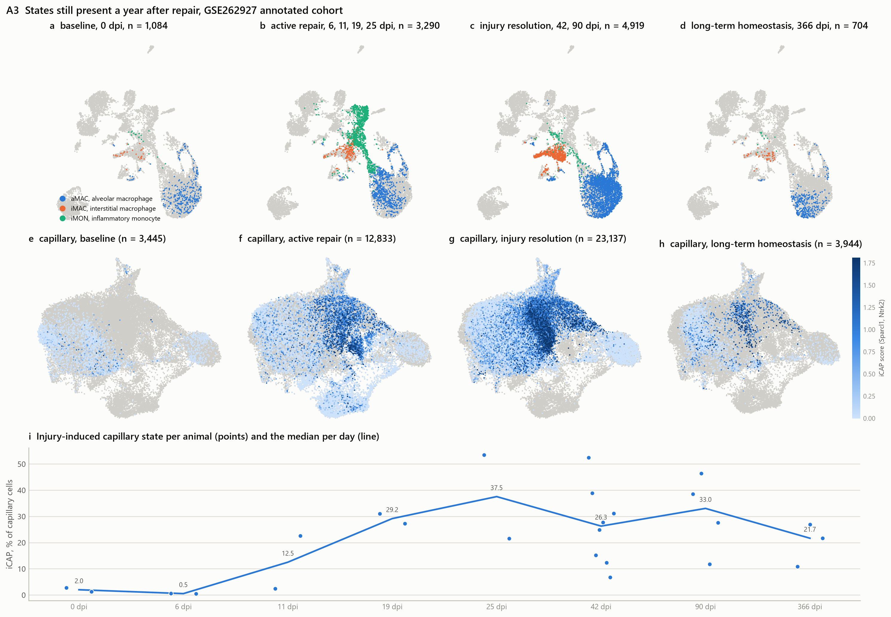

*Figure A3. GSE262927. Panels a–d show the myeloid embedding (9,997 cells) by phase, distinguishing alveolar macrophages, interstitial macrophages and inflammatory monocytes. Panels e–h show capillary endothelium (43,359 cells), coloured by the injury-induced capillary score. Panel i shows per-animal iCAP fractions and per-day medians: 2.0% at baseline, 37.5% at 25 dpi and 21.7% at 366 dpi. These are population-composition observations (C3/C12/C13/C15), not evidence that the same cells persist. Data in `analysis/figures/rq/rq_a3_myeloid_by_phase.csv` and `rq_a3_icap_by_day.csv`.*
<!-- /rq-figure:A3 -->

### A4. How do current Wnt activity and IL-1 responsiveness overlap in AT2 cells?

Lineage history, current transcript detection, pathway activity and
future fate are different measurements. Wnt-associated maintenance and
IL-1-associated transition can be sequential or context dependent within the
same cells; the question does not require two stable opposing subsets.

The bulk qPCR comparison of sorted cells supports an association, not a
same-cell overlap fraction. Detection near 4–7% applies to GSE145031; the
GSE310539 figure below reports Il1r1 detection of 19.3–29.8%. Neither makes a
single sparse transcript a validated substitute for a lineage reporter.

A useful experiment would specify present activity versus lineage history,
reporter washout, animal-level four-quadrant proportions and a functional
response endpoint. Available counts and accessibility can guide feasibility;
they do not establish reporter overlap or responsiveness. Claims of being the
first or only such comparison require a scoped literature review.

<!-- rq-figure:A4 -->
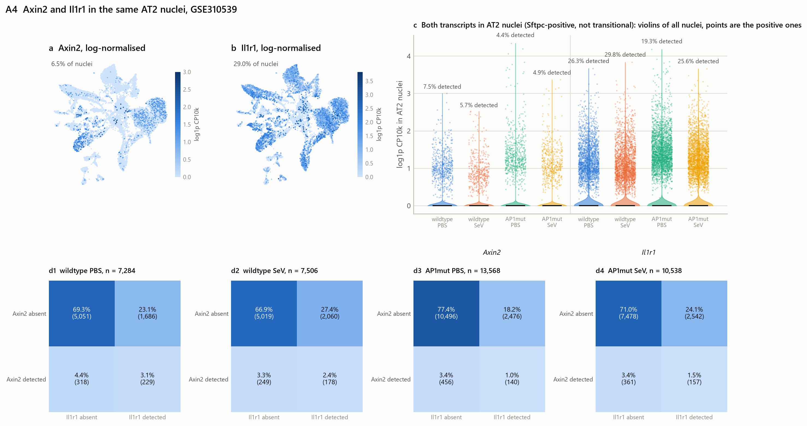

*Figure A4. GSE310539. Panels a–b show Axin2 and Il1r1 on the wild-type embedding. Panel c shows detection in AT2 nuclei (Sftpc detected; outside the transitional group) across four wells: Axin2 4.4–7.5% and Il1r1 19.3–29.8%. Panel d shows co-detection in 1.0–3.1% of AT2 nuclei. Sparse transcript co-detection does not establish the overlap of pathway activity, reporter history or functional responsiveness (C134–C137/C142). Data in `analysis/figures/rq/rq_a4_detection.csv` and `rq_a4_codetection.csv`.*
<!-- /rq-figure:A4 -->

#### Wnt source, response and epithelial state after injury

Which fibroblast states carry Wnt-ligand transcripts, and how do epithelial
Wnt transcripts, Wnt-response markers, AT2 identity and proliferation vary
across animals? These measurements separate candidate ligand sources from
receiver responses and functional stemness. They also allow the possibility
that identity maintenance and proliferation vary independently.

[Nb1](Thesis/gate1_03_nabhan_2018/nb1/README.md) uses deposited cell labels and
animal-level raw-count summaries in GSE262927. Its earliest injured samples
are day 6; it cannot test the rapid induction described by Nabhan 2018. Only
one baseline and one day-11 AT2 unit pass the primary 50-cell floor, so these
plots support hypothesis generation, not a replicated injury-effect test.
An [independent cohort screen](Thesis/gate1_03_nabhan_2018/external_feasibility/README.md)
documents the conditions needed for a follow-up comparison.

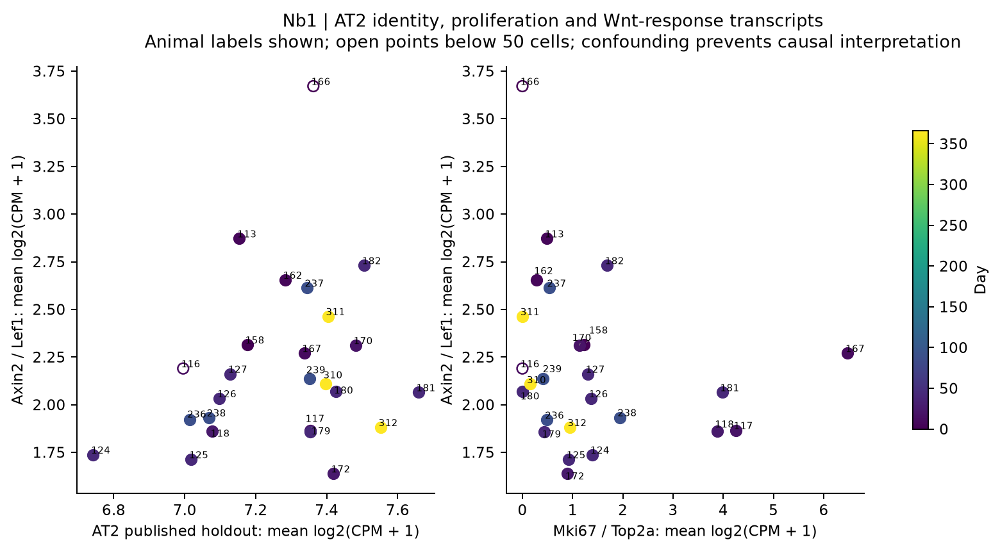

*Figure A4b. GSE262927, one point per animal, identified by sample suffix.
The two panels compare the Axin2/Lef1 transcript summary with a published AT2
holdout panel and Mki67/Top2a. Filled points have at least 50 AT2 cells; open
points fall below this eligibility floor. Day is confounded with cohort
characteristics, and the two-gene summaries are not validated pathway or
stemness scores. The [coverage figure](Thesis/gate1_03_nabhan_2018/nb1/figures/01_animal_coverage.png)
and [per-gene results](Thesis/gate1_03_nabhan_2018/nb1/figures/03_at2_per_animal.png)
show the sampling and transcript-level context.*

### A5. Which transitional signatures are specific to injury rather than development or genotype?

This specificity question complements the RNA/chromatin measurements in A1. At
the common RNA budget, the two-transcript label identifies 3.69% of P9
control cells and 8.07% of P9 **Cebpa-mutant** cells. The control result already
refutes injury exclusivity of the classifier (C119); the larger mutant value
must not be described as ordinary development.

Shared Krt8/Cldn4 expression does not establish that full DATP, PATS and ADI
programmes, regulatory mechanisms or fates are equivalent. Those definitions
must retain their original source and gene universe. Analyses should include
label-free versions excluding Krt8 and Cldn4 to expose circular enrichment.
A maturation score does not hold development fixed: the existing age-by-injury
design is not a replicated factorial experiment.

The analysis records which complete source signatures are available,
which comparisons use marker panels, and whether an independent cohort has
adequate animals and epithelial coverage. A failed eligibility check is a
reason to narrow the conclusion, not to substitute cell-level significance.

<!-- rq-figure:A5 -->
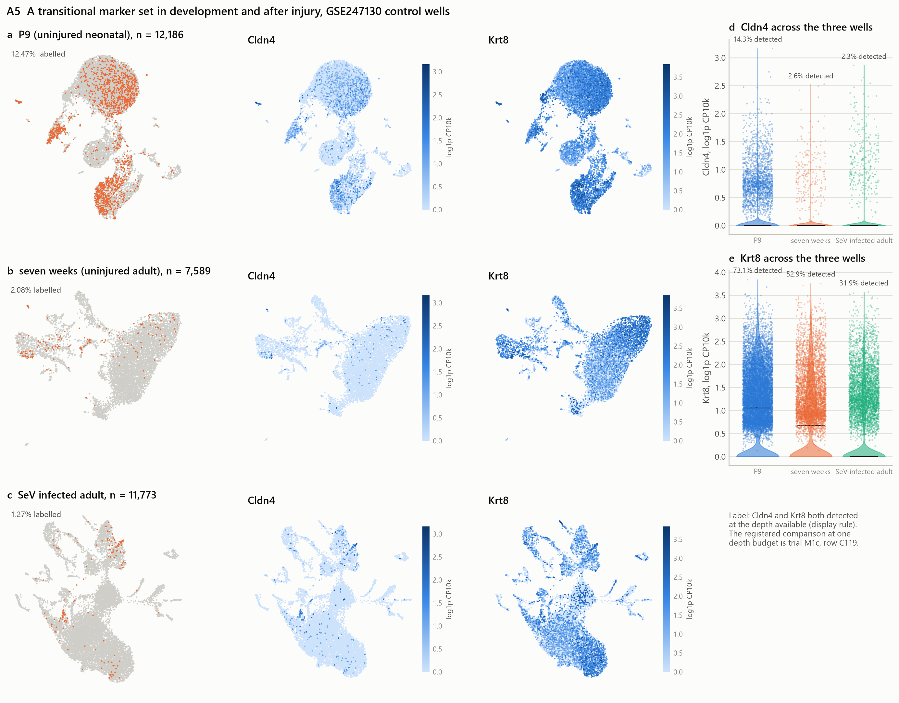

*Figure A5. GSE247130 control wells: P9 n = 12,186; seven weeks n = 7,589; SeV-infected n = 11,773. Panels a–c show an RNA embedding for each well, with Cldn4/Krt8 co-detection at the available depth (12.47%, 2.08% and 1.27%), followed by each transcript separately. Panels d–e compare transcript measurements across wells. The raw detection fractions shown here differ from the common-depth comparison in the text; both require their stated measurement scale. The depth-matched analysis supports the presence of this marker combination during development (C119), without establishing equivalence to an adult injury state. Data in `analysis/figures/rq/rq_a5_wells.csv`.*
<!-- /rq-figure:A5 -->

#### Source-defined signatures and sample coverage

*ES1 uses 2,000 UMI and label-excluded source definitions. ADI enrichment is
+1.04/+1.21 detection points in neonatal controls and +7.61/+6.53 in injured
adult controls. Only one of 25 external-study animals passes both group floors.
Seven-week control eligibility changes with seed. These are within-well
measurements and coverage checks, not replicated fate inference (C165–C168).*

### A6. How much of the IPF macrophage proliferation signal is composition, and what remains within a shared noncycling state?

**Motivation:** G2 enrichment inference depends strongly on correlation assumptions.
The validation cohort has more deposited proliferating macrophages on average in
IPF (3.77% versus 2.11%), but its proliferating subtype has only three IPF donors
and one control above the 50-cell floor. Within-subtype findings in discovery
are not confirmed in the available validation labels.

**Test:** harmonize resident, recruited and cycling states across cohorts before
constructing donor pseudobulks. Decompose cell-fraction and raw transcript
contributions, then compare the same noncycling state under a fixed composition
standard. Require at least three donors per arm and justify power beyond that
minimum. A composition-only explanation is challenged by a reproducible
within-state effect after standardization. Failure to reach significance does
not establish composition-only; excluding a meaningful within-state effect
requires a prespecified equivalence margin and adequate precision.

Evidence: [sample-level enrichment analysis](analysis/corrections/statistics/README.md).
The current data leave both mixture and within-state explanations plausible.

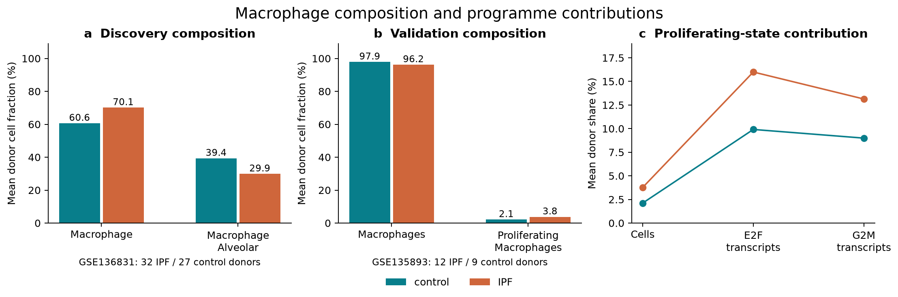

*Figure A6. Panels a–b show mean donor cell fractions under each cohort’s deposited macrophage labels. The state labels differ between cohorts and are not treated as harmonized populations. Panel c shows the validation cohort’s proliferating-state share of cells and of E2F/G2M programme transcripts. Values are cohort means, without donor-level uncertainty bars; they motivate composition analysis but cannot establish a within-state effect. Sources: [cell fractions](analysis/corrections/statistics/tables/subtype_cell_fractions.csv) and [transcript contributions](analysis/corrections/statistics/tables/subtype_transcript_contributions.csv).*

### A7. Does Cebpa genotype shift the reference AT2 population and compress the apparent transitional contrast?

**Motivation:** ES1's published AT2 holdout contrast is smaller in mutant wells:
P9 control -4.59/-4.79 points versus mutant -0.70/-0.31, and injured adult
control -8.88/-7.34 versus mutant -2.28/-2.43 across technical seeds. Reference
scores also decrease in mutants (C167). A smaller difference need not mean a
more preserved transitional state; it can arise from a changed reference.

**Test:** estimate a genotype-by-state interaction from independent animals at
matched ages, reporting changes in both reference and labelled states. Repeat
with state definitions independent of Sftpc and the scored genes, because
reference selection can itself change with genotype. Comparable genotype shifts
in both states, bounded by a prespecified interaction margin, would argue against
the differential-state explanation. The current one-well comparisons cannot
establish that interaction.

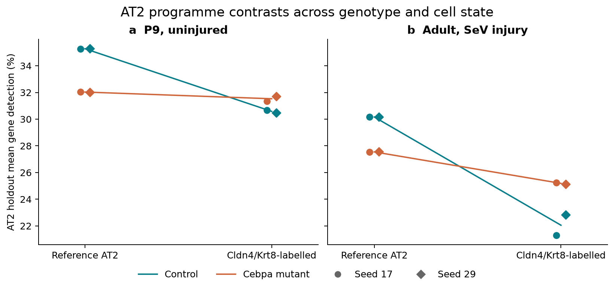

*Figure A7. GSE247130 AT2 holdout mean gene detection at 2,000 UMIs, shown separately for P9 and SeV-injured adult wells. Lines connect the mean of two technical seeds within each genotype; circles and diamonds show seeds 17 and 29. There is one pooled library per condition, so these points do not supply biological replication or an interaction confidence interval. Reporting both populations reveals how reference shifts affect the labelled–reference contrast. Source: [module scores](Thesis/epithelial_state_specificity/results/module_scores.csv).*

### A8. Does a broad AT1 score capture shared transition programmes rather than late maturation?

**Motivation:** the published ADI and AT1 holdout lists share **119 genes**.
Broad AT1 scores rise in several injured labelled groups while a four-gene
late-AT1 panel is seed-sensitive (C168). Neither the broad score nor the small
late-marker panel alone establishes fate.

**Test:** freeze shared and AT1-unique components before validation; relate both
to mature AT1 protein, morphology or lineage contribution in independent animals.
If the unique component predicts mature endpoints with adequate precision
beyond the shared component, a purely shared-transition explanation is weakened.
If no precise difference can be estimated, retain the question rather than
calling one component biologically absent.

Evidence for A7/A8: [ES1 source definitions and results](Thesis/epithelial_state_specificity/README.md).
Neither requires treating the neonatal label as the same biological state as an
adult injury intermediate.

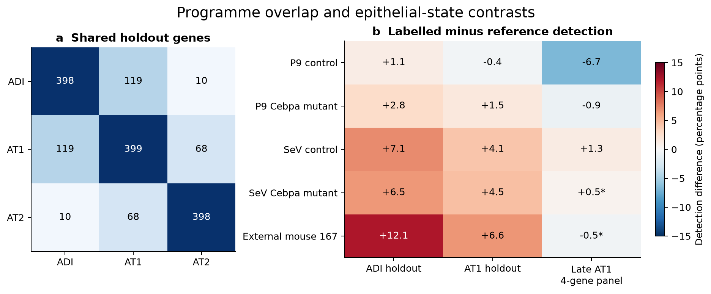

*Figure A8. Panel a shows source-list membership: diagonal cells are holdout-list sizes, and off-diagonal cells count shared genes, including 119 between ADI and AT1. Panel b shows labelled-minus-reference detection differences in percentage points, averaged across technical seeds 17 and 29 at 2,000 UMIs. An asterisk marks a sign change between seeds, not statistical significance. All displayed comparisons pass the group floor in both seeds. The external row is one mouse; broad AT1 enrichment and a small late-marker panel do not establish mature fate. Sources: [module overlap](Thesis/epithelial_state_specificity/results/module_overlap.csv) and [within-unit effects](Thesis/epithelial_state_specificity/results/within_unit_effects.csv).*

### A9. Does apparent EGFR ligand specificity reflect receiver biology or receptor representation and coverage?

**Motivation:** the consensus resource contains
AREG–EGFR_ERBB2, but only 7 of 22 donors pass its expression score requirements,
below the 11-donor retention rule. Meanwhile, AREG leads a restricted canonical
exact-EGFR list in four resources. These are different estimands on shared data,
not independent confirmations of one mechanism.

**Test:** freeze the receptor-complex definitions, compare donor-level EGFR and
ERBB2 coexpression within the same fibroblast states, and distinguish missing
resource entries from failed expression eligibility. Require matched biological
replicates and independent protein or receptor-activation measurements before
inferring receiver specificity. If the ranking difference disappears under
matched definitions and donor coverage, the representation explanation gains
support; persistent RNA differences alone still do not prove activation.

Evidence: [ligand-resource analysis](analysis/corrections/ligand/RESULTS.md).

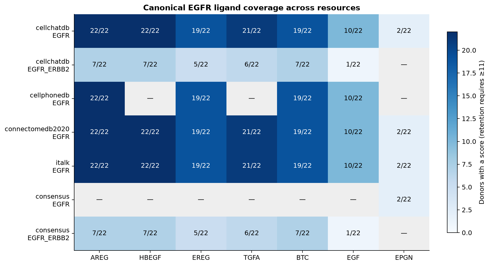

*Figure A9. Each cell gives the number of scored donors out of 22; retention requires at least 11. Separate rows preserve exact EGFR and EGFR_ERBB2 complex definitions. A dash means no matching row in the inspected canonical coverage table, not biological absence. AREG–EGFR is scored in all 22 donors in four resources, while AREG–EGFR_ERBB2 is scored in seven where listed. The dependence on receptor representation is visible before any activation claim is considered. Source: [receptor coverage](analysis/corrections/ligand/results/lr/canonical_egfr_receptor_coverage.csv).*

### A10. Do epithelial perturbation responses predict organoid growth and fibroblast responses across independent preparations?

**Motivation:** GSE307112 provides species-separated epithelial/fibroblast RNA
and well-linked imaging measurements, enabling an association with organoid
growth outcomes. The relationship has not yet been tested in this repository.

**Test:** freeze epithelial programmes and an imaging endpoint, resolve well,
guide, plate and biological-preparation identities, and test prediction on held-out
biological batches. Compare programme predictions with models using plate and
baseline imaging alone. A precise absence of incremental predictive performance
would weaken the proposed RNA–growth association. If independent batches cannot
be identified, restrict the analysis to descriptive screen associations.
Species-separated bulk RNA does not resolve within-compartment composition;
organoid area is not mature AT1 fate or in vivo repair.

See the [dataset gate and pilot contract](docs/NEXT_DATASET_GATE.md). This takes
priority over another unrestricted ligand-ranking pass because it can test a
different endpoint; the design still has to pass before inference.

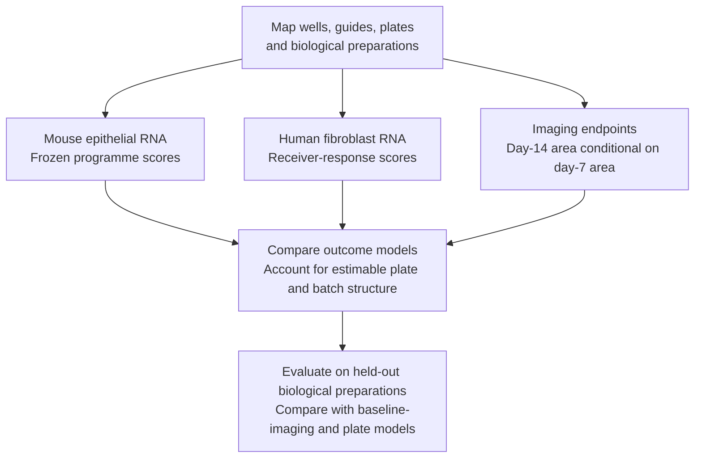

*Figure A10. Conceptual prediction design. Preparation identities define the
validation split; wells from a shared preparation cannot supply independent
validation. Imaging measures organoid growth and morphology, not mature AT1
fate or in vivo repair.*

The review-motivated extensions A11–A14 below were consolidated here on
25 September 2026. They build on A5/A8 (programme specificity), A2/A9
(source and receptor coverage), A3/A6 (myeloid context) and A4 (recipient
state). These are **post-analysis exploratory questions**, not claims of
literature novelty or retrospective preregistration. Five measured-data
figures and one experimental schematic are complete; the proposed joint
association and withdrawal tests are not. See the shared
[figure methods and plotted values](analysis/figures/rq/il1b_context/REPORT.md).

The organising extension is: which macrophage–fibroblast niche features
accompany shared epithelial plasticity, and which distinguish neoplasia-associated
plasticity from non-neoplastic repair and fibrosis? Histology context does not
independently establish malignant cell identity, persistence or dysplastic fate.

### A11. Shared plasticity versus neoplasia-associated context

**Question.** Which epithelial programs distinguish lesion-associated AT2-like
cells from repair/fibrotic transitional cells, once the shared HPCS-like
transcriptional component is made explicit?

**Why it follows from the results.** The overlap-reduced HPCS signature rises
in all seven evaluable pooled repair/developmental libraries and all three
eligible IPF donor pairs. It also rises in 19/23 LUAD-versus-normal paired
patients, with mean difference +0.327 log2 CPM. This challenges the specificity
of an elevated score; it does not establish a common cell identity. See the
[completed evidence review](Thesis/gate2_C3_yu_lee_choi_min_2026/EVIDENCE_REVIEW.md),
[repair comparison](Thesis/gate2_C3_yu_lee_choi_min_2026/trials/u6_specificity/REPORT.md),
[IPF comparison](Thesis/gate2_C3_yu_lee_choi_min_2026/trials/u6_ipf_specificity/REPORT.md) and
[human comparison](Thesis/gate2_C3_yu_lee_choi_min_2026/trials/u6_human_specificity/REPORT.md).

**Working alternatives.** A shared injury/stress program may account for the
overlap; additional epithelial programs may associate with lesion context;
or assay, annotation and sample composition may explain apparent differences.
An extra program is useful only if its association survives independent
evaluation, rather than being defined and tested on the same labels.

**Generated A11:** A, PCA of 70 patient-histology pseudobulks; B, reduced-HPCS
violins for 23 paired patients; C, all seven released paired contrasts;
D, six fixed program differences across 23 LUAD-normal pairs.

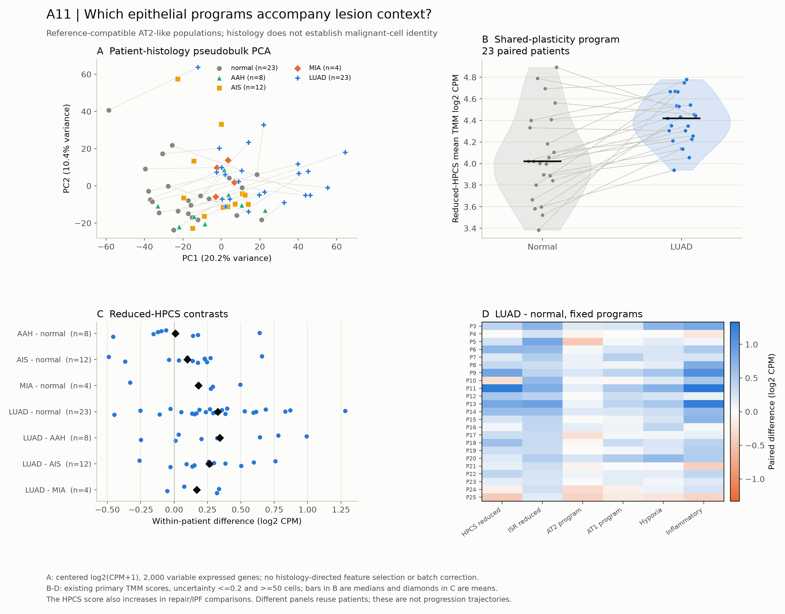

**Original panel concepts and optional extensions.** The following design
menu remains broader than the generated figure; dedicated epithelial UMAP
score overlays and gene-component heatmaps have not been generated.

- **A: epithelial UMAP.** Within each cohort, use the same coordinates in
  adjacent panels colored by supported annotation, histology, donor and
  continuous reduced-HPCS/ISR scores. Keep uncertain identities visible.
  No combined repair-to-fibrosis-to-cancer trajectory or cross-cohort distance
  interpretation. This panel localizes heterogeneity; it does not test fate.
- **B: pseudobulk PCA.** Each point is a patient-histology-cell-state aggregate,
  analyzed within cohort and compartment. Show PC variance, patient identity
  and paired normal-lesion connections where verified. Use an unsupervised
  expression-based feature rule, not genes selected for case-control separation.
  PCA is a sample/heterogeneity diagnostic, not a significance test.
- **C: paired program distributions.** Plot individual patient scores and
  paired differences for reduced HPCS and eligible source programs. A violin
  may summarize donor scores where sample size supports a density; retain all
  points. Use dot/slope plots for three IPF pairs and small histology groups.
  Cell-score violins, if added, are descriptive supplements and show donor
  contributions. Do not recalculate a different cell score and present it as
  the released pseudobulk result.
- **D: gene/program heatmap.** Show fixed signature components and overlap
  membership alongside within-study contrasts and measured-gene coverage.
  Separate shared from source-specific members without selecting only positive
  genes. New candidate discriminatory genes remain exploratory and require
  a held-out cohort; no classifier performance claim from these inspected data.

**Decision.** Overlap alone supports a specificity limitation. A defensible
neoplasia-specific extension needs reproducible within-study associations,
independent cell-state validation and validation data not used for selection.
Histology differences are cross-sectional, not a progression time course.

**Reuse now:** [human program figure](Thesis/gate2_C3_yu_lee_choi_min_2026/figures/human_epithelial_program_specificity.png),
[IPF state figure](Thesis/gate2_C3_yu_lee_choi_min_2026/figures/ipf_epithelial_state_specificity.png),
[repair/overlap figure](Thesis/gate2_C3_yu_lee_choi_min_2026/figures/epithelial_specificity_and_signature_overlap.png),
[paired values](Thesis/gate2_C3_yu_lee_choi_min_2026/trials/u6_human_specificity/paired_program_values.csv).

### A12. Recipient context and IL-1 specificity

**Question.** Are differences in fibroblast and epithelial recipient programs
associated with receptor/inhibitor expression and subtype composition, and
how do IL1A/IL1B candidates compare with the frozen alternative ligand families?

**Why it follows from the results.** The canonical macrophage-to-fibroblast
IL1B compatibility contrast is near zero in one IPF cohort and positive in
the other. In human LUAD-versus-normal up-target fits, IL1B ranks 4/10 for
broad fibroblasts and 12/14 for AT2. Different candidate/target backgrounds
make those ranks noncommensurate as effect sizes; they motivate a recipient
question without proving stronger fibroblast signaling or indirect causality.
See [IPF compatibility](Thesis/gate2_C3_yu_lee_choi_min_2026/trials/u5_ipf_compatibility/REPORT.md) and
[human target fits](Thesis/gate2_C3_yu_lee_choi_min_2026/trials/u5_human_ligand_targets/REPORT.md).

**Working alternatives.** Changes could originate in ligand RNA, recipient
components, captured subtype mixture, shared inflammation or other ligands.
The current data do not identify which explanation causes cohort disagreement.

**A12 panels.**

- **A: source/recipient dot plot.** IL1A/IL1B in observed sources; IL1R1 and
  IL1RAP in recipients; IL1RN, IL1R2 and SIGIRR in a separate regulatory block.
  Dot size shows the donor-averaged detection fraction and color the
  donor-averaged expression, with eligible n. Keep complex subunits visible.
- **B: paired expression and compatibility plots.** Show patient points or
  donor-score violins with overlaid points for fixed macrophage/fibroblast/
  epithelial labels. Place ligand and receptor component changes beside the
  composite score. Facet independent IPF cohorts; do not connect unpaired
  IPF and control donors. Label omission ranges as robustness, not confidence.
- **C: recipient pathway enrichment dot plot.** Separate fibroblast,
  macrophage and epithelial panels. Include the declared evaluable pathway
  family, with direction, q value, measured set size and sample coverage.
  Show estimated-correlation primary and fixed-0.01 sensitivity side by side.
  The human results are 0/279 versus 148/279 at q<0.05; this model dependence
  is a finding to display, not a reason to hide the primary results.
- **D: ligand-target rank and stability plot.** Compare IL1A/IL1B with eligible
  TGFB1, EGFR-ligand and other prespecified candidates within each receiver's
  fixed comparison. Show candidate denominators, target eligibility and
  omitted-patient rank ranges. An unsigned prior fit is not an activation or
  inhibition measurement. Any ligand-target heatmap must distinguish prior
  weights from observed receiver gene changes.

**Decision.** Look for agreement between within-subtype component changes,
recipient programs and omission stability. RNA agreement remains an
association; NF-kB-like responses and high ligand ranks are not IL-1-specific
causal evidence. The main test includes discordance and ineligible target sets.

**Reuse now:** [human pathway figure](Thesis/gate2_C3_yu_lee_choi_min_2026/figures/human_paired_recipient_pathways.png),
[human niche figure](Thesis/gate2_C3_yu_lee_choi_min_2026/figures/human_paired_niche_RNA_contrasts.png),
[target figure](Thesis/gate2_C3_yu_lee_choi_min_2026/figures/human_ligand_target_eligibility_and_fit.png),
[paired compatibility values](Thesis/gate2_C3_yu_lee_choi_min_2026/trials/u5_human_niche/primary_compatibility_patient_values.csv).

**Generated A12 figures:**

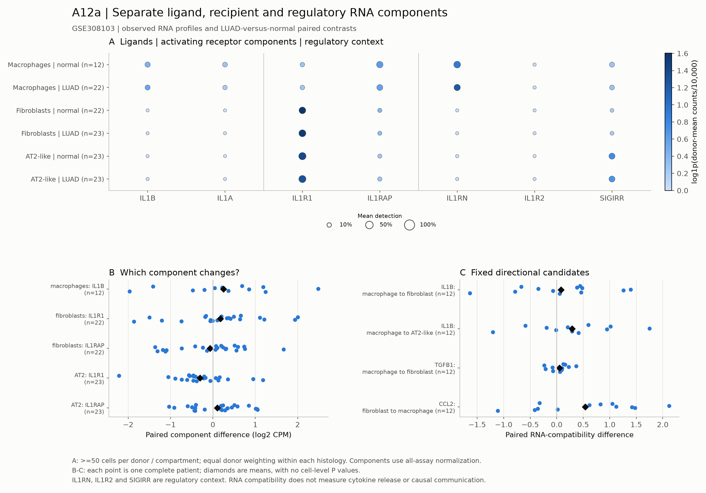

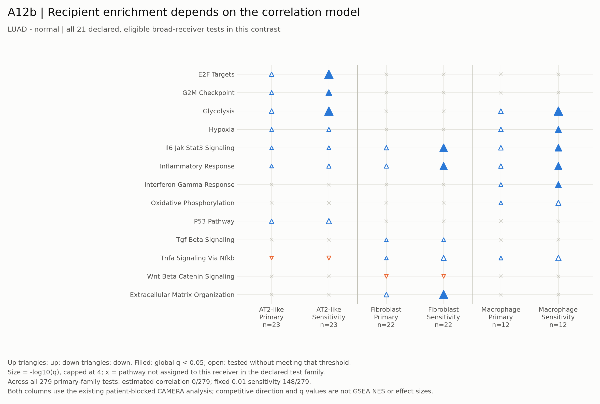

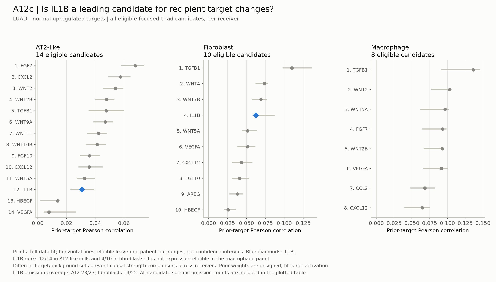

The target figure retains all 32 eligible up-target candidates across the
three broad receivers for LUAD-normal in the focused-triad scope. IL1B does
not pass expression eligibility in the macrophage panel. Full contrast,
direction and sensitivity tables remain available in the original reports.

#### Source annotation supporting A12: Resolve source uncertainty before strong macrophage claims

**Enabling question.** Do IL1B-expressing cells without confident fine labels
represent coherent cell states, mixed profiles or measurement background?

Unassigned cells carry median IL1B count fractions of 52-72% across human
histologies. This is recovered RNA, not a fraction of tissue cytokine secretion.
Cross-lineage RNA also remains substantial in the mapped populations. See the
[annotation review](Thesis/gate2_C3_yu_lee_choi_min_2026/trials/u5_human_full/ANNOTATION_REVIEW.md) and
[source report](Thesis/gate2_C3_yu_lee_choi_min_2026/trials/u5_human_sources/REPORT.md).

The generated A12-S1 figure uses 34,178 display cells with a 75-cell cap per
patient/histology/source label, while quantitative source fractions use all
QC cells. The same UMAP coordinates show existing labels, uncertainty and
IL1B RNA; paired source-fraction violins show 23 normal-LUAD patient pairs.

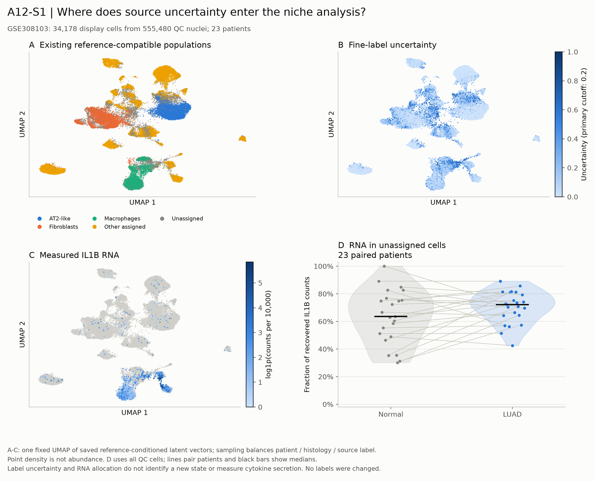

Further annotation-review options: an all-QC UMAP colored by broad identity, confidence,
donor, histology and IL1B; a multi-marker dot plot; QC/confidence violin plots
with donor summaries; and stacked per-patient IL1B count fractions retaining
the unassigned category. Use assay-appropriate background/mixed-profile checks
and independent marker support. A separate UMAP cluster or a relaxed confidence
cutoff does not establish a new macrophage state. Keep original annotations
and any reviewed alternative labels as separately versioned results.

### A13. Fibroblast context and reciprocal niche associations

**Question.** Within eligible patients, do fibroblast recruitment/inflammatory,
matrix and trophic programs associate with epithelial plasticity, and do these
associations differ from those involving macrophage IL1B RNA alone?

This is a new, conditional association question inspired by the heterogeneous
IL-1 results and the Body notes. A reciprocal or fibroblast-mediated mechanism
has not been established by the completed analysis.

**A13 panels.**

- **A: matched-patient heatmap.** Align macrophage IL1B, recipient components,
  fibroblast inflammatory/matrix/trophic programs, eligible CCL2/CCR2 and
  CXCL12/CXCR4 compatibility, and epithelial program scores. Rows are verified
  patient-histology observations; mark missing compartments instead of filling
  them with zero. Separate captured cell fractions from within-state RNA.
- **B: donor-level scatterplots.** Use matched within-patient lesion-normal
  changes where available; show every patient and omission sensitivity.
  Freeze a small set of associations and their multiplicity family before
  fitting. Repeated histologies cannot supply independent patient n.
  “Beyond IL1B” requires an eligible, parsimonious joint model; marginal
  correlations alone cannot establish added explanatory information.
- **C: spatial extension.** Reuse measured human maps as descriptive context.
  Regional enrichment and neighborhood summaries wait for independent
  pathology regions and a suitable patient-level spatial null. Transcript
  hotspots cannot define and then validate their own regions. Mixed spots
  do not identify direct cell contact, and companion assays are not replication.

**Eligibility and decision.** Count complete triads before estimating joint
associations. Existing IPF triad counts (six and three donors) do not reach the
project's ten-unit joint-association floor. Human eligibility must be audited
for the exact variables and paired contrast; 23 cohort patients does not mean
23 complete triads. A floor is not a power guarantee. Weak coverage produces
a coverage panel, not a mediation fit. Replicated association would prioritize
a functional test; it would not demonstrate a feedback loop.

**Reuse now:** [human niche report](Thesis/gate2_C3_yu_lee_choi_min_2026/trials/u5_human_niche/REPORT.md),
[spatial report](Thesis/gate2_C3_yu_lee_choi_min_2026/trials/u5_spatial_context/REPORT.md),
[measured maps](Thesis/gate2_C3_yu_lee_choi_min_2026/figures/human_spatial_measured_maps.png).

### A14. Resolution versus persistence after signal withdrawal

**Question.** Does transient versus sustained IL-1beta exposure produce
different recovery after withdrawal, and does fibroblast IL-1 reception modify
epithelial recovery independently of direct epithelial reception?

**Why it matters.** Shared RNA programs cannot distinguish reversible repair
from persistent dysfunction. The current mouse arm lacks the author KAC
classifier and does not supply the required withdrawal/lineage experiment.
This is a mechanistic follow-up, not a claim derived directly from RNA ranks.

**A14 panels, requiring new evidence.**

The experimental layout is now drawn below; outcome panels B-D still require
new data. No anticipated response curve is presented as a result.

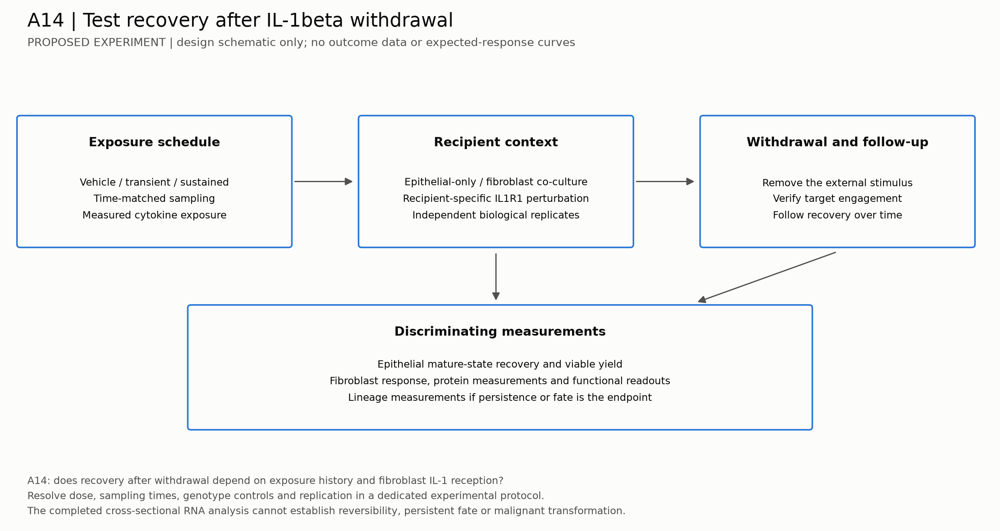

- **A: experimental schematic.** Define transient/sustained exposure and
  withdrawal, with epithelial-only and stromal-containing systems and
  recipient-specific IL1R1 perturbations. Add a macrophage-source arm only
  if separating source effects is an explicit experimental aim. Freeze
  endpoints, contrasts and biological replication before acquisition.
- **B: longitudinal response plots.** Epithelial plasticity and mature-state
  recovery alongside fibroblast responses, with independent culture/animal
  replicates and time-matched controls. Connect repeated measures only when
  the same unit was actually measured repeatedly.
- **C: fate and function.** Replicate-level mature-cell yield, viability,
  organoid function and lineage outcomes; show individual replicates rather
  than treating cells or organoids from one preparation as independent animals.
- **D: protein and target engagement.** Measured mature cytokine release and
  recipient response establish exposure/perturbation context. RNA alone cannot
  measure blockade efficacy, biochemical ISR activation or irreversible fate.

**Decision.** Evidence for fibroblast dependence requires an epithelial outcome
change under a fibroblast-specific intervention with appropriate controls.
Persistence after withdrawal requires observation after withdrawal. Neither
result, on its own, establishes malignant transformation.

#### Analysis and figure rules for A11–A14

1. **Biological units remain visible.** Cells describe heterogeneity; donors,
   patients or animals support inference. Preserve paired designs. Pooled
   wells/sort gates do not become independent mice. This is consistent with
   the biological-replicate analysis evaluated by
   [Squair et al.](https://www.nature.com/articles/s41467-021-25960-2).
2. **UMAP and PCA need their own reproducible inputs.** Reuse validated
   embeddings where present; otherwise record feature selection, normalization,
   dimensions, neighbors, seed and any display-only donor-balanced sampling.
   Use identical coordinates for overlays and include donor/batch diagnostics.
   Do not optimize embeddings to separate histologies. Statistical summaries
   use all eligible observations, not the display subsample.
3. **Enrichment plots must match the method.** CAMERA returns set size,
   direction and P/FDR values, not a GSEA normalized enrichment score
   ([official limma manual](https://bioconductor.org/packages/release/bioc/manuals/limma/man/limma.pdf)).
   Running-score GSEA curves would require a separately specified exploratory
   analysis and would not replace the completed primary analysis. Current
   primary and sensitivity labels remain unchanged.
4. **Small n stays visible.** Prefer paired points to a smooth violin with
   three donors. No cell-level significance stars as patient-level evidence,
   no inferred confidence intervals from omission ranges, and no pooling of
   distinct studies into a common quantitative trajectory.
5. **Render from saved tables.** New embeddings/models are separate computation
   stages. Each released figure needs its plotted table, input hashes,
   generating script, run record, sample counts and visual review. Use the
   repository palette and PNG/SVG exports under `analysis/figures/rq/`.
   The main repository README stays a navigation page.

The 17 paper-specific figures remain in the Yu study gallery. The six new figures add display
geometry, existing quantitative evidence and one experimental schematic.
Source-label review and causal/spatial claims still need additional evidence.
Freeze any new analysis specification before testing these exploratory RQs.

## Part B. What a reader can reproduce

- Initial mouse and human atlas recovery, annotation disagreements and integration
  choices: [FINDINGS.md](FINDINGS.md) and [pipeline record](docs/PIPELINE_AS_RUN.md).
- Observations and source-specific limitations:
  [CLAIMS.md](CLAIMS.md), [generated evidence index](analysis/claims/manifest.json),
  and [negative results](NEGATIVE_RESULTS.md).
- Data preparation, environments and analysis commands:
  [REPRODUCIBILITY.md](REPRODUCIBILITY.md).

Data figures A2 and A6–A9 are generated by
[`18_rq_evidence_figures.py`](analysis/scripts/18_rq_evidence_figures.py) from saved
analysis tables. PNG and editable SVG versions are stored beside the other RQ
figures; [input and output hashes](analysis/figures/rq/rq_evidence_figures.json)
record their provenance. These descriptive displays do not introduce new
hypothesis tests.

## Part C. How evidence is assessed

A donor or animal is the inferential unit where replication exists. Cell
resampling measures technical or within-sample sensitivity, not biological
replication. Gene-set permutations and donor-label permutations test different
nulls. Discovery selection and confirmation are separated; overlapping gene
sets are not counted as independent mechanisms. Leave-one-out direction checks
measure influence, not external replication.

Analysis records distinguish exploratory observations from independent
confirmation and preserve the provenance of each result. Machine checks bind
selected numbers to explicit files and filters; unbound
claims remain visibly outside that check's coverage. Status counts combine
observations, methods and decisions and are not a measure of scientific merit.

## Part D. Research sequence

A10 retains priority for linking RNA to an independent measured outcome.
A11–A12 use the completed evidence and source diagnostics; A13 first needs
complete-triad eligibility and a frozen joint model, while A14 requires new
withdrawal/perturbation data. These extensions do not reopen completed runs.

1. Establish source, programme and epithelial-state measurements with explicit
   sensitivity to annotation, sampling depth and analysis assumptions.
2. Select confirmation datasets using independent samples, explicit outcomes,
   cell-state coverage, age/genotype controls and quantitative assay availability.
3. Link molecular programmes to measured outcomes through the
   [organoid dataset pilot](docs/NEXT_DATASET_GATE.md). Establish sample identities
   and replication before fitting an inferential model.
4. Undertake spatial or functional follow-up only for surviving candidates with
   a defined discriminating endpoint.

## Part E. Scope and limitations

Several deposits contain one pooled library per condition. Same-laboratory
agreement, alternate databases on the same expression matrix, and repeated
resampling do not create independent cohorts. There is no common functional
repair outcome across this collection. The project supplies reproducible
observations and candidate mechanisms; causal claims require additional design.
