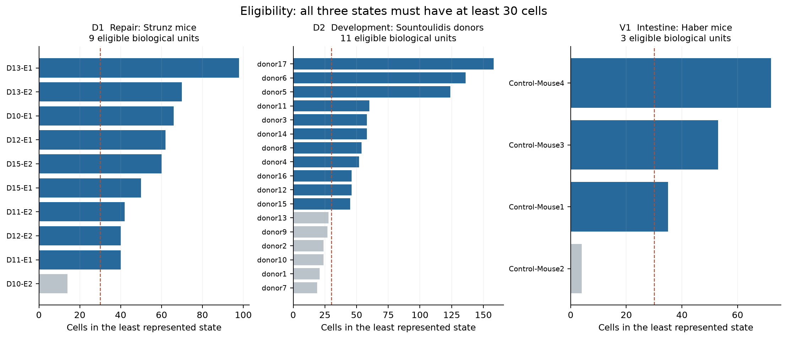
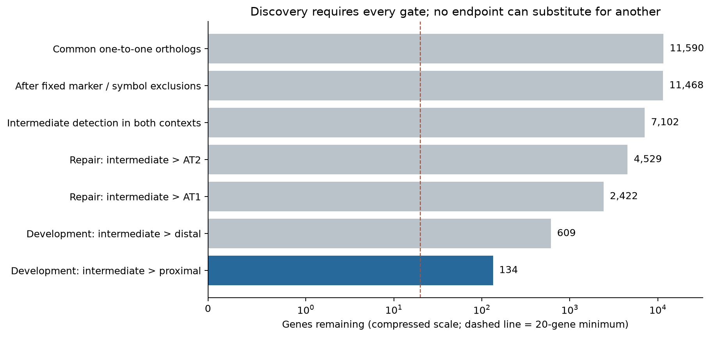
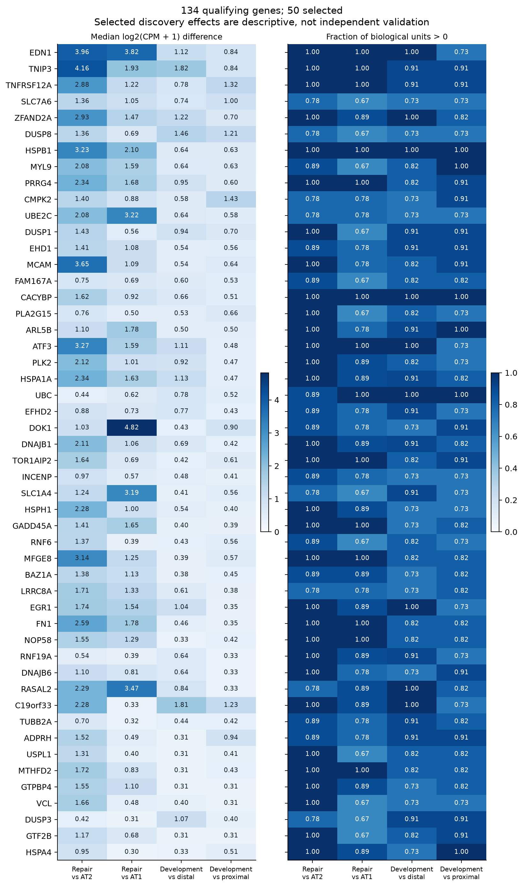
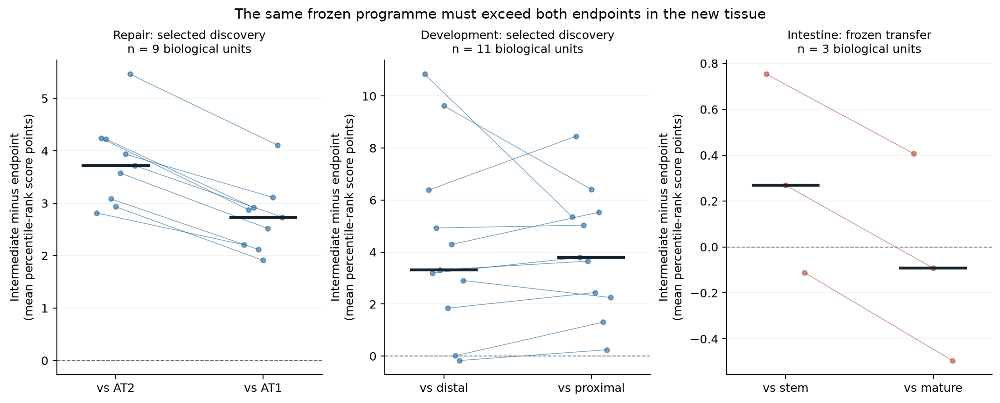

# A0 pilot figures

The [scientific report](../../reports/PILOT_V1_RESULTS.md) is authoritative.
All four figures use the fixed pilot inputs and are recorded in the
[render manifest](../../tables/pilot_v1/figure_render.json) and subsequent
[visual review](../../tables/pilot_v1/figure_review.json). Original feasibility
figures in the parent directory remain historical.

## 1. Biological-unit coverage

Each bar is the least represented of the three states in one mouse or donor.
The dashed line is 30 cells; blue units pass all three floors, gray units fail.
Nine repair mice, eleven developmental donors and three intestinal mice qualify.
Coverage does not establish conservation or power. [SVG](01_biological_unit_coverage.svg).

## 2. Discovery gates

Cumulative display of the fixed gene filters, followed by the four paired
comparisons. All gates are required; the display order has no inferential role.
The compressed x-axis is explicitly labelled. Of 11,590 shared orthologs, 134
qualify and the fixed ranking selects 50. [SVG](02_discovery_gates.svg).

## 3. Selected gene effects

Only the 50 selected genes are shown; the complete candidate and per-unit effects
are in the [full table](../../tables/pilot_v1/discovery_gene_effects.tsv.gz).
Left: within-source median intermediate-minus-endpoint log2(CPM + 1) differences.
Right: positive fractions among nine mice or eleven donors. These are selected
discovery estimates, not validation or causal effects. Gene labels use the human
ortholog. [SVG](03_qualifying_gene_effects.svg).

## 4. Frozen transfer

Dots are biological-unit paired differences, connected only to identify the same
unit across the two endpoint comparisons; lines do not trace cell fate. Thick
horizontal marks are medians. The y-axes use percentile-rank score points and
**different ranges**; no calibrated cross-platform biological magnitude is implied.
D1/D2 are selected discovery contexts. V1 was scored after the programme was
committed and fails against the mature endpoint (1/3 positive mice), despite a
positive stem comparison. No cell-level p-value or confidence interval is shown.
[SVG](04_frozen_transfer.svg).
