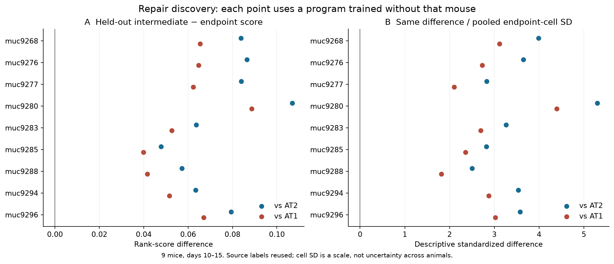
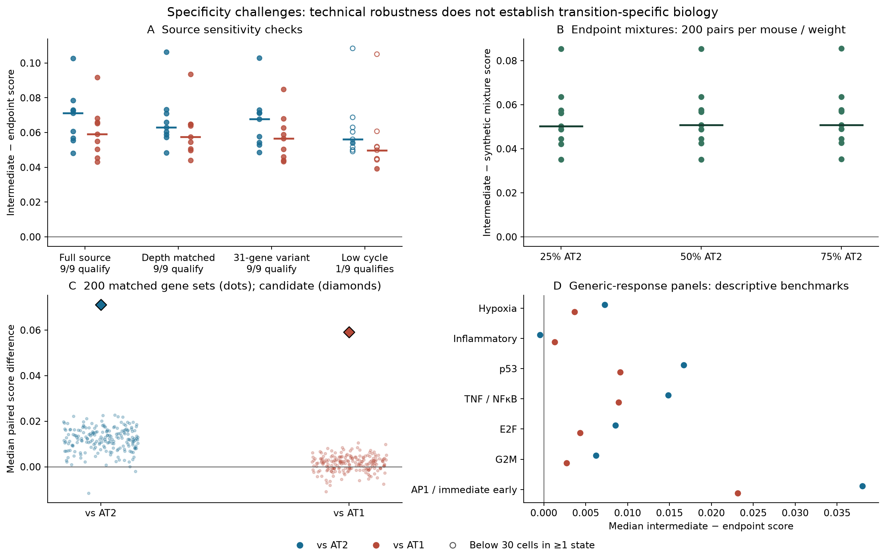
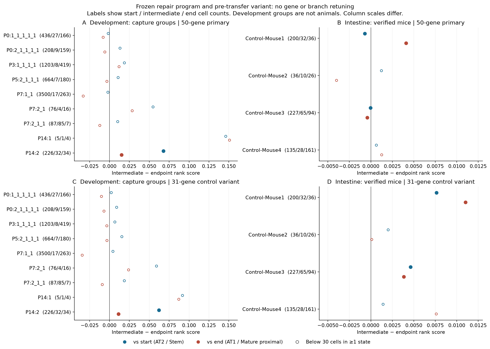

# A0 — Executed exploratory expression pilot

Date: 2026-09-26. **Decision: narrow the hypothesis; stop broad expansion of this candidate for now.**

The pilot was worth running: it identifies a reproducible lung-repair-associated
RNA program, then shows that its full 50-gene form does not robustly distinguish
the proposed intestinal intermediate from both endpoints. A developmental signal
and a smaller control variant remain leads, with substantial replication and
measurement limitations. These findings do not disprove a universal process;
they weaken this particular shared-transcriptomic-program prediction.

## What was authorized and what was completed

The [staged amendment](../EXPLORATORY_PLAN.md) replaced the earlier requirement to
qualify all contexts before analyzing expression. Repair was the only discovery
context. Development and intestine were frozen, descriptive transfer checks.
This is an executed exploratory pilot, not completion of the original two-context
discovery design in [PLAN.md](../PLAN.md). Earlier feasibility reports are historical. This repair-first run is separate
from the already merged [pilot_v1](PILOT_V1_RESULTS.md), which uses different
developmental and intestinal cohorts and a different frozen program. Source
data overlap; this is not independent replication and does not reopen its pruned P4.

| Stage | Question and evidence | Was the next step worth doing? |
|---|---|---|
| E1: discovery and mouse-held-out checks | A 50-gene candidate; 9/9 held-out mice positive against each endpoint | Yes: challenge specificity and technical alternatives |
| E2: source challenges | Both endpoint directions survive depth matching in 9/9 mice; signal exceeds tested endpoint mixtures | Yes: normal-context transfer can distinguish broader reuse from repair restriction |
| E3: frozen transfer | One qualifying developmental group positive; primary intestinal effects near zero; frozen 31-gene variant initially positive | Yes, one targeted depth sensitivity check to assess that discrepancy |
| E3a: post-transfer sensitivity | Variant changes sign versus Stem in Mouse1; matching leaves only one qualifying mouse | No broad expansion; narrow and finish the report |
| E4: closeout | Effect/gene tables, three figures, source hashes and reproducibility checks | Complete the bounded pilot; preserve negative and ambiguous findings |

The complete reviews and limitations are in [stage_decisions.json](../stage_decisions.json).
E3a was added after seeing transfer results. Its purpose and timing are explicit;
neither genes, branches, endpoints nor primary scoring were retuned.

## E1 — Does a reproducible repair-associated signal exist?

[GSE141259](https://www.ncbi.nlm.nih.gov/geo/query/acc.cgi?acc=GSE141259) supplies
32,559 cells × 24,051 genes with author annotations. The selected nine mice at
days 10–15 contain 9,189 epithelial cells across all states; all nine have at least
30 AT2, Krt8+ ADI and AT1 cells each. NC-labeled source controls were excluded.
These are paired mouse comparisons across the selected time window, not nine
replicates at one day. The available matrix covers fewer animals than the full
published study; missing animals were not reconstructed.

Raw counts were summed by mouse/state. Gene selection required positive paired
log2(CPM+1) differences against both endpoints in at least two-thirds of mice,
median differences of at least 0.25 against each, and at least 10% ADI-cell
detection in at least two-thirds of mice. Known label genes and conservative
mitochondrial/Rpl/Rps prefixes were excluded. Of 886 eligible
genes, the top 50 formed the candidate. The [gene table](../tables/exploratory/program_genes.csv)
includes every selected gene's evidence; the [full table](../tables/exploratory/repair_gene_evidence.csv)
also records rejected genes.

Each cell's score averages the probability that a program gene exceeds a fixed
reference gene, assigning ties half credit. The 1,000 reference genes were sampled
from shared feature identities before expression outcomes; overlaps with each
module are omitted from its reference set. Scores are bounded by 0 and 1.
The full gene filter and ranking were repeated after leaving out each mouse.

| Endpoint | Positive held-out mice / 9 | Median paired score difference | Median difference / endpoint-cell SD |
| --- | --- | --- | --- |
| AT2 | 9 | +0.0794 | 3.54 |
| AT1 | 9 | +0.0624 | 2.73 |

Fold gene-set Jaccard overlap with the full candidate ranged from 0.639 to 0.786.
Standardized differences use within-endpoint cell SD solely as a magnitude scale;
they are not confidence intervals or biological replication estimates. Author
state labels are reused, so this internal stability test does not independently
validate the existence or fate of the labeled transitional cells.

## E2 — Could technical effects or generic responses explain it?

- Within-mouse UMI-quintile matching preserves positive differences against both
  endpoints in all nine mice, with at least 30 matched cells per state. Median
  differences are +0.0629 versus AT2 and
  +0.0574 versus AT1.
- All nine intermediate means exceed simulated normalized AT2/AT1 mixtures at
  25%, 50% and 75% AT2 weights. The median worst-weight gap is
  +0.0503. Each weight uses
  200 sampled endpoint pairs per mouse; these are technical draws, not animals.
  This does not exhaust real doublets, ambient RNA or normalization artifacts.
- Nineteen of 50 candidate genes belong to the predefined generic-control union.
  The remaining 31 genes retain positive source effects in all nine mice: median
  +0.0679 versus AT2 and +0.0565 versus AT1. This variant was
  frozen before transfer and never replaced the primary candidate.
- A low-cell-cycle-score restriction preserves directions, but only one mouse
  retains 30 cells in every state. It therefore gives limited evidence about
  independence from proliferation. Activated AT2 is also lower than ADI in all
  nine mice; seven meet the floor for this comparison. Activated AT2 is not a
  validated stress-only negative control.
- None of 200 gene sets matched on size and source mean-expression bins reaches
  the candidate's median difference against either endpoint. The candidate was
  selected for these source effects; these comparisons are conditional diagnostics,
  not selection-adjusted tests or a p-value of zero.

Quality correlations remain present; matching reduces a measured confound rather
than proving its absence. The following summarize 27 mouse/state Spearman values:

| Metric | Median correlation | Range |
| --- | --- | --- |
| measured_genes | 0.259 | -0.001 to 0.677 |
| measured_mito_fraction | -0.012 | -0.238 to 0.119 |
| measured_umi | 0.222 | -0.057 to 0.675 |

The controls include Hallmark p53, hypoxia, inflammatory response, TNF/NFκB, E2F,
G2M, and a short analyst-defined AP1/immediate-early panel. A signature score is
not a direct pathway-activity assay. Differences across unrelated, differently
sized modules should not be interpreted as relative biological strengths.
Removing known control members does not remove every stress-related mechanism.

## E3 — Does the frozen candidate transfer?

Development uses the postnatal AT2 → Transitional → AT1 branch from the Negretti
author viewer linked to [GSE165063](https://www.ncbi.nlm.nih.gov/geo/query/acc.cgi?acc=GSE165063)
and [GSE160876](https://www.ncbi.nlm.nih.gov/geo/query/acc.cgi?acc=GSE160876).
The input is the author's **SCT normalized data-slot export, not raw counts**.
It contains 9,861 postnatal cells in ten encoded groups; nine groups contain all
three states at any count, and only P14:2 has at least 30 of each. The group-to-animal
mapping is missing. Feature coverage is 49/50 candidate genes and 100% of reference
genes. Numeric API columns and row ordering were reconciled to source annotations.
Gene-specific SCT transformations limit direct comparability with raw-count ranks.

Intestine uses author Stem → Enterocyte.Immature.Proximal →
Enterocyte.Mature.Proximal annotations in
[GSE92332](https://www.ncbi.nlm.nih.gov/geo/query/acc.cgi?acc=GSE92332).
The raw integer UMI matrix contains 7,216 cells; 3,240 belong to the four verified
mouse mappings. Only Mouse1 and Mouse3 pass the 30-cell floor for all three states.
The other six source batches were not assigned invented animal identities.
Feature coverage is 48/50 candidate genes and 100% of reference genes.
The candidate's mean detected-gene fraction in intestinal intermediates is
approximately 13–15% across mapped mice, so feature availability should not be
confused with complete expression detection.

The primary transfer results for groups passing the original cell-count floor are:

| Context | Unit | Endpoint | Cells: start/intermediate/end | Intermediate − endpoint |
| --- | --- | --- | --- | --- |
| development | P14:2 | AT2 | 226/32/34 | +0.06788 |
| development | P14:2 | AT1 | 226/32/34 | +0.01523 |
| intestine | Control-Mouse1 | Stem | 200/32/36 | -0.00070 |
| intestine | Control-Mouse1 | Enterocyte.Mature.Proximal | 200/32/36 | +0.00410 |
| intestine | Control-Mouse3 | Stem | 227/65/94 | -0.00005 |
| intestine | Control-Mouse3 | Enterocyte.Mature.Proximal | 227/65/94 | -0.00042 |

P14:2 is positive against both endpoints; it remains **one capture group without
verified biological replication**. Across all nine evaluable developmental groups,
7/9 are positive versus AT2 and 4/9 versus AT1; underfloor groups are descriptive.
Neither qualifying intestinal mouse is positive against Stem, and only one is
positive against the mature endpoint. These near-zero estimates do not support
robust transfer of the full program. Small sample counts prevent a strong claim
that no weaker effect exists.

## E3a — Was the smaller intestinal lead robust enough to pursue?

The pre-transfer 31-gene variant is positive against both intestinal endpoints
in the two initially qualifying mice. The existing published ADI benchmark is
also positive before matching; this is an exploratory comparator, not a new
primary discovery. That apparent discrepancy justified checking intestinal depth.

The targeted check reused the frozen scores and applied within-mouse pooled UMI
quintile matching, sampling equal numbers of each state within each shared bin
without replacement. Two hundred deterministic-seeded draws assess sensitivity
to cell selection. They do not add biological replication. For the 31-gene variant:

| Mouse | Endpoint | Before matching | Median after matching | 5–95% matching-draw range | Matched cells / state |
| --- | --- | --- | --- | --- | --- |
| Control-Mouse1 | Stem | +0.00764 | -0.00388 | [-0.00944, +0.00264] | 25 |
| Control-Mouse1 | Enterocyte.Mature.Proximal | +0.01101 | +0.01057 | [+0.00385, +0.01585] | 25 |
| Control-Mouse3 | Stem | +0.00461 | +0.00188 | [-0.00531, +0.00820] | 32 |
| Control-Mouse3 | Enterocyte.Mature.Proximal | +0.00384 | +0.00465 | [-0.00079, +0.01188] | 32 |

The variant loses the Stem comparison in Mouse1. Only Mouse3 remains above the
30-cell floor, and its matching-draw ranges include zero. The primary candidate
remains near zero or negative versus Stem. The published ADI benchmark also loses
its Stem comparison in Mouse3 after matching. Thus the initial positive variant
does not provide robust two-endpoint, replicated cross-tissue support. Matching
also changes which cells are represented and reduces coverage; it does not prove
that sequencing depth caused the original signal. The draw ranges are **not
biological confidence intervals**.

See the [complete sensitivity table](../tables/exploratory/intestine_depth_matched_sensitivity.csv)
and [matched depth summaries](../tables/exploratory/intestine_depth_matching_quality.csv).

## Hypothesis status and next investment decision

**Supported within this dataset:** a stable repair-associated expression program
distinguishes source-labeled alveolar intermediates from both endpoints and survives
the tested technical challenges. **Suggestive:** some reuse in normal alveolar
development. **Unsupported by this pilot:** robust transfer of the full candidate
to the selected normal intestinal transition. **Unresolved:** weaker shared
components, other normal epithelial branches, or a common process expressed through
different genes, chromatin, mechanics or dynamics.

Accordingly, retain the candidate as a lung-repair-associated program and pause
broad expansion of this specific RNA signature. Do not use it yet to justify a
cross-tissue atlas integration, regulatory-network search, or causal perturbation
claim. A later, bounded follow-up could test the unchanged candidate and variant
in an independently replicated normal transition, with verified units, adequate
three-state capture and matched raw-count annotations. That is a proposed new
investment, not an unexecuted mandatory stage of this pilot.

The experiment tests intermediate-associated abundance, not a temporal law or a
process governing generation of all transitional states. Even a positive result
would require independent state/lineage evidence and perturbations before a causal
claim. The present result is informative against the simplest transferable-signature
version of the hypothesis, not against every possible universal mechanism.

## Artifacts and reproducibility

- [Frozen primary program](../frozen_repair_program.json), [control variant](../frozen_control_variant.json)
  and [frozen configuration](../exploratory_config.json).
- [E1](../stage_E1_result.json), [E2](../stage_E2_result.json),
  [E3](../stage_E3_result.json) and [E3a](../stage_E3a_result.json) machine-readable results.
- [Reproduction commands](../EXPLORATORY_REPRODUCING.md), [current status](../exploratory_readiness.json),
  [validation](../exploratory_validation.json), [execution record](../exploratory_execution_record.json)
  and [expression source manifest](../expression_source_manifest.json).
- Figures are available as PNG and editable SVG in `figures/exploratory/`.
  Cell-level intermediates and public downloads stay in ignored `processed/`
  and `cache/`; tracked tables preserve group-level evidence.

No cell-based biological p-values were calculated. This run does not itself complete the original three-context design; pilot_v1
is reported separately. All stages warranted under this repair-first exploratory
scope, including the explicitly added sensitivity check, have been executed.
