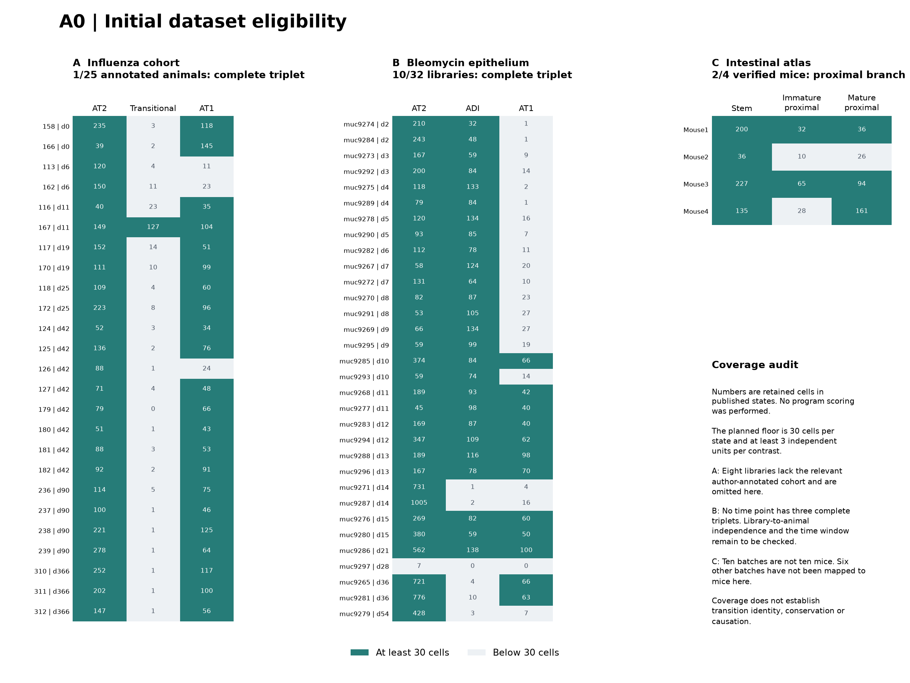

# A0 — Initial dataset eligibility audit

Generated from audit records and a reviewed interpretation template.

Historical initial audit. See the [extended feasibility report](PILOT_REPORT.md)
for the current findings and downstream status.

Date: 2026-09-25. **P0 initiated; initial audit complete; cohort selection unresolved.**
P1 is not frozen and no candidate expression program has been learned or scored.

## Decision

The first candidate set does not yet support the planned three-setting pilot.
The local influenza cohort has too few adequately sampled transitional states.
A bleomycin epithelial dataset is a stronger repair candidate, while development
and intestinal transfer still require design/metadata resolution. This is a
feasibility result, not evidence for or against biological conservation.

Keep the planned 30-cell floor and three-independent-unit minimum. Do not merge
published states, pool different stages without a defined estimand, or count
sequencing batches as animals to manufacture eligibility.

## What was executed

- Read existing retained-cell metadata from GSE262927 and checked cell-ID overlap
  with its cached alveolar matrix. No gene-expression values or prior module
  scores were used to assign states or assess eligibility.
- Retrieved six GEO family metadata archives: GSE254356, GSE165063, GSE160876,
  GSE149563, GSE141259 and GSE92332. Extracted sample designs and processed-file URLs.
- Retrieved the two GSE141259 author annotation tables, the GSE92332 matrix
  **header only**, its supplementary-file README and the original authors'
  parsing example. No new expression matrix was downloaded or scored.
- Counted each published state per observable sample/library, retained failures,
  and recorded source hashes and retrieval times in [the manifest](../source_manifest.json).



## D1: repair datasets

### Existing influenza cohort: insufficient coverage

The local GSE262927 retained-cell table contains 162,175 cells from 33 libraries.
Of these, 8,433 cells have epithelial author annotations across 25 animals.
The relevant published states contain 3,299 AT2, 233 Alveolar_transitional,
429 AT1_AT2 and 1,760 AT1 cells.

Only **1 animal** has at least 30 cells in each of AT2, Alveolar_transitional
and AT1. Keeping the separate AT1_AT2 label as an alternative gives 2 complete
triplets across the entire series. Neither provides the required primary
replication. The 30-cell floor was not lowered.

The cached alveolar object contains 5,694 cells and 32,228 features. Its cell IDs
all match the retained-cell table, but it omits 27 of the 5,721 cells with these
four source labels. Coverage in this audit therefore comes from the full
retained-cell metadata rather than silently treating the subset as exhaustive.

The original table uses `unannotated` for some missing condition labels. The
audit treats that sentinel as missing and aggregates only consistent known
sample facts; it does not fill missing cell-state annotations. Eight libraries
outside the author-annotated cohort are not treated as negative epithelial samples.

Evidence: [per-sample coverage](../tables/d1_sample_coverage.csv),
[stratum checks](../tables/d1_stratum_eligibility.csv),
[cached-object coverage](../tables/d1_cached_matrix_state_counts.csv),
[run record](../local_audit_record.json).

### Bleomycin alternative: promising across time, not selected

GSE141259's enriched epithelial annotation contains 32,559 cells in 32 libraries.
**10 libraries** meet the AT2 / Krt8+ ADI / AT1 triplet floor, at days 10, 11,
12, 13, 15 and 21. There are at most two complete libraries at an individual day.

This supports investigating a paired state contrast across a biologically
defined repair window. It does not establish a three-animal same-day design.
Confirm independent animal/preparation identities and decide how time enters
the estimand before freezing discovery. The default plan requires independent
units for each contrast; this audit has not added a universal requirement that
all units come from one day. Across-time coverage and same-time replication are
reported separately so the design choice remains explicit.

The whole-lung annotation contains 29,297 cells in 28 libraries but only **38 AT1
cells in total**, with no complete triplets. Replicated collection days do not
repair this endpoint-coverage problem.

Evidence: [enriched sample counts](../tables/d1_strunz_high_resolution_coverage.csv),
[counts by time](../tables/d1_strunz_high_resolution_time_coverage.csv),
[whole-lung counts](../tables/d1_strunz_whole_lung_coverage.csv),
[GEO series](https://www.ncbi.nlm.nih.gov/geo/query/acc.cgi?acc=GSE141259).

## D2: developmental cohort remains unresolved

| Candidate | Confirmed deposit/design facts | Interpretation for A0 |
|---|---|---|
| Ke et al., GSE254356 | Three deposited libraries: two EPCAM/ICAM-enriched and one EPCAM-only. Methods describe pooled embryonic lungs. | The paper's reported n=3 is not enough to establish three independent, comparable state contrasts. Pool identities and state coverage remain unresolved. |
| Negretti atlas, GSE165063 + GSE160876 | Six plus nine GEO records, including adult material; most ages have one or two libraries. P7 occurs in both series with differing enrichment. | Pooled animals cannot be counted separately. Same-age/sort comparability and cell-level state annotations must be resolved; no expression matrix downloaded. |
| GSE149563 | Seven mouse scRNA libraries at different ages, plus two human libraries and one bulk ATAC library. | The latter records are not mouse scRNA replicates. An across-age paired design would need explicit biological justification and state coverage. |

These are candidate design limitations, not a claim that all developmental data
are unusable. None is frozen as D2. A targeted next step is to find a donor- or
pool-resolved developmental cohort with source-supported intermediate labels;
if using human data, record the species change and freeze orthology first.

Sources: [Ke primary paper](https://pmc.ncbi.nlm.nih.gov/articles/PMC11945641/),
[Ke GEO](https://www.ncbi.nlm.nih.gov/geo/query/acc.cgi?acc=GSE254356),
[Negretti primary paper](https://pmc.ncbi.nlm.nih.gov/articles/PMC8722390/),
and the accession-specific records extracted into
[GEO sample metadata](../tables/geo_sample_metadata.csv).

## V1: intestinal atlas has recoverable IDs but incomplete eligibility

The GSE92332 homeostatic atlas header contains **7,216 cells in 10 batches** with
author-assigned cell labels. The paper reports six mice; the 10 batches must not
be analyzed as 10 animals. Four control mice are explicitly linked in GEO to
atlas batches B3, B4, B7 and B8. The B3 title contains a typographical error
(`Atla sbatch 3`), preserved in the source mapping.

For a proposed Stem → Enterocyte.Immature.Proximal → Enterocyte.Mature.Proximal
branch, the source counts are:

| Verified mouse | Batch | Stem | Immature proximal | Mature proximal | Complete at 30 cells/state |
|---|---|---:|---:|---:|---|
| Control-Mouse1 | B3 | 200 | 32 | 36 | Yes |
| Control-Mouse2 | B4 | 36 | 10 | 26 | No |
| Control-Mouse3 | B7 | 227 | 65 | 94 | Yes |
| Control-Mouse4 | B8 | 135 | 28 | 161 | No |

Only **2 mice** currently pass. The six remaining batches need a verified
mouse mapping, not an assumption of independence. The proposed branch remains
an eligibility example: author labels alone do not establish a temporal
transition, and independent transition support has not been closed. This is
not a held-out expression test; only design and label coverage were inspected.

Next resolve the complete sample-design supplement and source evidence for this
branch, or replace V1 with a better documented normal-differentiation cohort.
Do not lower the threshold to admit the mouse with 28 intermediate cells.

Evidence: [verified mappings](../tables/v1_haber_verified_mouse_mapping.csv),
[per-mouse coverage](../tables/v1_haber_verified_mouse_coverage.csv),
[all batch/state counts](../tables/v1_haber_batch_state_counts.csv),
[Haber primary paper](https://www.nature.com/articles/nature24489),
[author parsing code](https://github.com/adamh-broad/single_cell_intestine).

## Stage status and next actions

| Stage | Status |
|---|---|
| P0 initial candidate audit | Executed; reproducible tables and source records saved |
| P0 final cohort selection | Unresolved |
| P1 state definitions / method freeze | Not reached |
| P2 discovery | Not started |
| P3 transfer / P4 specificity | Not started |

1. Resolve D2's biological-unit and intermediate-state evidence; replace the
   cohort if those cannot be recovered.
2. Resolve the remaining intestinal batch-to-mouse map and transition evidence.
3. Verify GSE141259 animal independence and define a time-aware D1 contrast.
4. Freeze all three roles and P1 settings before expression-based selection.

The initial search was deliberately bounded. It establishes specific selection
gaps before expensive matrix downloads, integration or model fitting. Existing
A1/ES1 analyses and source datasets were left unchanged.

## Reproduction

From the repository root, use a compatible Python and the documented launcher:

```powershell
python analysis/scripts/run_with_environment.py --site-packages .venv-x64/Lib/site-packages RQ_Specified/A0_conserved_epithelial_transition_program/scripts/audit_local_coverage.py
python analysis/scripts/run_with_environment.py --site-packages .venv-x64/Lib/site-packages RQ_Specified/A0_conserved_epithelial_transition_program/scripts/audit_public_metadata.py
python analysis/scripts/run_with_environment.py --site-packages .venv-x64/Lib/site-packages RQ_Specified/A0_conserved_epithelial_transition_program/scripts/plot_p0_coverage.py
python analysis/scripts/run_with_environment.py --site-packages .venv-x64/Lib/site-packages RQ_Specified/A0_conserved_epithelial_transition_program/scripts/write_p0_report.py
```

This machine used the working Python recorded by the local audit runtime checks;
the older environment launchers are not assumed to work. Cached source files are
excluded from Git. To recover them, use `scripts/fetch_source_metadata.py NAME URL`
with each [manifest](../source_manifest.json) entry's filename and requested URL.
Use `--gzip-first-line` for the intestinal atlas header entry. Its hash applies
only to the saved decompressed header, not to the remote expression matrix.

Download failures at the NCBI web host were resolved using the public GEO FTP
HTTPS host with network permission. No access or scientific gate was silently bypassed.
