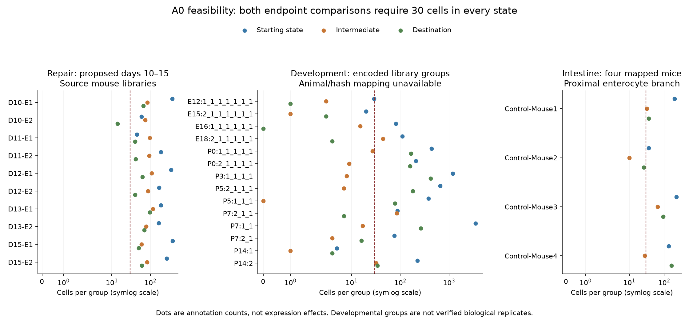
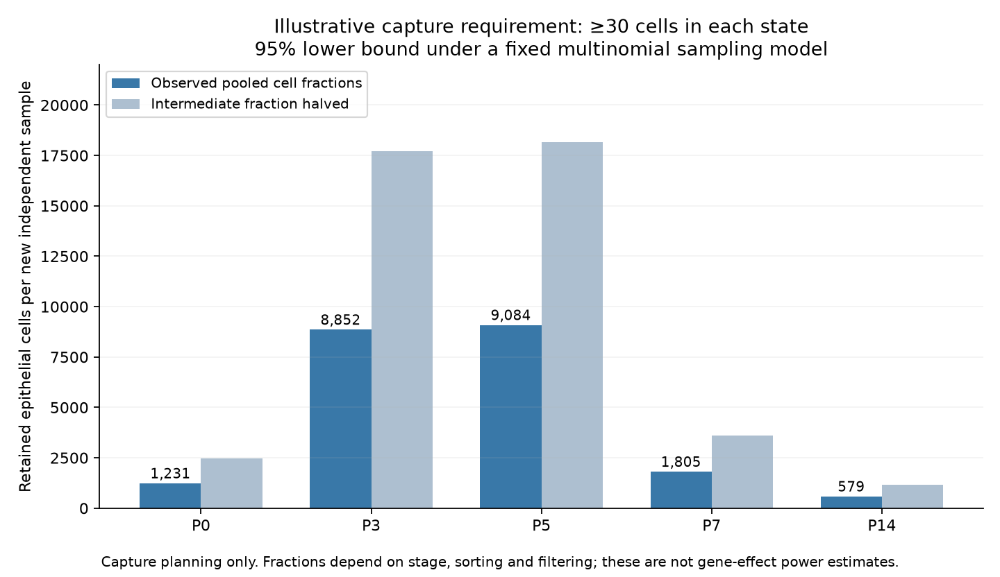

# A0 — Feasibility closeout

Date: 2026-09-25. **Feasibility work completed; the primary biological pilot is blocked by input requirements.**

The question remains worth testing. The current public-data audit does not supply
the replicated developmental and independent non-lung comparisons required by
the plan. The scientific decision is **unresolved**, not evidence for or against
a universal epithelial process. No candidate expression program was learned and
no transfer or specificity test was performed.

## What was executed

The local influenza data, public repair metadata, three developmental candidates,
the intestinal atlas and one planned skin fallback were inspected. Public source
annotations, GEO designs, author analysis/export code and source-study methods
were used. Source files and hashes are recorded in `source_manifest.json`.
The search was bounded to these candidates; this is not an exhaustive claim about
every public epithelial dataset.

| Role | Result | Consequence |
|---|---|---|
| Repair, GSE141259 enriched epithelium | 10 complete triplets across all times; 9 within proposed days 10–15 | Feasible discovery candidate for paired within-mouse contrasts across this interval |
| Development, Negretti atlas | 10,918 epithelial cells; 14 barcode-suffix groups; only one complete group | Does not establish the required three independent comparisons |
| Intestine, GSE92332 | 2 qualifying mice among four explicitly mapped controls | Below three; remaining batch-to-mouse relationships unresolved |
| Skin fallback, GSE67602 | 1,422 cells in 34 capture batches; source reports 19 mice | Animal mapping is missing; batch counts are not biological replication |

The other developmental candidates remain unresolved: GSE254356 has two
EPCAM/ICAM-enriched libraries and one broader EPCAM library with unclear
independent pools and state-level coverage; GSE149563 has mouse libraries across
ages but no recovered author intermediate annotations matching individual cells.
Neither a count matrix alone nor one library per age establishes a valid
intermediate-versus-both-endpoints comparison.

## Repair: a usable candidate, with a specified estimand

The [Strunz study](https://www.nature.com/articles/s41467-020-17358-3) describes two
mice at each sampled high-resolution time. The available annotation has 32
libraries and 32,559 cells, versus 36 mice and 34,575 cells reported for the study.
Unavailable material was not reconstructed. Available complete triplets support
a candidate days 10–15 analysis, estimating paired state differences across that
repair interval. It would not estimate a same-day population effect. Each mouse
would contribute equally; day-balanced and leave-one-day-out sensitivity would
be needed because some days have more eligible mice.

Source-labeled normal controls (`NC-` sample IDs) are excluded from that interval,
even where the annotation's numeric time field falls within it.

This resolves the earlier ambiguity about requiring three mice on the same day:
the plan permits paired comparisons over a biologically specified interval.
The proposed window has not been frozen as P1, and expression outcomes have not
been inspected to select it. Activated AT2 cells could be a relevant comparison
but are not automatically a pure stress-only negative control.

## Development: why pooling by age is misleading

The [author viewer](https://lungcells.app.vumc.org/public/sucre/mouse_development_epithelium_revision/)
exposes cell identity, author state and age. Its 10,918 rows were decoded using
the official cellxgene wire-format schema and reconciled to the public schema.
The [export code](https://github.com/SucreLab/LungDevelopment/blob/master/all_cells/6_cellxgene_files.rmd)
omits animal/hashtag identities and exports the SCT data slot, rather than raw
counts. Original counts and unit IDs would be required before expression analysis.

Barcode suffixes form 14 distinct capture-like groups. Their timing is consistent
with the author loading/merging workflow, but this audit has **not verified their
individual animal identities or all original library assignments**. Counts below
are therefore a coverage screen using encoded groups, not independent-n estimates.

| Encoded group (not mouse ID) | AT2 | Intermediate | AT1 | All ≥30 |
| --- | --- | --- | --- | --- |
| E12:1_1_1_1_1_1_1 | 29 | 3 | 1 | False |
| E15:2_1_1_1_1_1_1 | 20 | 1 | 3 | False |
| E16:1_1_1_1_1_1 | 81 | 15 | 0 | False |
| E18:2_1_1_1_1_1 | 110 | 44 | 4 | False |
| P0:1_1_1_1_1 | 436 | 27 | 166 | False |
| P0:2_1_1_1_1 | 208 | 9 | 159 | False |
| P3:1_1_1_1 | 1203 | 8 | 419 | False |
| P5:2_1_1_1 | 664 | 7 | 180 | False |
| P5:1_1_1 | 377 | 0 | 78 | False |
| P7:2_1_1 | 87 | 85 | 7 | False |
| P7:1_1 | 3500 | 17 | 263 | False |
| P7:2_1 | 76 | 4 | 16 | False |
| P14:1 | 5 | 1 | 4 | False |
| P14:2 | 226 | 32 | 34 | True |

Aggregating all libraries by age would make P0, P7 and P14 appear to pass. That
would combine separate captures to cross the floor and conceal the limiting
state within individual preparations. Only the P14:2 encoded group passes on its
own (226 AT2, 32 intermediate, 34 AT1). Recovering hashtags may identify animals,
but splitting this sparse material cannot be assumed to produce three eligible
animals. Nor can separate pools be arbitrarily merged to manufacture eligibility.

The [developmental paper](https://pmc.ncbi.nlm.nih.gov/articles/PMC8722390/) supports
an intermediate interpretation through trajectory analysis and tissue imaging;
this does not itself establish an independent cell-by-cell fate measurement.
Early embryonic epithelium and postnatal AT2 are different starting states and
must not be combined into one unspecified developmental contrast.

## Transfer: unresolved animal identities

The [Haber study](https://www.nature.com/articles/nature24489) reports six mice and
ten batches. Its published matrix header gives state labels; GEO explicitly maps
four control mice to batches B3, B4, B7 and B8. Only mice 1 and 3 pass the proposed
Stem → immature proximal enterocyte → mature proximal enterocyte branch at the
existing floor. Supplementary Table 1 confirms dataset totals, not the missing
mouse mappings. The author analysis repository does not supply that mapping.
The portal's download tab requires sign-in; no authenticated export was obtained.
Unmapped batches were not counted as additional animals or attached to known
mice by guesswork. No primary merge of proximal and distal branches was made.

For the [Joost skin fallback](https://pmc.ncbi.nlm.nih.gov/articles/PMC5052454/), GEO
provides source state labels and 34 capture prefixes. The study reports 19 mice,
so technical repeats exist or captures otherwise subdivide animals. The recovered
records do not identify which batches should be combined within a mouse. The
supplementary PDF was cached and text on pages 8–20 was searched for capture-prefix
IDs; no mapping was recovered. This limited check does not establish that no
mapping exists in all author resources. Skin eligibility remains unresolved,
rather than zero qualifying mice.

## What additional sampling might require

These figures estimate **capture adequacy, not power for differential expression**.
For each postnatal age, the observed pooled epithelial state proportions were used
as hypothetical probabilities for a new independent sample. The smallest retained
epithelial cell count N was found such that:

`1 − Σ BinomialCDF(29; N, p_state) ≥ 0.95`, summed over AT2, intermediate and AT1.

This union bound gives a conservative probability under a fixed multinomial
sampling model. It does not include uncertainty in estimated proportions,
animal-to-animal heterogeneity, correlated cell capture, sorting differences or
QC loss. The second scenario halves the intermediate fraction while keeping
endpoint fractions fixed and allocating the remaining probability to other cells.

| Age | Observed intermediate fraction | Cells/sample: point scenario | Cells/sample: fraction halved |
| --- | --- | --- | --- |
| P0 | 3.20% | 1231 | 2467 |
| P3 | 0.45% | 8852 | 17710 |
| P5 | 0.44% | 9084 | 18173 |
| P7 | 2.19% | 1805 | 3614 |
| P14 | 6.82% | 579 | 1155 |

Age-pooled proportions are used only for this planning scenario, never as
replicate expression observations. These counts refer to retained epithelial
cells **per independently identified animal or prespecified independent pool**.
They do not refer to raw droplets, total lung cells or sequencing reads. At least
three eligible independent units would still be needed; that minimum is not a
power guarantee. Stage/sort selection needs biological justification before a
new cohort is collected or analyzed.

## Remaining dependencies and next executable step

| Stage | State | Missing dependency |
|---|---|---|
| P0 metadata and coverage audit | Completed for the bounded candidate set | None for this audit |
| P1 freeze | Blocked | Eligible D2 and V1 cohorts with verified independent IDs, state evidence and matching counts |
| P2 common-program discovery | Not run | Both discovery contexts must pass P1 |
| P3 held-out transfer | Not run | Frozen program and eligible non-lung cohort |
| P4 specificity/sensitivity | Not run | Program, evaluable cohorts and relevant controls |

The concrete unblocking input is a developmental dataset with source-supported
start/intermediate/destination annotations and ≥3 independent units, each with
≥30 cells in each state, plus an eligible non-lung dataset. For an existing
candidate, a complete cell-to-library-to-mouse/pool map may resolve part of the
gap; it must be audited before assuming it resolves coverage. Required columns
and the rerun sequence are in [REPRODUCING.md](../REPRODUCING.md).

Do not claim a shared program from repair alone, lower floors after inspecting
the shortages, or substitute cell-level significance for animal replication.
If adequate inputs become available, finish P1 before reading discovery effects,
then execute the original P2–P4 sequence. If the intended hypothesis is instead a
shared regulatory process implemented by different genes, it needs a separate
prospective test: failure of this single-module RNA pilot would not rule it out.

## Reproducibility and limits

The report is generated from audited tables and a reviewed interpretation
template. `readiness.json` is the current machine-readable status; `validation.json`
records the checks and `execution_record.json` records artifact hashes.
The earlier [P0 report](P0_ELIGIBILITY_REPORT.md) is retained as the initial audit.
No raw reads were reprocessed, no expression matrices downloaded for A0, no
candidate program selected, and no biological association reported from this
feasibility work. The original local matrix was inspected only for coverage.
