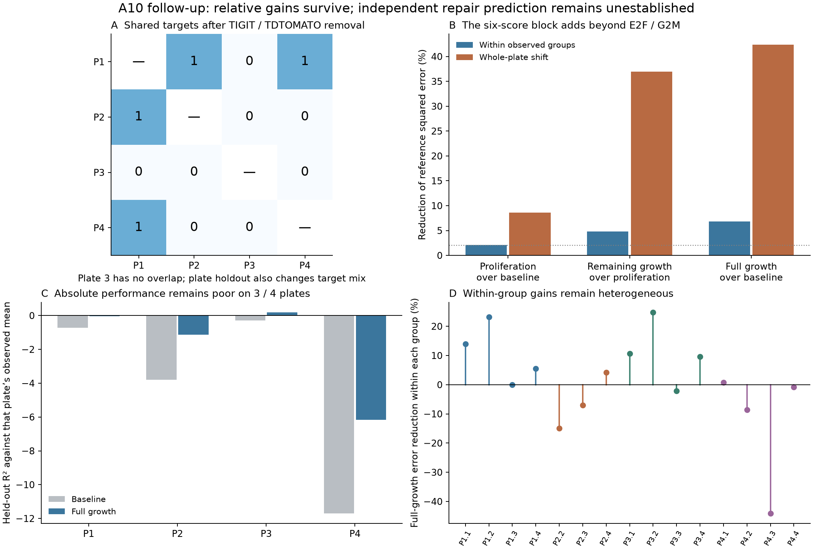

# A10 follow-up: more than the nominated proliferation scores, limited absolute transfer

26 September 2026. The requested design audit, programme decomposition and eligible
holdouts are complete. The six-score epithelial growth block contains information
beyond the nominated E2F/G2M scores, including under whole-plate holdout. However,
relative improvement over a weak baseline does not establish reliable prediction:
the full model has negative held-out R-squared on three of four plates.

The diagnostic plan was committed in `53f5c7a`; diagnostics and the new model
specification in `330f5f2`; implementation in `c7f976a`/`6f49669`, before new fits.
Original results, specifications and claim grades are unchanged.

## What the design audit resolved

The complete GEO family contains 886 sample records with explicit library IDs.
All match the existing RNA data, and the 885 eligible imaging joins reproduce.
No sample-level preparation, isolation, animal, donor or fibroblast-lot identifiers
were found. All 1,883 imaging rows use the same `SAM1` segmentation label; shared
acquisition/calibration is not established by that label alone.

Only four of 203 targets occur on multiple plates. After removing TIGIT and
TDTOMATO, only MECOM links plates 1/2 and RNF43 links 1/4; plate 3 shares no targets
with the others. Thus plate holdout tests a combined change in plate and target
mix. It cannot identify a biological plate effect or independent preparations.
The [design report](FOLLOWUP_DESIGN_REPORT.md) links all metadata and diagnostics.

A subsequent bounded source check identifies TIGIT as the authors' in-plate
control. The caption reports four replicates per gene but does not map libraries
to independent preparations. Detailed methods are in a supplement that could not
be inspected: direct links failed and the public archive bundle exceeded the
30 MB retrieval bound. Thus missing design/calibration facts remain unresolved,
not proven absent from that supplement. No study note or roadmap-reading update
was made. [Primary article](https://pmc.ncbi.nlm.nih.gov/articles/PMC13367804/);
[source/access record](../tables/followup_v1/source_design_check.json).

## The comparison was fixed before fitting

- **Baseline:** day-7 deposited area, epithelial RNA fraction and epithelial library
  size. The latter two are RNA proxies, not direct cell counts.
- **Proliferation block:** E2F targets and G2M checkpoint.
- **Remaining growth:** MYC targets, apoptosis, p53 and mTORC1 scores. This is an
  operational partition, not a claim that these four are biologically unrelated
  to proliferation.
- **Within-group evaluation:** leave one deposited plate-replicate group out,
  with the original centring on observed group means. This remains conditional
  within-group association.
- **Plate-shift evaluation:** leave all replicate groups of one of the four
  deposited plate-layout labels out, without plate/target
  indicators or held-out outcome centring. Feature transformations and coefficients
  are learned on training plates. RNA is still concurrent with day-14 imaging.
- **Metric:** reduction of the comparison's reference squared error, not the
  original delta-R-squared. The new 2% margin is a pragmatic descriptive threshold,
  not a physical or clinically meaningful effect margin.

Primary and drop-both comparisons must meet the margin on both inherited
`log2(deposited area + 1)` and untransformed deposited-statistic scales. Consistent
plate-shift gain additionally requires a positive increment in each held-out plate
in those settings/scales. All four target-removal settings are reported. No p-values,
BH procedure or biological confidence intervals are supplied for unresolved units.
See the [frozen amendment](../config/a10_followup_models.json).

## Results

Relative reductions in squared error, inherited-log2 scale. Each row uses its own
nominated reference model, so percentages cannot be added. Within-group and
plate-shift evaluations have different targets/baselines and are not measures of
the same generalization task.

| Comparison | Within group: primary | Within group: drop both | Plate shift: primary | Plate shift: drop both | Fixed combined rule |
|---|---:|---:|---:|---:|---|
| Proliferation over baseline | 2.10% | 2.79% | 8.62% | 8.67% | Not met |
| Remaining growth over proliferation | 4.84% | 5.55% | 36.96% | 39.41% | Met descriptively |
| Proliferation over remaining growth | 6.15% | 7.35% | 50.38% | 52.65% | Met descriptively |
| Full growth over baseline | 6.84% | 8.18% | 42.39% | 44.66% | Met descriptively |

Proliferation alone narrowly misses the within-group margin on the untransformed
primary scale (1.9615%), and worsens one held-out plate in the primary and two
after dropping both targets. This is not evidence that proliferation is irrelevant.
The primary equal-group mean error reduction is also negative (-1.46%), despite
the pooled +2.10%, which exposes unequal weighting by group size and error variance.

The full growth block and both conditional additions pass on both fixed scales.
For full growth, the primary plate-shift gain is positive on all four plates
(40.15%, 55.72%, 36.67%, 43.56%). Within groups it is positive in only 8/15;
the equal-group mean improvement is 1.02%, versus the pooled 6.84%. The remaining
block beyond proliferation is positive in 11/15 groups. Correlated gene sets,
composition and shared conditions still preclude a claim of separate mechanisms.

Sources: [pooled/equal-fold comparisons](../tables/followup_v1/model_comparisons.tsv),
[every fold](../tables/followup_v1/model_fold_comparisons.tsv),
[prediction records](../tables/followup_v1/model_predictions.tsv), and
[run/decisions](../tables/followup_v1/model_run.json).

## Relative gain does not establish good absolute prediction

Primary inherited-log2 plate holdout:

| Held-out plate | Baseline R-squared | Full-growth R-squared |
|---|---:|---:|
| 1 | -0.728 | -0.034 |
| 2 | -3.795 | -1.123 |
| 3 | -0.278 | 0.190 |
| 4 | -11.707 | -6.172 |

The held-out plate's mean appears only in this diagnostic R-squared denominator;
it is not used to generate predictions. Negative values mean worse squared error
than that observed-mean benchmark. The positive relative gains therefore support
added information in this screen, while substantial calibration/transport error
remains. No result establishes a forecast of growth, an independent preparation
effect, or an in vivo repair mechanism. See
[absolute errors](../tables/followup_v1/model_absolute_performance.tsv).

Panel A shows target overlap after the fixed double exclusion. Panels B–D use
the primary inherited-log2 scale. Points are deposited groups, not established
biological replicates. The dotted line in B is the new 2% reference-error margin;
its combined decision also requires the untransformed and drop-both checks.
No confidence intervals are implied. [Vector figure](../figures/a10_followup.svg).

## Biological interpretation and what was pruned

The data are not reduced to the two selected E2F/G2M scores: the other four growth
scores add conditional information. This supports a broader measured RNA correlate
of organoid size. It does not isolate biosynthesis, apoptosis or p53 as causal
drivers; MYC and mTORC1 can also relate to proliferation, and scores overlap.
Mean organoid area is not tissue mass, viable-cell yield, mature AT1 function or
repair success. Physical area units/transformation metadata remain insufficient
for converting the effect into those endpoints.

The following dependent work was stopped deliberately:

- A target-adjusted four-plate effect after TIGIT/TDTOMATO removal: plate 3 is
  disconnected from the shared-target design.
- Target-level functional interpretation: guide sequences and the authors' TIGIT
  control designation are available, but well-specific editing efficiency and
  independent preparation mapping remain unresolved.
- Additional fibroblast/pathway searches or retrospective BH inference: these
  would neither repair the missing design nor independently confirm an adapted
  model. The old secondary comparisons retain their disclosed limitations.
- Further fitting solely to improve plate transfer: absolute failures and joint
  plate/target shift require better design/calibration evidence before another
  model-selection cycle.

The authorized bounded follow-up is complete. Stronger conclusions now need an
explicit preparation/lot crosswalk, interpretable imaging calibration and a fresh
matched validation design. A1, A5 and A11 retain their separate evidence needs;
this screen does not resolve lineage, regulation-to-fate mediation or cancer
specificity. No author contact or Notion expansion was performed.

## Verification and reproduction

- Reproduced all 12 reported values in the original four-cell grid within its
  rounding tolerance before new fits.
- Passed 1,399 numerical/provenance checks, including 32 independent, unscaled
  QR fits reproducing the plate predictions to maximum error 1.37e-11. Altering
  held-out outcomes left the independent training fits unchanged.
- Recomputed saved prediction errors, pooled/fold gains, decisions and hashes.
  The [verification record](../tables/followup_v1/verification.json) preserves
  every check. The figure was visually inspected.
- Portable CI checks in `analysis/tests/test_a10_followup_contract.py` require no
  raw caches and protect the delivered evidence and absolute-performance caveat.

Scripts 07–10 implement audit, fitting, verification and rendering. Inputs include
the original three metadata tables, the hashed Hallmark NPZ/GMTs and the GEO SOFT
metadata whose URL/hash are in the diagnostic record. Raw inputs remain ignored.
Numerical scripts refuse overwrite: rerun only in a separate clean copy retaining
the original reference tables but excluding completed follow-up outputs. The
portable test can verify the delivered artifacts directly in a normal clone.
