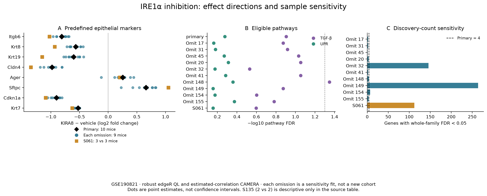
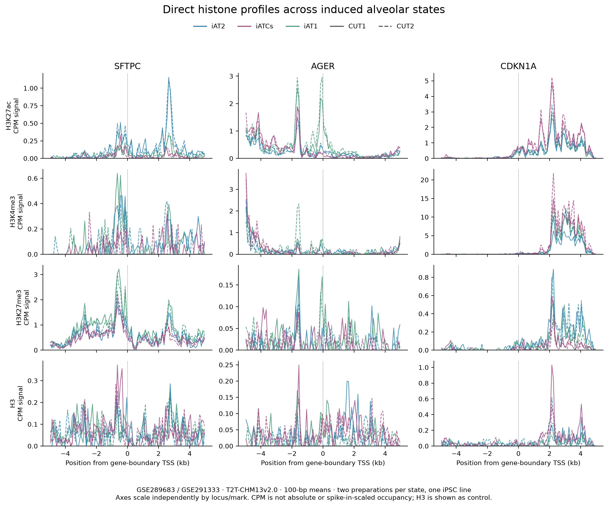
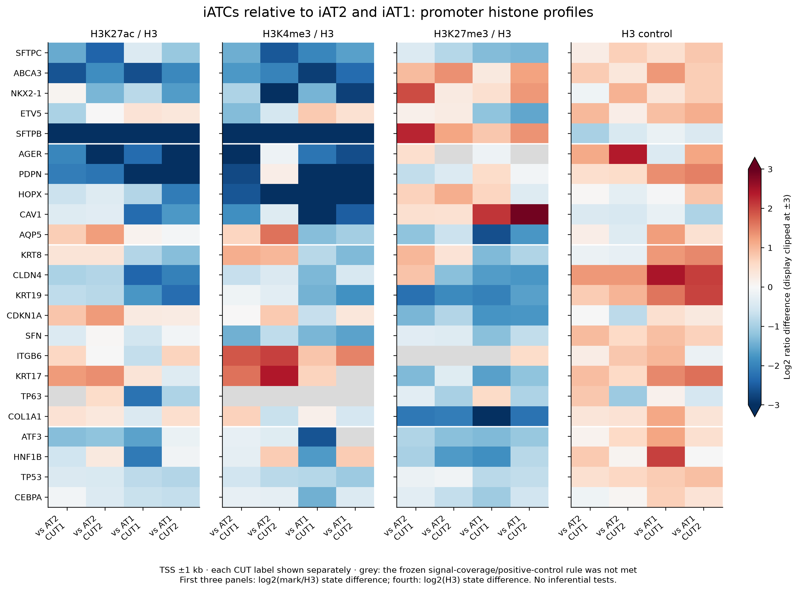
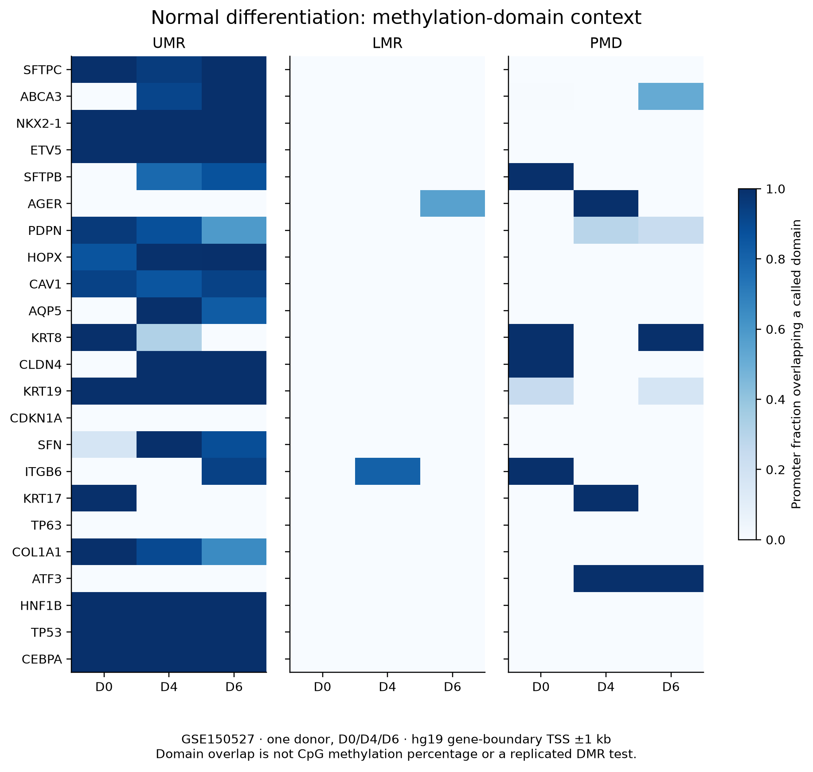
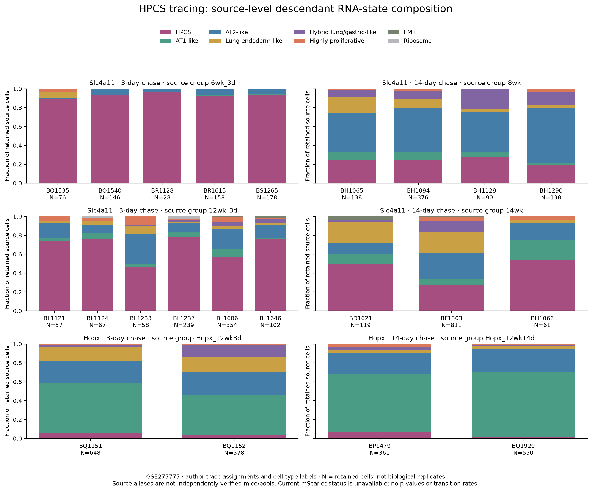
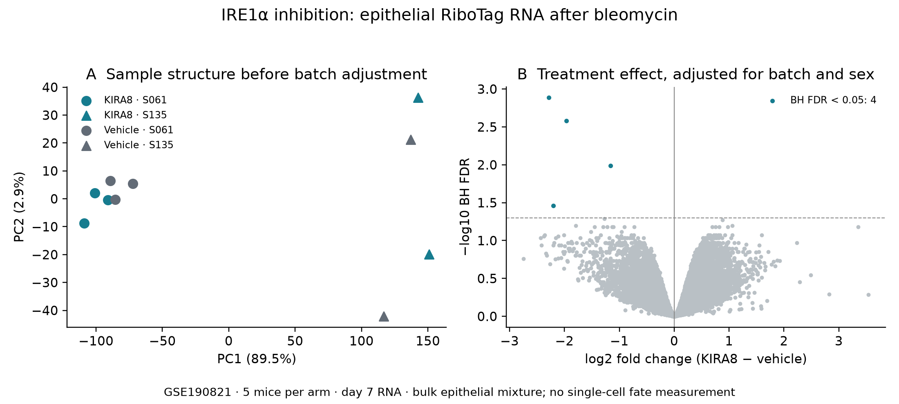
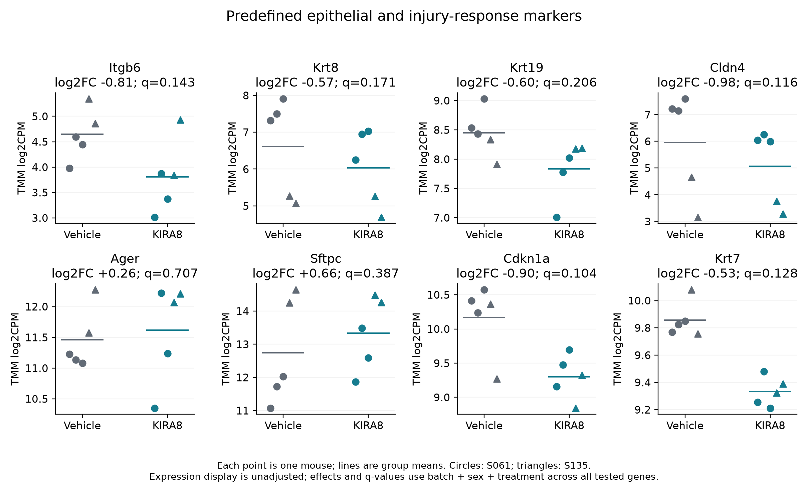
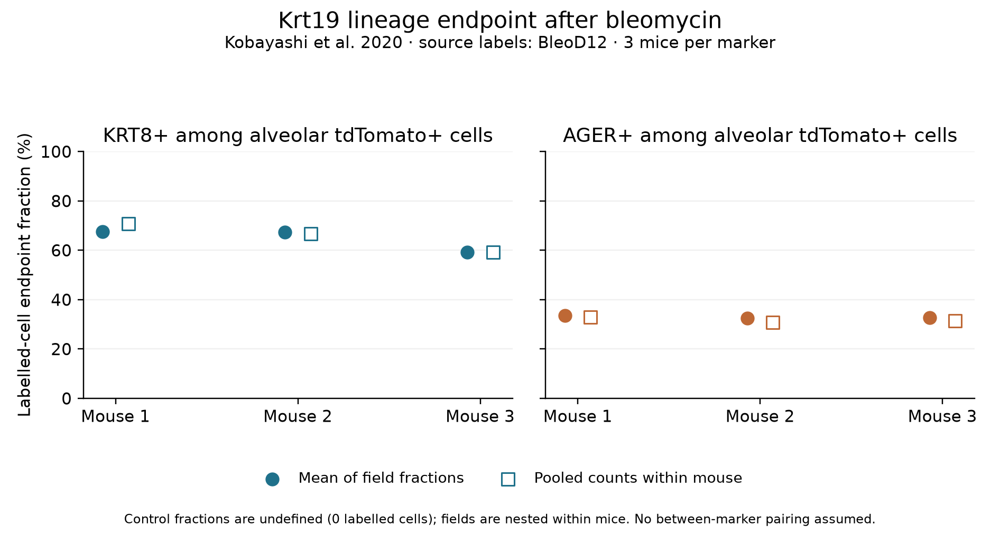
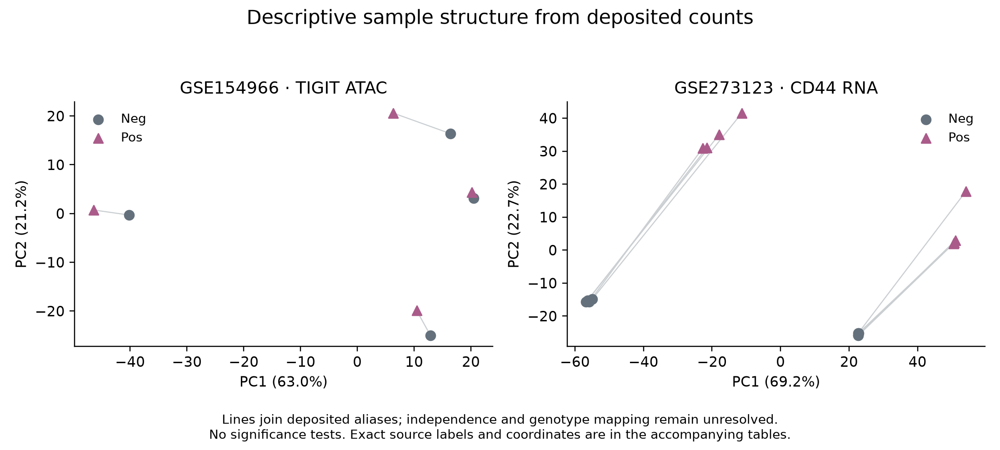

# A1 figure gallery

The verified second batch adds five figure groups to the four first-batch
groups. Read the [second-batch report](../reports/SECOND_BATCH_REPORT.md) and
[first-batch report](../reports/FIRST_BATCH_REPORT.md) for models, source hashes
and limits. PNGs below have adjacent SVG versions. Original second-batch renders
remain preserved under `second_batch/`; the corrected versions are below.

## IRE1α omission and batch sensitivity

Eight frozen markers, ten nine-mouse omission fits and the six-mouse S061 fit.
Seven markers retain direction in every omission; Ager does so in nine.
Dots are point estimates, not confidence intervals. Whole-family discoveries
range from 1 to 264 versus 4 in the primary analysis. TGF-β passes pathway FDR
only for omission of mouse 148; the primary pathway result remains nonsignificant.
S135 (two per arm) stays descriptive in the
[table](../tables/second_batch_verified/ire1_focus_stability.tsv).
The four post-selection primary discoveries remain outside this marker panel.
[SVG](second_batch_verified/a1_ire1_stability.svg).

## Direct histone profiles and controls

Three frozen loci, four marks including H3, three induced states and both
CUT preparations from one B2-3 iPSC line. Native CHM13 coordinates, gene-boundary
TSSs and 100-bp means. Axes scale independently across locus/mark. CPM is not
absolute or spike-in-scaled occupancy. [Values](../tables/direct_marks_2026-09-25/locus_tracks.tsv),
[SVG](second_batch_verified/a1_histone_loci.svg).

All 23 loci and both preparations, ±1-kb windows. First three panels display
log2(mark/H3) differences; the fourth displays H3 differences. Grey indicates
failure of the frozen coverage/positive-signal rule. CDKN1A shows higher
H3K27ac/H3 and lower H3K27me3/H3 versus iAT2 in both preparations, but other
loci disagree or change direction under H3 normalization. The
[complete ±1/±5-kb sensitivity table](../tables/second_batch_verification/histone_window_and_H3_sensitivity.tsv)
retains counterexamples and held ratios. These are descriptive preparations,
not population tests. [SVG](second_batch_verified/a1_histone_promoters.svg).

## Normal-differentiation methylation-domain reference

One donor at D0/D4/D6, hg19 ±1-kb promoters. Colour is promoter fraction
overlapping an author-called UMR, LMR or PMD, not CpG methylation percentage.
Classes are separate annotations, not an assumed partition. The main panel
assumes one-based inclusive domains; the alternative BED convention changes
fractions by at most 0.0005. No replicated DMR or purified transitional state
is inferred. [Values](../tables/direct_marks_2026-09-25/methylation_domain_overlap.tsv),
[SVG](second_batch_verified/a1_methylation_domains.svg).

## HPCS trace-linked descendant source composition

5,333 retained author-designated traced cells across 22 source labels. Each
bar retains every RNA-state category, including zeros; N denotes captured
cells, not biological replicates. Source labels, driver and chase are linked
to author hash assignments and GEO libraries in the
[manifest](../tables/hpcs_source_composition/source_manifest.tsv).
Current mScarlet is absent in these traced rows. Mouse/pool independence and
the IGO17543 age discrepancy remain unresolved, so the panel is a descriptive
source reproduction with no p-values or transition rates. Source means and
cell-pooled fractions are reported separately in the
[summary](../tables/hpcs_source_composition/group_descriptive_summary.tsv).
[Counts](../tables/hpcs_source_composition/source_state_counts.tsv),
[SVG](hpcs_source_composition/a1_hpcs_source_composition.svg).

## IRE1α perturbation: sample structure and treatment effects

Five vehicle and five KIRA8 mice, GSE190821. PCA uses the 2,000 most variable
retained genes without batch removal; PC1 explains 89.5% and separates batches.
The volcano uses a batch + sex + treatment edgeR model and all-gene BH FDR.
Four of 14,811 tested genes pass FDR < 0.05. These are day-7 epithelial
ribosome-associated RNA measurements, not traced-cell fate or chromatin assays.
[Coordinates](../tables/ire1/sample_PCA.tsv),
[gene effects](../tables/ire1/gene_effects.tsv),
[SVG](a1_ire1_rna_overview.svg).

## Predefined molecular endpoints

All eight frozen markers are shown, with one point per mouse and group means.
Shapes identify batch. Display values are unadjusted TMM log2CPM; effects and
q-values come from the adjusted model and the full tested-gene family. None
passes FDR < 0.05. Apparent directions do not establish restored cell fate.
[Plotted values](../tables/ire1/marker_logCPM.tsv),
[effects](../tables/ire1/predefined_marker_effects.tsv),
[SVG](a1_ire1_marker_panel.svg).

## Measured PATS lineage endpoint reconstruction

Kobayashi Extended Data 4 source data, labelled BleoD12. Three named mice per
marker; fields remain nested within each mouse. Filled circles average field
fractions; open squares pool counts within that mouse. Control denominators
are zero, so their fractions are undefined. No between-marker pairing,
mutually exclusive composition or transition-rate estimate is assumed.
[Mouse table](../tables/lineage/pats_mouse_endpoints.tsv),
[field table](../tables/lineage/pats_source_fields.tsv),
[SVG](a1_pats_lineage_endpoints.svg).

## Descriptive ATAC and protein-sorted RNA profiles

PCA of deposited integer counts after CPM/log2 transformation, using 2,000
variable features. Lines connect literal source aliases. ATAC pool independence
and CD44 alias-to-genotype mapping are unresolved; neither plot supplies
biological replication or an inferential contrast. Labels and coordinates:
[ATAC](../tables/descriptive/GSE154966_source_PCA_QC.tsv),
[CD44 RNA](../tables/descriptive/GSE273123_source_PCA_QC.tsv),
[SVG](a1_deposited_source_PCA.svg).

No biological peak-overlap plot was made for GSE141635: the deposited histone
calls use incompatible region settings. The
[technical audit](../tables/descriptive/H3K4me3_technical_geometry.tsv) records why.

## Remaining figure plan

The existing
[RNA/accessibility figure](../../../analysis/figures/rq/rq_a1_chromatin.png)
remains a historical descriptive result; it does not answer the expanded
histone-modification or fate questions.

| Proposed figure | Main evidence | Presentation |
|---|---|---|
| A1-1 | Sampling and modality-specific state maps | Assay/design diagram; separate RNA and ATAC UMAPs; cross-assignment matrix |
| A1-2 | Sample-level accessible regulatory programmes | PCA with paired sources joined; accessibility effects; motif heatmap; genome tracks |
| A1-3 | Direct histone marks and methylation reference | Descriptive tracks/domain heatmap completed above; replicated direct-mark effects and promoter CpG estimates remain future work |
| A1-4 | Measured lineage, then testable time/topology | PATS mouse endpoints and HPCS source-composition table completed; verified HPCS biological units and independently testable trajectory remain future work |
| A1-5 | Functional perturbation and linked phenotype | RNA response, eligible pathways and separately measured differentiation/fibroblast outcomes |
| A1-6 | Optional tissue proteins and cross-assay synthesis | Donor/ROI protein, morphology and regional effects; measured-versus-inferred evidence matrix |

Each figure requires plotted values, sample counts, an independent-unit
definition, source/code hashes and visual review. Cell-level violins are
descriptive; donor/animal points carry inference. No embedding should imply a
trajectory without independent temporal/fate evidence. The [analysis plan](../PLAN.md)
specifies figure-specific eligibility and sensitivity checks.
