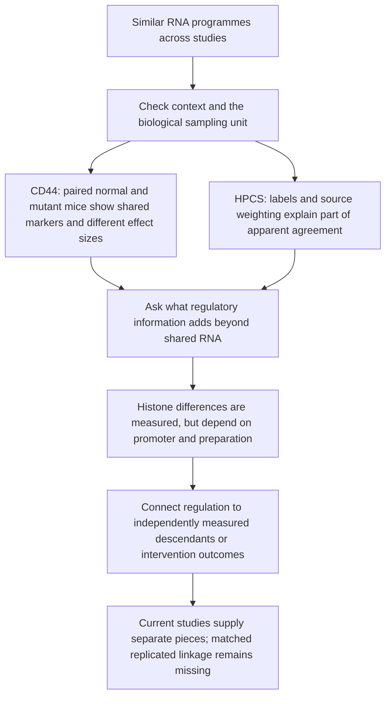

# A1 adaptive evidence closure

25 September 2026. The owner requested completing feasible work, changing the
sequence when earlier results make a later step uninformative, and checking
established analysis references before every new launch.

The most useful new result is that **CD44-associated RNA changes are strongly
context-dependent, while several familiar transitional markers change in both
WT and mutant lungs**. The recovered identities permit a direct paired test of
that distinction. The HPCS annotation hold is resolved: its stringent classifier
is confidence filtering of the same prediction, rather than independent support.
These results refine A1's logic; they do not establish a universal regulatory
taxonomy or link chromatin and future fate in the same cells.

## Read the evidence as a sequence

The [analysis-reference map](ANALYSIS_REFERENCE_MAP.md) distinguishes published
precedents, same-cohort reanalysis, separate evidence and unmet requirements.
Published conclusions informed this work; the numerical contracts were frozen
before the new results, not before any prior knowledge of the studies.

## CD44: identity recovery unlocks the paired question

The 16 NCBI SRA full records retain original FASTQ filenames. They connect the
count matrix's R26/OG identifiers and CD44 gates to exact GSM records. The only
identifier spelling normalization is `R26_1` → `R261`, likewise 2/7/8; sample
numbers and gates must agree. The join is one-to-one, not based on column order,
PCA, expression or the generic `OG TMX` treatment field. GEO's explicit study
design and WT1–4/SPC Mut1–4 titles identify four paired mice per genotype.
The unrelated GSE273122 genotype contradiction is not carried into this cohort.

Precedents: [Rodriguez et al. Fig. 3e–k](https://doi.org/10.1038/s41467-025-63735-1)
and the [edgeR quasi-likelihood workflow](https://doi.org/10.12688/f1000research.8987.2).
Our extension tests the **difference of paired CD44 effects** directly. In
`~0 + mouse + positiveWT + positiveMutant`, mouse absorbs the genotype baseline;
the interaction is `positiveMutant − positiveWT`. The full design has rank 10,
16 libraries and six residual degrees of freedom. Genotype/disease main effects
cannot be estimated separately from the mouse intercepts in this model.

From the deposited raw integer matrix, 15,516 genes survive the shared
`filterByExpr` rule. TMM factors span 0.897–1.084. Raw library totals span
9.02–21.36 million counts. No mouse was removed. Quasi-likelihood models use
robust dispersion estimation; primary BH adjustment is recorded per contrast
and additionally over all 46,548 gene–contrast tests. The latter supports the
cross-contrast discussion here; combining families can raise or lower individual
q-values relative to per-contrast adjustment.

| Contrast | Per-contrast FDR <0.05 | Pooled three-contrast FDR <0.05 |
|---|---:|---:|
| CD44+ minus CD44−, WT | 6,615 | 6,659 |
| CD44+ minus CD44−, mutant | 8,739 | 8,480 |
| Mutant minus WT difference in CD44 effect | 5,023 | 5,321 |

Large discovery counts describe this sorted bulk experiment, not thousands of
independent biological mechanisms. Technical alignment/RNA-integrity QC is not
available in the deposited count matrix; unrecorded technical differences remain
a limitation. Bulk fractions can contain different mixtures of cells.

Seven of the eight transported IRE1 marker genes show significant CD44-associated
changes in **both** genotypes: Itgb6, Krt8, Krt19, Cldn4, Cdkn1a and Krt7 increase;
Sftpc decreases. Ager does not pass either contrast. Thus, in this comparison,
these shared marker directions do not identify the mutant fibrotic population
specifically. This does not claim that the two CD44+ populations are identical,
or that any individual mouse contains a pure transitional state.

| Marker | WT paired log2FC | Mutant paired log2FC | Interaction | Interaction pooled q |
|---|---:|---:|---:|---:|
| Cldn4 | +2.942 | +1.220 | −1.722 | 3.39e−13 |
| Krt19 | +1.083 | +0.600 | −0.483 | 5.55e−8 |
| Sftpc | −0.569 | −0.808 | −0.239 | 0.0251 |
| Krt7 | +0.573 | +0.770 | +0.198 | 0.0191 |
| Cdkn1a | +0.220 | +0.377 | +0.157 | 0.0559 |

Itgb6 and Krt8 have no detected interaction; Ager is also inconclusive. These
are differences of within-genotype effects, not mutant-versus-WT baseline
expression comparisons. A nonsignificant interaction does not demonstrate
equivalence. All eight markers and every tested gene are retained in the tables.
The frozen conditional rule launches eight leave-one-mouse-pair-out fits because
focus markers pass the primary family threshold; those effects are sensitivity
checks, never replacement discovery tests.

All seven significant shared-marker directions persist in all eight omission
fits, as do all four detected interaction directions. Magnitude matters:
**Sftpc's interaction shrinks from −0.239 to −0.0046 after removing WT2**,
despite retaining its sign. Treat that interaction as fragile. Cldn4 remains
−1.749 to −1.536, Krt19 −0.494 to −0.349, and Krt7 +0.170 to +0.381.
These ranges are sensitivity ranges, not confidence intervals. No new
mechanistic follow-up is promoted from the fragile Sftpc interaction.

Evidence: [exact sample crosswalk](../tables/evidence_closure/cd44_sample_manifest.tsv),
[all gene effects](../tables/cd44_closure/all_gene_effects.tsv),
[focus effects](../tables/cd44_closure/focus_effects.tsv),
[paired values](../tables/cd44_closure/marker_paired_differences.tsv),
[omission summary](../tables/closure_verification/cd44_focus_stability.tsv),
[run record](cd44_closure_run.json), and [figure](../figures/evidence_closure/a1_cd44_context.png).
This reuses the published cohort; it is not independent replication of that paper.

## HPCS: biological map recovered, validation interpretation corrected

Under a specific new 80-MiB-per-notebook scope, both previously oversized
notebooks were retrieved (69,091,594 and 49,691,834 bytes) from pinned commit
`b52d53c984e21d3bb3a163041fdb3f56b54c19c0`. Git blob hashes and lengths match.
Only cell source text was extracted; author code was not executed.

Notebook 01 cell 142 explicitly maps `newleiden` to the eight biological labels.
It reproduces **all 28,402 deposited labels**, including all 5,333 traced cells.
The K12 classifier is a different construction; its numeric codes cannot be
substituted into that map. Cell 116 sets `clusterK12_stringent` to `other` unless
classifier confidence is at least 0.8. Every one of the 1,282 traced-cell changes
(24.04%) is an abstention; none switches between retained K12 codes. Across the
whole object, all 11,133 changes are also abstentions.

Abstention is uneven: 146/1,717 HPCS-labelled cells (8.50%), 538/1,277 AT2-like
cells (42.13%), and 331/531 lung-endoderm-like cells (62.34%). These are RNA-state
label summaries, not independent accuracy estimates. Removing `other` would
alter the denominator and can bias state comparisons. The original ARI values
remain correct as partition summaries; their interpretation now explicitly
accounts for classifier dependence and rejection.

Notebook 02 defines driver-excluded labels (`cell type_noSH`) from a separate
reclustering. Those labels are absent from the recovered observation table.
Recomputing them would require the expression/model workflow and would still
be same-data annotation sensitivity. It cannot resolve mouse/pool identity,
current mScarlet protein, chase/library aliasing or the IGO17543 age discrepancy.
Accordingly, it is not needed to close the independent-validation question.

Evidence: [mapping and abstention checks](../tables/evidence_closure/hpcs_annotation_audit.tsv),
[all source/state summaries](../tables/evidence_closure/hpcs_abstention_summary.tsv),
[source inventory](closure_source_inventory.json), [run](closure_identity_run.json),
and [figure](../figures/evidence_closure/a1_hpcs_abstention.png).

## Adaptive decisions for every remaining branch

| Branch | Evidence examined and decision | What would change the decision |
|---|---|---|
| CD44 identities and genotype-specific response | **Completed:** SRA originals resolve the crosswalk; paired contrasts and direct interaction run. Shared marker directions retire using this panel alone as a disease-specific label. | Independently defined state/protein or fate outcomes are required for specificity beyond the sorting comparison. |
| HPCS annotation robustness | **Completed:** explicit author mapping and confidence-abstention audit. Independent-classifier interpretation retired. Existing source omissions and design-rank checks are reused. | Independent labels/features or a genuinely separate validation cohort; rerunning related labels does not supply one. |
| HPCS biological fate inference | **External input required:** new notebooks provide no animal/pool crosswalk or timing correction; no current-state reporter for traced rows. | Exact animal/pool members, age/timing records and reporter measurements. Crosswalk alone does not remove chase/library aliasing. |
| TIGIT paired ATAC | **Targeted recovery exhausted:** all eight SRA full records recover original sort/source filenames but no additional pool membership. The compound 106621_106642 remains ambiguous against the reported four replicates. | Explicit disjoint animal/pool membership and pairing; author contact remains a separate, unrequested action. |
| PATS deposited histone comparison | **Normalization hold remains:** 20 SRA experiments and raw files exist; the paper describes MintChIP/BWA/HOMER and H3-normalized peak calling, but not a recoverable executed scale/control contract for every deposited track. | Executed scaling/control records, or a separate common raw-processing study. |
| PATS raw reprocessing | **Pruned from this discriminating sequence:** deposited original files total 54.86 GB (48.01 GB for 16 histone/H3 libraries), before reference/alignment storage. Raw processing could standardize a descriptive injury-versus-homeostasis comparison, but does not separate injury, sort and state or resolve A1's matched regulatory-to-fate gap. | A defined useful contrast and adequate compute/storage plan, with missing biological/preparation identity and control associations reconciled. No raw download was started and no runtime estimate is presented as measured. |
| Independent direct-mark comparator | **Context screen complete; quantitative comparison not eligible:** GSE150527 has donor-matched input and H3K27ac BigWigs across D0/D4/D6, but catalog text says aligned BigWigs without specifying their quantitative scale. Donor 2 provides published enhancer replication; D4 is not a purified injury transitional population. | Verified track scaling plus an appropriate state definition. Existing one-donor methylation-domain context is retained; it is not replicated DMR evidence. |
| IRE1 cell-resolved follow-up / bulk deconvolution | **Design screen complete; replicate-level test not eligible:** GSE243124 pools 2/2/3/3 mice into one GEM library per saline/KO/KIRA8/bleomycin condition. No recovered donor labels or author cell annotations. Deconvolution adds assumptions without fixing the lack of independent treatment libraries. | Demultiplexed original mice, independent pooled-library replicates or a new replicated treated/control dataset. Descriptive reproduction of the published single-cell panel remains possible but cannot fill this inferential gap. |
| GSE243129 as another KIRA8 experiment | **Excluded:** the linked accession is neonatal Tgfbr2 knockout/hyperoxia, not an IRE1 intervention cohort. | A different explicitly matched accession. |
| New SAGE perturbation analysis | **Public-input hold:** current primary text still promises later GEO/Single Cell Portal/code deposition; no new accession was verified in this bounded check. | Published processed data, guide/sample identities and animal-level design. |
| More embeddings, pooled cross-study DE, marker-derived “validation,” repeated IRE1 fits | **Unnecessary for the remaining questions:** they reuse dependent evidence or change the estimand without resolving the recorded gaps. | A new independently measured endpoint or explicit analysis question. |
| Universal epigenetic taxonomy / regulatory causality / same-cell fate linkage | **New measurements or a suitable independent cohort required.** Histone, lineage and intervention observations currently come from different experiments. | Replicated, state-aligned regulatory perturbation and measured fate, with controls for general stress/cycle and mature states. |

This closes the selected executable work and records why other branches stop.
It is not an assertion that no additional public dataset or useful experiment
exists. Resource-heavy or descriptive studies are not silently counted as
completed. No author messages were sent; the concise English Notion page remains
unchanged and contains neither the critique nor this follow-up ledger.

## Verification and reproducibility

The [frozen contract](../config/closure_analysis_contract.json), acquisition
inventories, exact executed source archive and run records separate acquisition,
identity recovery, numerical fitting and verification. Two preflight parsing
errors were corrected before numerical analysis; both are documented in
[the failure record](closure_preflight_failures.json). Historical numerical
outputs are protected by a baseline hash inventory. Verification covers input
identity, count preservation, design rank, BH adjustments, interaction algebra,
annotation reconstruction and source-omission completeness. Test results and
figure inspection are recorded in the delivery check record. Independent checks
confirm 113 unchanged earlier numerical artifacts, 46,548 BH adjustments,
15,516 interaction identities and 28,402 author label reconstructions. Both
new figures were visually inspected. The gallery README is intentionally
updated and is excluded from the numerical-immutability count.
