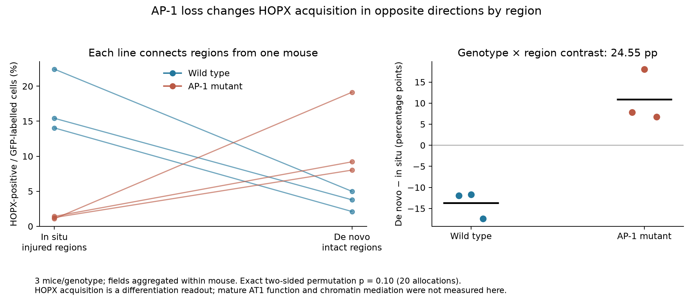
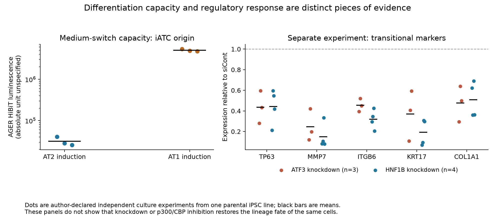

# A1: identities, regulatory evidence and measured outcomes

25 September 2026. The three requested avenues were pursued using previously
uninspected primary records and established analyses. The main advance is a
more specific biological explanation: **transitional markers can accompany
different origins and outcomes, and suppressing a transitional program does
not have a uniformly beneficial differentiation effect.** This strengthens
the reason to distinguish states using context and measured outcomes. It does
not establish a universal state taxonomy or same-cell chromatin mediation.

## What changed

| Avenue | New result | Consequence |
|---|---|---|
| Identity records | All 22 retained HPCS aliases match named mice in Supplementary Table 4; IGO17543 harvest is 14 weeks | The mouse-identity and Hopx-harvest holds are resolved. Mouse summaries are now justified; the library/chase confounding and missing current reporter remain. TIGIT pool membership was not recovered. |
| Comparable regulatory evidence | Full SRA records identify all 64 Tsutsui runs: 26 inhibitor CUT&Tag, 32 organoid CUT&Tag and six fibroblast RNA libraries | Two explicitly numbered CUT preparations and their treatment/H3 controls are identified. The published, perturbation-associated regulatory analysis can be placed in the evidence chain. No new normalized track comparison or peak-count fit is claimed. |
| Regulation to outcome | Reanalysis of AP-1 microscopy at the mouse level, Tsutsui culture source values, and signed TP53 gene lists | Regional context changes the AP-1 outcome; differentiation capacity, program suppression and shared RNA are distinct results. A universal “less transitional state means better repair” interpretation is rejected. |

The [reference map](ANALYSIS_REFERENCE_MAP.md) was updated before numerical
launch. Existing author DiffBind/HOMER/GREAT analyses, figure definitions and
source tables guided the extensions. These are reanalyses of those experiments,
not additional independent replications. The
[contract](../config/regulatory_fate_analysis.json) is explicitly
source-informed: layouts and source values were inspected before specification.

## 1. HPCS: exact animals recovered, design limits retained

The [2026 HPCS article](https://www.nature.com/articles/s41586-025-09985-x)
Supplementary Table 4 contains a `Mice` sheet with animal tags, library headings,
sex, reporter genotypes and harvest week. Joining the exact tag component of
each author-demultiplexed alias to this table resolves **22 distinct animals
and all 5,333 retained traced cells**. Library and driver agree for every join.
This is stronger evidence than inferring animals from the shape of a sample name.

The [crosswalk](../tables/regulatory_fate/hpcs_mouse_crosswalk.tsv) records
each source cell range. The retained groups contain 5/4 Slc4a11 mice at the
early 3/14-day chase, 6/3 at the late chase, and 2/2 Hopx mice. Four additional
animals are listed for these experiments but lack a retained traced alias in
the recovered subset: **BO1534, BR1311, BL1241 and BH1719**. Their absence is
recorded without assigning an exclusion mechanism or a zero-cell outcome.

For Hopx IGO17543, `Mice!A90:M92`, the main Fig. 2 tracing design and GEO agree
on a **14-week harvest following induction at 12 weeks and a 14-day chase**.
The old README's 12-week-harvest wording is superseded by the primary animal
table and figure. The separate 3-day harvest-week labels are rounded study
labels, not exact chronological ages calculated from dates of birth.

[Equal-mouse summaries](../tables/regulatory_fate/hpcs_named_mouse_summary.tsv)
reuse the existing state counts. Sex and reporter dosage vary between groups;
the early 3-day retained Slc4a11 group has one male and four females, versus
three males and one female at the 14-day chase. The previously established
library/chase rank deficiency is unchanged. These are between-animal endpoint
compositions, not within-animal conversion rates, and no temporal p-value is
added. Current mScarlet status remains unavailable for traced cells.

For TIGIT, the previously uninspected
[2020 author repository](https://github.com/matanhofree/lungTumorEvolution/tree/31cb173ae9dc9b2af23f8cbbb692e89147569fb0)
was pinned and its complete tree and README inspected. It provides single-cell
computational methods, not the needed ATAC pool crosswalk. The original paired
`~Mouse + Tigit_status` analysis is a method precedent; it does not establish
membership/non-overlap of `106621_106642`. That inference remains held.

## 2. Regulatory comparisons: a newly resolved perturbation design

[Tsutsui et al.](https://doi.org/10.1038/s41467-026-68909-z) already performed
DiffBind differential-peak analysis, HOMER motif analysis and GREAT
motif-associated gene prediction in inhibitor-treated iATCs. Their Fig. 8/9
track captions specify **E. coli DNA normalization**. This is different from
the deposited baseline CPM tracks analyzed earlier in A1; do not compare their
absolute amplitudes or silently reuse the baseline scaling assumption.

The [new full-record crosswalk](../tables/regulatory_fate/tsutsui_sequencing_crosswalk.tsv)
recovers treatment, mark and author-declared preparation numbers that were
missing from the generic ENA run catalog:

- **PRJDB37980:** DMSO, CBP30 and GNE781 × two CUT preparations × H3,
  H3K27ac, H3K4me3 and H3K27me3, plus two DMSO p300 libraries: 26 total.
- **PRJDB37983:** 32 epithelial organoid CUT&Tag libraries spanning DMSO/BLM,
  days 14/17 and inhibitor conditions. Use explicit titles/treatments for each
  subset; do not assume every mark occurs in every treatment.
- **PRJDB37982:** NHLFs alone or with iATCs, three author-declared biological
  preparations per condition: six RNA libraries, not histone measurements.

Supplementary Data 2 contains 325 shared predicted AP-1/HNF1B-associated genes
and a supplied 126-gene RNA-upregulated subset; all 126 are in the shared set.
These are the author's selected predictions, not a new discovery or a binding
assay. The HNF1B-only column has 317 rows but **313 unique genes**, because
ZNF608, ZNF609, ZNF710 and ZNRF3 each occur twice. Raw row memberships are
preserved and unique counts are reported separately in the
[set audit](../tables/regulatory_fate/tsutsui_gene_set_audit.tsv).

No scaled per-replicate perturbation signal matrix, peak-count matrix or
spike-in factors were recovered from these inspected resources. Raw SRA reads
exist, but no raw sequencing was downloaded. Reprocessing PATS's approximately
48-GB histone/H3 reads would still leave injury/sort/state inseparable; it was
pruned again because it would not answer a newly estimable causal question.
The PATS normalization hold remains specific to its deposited tracks.

The AP-1 bulk ATAC precedent, GSE309751 and the author's supplementary tables,
provides additional regulatory context, not a fully matched fate experiment.
Two 49-day mock-PBS sample titles conflict with their treatment fields saying
Sendai infection. Also, correlating the published 14-day-minus-PBS and
49-day-minus-14-day changes reuses the middle time point with opposite signs;
negative correlation alone is not evidence of biological reversal. We did not
launch that shortcut or infer independent animals from library suffixes.

## 3. Regulatory perturbation and differentiation are context-dependent

### AP-1: nested source values reveal a regional interaction

The [Lynch preprint v2 Fig. 4I](https://www.biorxiv.org/content/10.1101/2025.10.25.684549v2.full)
contains a direct lineage-labelled microscopy endpoint; the
[July 2026 accepted-paper abstract](https://doi.org/10.1093/ajrcmb/aanag157)
also describes region-specific differentiation. Numerical values here come
from the preprint source workbook, not an assumed unchanged accepted-paper
supplement. Download labels do not reliably identify table contents: the
HOPX workbook is **DC5/media-5.xlsx**, while DC9 contains marker-gene tables.
Internal headers and the figure legend determine the mapping.

There are three mice per genotype and three fields per mouse in each region.
The primary endpoint sums HOPX-positive and GFP-labelled counts within each
mouse/region, then gives each mouse equal weight. Mouse numbers are scoped
within genotype; repeated numbers across regions identify within-mouse pairs.

| HOPX-positive fraction among GFP-labelled cells | Wild type, mean of 3 mice | AP-1 mutant, mean of 3 mice | Mutant minus WT |
|---|---:|---:|---:|
| In situ, injured regions | 17.30% | 1.24% | −16.06 percentage points |
| De novo, intact regions | 3.63% | 12.12% | +8.49 percentage points |

The genotype-by-region difference is **24.55 percentage points**. Equal-field
weighting within mice gives 24.27 points. All nine leave-one-mouse-per-genotype
omissions remain positive, ranging from **19.07 to 27.62 points**. This supports
a consistent direction in the observed animals, not precise population inference.

An exploratory exhaustive permutation of the six mouse regional differences
has only 20 possible 3-versus-3 allocations. The two-sided p-value is **0.10**,
the smallest possible here, assuming exchangeable mouse-level differences under
the null. Genotype assignment is not claimed randomized. We do not transplant
the paper's plotted p-values into a mouse-level conclusion or treat an
absence of conventional significance as evidence of no regional effect.

This endpoint measures **HOPX acquisition by labelled cells**, not completed,
functional AT1 differentiation. The same study's mutant RNA/ATAC experiment
has one pooled library per condition; those nuclei cannot supply independent
genotype replication or be paired to these microscopy animals. The evidence
supports a role for AP-1 in context-dependent transition. It does not prove
that a particular accessible peak mediates fate.

### Tsutsui: plasticity and program suppression are separate experiments

The [source reconstruction](../tables/regulatory_fate/tsutsui_endpoint_summary.tsv)
checks 317 measurements across 65 endpoint/condition summaries against the
workbook's averages and sample SDs. Figure legends call these biologically
independent culture experiments. They use one parental epithelial iPSC line;
derived reporter lines do not add independent donors. Cross-panel pairing is
not assumed.

After medium switching, iATC-derived cultures show a 229.88-fold mean SFTPC
increase under AT2 induction and a 33.32-fold mean AGER increase under AT1
induction relative to the respective day-zero population values. These fold
changes start from low baselines and are not percentages of converted cells.
The AGER HiBiT reporter is **158.45-fold higher** in AT1 versus AT2 induction
from iATC origin, with three experiments per condition. The workbook repeats
an adult-lung-ratio heading above luminescence values; we preserve their numeric
values and label the absolute luminescence unit unspecified rather than assign
an unsupported physical unit.

In separate siRNA experiments, ITGB6 expression averages **0.455** of siCont
after ATF3 knockdown and **0.319** after HNF1B knockdown; KRT17 averages
**0.369** and **0.192**, respectively. All five supplied transitional markers
decrease in mean. AP-1 inhibitors give mean normalized gel-contraction
inhibition of **59.64%** and **57.89%** in three experiments. The source workbook
spells the first compound `SR11392`; the figure and methods identify **SR11302**.
The table preserves the original label and this discrepancy is explicit.

Normalized siCont entries are all 1 and contraction anchors are 0/100 by
construction. They were not treated as measured zero-variance controls for new
tests. The combined evidence supports modifiable programs and population-level
differentiation capacity. It does **not** show that p300/CBP inhibition or
knockdown rescues the fate of the same cells followed in the medium-switch assay.

### TP53: shared selected RNA changes do not establish one origin or state

The [Morowitz preprint](https://www.biorxiv.org/content/10.64898/2026.06.24.732965v1.full)
reports AT1-specific Mdm2 perturbation, lineage tracing and live imaging, and
compares AT1- and AT2-origin RNA responses. Its supplied selected DE table can
be audited even though **GSE335749 and GSE335750 are currently private**, with
GEO displaying a scheduled release of 1 June 2027. That conflicts with the
manuscript's statement that they are publicly available.

The paper's table description calls 3,984/686/868 genes upregulated. The
[actual signed values](../tables/regulatory_fate/tp53_signed_set_summary.tsv)
show:

| Supplied set | Increased | Decreased | Opposite directions between origins |
|---|---:|---:|---:|
| AT2-origin only, 3,984 genes | 2,049 | 1,935 | Not testable from this selected list |
| AT1-origin only, 686 genes | 245 | 441 | Not testable from this selected list |
| Shared significant set, 868 genes | 493 in both | 266 in both | **109** |

Cldn4 and Cdkn1a increase in both supplied contrasts, consistent with some
transitional-response convergence. However, 109/868 shared significant genes
change in opposite directions. “Shared significance” therefore cannot be
renamed “shared activation.” A gene unique to one significant list is not a
tested origin interaction; an unlisted coefficient is unknown, not zero.
No enrichment analysis, independent DE fit or causal regulatory claim was
made from selected lists without the full tested universe/counts.

## Adaptive decisions and remaining requirements

The feasible public-source continuation is complete. These concrete requirements
remain; they are not unfinished computations on already usable inputs:

| Question still open | Why the next analysis was not launched | Exact changed input required |
|---|---|---|
| Paired TIGIT inference | Compound source and overlap remain ambiguous | Animal/pool membership for all four source blocks |
| HPCS current-state retention or adjusted chase effect | Current reporter missing; libraries confound chase; reporter dosage/sex vary | Trace-linked current fluorescence; independent libraries spanning chase within matched designs |
| PATS histone-amplitude comparison | Deposited scaling/H3 association unresolved; raw reprocessing cannot remove design confounding | Explicit normalization/scales and matched control definitions, or a new matched cohort |
| Quantitative inhibitor chromatin effect | Preparation identity now known; normalized signal/count inputs not recovered | Per-preparation peak counts/normalized tracks plus spike-in/H3 scaling provenance |
| Origin-specific TP53 interaction | GEO remains private; selected lists are insufficient | Full count matrix and biological sample manifest; source-level lineage outcome counts for independent verification |
| Causal regulation-to-fate mediation | Chromatin, program suppression and differentiation are measured in separate experiments | Replicated perturbation/rescue with linked chromatin and observed lineage endpoints; independent donors/animals and region-aware design |

The [prepared source requests](SOURCE_REQUEST_DRAFTS.md) specify only the inputs
still needed; no messages were sent. Repeating cell-level tests, refitting
already completed CD44/IRE1 models, or adding adjacent-time peak correlations
would not resolve these requirements. The Notion page remains the concise
English reasoning summary requested by the owner.

## Verification and provenance

Scripts 32–35 record bounded public acquisition, exact sample joins, source
calculations and independent checks. The first numerical launch stopped before
writing results when an assumed unique-gene count exposed the four duplicate
HNF1B symbols; the corrected audit preserves those source rows explicitly.
Transport retrieval success in the source inventory is not semantic validation:
the AP-1 BioC endpoint returned an error page, so the public preprint HTML and
actual workbook contents were used instead.

Verification independently reproduced 12 AP-1 mouse/region fractions, all 20
permutation allocations, 868 shared-gene signs and 65 Tsutsui endpoint summaries.
It also checked all new source/output hashes, **113 earlier numerical artifacts**,
and the previous closure's six identity and 18 CD44 output hashes. Five focused
unit tests cover nested denominators, zero denominators, interaction direction,
small-sample permutation resolution and opposite signs. Both figures were
visually inspected. Run records and exact execution sources accompany this
report; repository-wide delivery checks are recorded separately.
