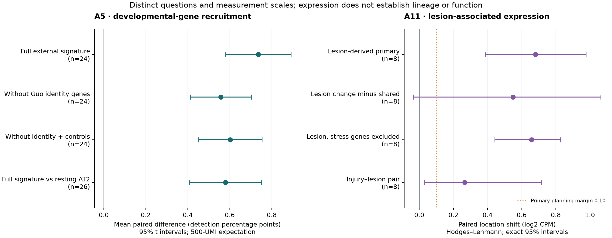

# A5/A11 revised tests: results and biological interpretation

The external developmental signature increases in adult transitional cells,
including after the planned external identity and control exclusions. A11's
primary direction is positive; the predefined stronger relative-activation
criterion is not met. Interpret these as paired RNA
associations, with the distinct biological limits below.

25 September 2026. Plans and external A5 definitions were committed in `eb5317e`
before new expression scores. Implementation and the passed discovery check were
committed in `19fa116`. See [biological logic](../BIOLOGICAL_LOGIC.md),
[A5 plan](../../A5_developmental_programme_reuse/PLAN.md) and
[A11 plan](../../A11_lesion_programme_addition/PLAN.md).

## A5: partial developmental-signature recruitment

| Test | Mice | Mean pp | 95% CI | p | Holm q |
|---|---|---|---|---|---|
| Full external signature | 24 | 0.735 | [0.579, 0.892] | 1.25e-09 | — |
| Without Guo identity genes | 24 | 0.557 | [0.413, 0.702] | 4.56e-08 | 9.12e-08 |
| Without identity + controls | 24 | 0.602 | [0.451, 0.754] | 2.7e-08 | 8.09e-08 |
| Full signature vs resting AT2 | 26 | 0.580 | [0.407, 0.752] | 2.87e-07 | 2.87e-07 |

Intervals are per-test; secondary decisions use the displayed Holm adjustment.

All 24 primary mice have positive paired differences. The equal-day mean is
0.753 pp; leave-one-mouse-out means range from
0.701 to 0.764 pp. All 24 activated-AT2
and 26 resting-AT2 candidate mice still meet the fixed floors after raw depth >=500.
The primary and both external exclusion modules have complete source-gene coverage.

The source signature is recruited beyond activated AT2, including the 57-gene
identity-excluded and 53-gene identity/control-excluded versions. This weakens the
specific explanation that all signal comes from Guo-defined mature alveolar identity
or the six nominated Hallmarks. It does not remove unlisted stress programmes, ambient RNA or annotation effects,
validate clustering, establish lineage direction or measure repair function.
Effect size is a mean detection-probability difference at 500 UMI, not a fraction
of cells converted or a log-fold change. No meaningful-effect margin was invented.

Strunz's pre-established observation concerned poor overall correspondence of
developmental and injury signatures. A positive paired mean for an external
subset is compatible with that observation: some genes can be recruited without
the populations sharing global identity. The 94/51-gene Strunz-filtered modules
and pairwise overlaps are descriptive references, not independent confirmations.

## A11: report direction, magnitude and biological claim separately

| Test | Patients | HL log2 CPM | 95% CI | Exact p | BH q |
|---|---|---|---|---|---|
| Lesion-derived primary | 8 | 0.681 | [0.386, 0.976] | 0.007812 | — |
| Lesion change minus shared | 8 | 0.549 | [-0.034, 1.063] | 0.05469 | 0.05469 |
| Lesion, stress genes excluded | 8 | 0.658 | [0.442, 0.827] | 0.007812 | 0.02344 |
| Injury–lesion pair | 8 | 0.267 | [0.031, 0.715] | 0.02344 | 0.03516 |

Intervals are per-test; secondary decisions use the displayed BH adjustment.

Primary direction: **positive**. Primary positive-margin classification:
**positive shift exceeding the 0.10 planning margin supported**. This is a pragmatic log2 CPM margin, not a clinical threshold.
The arithmetic mean sensitivity is 0.695 log2 CPM
(95% t interval [0.443, 0.947]); it estimates
a mean rather than the primary location parameter. 8/8 patient
differences are positive. Omission means range from 0.631
to 0.747; omitting double-primary P0028 gives
0.663.
These are descriptive omissions of already-normalized scores.

The predefined stronger *narrow* criterion (positive primary plus positive
BH-significant beyond-shared and stress-excluded tests) is **not met**.
The shared union's mean paired change is 0.171 log2 CPM; its own
direction must accompany any interpretation of the relative score contrast.
A stronger claim of activation beyond the nominated shared response is not established by the predefined combined criterion.

This experiment compares pooled author tumour epithelium with normal AT2, a changed
population definition from discovery. It does not establish malignant identity or
specificity relative to non-neoplastic repair/fibrosis. A module's source-list
exclusivity and even a positive beyond-shared comparison do not establish a separate
mechanism. Three Hallmark exclusions do not exhaust stress/cycling biology.

## How the two results fit A1

A5 asks which externally defined developmental genes are recruited during repair.
A11 asks whether lesion-associated expression replicates and how it compares with
a nominated common response. Neither moves a cell along a presumed repair-to-cancer
trajectory. A1's observed opposing regional AP-1 directions and mixed-direction TP53 overlap
show why shared RNA must be separated from lineage, regulatory mediation and
successful repair. Existing evidence supplies that context without repeating pooled
chromatin analysis as if it were independent confirmation.

## Verification and execution record

- All 46 original human broad/narrow discovery pairs reproduced within
  8.88e-15; the original all-histology TMM scope was retained.
- Paired arithmetic, A5 t intervals, A11 exact sign enumeration and HL estimates,
  multiplicity adjustment, depth expectation and output hashes were independently
  checked by this reporting script. Original frozen artifacts remain unchanged.
- Strunz's deposited matrix is cells-by-genes (32,559 by 24,051); the loader's first
  shape assertion stopped before scores. Explicit dimension-verified transposition
  corrected the orientation. A Python-to-R boolean parsing mismatch similarly
  stopped A5 inference before outputs; explicit parsing corrected it. Neither
  changed a population, gene set, threshold or test. Failed attempts produced no
  scientific result to replace.
- A5 source/raw retrieval and score records are under its `tables/`; Kim source,
  pseudobulk and normalization records are under `tables/test_v2/`. Raw inputs and
  large intermediates remain in ignored caches. R session files record versions.

## What remains scientifically unresolved

The requested transcriptional tests are complete. Independent replication in
another adult injury study would test generality of A5 beyond Strunz. A comparable
non-neoplastic human injury arm and supported epithelial identity would be needed
for A11 specificity. Neither new cohort acquisition nor a functional perturbation
is replaced by re-scoring existing pooled data. There is no result-dependent
subtype search, threshold change or automatic expansion into these new studies.
