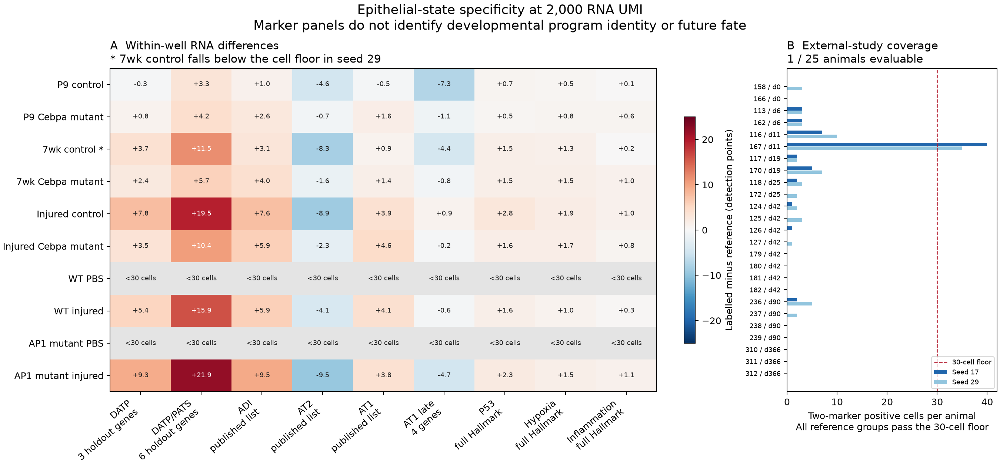

# Epithelial-state specificity

This project combines the former A1 chromatin motivation and A5 neonatal
marker warning into a measurable RNA specificity question: which changes
extend beyond the two transcripts used to label a group, and how do they
vary across developmental stage, injury and genotype?

The executable first pass is **ES1**. Read the [frozen analysis plan](PLAN.md),
[module definitions](modules.json), and [generated results](results/SUMMARY.md).
The figure shows within-well differences; each multiome condition is one
pooled library. It does not assign fate or measure chromatin reversibility.



## What is measured

ES1 uses the ten cached GSE247130/GSE310539 multiome wells and an animal-level
eligibility check in GSE262927. Counts are jointly subsampled to 2,000 RNA UMI,
with a second technical seed. The two-transcript group requires detectable
Cldn4 and Krt8; its reference requires Sftpc and lacks the conjunction. Both
groups need 30 cells. The primary scores exclude the labeling genes. Every
gene, group size, gene coverage, genotype and technical seed is retained in
the output tables. There are no cell-level significance tests.

The source-backed panel library includes:

- The complete 400-gene **reported marker lists** for ADI, AT2 and AT1 from
  [Strunz et al. 2020](https://doi.org/10.1038/s41467-020-17358-3),
  Supplementary Data 3, `cell_types_2`; and versions excluding the three
  labeling genes plus Cebpa consistently across genotypes. A 400-gene source
  cap is not an exhaustive biological program.
- Short DATP, early/late AT1 and combined DATP/PATS marker panels already
  sourced in this repository. These are explicitly short panels.
- Complete mouse Hallmark p53, hypoxia and inflammatory-response sets from
  cached MSigDB 2024.1, used as separate pathway controls.

[Module overlap](results/module_overlap.csv) prevents overlapping signatures
from being counted as independent biological corroboration. The original
source spreadsheet is cached locally under `sources/` and is not tracked.
Its factual gene lists, primary-source URL and hash are tracked in `modules.json`.
The larger per-gene `results/gene_detection.csv` and the plot PDF are also
regenerable local artifacts; the compact result tables, summary and PNG are
tracked. Initial
download failures were resolved by the Europe PMC supplementary archive;
the local-only initial freeze was never scored and is retained for provenance.

## What remains unresolved

Complete DATP/PATS signatures and an independently sourced developmental
maturation signature are not available in this pass. Adult AT2 identity is
not a substitute for developmental maturation. The same-age injury and
neonatal contrasts are kept separate, and genotype contrasts are made only
within stage. The data lack a replicated age-by-injury design.

GSE262927 is an external study relative to the two multiome sources but was
already analyzed by this repository. It is therefore an external consistency
and measurement-coverage check, not untouched held-out validation. Its
annotated adult alveolar compartment has no neonatal arm. The recorded cell
floor may leave it unable to evaluate the same operational groups. Any
successful within-animal score would still not validate developmental reuse,
fibrosis causation, or future fate.

The historical M-series files remain unchanged. Their chromatin statistics
do not become state-specific or causally interpretable because RNA panels
are examined here. AT2 identity loss can accompany normal AT1 differentiation,
and a shared marker list can be active in different biological processes.

## Reproduce

Use the repository's configured scientific Python environment:

```powershell
python "Research Article/epithelial_state_specificity/test_es1.py"
python "Research Article/epithelial_state_specificity/run_es1.py"
python "Research Article/epithelial_state_specificity/verify_es1.py"
python "Research Article/epithelial_state_specificity/run_es1.py" --replot
```

The runner needs numpy, pandas, scipy, h5py, anndata and matplotlib. Freezing
again additionally needs openpyxl and deliberately refuses to overwrite an
existing `modules.json`. The four multiome H5 count files, the external raw
`postQC.h5ad`, and the recorded local metadata must exist at the paths in the
runner. No network access is used by scoring. The run record includes input
and output SHA-256 hashes, parameters and runtime versions.
