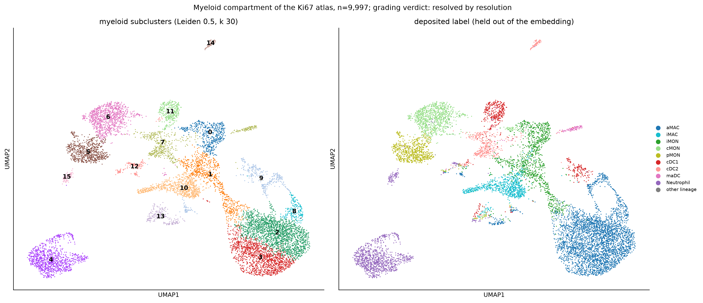
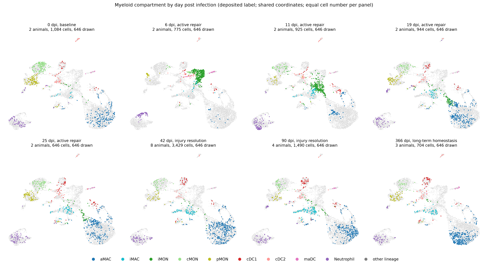
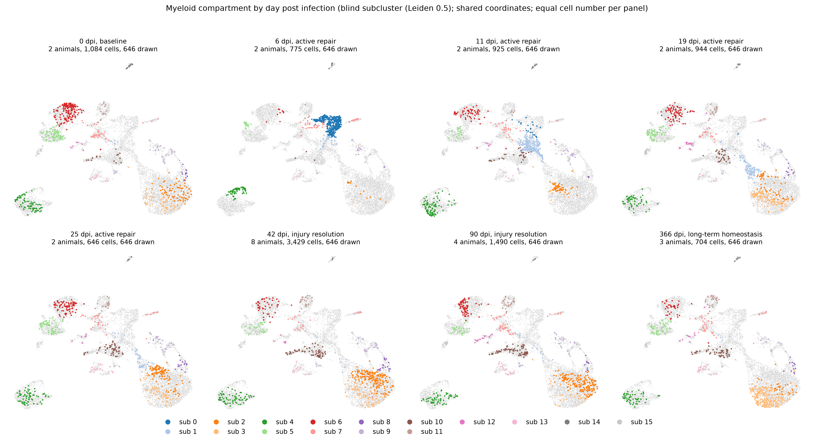
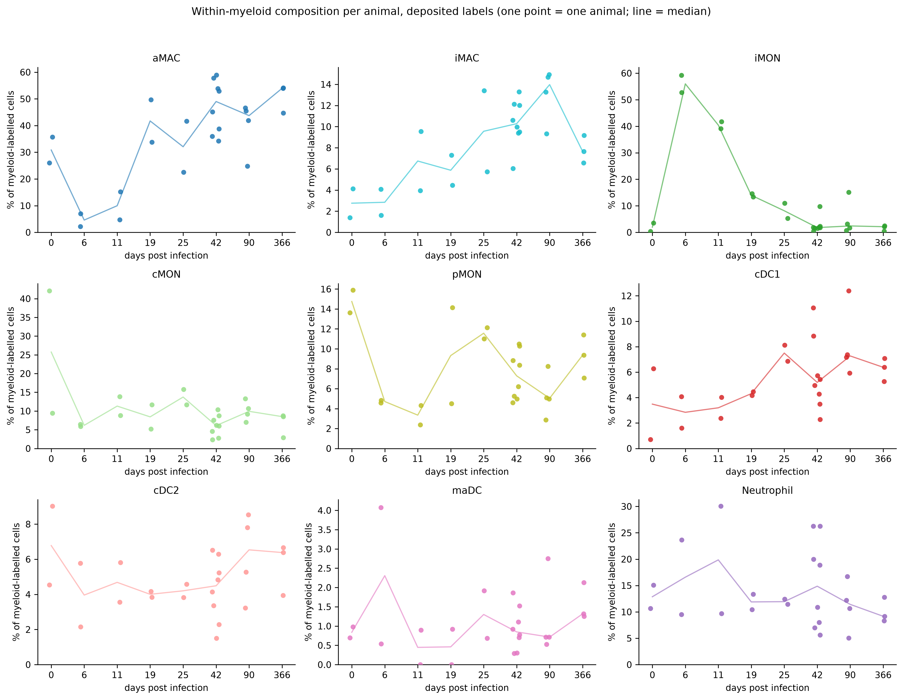
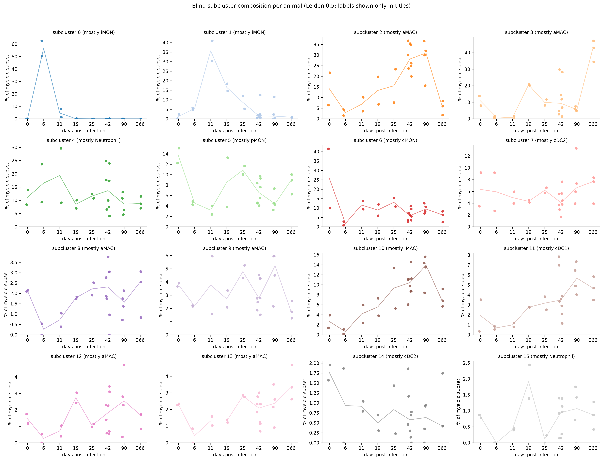

# Myeloid compartment of the Ki67 atlas (generated)

Generated by `analysis/scripts/11_myeloid_focus.py`; the frozen rules, inputs and results
are in [`run_record.json`](run_record.json). Owner retain/reject review pending.

**What is being reproduced.** Niethamer et al. 2025 (Figure 3) report that alveolar
macrophages (aMAC) are lost and inflammatory monocytes (iMON) expand at 6 dpi, and that the
aMAC pool is reconstituted over the following three weeks from resident aMACs and from an
iMON-derived trajectory. The compartment here is defined from the blind atlas clustering
(clusters 5, 17, 24) within the 25-sample Ki67 atlas, re-embedded without the deposited
labels, and graded against them afterwards.

## Cohort

9,997 cells from 25 animals; 13 of them carry a
non-myeloid deposited label and are excluded from the label composition. Cells per atlas cluster:
5: 4,737, 17: 4,032, 24: 1,228.

| dpi | phase | n_animals | n_cells |
|---|---|---|---|
| 0 | baseline | 2 | 1084 |
| 6 | active repair | 2 | 775 |
| 11 | active repair | 2 | 925 |
| 19 | active repair | 2 | 944 |
| 25 | active repair | 2 | 646 |
| 42 | injury resolution | 8 | 3429 |
| 90 | injury resolution | 4 | 1490 |
| 366 | long-term homeostasis | 3 | 704 |

## 1. Blind subclusters against the held-out labels

Verdict by the frozen rule at the primary resolution (0.5): **resolved by resolution**. Fraction of
labelled cells in subclusters with purity >= 0.75: 0.8723;
cell-weighted mean label entropy: 0.2972.

| subcluster | n_cells | n_labelled | top_label | purity | label_entropy | entropy_flag | n_animals | max_animal_fraction | dominant_animal |
|---|---|---|---|---|---|---|---|---|---|
| 0 | 494 | 494 | iMON | 0.909 | 0.327 | low | 6 | 0.747 | EEM-scRNA-162 |
| 1 | 716 | 716 | iMON | 0.81 | 0.637 | HIGH | 24 | 0.384 | EEM-scRNA-167 |
| 2 | 1944 | 1944 | aMAC | 0.998 | 0.012 | low | 25 | 0.13 | EEM-scRNA-179 |
| 3 | 1348 | 1347 | aMAC | 0.994 | 0.042 | low | 24 | 0.151 | EEM-scRNA-180 |
| 4 | 1085 | 1085 | Neutrophil | 1.0 | -0.0 | low | 25 | 0.069 | EEM-scRNA-116 |
| 5 | 720 | 719 | pMON | 0.981 | 0.111 | low | 25 | 0.121 | EEM-scRNA-170 |
| 6 | 994 | 994 | cMON | 0.947 | 0.27 | low | 25 | 0.239 | EEM-scRNA-166 |
| 7 | 545 | 545 | cDC2 | 0.659 | 1.068 | HIGH | 25 | 0.099 | EEM-scRNA-162 |
| 8 | 185 | 185 | aMAC | 0.995 | 0.034 | low | 23 | 0.135 | EEM-scRNA-182 |
| 9 | 365 | 365 | aMAC | 0.507 | 1.101 | HIGH | 25 | 0.11 | EEM-scRNA-167 |
| 10 | 747 | 747 | iMAC | 0.952 | 0.205 | low | 25 | 0.102 | EEM-scRNA-180 |
| 11 | 319 | 319 | cDC1 | 0.966 | 0.193 | low | 25 | 0.088 | EEM-scRNA-239 |
| 12 | 168 | 160 | aMAC | 0.212 | 1.955 | HIGH | 24 | 0.119 | EEM-scRNA-170 |
| 13 | 208 | 205 | aMAC | 0.288 | 1.941 | HIGH | 24 | 0.096 | EEM-scRNA-182 |
| 14 | 82 | 82 | cDC2 | 0.988 | 0.066 | low | 22 | 0.134 | EEM-scRNA-162 |
| 15 | 77 | 77 | Neutrophil | 1.0 | -0.0 | low | 21 | 0.208 | EEM-scRNA-170 |

Sensitivity to resolution:

| resolution | fraction_labelled_cells_in_pure_subclusters | cell_weighted_mean_entropy | n_subclusters |
|---|---|---|---|
| 0.5 | 0.8723 | 0.2972 | 16 |
| 0.2 | 0.4837 | 0.5853 | 9 |
| 1.0 | 0.923 | 0.2803 | 22 |

## 2. The compartment by day post infection

Shared subset coordinates; every panel draws 646 cells (the smallest
per-day count, seed 0) over all subset cells in grey.

## 3. Within-myeloid composition per animal

Median per-animal percent of each deposited label among the animal's myeloid-labelled cells
(per-animal values in `tables/myeloid_label_composition_per_animal.csv`; the blind subcluster
version is `tables/myeloid_subcluster_composition_per_animal.csv` and
`figures/myeloid_subcluster_composition_by_dpi.png`):

| dpi | aMAC | iMAC | iMON | cMON | pMON | cDC1 | cDC2 | maDC | Neutrophil |
|---|---|---|---|---|---|---|---|---|---|
| 0 | 30.84 | 2.76 | 1.94 | 25.74 | 14.75 | 3.49 | 6.78 | 0.84 | 12.87 |
| 6 | 4.6 | 2.84 | 55.97 | 6.18 | 4.71 | 2.84 | 3.96 | 2.31 | 16.58 |
| 11 | 9.97 | 6.75 | 40.43 | 11.31 | 3.35 | 3.2 | 4.68 | 0.45 | 19.86 |
| 19 | 41.72 | 5.87 | 13.97 | 8.44 | 9.32 | 4.31 | 4.0 | 0.46 | 11.89 |
| 25 | 32.07 | 9.56 | 8.13 | 13.73 | 11.57 | 7.5 | 4.2 | 1.3 | 11.94 |
| 42 | 49.01 | 10.28 | 1.79 | 6.1 | 7.29 | 5.2 | 4.49 | 0.85 | 14.87 |
| 90 | 43.73 | 13.97 | 2.41 | 9.92 | 5.04 | 7.27 | 6.54 | 0.71 | 11.42 |
| 366 | 53.95 | 7.66 | 2.13 | 8.51 | 9.36 | 6.38 | 6.38 | 1.32 | 9.17 |

**Figure 3 check by the frozen rule:** aMAC median at 6 dpi below baseline: True; iMON median at 6 dpi above baseline: True; aMAC median at 25 or 42 dpi above the 6 dpi value: True. Verdict: **consistent with Figure 3**. Two animals per active-repair day; this is a description, not a test.

## 4. Markers and comparator panel (ranking devices)

Top 10 Wilcoxon genes per primary subcluster (full top 20 with scores in
`tables/myeloid_subcluster_markers_top20.csv`):

| 0 | 1 | 2 | 3 | 4 | 5 | 6 | 7 | 8 | 9 | 10 | 11 | 12 | 13 | 14 | 15 |
|---|---|---|---|---|---|---|---|---|---|---|---|---|---|---|---|
| Ms4a4c | Ctss | Slc7a2 | Abcg1 | Srgn | Pou2f2 | S100a4 | Cd74 | Mcm3 | Tubb5 | C1qa | Cst3 | Ets1 | Adgrf5 | Siglech | S100a9 |
| Irf7 | Ctsz | Ear2 | Cd164 | S100a9 | Gngt2 | Plac8 | H2-Eb1 | Pcna | Stmn1 | C1qc | Ckb | Rpl12 | Epas1 | Bst2 | S100a8 |
| Isg15 | Npc2 | Plet1 | Lpl | S100a8 | Ace | Ifitm6 | Rpsa | Mcm6 | Mki67 | C1qb | Wdfy4 | Ptprcap | Cldn5 | Tcf4 | Hdc |
| Fcgr1 | Lgmn | Lpl | Plet1 | Hdc | Adgre4 | Ifitm3 | Etv3 | Mcm2 | Birc5 | Tmem176b | Xcr1 | Gimap6 | Calcrl | Ccr9 | G0s2 |
| Zbp1 | Apoe | Ltc4s | Krt19 | Csf3r | Itgal | Ccr2 | H2-Aa | Mcm5 | Top2a | Cd81 | Plbd1 | Rps24 | Cdh5 | Rpl31 | Csf3r |
| Ifi204 | Cyba | Nceh1 | Krt79 | Mxd1 | Nr4a1 | F13a1 | H2-Ab1 | Mcm7 | Pclaf | Apoe | H2-DMa | Septin1 | Sptbn1 | Irf8 | Sorl1 |
| Ifi202b | Trem2 | Abcg1 | Ncoa4 | Il1b | Stap1 | Ms4a6c | S100a4 | Stmn1 | Tuba1b | Tmem176a | Septin3 | Rps15a | Egfl7 | St8sia4 | Slc16a3 |
| Ifi47 | C1qb | Cd9 | Atp6v0d2 | Trem1 | Treml4 | Ly6c2 | Rpl21 | Atad2 | Nucks1 | Ms4a7 | Eef1b2 | Ablim1 | Pecam1 | Gnas | Adgre4 |
| Ms4a6d | Ctsb | Adipor2 | Chil3 | Cxcr2 | Spn | Tpt1 | Syngr2 | Rrm1 | H2az2 | H2-Eb1 | Irf8 | Ltb | Slco2a1 | Ptprcap | Ptprc |
| Ifit3 | Atp6v0c | F7 | Cd9 | Clec4d | Rap1b | H3f3a | Crip1 | Lig1 | Smc2 | H2-Aa | Itgae | Cd3g | Bmpr2 | Ighm | Rap1b |

Detection fraction of the comparator panel per subcluster (`tables/myeloid_panel_detection_fraction.csv`;
the dot plot is `figures/dotplot_myeloid_panel_by_subcluster.png`).
Panel genes absent from the object: none.

## Caveats

- The unit is the animal; active-repair days carry two animals each and no P values are computed.
- Myeloid cells are 10 to 15 percent of every library by the MACS recombination, so only
  within-myeloid fractions are interpretable; the absolute myeloid influx is not measurable here.
- The subset inherits the atlas QC and doublet calls; no ambient-RNA correction was applied
  (raw droplet matrices are absent for this series).
- The iMON-to-aMAC trajectory of the paper is not fitted here; this analysis reads states and
  composition only.
