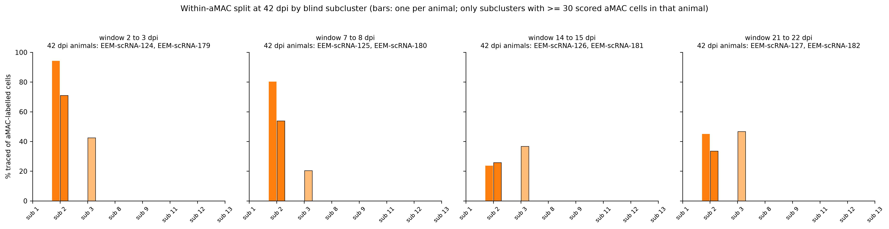
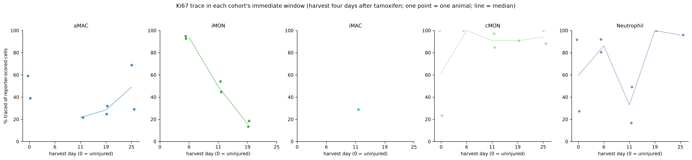

# Origin of the rebuilt alveolar macrophage pool, read from the Ki67 trace (generated)

Generated by `analysis/scripts/12_amac_trace_by_window.py` from the tracked table
`../tables/myeloid_cell_metadata.csv`; frozen rules, inputs and results in
[`run_record.json`](run_record.json). Owner retain/reject review pending.

**Question.** Niethamer et al. 2025 (Figure 3) propose two sources for the aMAC pool rebuilt after
its loss at 6 dpi: resident aMACs and an iMON-derived trajectory. Here the Ki67 trace is read
by tamoxifen window at the common 42 dpi harvest (two animals per window), with classical
monocytes and neutrophils of the same animal as the reference for labelling inherited from
bone-marrow progenitors that divided during the window.

Cells: 7,492 reporter-scored cells with a deposited label in aMAC, iMON, iMAC, cMON, Neutrophil from 25 animals.

## 1. Which window labelled the 42 dpi aMAC pool

Median per-animal traced fraction at 42 dpi by window (two animals each), with the single 90 dpi
and 366 dpi animals alongside (`tables/window_contribution_summary.csv`; per animal in
`tables/traced_fraction_per_animal_label.csv`):

| label | median_pct_traced_42dpi_window_2 | median_pct_traced_42dpi_window_7 | median_pct_traced_42dpi_window_14 | median_pct_traced_42dpi_window_21 | pct_traced_90dpi_window_2 | pct_traced_90dpi_window_7 | pct_traced_90dpi_window_14 | pct_traced_90dpi_window_21 | pct_traced_366dpi_window_7 | pct_traced_366dpi_window_14 |
|---|---|---|---|---|---|---|---|---|---|---|
| Neutrophil | 20.37 | 37.94 | 28.33 | 63.44 |  | 6.98 | 34.38 | 17.65 |  |  |
| aMAC | 79.72 | 59.95 | 29.31 | 41.99 | 90.74 | 70.41 | 25.66 | 35.61 | 48.72 | 37.3 |
| cMON | 13.33 | 21.57 |  | 32.5 |  | 11.11 | 33.33 | 10.0 |  |  |
| iMAC | 54.69 | 53.09 | 6.9 | 9.68 | 56.25 | 36.51 | 21.21 | 9.8 |  |  |
| iMON |  |  |  |  |  |  |  |  |  |  |

By the frozen rule the main contributing window for aMAC is **2 to 3 dpi** (agrees with the paper's expectation of an early window: True).

## 2. Is the aMAC labelling explained by marrow inheritance

| sample_id | window_start_dpi | pct_traced_aMAC | pct_traced_cMON | pct_traced_Neutrophil | aMAC_minus_cMON | aMAC_minus_Neutrophil | exceeds_both_references_by_margin |
|---|---|---|---|---|---|---|---|
| EEM-scRNA-124 | 2 | 95.74 |  |  |  |  | False |
| EEM-scRNA-179 | 2 | 63.69 | 13.33 | 20.37 | 50.36 | 43.32 | True |
| EEM-scRNA-125 | 7 | 83.1 |  | 45.65 |  | 37.45 | False |
| EEM-scRNA-180 | 7 | 36.8 | 21.57 | 30.23 | 15.23 | 6.57 | False |
| EEM-scRNA-126 | 14 | 25.84 |  | 28.33 |  | -2.49 | False |
| EEM-scRNA-181 | 14 | 32.78 |  |  |  |  | False |
| EEM-scRNA-127 | 21 | 44.32 |  | 89.19 |  | -44.87 | False |
| EEM-scRNA-182 | 21 | 39.66 | 32.5 | 37.68 | 7.16 | 1.98 | False |

Windows where aMAC exceeds both marrow references by at least 10.0 points in both animals: none. Both references reached the 30-cell floor in 3 of 8 animals at 42 dpi (classical monocytes are sparse by then), so the rule is Not established for every window with fewer than two evaluable animals; the per-animal differences above are descriptive.

## 3. Within-aMAC split by blind subcluster at 42 dpi

- window 2 to 3 dpi: no subcluster pair differs by at least 20.0 points in both animals (subclusters with enough cells in both animals: 2).
  - EEM-scRNA-179: sub 2 70.95% (n=241), sub 3 42.5% (n=80).
- window 7 to 8 dpi: no subcluster pair differs by at least 20.0 points in both animals (subclusters with enough cells in both animals: 2).
  - EEM-scRNA-180: sub 2 53.9% (n=154), sub 3 20.42% (n=191).
- window 14 to 15 dpi: no subcluster pair differs by at least 20.0 points in both animals (subclusters with enough cells in both animals: 2).
  - EEM-scRNA-181: sub 2 25.84% (n=89), sub 3 36.72% (n=128).
- window 21 to 22 dpi: no subcluster pair differs by at least 20.0 points in both animals (subclusters with enough cells in both animals: 2).
  - EEM-scRNA-182: sub 2 33.5% (n=203), sub 3 46.67% (n=90).

Per-animal values: `tables/amac_subcluster_traced_fraction_42dpi.csv`.

## 4. The same populations in their immediate windows

## Caveats

- Two animals per window at 42 dpi and one at 90 dpi: rankings and margins, no tests.
- The trace marks cells that divided during the window and all their progeny. Labelled marrow
  progenitors keep producing labelled monocytes after the window, which is why the marrow
  reference is read; the reference is itself imperfect because monocyte and neutrophil half-lives
  differ from the interval between window and harvest.
- Resident aMAC proliferation and iMON-derived reconstitution are both traceable in the early
  windows; the within-aMAC split by subcluster is a descriptive signature, not a lineage assignment.
- Deposited labels are used as given; the subclusters come from an embedding that held them out.
