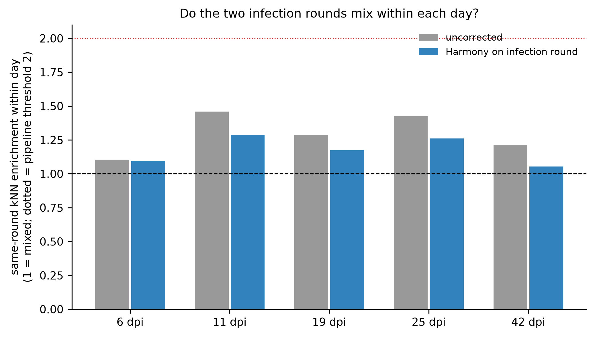

# Batch sensitivity of the myeloid embedding: Harmony on infection round (generated)

Generated by `analysis/scripts/13_myeloid_batch_sensitivity.py`; frozen rules, inputs and results in
[`run_record.json`](run_record.json). Owner retain/reject review pending.

**Question.** Is the dense 6 dpi inflammatory-monocyte (iMON) state of `../README.md` biology or a
one-day batch island? Correcting on sample cannot answer it (one animal per sample and day). The
paper's Table S3 gives the infection round, and on every tested day the two replicate animals came
from different rounds, so the round is a technical key that crosses time. It also carries Ki67-Cre
dosage (Cre/Cre in most 2021 animals, Cre/+ in all 2022 animals). The compartment was embedded twice
with identical rules, uncorrected and after Harmony on round, and compared.

Cells: 6,719 from 16 animals at [6, 11, 19, 25, 42] dpi (0, 90 and 366 dpi are single-round and excluded). Sample-to-round map: `tables/sample_infection_round.csv`.

## 1. Do the rounds mix within each day

| day | enrichment_uncorrected | observed_same_round_fraction_uncorrected | enrichment_Harmony on infection round | observed_same_round_fraction_Harmony on infection round | expected_if_mixed | n_cells |
|---|---|---|---|---|---|---|
| 6.0 | 1.105 | 0.7021 | 1.094 | 0.6951 | 0.6352 | 775.0 |
| 11.0 | 1.459 | 0.8795 | 1.286 | 0.7749 | 0.6026 | 925.0 |
| 19.0 | 1.286 | 0.7407 | 1.174 | 0.6762 | 0.576 | 944.0 |
| 25.0 | 1.425 | 0.8011 | 1.26 | 0.7083 | 0.5623 | 646.0 |
| 42.0 | 1.215 | 0.7658 | 1.053 | 0.6639 | 0.6304 | 3429.0 |

Overall same-round kNN enrichment: 1.311 uncorrected, 1.072 after Harmony (1 = mixed; the pipeline's failure threshold is 2).

## 2. Does the 6 dpi iMON state survive

| embedding | definition | subcluster | n_cells | iMON purity | share of each 6 dpi animal's iMON cells | % cells from 6 dpi | round composition | passes criteria |
|---|---|---|---|---|---|---|---|---|
| uncorrected | frozen rule: subcluster with the most iMON-labelled cells | 1 | 608 | 0.845 | EEM-scRNA-113: 0.071, EEM-scRNA-162: 0.023 | 3.9 | 2022-07-06: 0.706, 2021-10-21: 0.294 | False |
| uncorrected | post hoc (disclosed): subcluster with the most iMON-labelled cells from 6 dpi animals | 0 | 530 | 0.891 | EEM-scRNA-113: 0.898, EEM-scRNA-162: 0.968 | 90.8 | 2022-07-06: 0.766, 2021-10-21: 0.234 | True |
| Harmony on infection round | frozen rule: subcluster with the most iMON-labelled cells | 1 | 605 | 0.858 | EEM-scRNA-113: 0.214, EEM-scRNA-162: 0.249 | 22.0 | 2022-07-06: 0.767, 2021-10-21: 0.233 | True |
| Harmony on infection round | post hoc (disclosed): subcluster with the most iMON-labelled cells from 6 dpi animals | 0 | 411 | 0.859 | EEM-scRNA-113: 0.765, EEM-scRNA-162: 0.742 | 92.0 | 2022-07-06: 0.749, 2021-10-21: 0.251 | True |

**Rule revision, disclosed.** The frozen definition (subcluster with the most iMON-labelled cells)
selects the 11 to 19 dpi monocyte state in both embeddings, not the 6 dpi state the question is
about; its outcome is kept in the run record (`first_run_outcome`, `verdict_frozen_rule`). The
post hoc definition anchored on the 6 dpi cells is reported alongside and judged by the same
purity and per-animal criteria.

**Verdict: the 6 dpi iMON state survives Harmony on infection round (post hoc definition, disclosed).** frozen rule (selects the 11 to 19 dpi monocyte state, see rule revision): uncorrected False, Harmony True. Adjusted Rand index between the two Leiden partitions: 0.837.

## 3. Grading against the held-out labels in both embeddings

| embedding | fraction_labelled_cells_in_pure_subclusters | cell_weighted_mean_entropy | n_subclusters |
|---|---|---|---|
| uncorrected | 0.8799 | 0.3085 | 14 |
| Harmony on infection round | 0.8934 | 0.3373 | 15 |

Per-subcluster tables: `tables/grading_X_pca.csv`, `tables/grading_X_pca_harmony.csv`; the
partition crosstab: `tables/subcluster_crosstab_uncorrected_vs_harmony.csv`; per-cell subcluster
assignments in both embeddings: `tables/batch_sensitivity_cell_metadata.csv`.

## Caveats

- Infection round and Ki67-Cre dosage are confounded; the correction removes both, which is the
  conservative direction for this question.
- Days with one round (0, 90, 366 dpi) are not tested; the persistence claims at 90 and 366 dpi
  rest on the uncorrected embedding and on within-day replicate agreement only.
- Two animals per active-repair day; descriptive, no P values.
