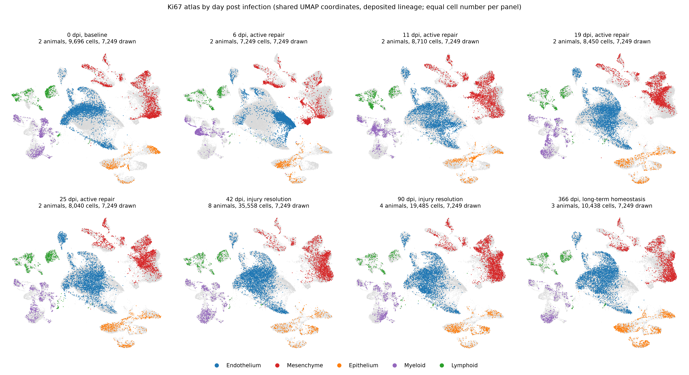
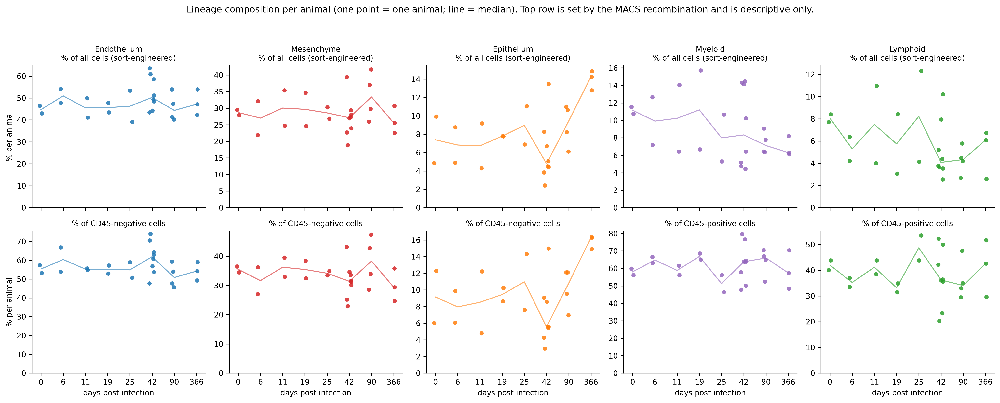
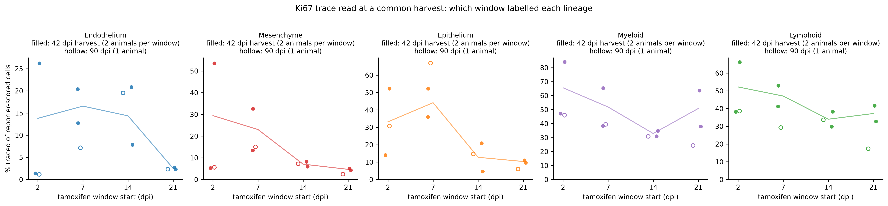

# Phase-wise view of the Ki67 atlas (generated)

Generated by `analysis/scripts/10_phase_timecourse.py` from the tracked table
`../tables/cell_metadata.csv`; the frozen rules, inputs and results are in
[`run_record.json`](run_record.json). Owner retain/reject review pending.

**What is being reproduced.** Niethamer et al. 2025 report that proliferation after
influenza injury is asynchronous across compartments: immune cells proliferate first
(2 to 6 dpi), epithelium and mesenchyme second (7 to 15 dpi), endothelium last
(14 to 22 dpi), and every lineage is back at baseline by 21 to 28 dpi (their Figures 1
and 2, and the three-phase model of Figure 2F). The readouts here use the deposited
lineage labels as given, so this is a descriptive reproduction, not a blind validation.

## Cohort

107,626 cells from 25 animals (the 25-sample Ki67 atlas; the 8 pre-labelled tracing samples have no day post infection and are excluded).

| dpi | phase | n_animals | n_cells |
|---|---|---|---|
| 0 | baseline | 2 | 9696 |
| 6 | active repair | 2 | 7249 |
| 11 | active repair | 2 | 8710 |
| 19 | active repair | 2 | 8450 |
| 25 | active repair | 2 | 8040 |
| 42 | injury resolution | 8 | 35558 |
| 90 | injury resolution | 4 | 19485 |
| 366 | long-term homeostasis | 3 | 10438 |

## 1. Atlas UMAP by day post infection

Shared atlas coordinates; every panel draws 7,249 cells (the smallest per-day count, seed 0) over all cohort cells in grey, so that density is comparable
between days. Panel area and cluster distance carry no meaning (see `docs/UMAP_AND_FIGURES.md`).

## 2. Lineage composition per animal

Median per-animal percent of each lineage **within its compartment** (CD45-negative:
Endothelium, Mesenchyme, Epithelium; CD45-positive: Myeloid, Lymphoid). The top row of the
figure, percent of all cells, is set by the MACS recombination (10 to 15 percent CD45-positive)
and is descriptive only. Per-animal values: `tables/lineage_composition_per_animal.csv`.

| dpi | Endothelium | Mesenchyme | Epithelium | Myeloid | Lymphoid |
|---|---|---|---|---|---|
| 0 | 55.35 | 35.5 | 9.15 | 58.05 | 41.95 |
| 6 | 60.4 | 31.64 | 7.96 | 64.76 | 35.24 |
| 11 | 55.27 | 36.22 | 8.52 | 58.85 | 41.15 |
| 19 | 55.11 | 35.45 | 9.44 | 66.84 | 33.16 |
| 25 | 54.88 | 34.15 | 10.97 | 51.32 | 48.68 |
| 42 | 61.88 | 31.41 | 5.56 | 63.78 | 36.22 |
| 90 | 50.85 | 38.33 | 10.82 | 65.98 | 34.02 |
| 366 | 54.23 | 29.36 | 16.27 | 57.43 | 42.57 |

## 3. Proliferation per lineage

Top row: Ki67 trace in each cohort's immediate window (tamoxifen at 2, 7, 14 or 21 dpi,
harvest four days later). Cells whose reporter was not detected are excluded as dropout,
the rule of `07_lineage_tracing_cohort.py`; the not-detected share is 10.4% of cohort cells overall and is listed per animal in the run record.
Bottom row: the deposited cell-cycle call (S or G2M) per day. Per-animal values:
`tables/traced_fraction_per_animal.csv` and `tables/cycling_fraction_per_animal.csv`.

**Peak window by the frozen rule** (highest median per-animal value over the 6, 11, 19 and 25 dpi
harvests; two animals per day, so this is a ranking, not a test):

| lineage | median_pct_traced_0dpi | median_pct_traced_6dpi | median_pct_traced_11dpi | median_pct_traced_19dpi | median_pct_traced_25dpi | observed_trace_peak_day | observed_cycling_peak_day | paper_expected_peak | trace_agrees_with_paper | cycling_agrees_with_paper |
|---|---|---|---|---|---|---|---|---|---|---|
| Endothelium | 1.72 | 4.62 | 3.37 | 14.16 | 4.93 | 19 | 19 | 14 to 22 dpi | True | True |
| Mesenchyme | 3.6 | 7.71 | 11.29 | 7.79 | 7.9 | 11 | 6 | 7 to 15 dpi | True | False |
| Epithelium | 5.9 | 7.7 | 28.35 | 8.22 | 9.83 | 11 | 25 | 7 to 15 dpi | True | False |
| Myeloid | 55.48 | 84.85 | 47.27 | 48.12 | 58.71 | 6 | 25 | 2 to 6 dpi (immune) | True | False |
| Lymphoid | 31.77 | 43.45 | 54.7 | 30.27 | 23.38 | 11 | 19 | 2 to 6 dpi (immune) | False | False |

Trace peaks agree with the paper's expected window for 4 of 5 lineages; cycling peaks
agree for 1 of 5.

Median percent of cells in S or G2M per lineage and day:

| dpi | Endothelium | Mesenchyme | Epithelium | Myeloid | Lymphoid |
|---|---|---|---|---|---|
| 0 | 42.37 | 22.06 | 14.16 | 34.46 | 74.8 |
| 6 | 40.04 | 32.7 | 19.8 | 34.27 | 71.87 |
| 11 | 33.78 | 12.07 | 18.36 | 33.48 | 78.73 |
| 19 | 45.18 | 10.51 | 15.31 | 29.97 | 78.94 |
| 25 | 44.7 | 13.81 | 19.97 | 37.99 | 78.4 |
| 42 | 48.84 | 19.09 | 24.94 | 40.24 | 81.37 |
| 90 | 53.08 | 23.07 | 25.58 | 43.48 | 80.08 |
| 366 | 53.64 | 22.91 | 32.53 | 37.72 | 82.84 |

At the common 42 dpi harvest (two animals per tamoxifen window) the trace reads which window
labelled each lineage, including the labelled cells' progeny; 90 dpi animals (one per window)
are hollow points.

## Caveats

- The unit is the animal. Active-repair days carry two animals; 42 dpi carries eight because
  four tamoxifen cohorts converge on it. No P values are computed.
- Immune versus non-immune proportions describe the sort, not the lung. Only within-compartment
  fractions are interpretable.
- The trace marks cells that proliferated during the tamoxifen window and their progeny; a
  high traced fraction at a later harvest can reflect expansion after the window as well as
  proliferation within it.
- Cell-cycle phase is the authors' per-cell Seurat CellCycleScoring call, read from the deposited
  metadata and never recalculated (`docs/PIPELINE_AS_RUN.md`). It assigns S or G2M to any cell
  with a positive phase score, so it over-calls cycling (most lymphocytes score as cycling) and
  is shown only as a trace-independent cross-check, not as a measurement of proliferation.
- The two baseline animals carry different tamoxifen windows (3 and 42 days before harvest) and
  are not comparable with each other on the trace readout.
