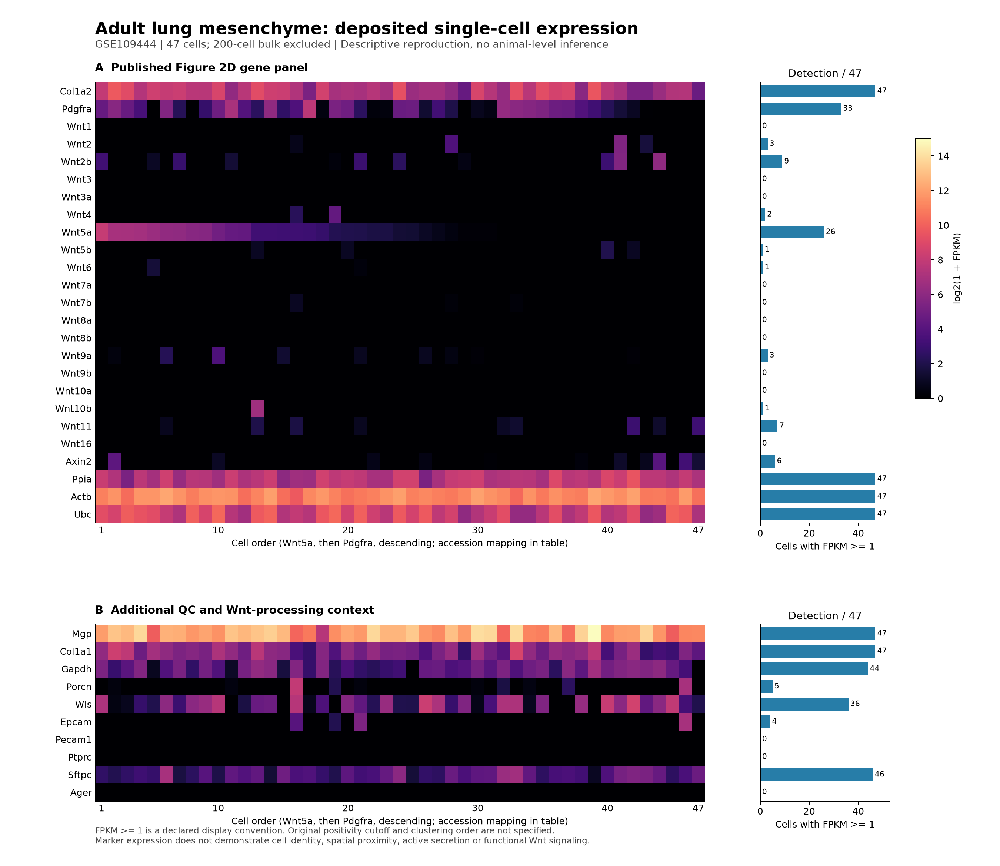
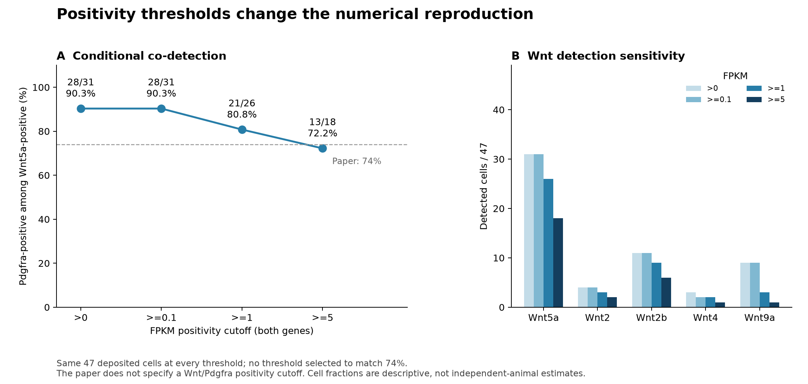

# Nabhan 2018: Wnt niche biology and public-data analysis

The owner completed the paper and authorized this sequence on 2026-09-22.
Their study notes remain private. This directory contains the analysis and its
evidence limits, not a substitute record of the owner's reading.

The paper's causal case rests on spatial and perturbation experiments, which
the deposited transcriptomes cannot independently reproduce. Its value here
is to define separable questions about ligand source, epithelial response,
identity and proliferation. See [Nabhan et al., *Science*, 2018](https://doi.org/10.1126/science.aam6603).

| Sequence | Result | Evidence |
|---|---|---|
| 1. Reproduce the source expression panel | Completed; frequent Wnt5a and Pdgfra co-detection recovered, exact 74% unresolved | [GSE109444 source reproduction](source_reproduction/README.md) |
| 2. Audit animals and compartments | Completed; baseline and day 11 each have one eligible AT2 animal at the 50-cell floor | [Nb1 coverage](nb1/figures/01_animal_coverage.png) |
| 3. Describe Wnt source, response and epithelial state | Completed; paired fibroblast profiles and animal-level AT2 figures; no local injury-effect inference | [Nb1 report](nb1/README.md) and [protocol](nb1/PROTOCOL.md) |
| 4. Screen an independent injury cohort | Eight GSE129605 samples acquired and checked; expression test HOLD pending animal provenance, annotations and compartment coverage | [External feasibility report](external_feasibility/README.md) |

## Findings that motivate research questions

- **Source heterogeneity:** Wnt2 is higher in AF1 and Wnt4 in AF2 in all 21
  eligible within-animal pairs, including the equal-depth detection sensitivity.
  Wnt5a spans multiple fibroblast populations. A useful follow-up asks whether
  these source profiles correspond to distinct spatially resolved AT2 niches,
  rather than treating Wnt5a as a unique niche-cell identity.
- **Source versus induction:** Wnt7b is detected in baseline and injured AT2
  samples. The available viral time course begins at day 6 and cannot test the
  rapid epithelial response in the paper. An acute, replicated source/response
  time course is required to ask whether injury changes production.
- **Response versus cell state:** Axin2 is detected more consistently than
  Lef1; an averaged two-gene summary is not a validated pathway assay. The
  animal-level plots motivate a test of Wnt response, identity and cycling as
  distinct measurements, followed by a functional readout.

## Figure gallery

All seven figures generated for this analysis are shown below, with vector
versions for export. They summarize expression, detection and sample coverage;
no gene-set enrichment analysis was run. Source FPKM and viral-injury UMI data
remain separate measurements.

### Source expression and threshold sensitivity

*GSE109444, log2(1+FPKM), with the bulk control excluded. Wnt ligands,
fibroblast markers and identity/QC context are shown together. The Sftpc signal
requires the source-data caveat discussed below. [Vector SVG](source_reproduction/figures/source_expression_panel.svg).*

*Four fixed positivity rules yield 72.2–90.3% Pdgfra detection among
Wnt5a-positive cells. The exact published 74% remains unresolved.
[Vector SVG](source_reproduction/figures/detection_sensitivity.svg);
[source tables and methods](source_reproduction/README.md#reproduction-and-evidence).*

### Animal and compartment coverage

*Bold counts meet the primary 50-cell floor. Baseline and day 11 each retain
only one eligible AT2 animal. [Vector SVG](nb1/figures/01_animal_coverage.svg);
[coverage table](nb1/tables/animal_compartment_coverage.csv).*

### Wnt source and response across compartments

*Rows preserve compartment, day and eligible animal count. Left: mean
animal-level log2(CPM+1); right: mean expected detection at 1,000 UMIs.
Only units with at least 50 cells enter the heatmaps. These are descriptive
expression measurements. [Vector SVG](nb1/figures/02_source_response.svg);
[figure table](nb1/tables/figure_source_summary.csv).*

*Each line is one animal, with at least 50 cells in both AF1 and AF2. Five
paper-defined ligands are shown without selecting them by observed effect.
This comparison does not establish proximity, secretion or an injury effect.
[Vector SVG](nb1/figures/05_fibroblast_pairs.svg);
[paired measurements](nb1/tables/paired_fibroblast_ligands.csv).*

### AT2 source, response, identity and proliferation

*Each point is one animal; open points have fewer than 50 AT2 cells. Wnt7b is
detected at baseline and after injury. Secretion-machinery RNA does not prove
an autocrine loop. [Vector SVG](nb1/figures/03_at2_per_animal.svg);
[per-gene measurements](nb1/tables/gene_expression_by_animal.csv).*

*Sample suffixes identify animals. The Axin2/Lef1 and Mki67/Top2a summaries
are marker measurements, not validated activity scores. The published AT2
holdout panel has 377/398 genes present. These plots motivate separable
measurements without establishing biological independence.
[Vector SVG](nb1/figures/04_at2_dimensions.svg);
[animal marker summaries](nb1/tables/animal_marker_summaries.csv).*

## Limits that remain open

The 47 source cells are not 47 established animal replicates. Pdgfra
co-detection among Wnt5a-positive cells ranges from 72.2% to 90.3% across fixed
FPKM thresholds; unspecified original filtering prevents exact reproduction.
Sftpc is detected at FPKM >=1 in 46/47 deposited mesenchymal cells, leaving an
unresolved transcript-carryover or identity question. This observation alone
does not establish doublets or justify relabeling the cells.

Local Nb1 sampling cannot support the proposed baseline/day-11 AT2 test.
The independent candidate has four saline and four bleomycin libraries, but
libraries have not yet been verified as independent animals and author cell
labels are absent from the deposit. Its 13,673 deposited cells cannot be
substituted for an eligible animal-by-compartment table.

The next bounded step is to resolve those provenance and annotation gates,
then freeze an animal-level contrast before examining external Wnt effects.
Failure of either gate leaves the inferential comparison on hold. No new
validated C-series claim is introduced by these descriptive analyses.

The questions also appear in [Research questions, A4](../../RESEARCH_QUESTIONS.md#a4-how-do-current-wnt-activity-and-il-1-responsiveness-overlap-in-at2-cells).
