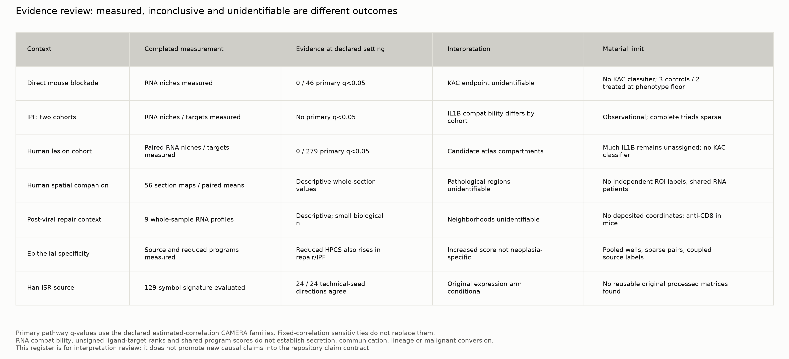

# Completed analysis: evidence for joint review

The feasible public-data analyses and their declared sensitivities are complete. No threshold was lowered after viewing results. Unsupported identities, absent spatial annotations and unavailable processed data remain explicit limits, rather than being replaced by proxy claims. The initial batch remains preserved in INITIAL_RUN_REPORT.md; this document summarizes the completed continuation.

## Findings that remain available for interpretation

1. **RNA niches can be measured without establishing an IL-1-specific causal circuit.** Both IPF cohorts support donor-level source, receptor, pathway and compatibility analyses. The estimated canonical macrophage-to-fibroblast IL1B compatibility contrast is near zero in GSE136831 (+0.005) and positive in GSE135893 (+1.285 log2-CPM-based units); this is not an equivalence test. No primary IPF pathway passes global q<0.05. The two cohorts do not jointly establish one uniform IL-1 response.

2. **Human paired contrasts are directly evaluated.** All 75 GSE308103 libraries from 23 patient labels were processed. The primary pathway family has 0/279 q<0.05 tests; 1080 primary RNA-compatibility contrasts retain paired patient values. Conditional ligand-target fits yield 943 expression-supported candidate rows across overlapping views/scopes, not independent validation. Unassigned cells carry median IL1B count fractions of 52–72% across histologies; confident-subtype results cannot establish the dominant source across all recovered cells. Detailed findings and patient coverage are in the human reports.

3. **An increased HPCS score is not specific to neoplasia in these comparisons.** The overlap-reduced source signature is higher in all seven evaluable pooled repair/developmental libraries and all three eligible KRT5-/KRT17+ versus AT2 IPF donor pairs. This is descriptive counterevidence to score specificity; it does not establish that repair or fibrotic cells are HPCS, KAC or malignant.

4. **Spatial measurements are available at a narrower scale than the proposed niche hypothesis.** All 56 human sections and nine post-viral matrices were processed. Deposited human coordinates support measured maps and patient-level whole-section summaries. Missing independent pathology regions prevent regional enrichment claims; absent post-viral coordinates prevent neighborhood tests. Whole-section means cannot reproduce or refute a region-specific source result.

## Human reduced-HPCS contrasts

| Contrast | Paired patients | Mean log2 CPM difference | Positive patients | Gate |
|---|---:|---:|---:|---|
| AAH − normal | 8 | +0.009 | 3 | eligible_descriptive_contrast |
| AIS − normal | 12 | +0.100 | 9 | eligible_descriptive_contrast |
| MIA − normal | 4 | +0.183 | 3 | eligible_descriptive_contrast |
| LUAD − normal | 23 | +0.327 | 19 | eligible_descriptive_contrast |
| LUAD − AAH | 8 | +0.342 | 7 | eligible_descriptive_contrast |
| LUAD − AIS | 12 | +0.264 | 10 | eligible_descriptive_contrast |
| LUAD − MIA | 4 | +0.170 | 3 | eligible_descriptive_contrast |

These atlas-compatible AT2-like contrasts remain separate from the unavailable source-defined KAC endpoint. Different histology contrasts reuse patients and are not independent confirmations.

## Questions the public data still cannot identify

- The primary KAC response to anti-IL-1β, and the KAC/NF-κB joint association: the public author classifier is missing. At the 100-alveolar-cell phenotype floor only three controls and two treated animals remain; lowering the floor does not recover KAC identity.
- Later mouse blockade effects tied to treatment strategy: the required treatment-history crosswalk remains unresolved.
- Mature IL-1β release, neutralization efficacy, mechanical stiffness, functional fibroblast suppression, irreversible fate, lineage ancestry and chromatin memory: RNA measurements do not directly assay these outcomes.
- Independent confirmation from shared specimens, pooled wells or sorting gates: these units cannot be relabelled as additional animals or cohorts. GSE222901/GSE300293 received contextual source/design audits, not a new independent expression-validation run. The GSE277777 source-label pilot is a consistency/specificity analysis with unresolved biological independence.
- Original Han developmental expression contrasts: the public source audit recovered the ISR signature and code, but not the reusable processed matrices needed for that conditional arm.

## What a change in criteria would and would not do

The predeclared cell floors, confidence, prior-count, sampling, LR resource/detection and correlation sensitivities are retained beside the primary results. All 52 cohort/pathway assay-coverage checks reach at least 92%, so the 50%, 70% and 80% pathway-coverage cutoffs select the same sets. A lower cutoff cannot fix absent labels, sample identity, regions or replication. Tested results without q<0.05 are inconclusive at the declared family threshold; they are not evidence of equivalence or absence.

The pathway findings depend materially on the correlation assumption. The matched comparisons below use identical test membership and gene counts; the primary analysis remains unchanged.

| Cohort | Tests | Estimated-correlation q<0.05 | Fixed-0.01 q<0.05 | Median estimated correlation |
|---|---:|---:|---:|---:|
| GSE136831 | 49 | 0 | 14 | 0.071 |
| GSE135893 | 36 | 0 | 12 | 0.068 |
| GSE300288 | 46 | 0 | 4 | 0.039 |
| GSE308103 | 279 | 0 | 148 | 0.041 |

These are alternative modeling assumptions, not different biological replications. The choice of estimated correlation is a project decision rather than a universal field standard. The discrepancy should be discussed before making a pathway-level claim; it cannot be resolved merely by choosing the setting with more discoveries.

[Correlation sensitivity and checks](trials/u6_completion/pathway_correlation_validation.json).

## Next interpretation decisions

Review the evidence by biological claim rather than by the number of nominally positive panels: reproducible niche association; IL-1 specificity versus generic inflammatory/stress programs; and specificity of dysplastic/neoplastic states versus repair. A focused next experiment would vary IL-1β duration and withdrawal while measuring recipient-specific response, viable mature fate, protein release and lineage outcomes in independent biological replicates. Missing author KAC annotations and independent spatial region labels are targeted data requests; no outreach has been sent.

[Full completion register](WORK_PACKAGES.md) · [Figure gallery](README.md#figure-gallery) · [Evaluation rules](EVALUATION_RULES.md) · [Evidence matrix](trials/u6_completion/evidence_matrix.csv) · [Human primary pathway discoveries](trials/u6_completion/human_primary_pathways_q05.csv).
