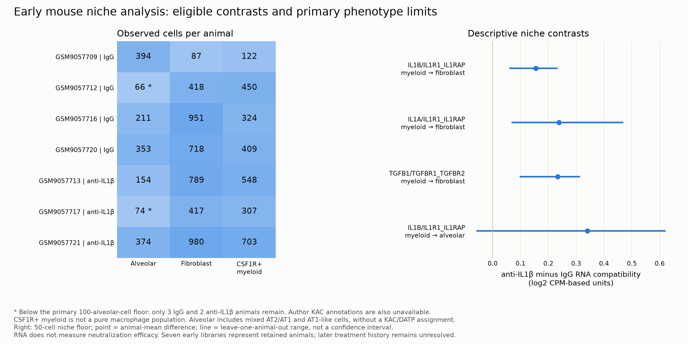

# Early mouse niche results and unreleased primary phenotype

The evaluable early-endpoint niche analyses are complete using independent, treatment-blind broad-lineage review. They do not reconstruct the author KAC annotation and do not replace the planned KAC-fraction endpoint.

## Eligibility changes the question

At the prespecified 100-alveolar-cell floor, only three IgG controls and two treated animals remain, below the three-per-arm requirement. The source-frozen KAC classifier is also unavailable. The 50-cell denominator sensitivity retains all seven animals, but it cannot repair the missing KAC definition. The later endpoint remains unresolved because treatment start/history is not mapped to libraries.

Fibroblast clusters have consistent stromal markers. The broad CSF1R-positive myeloid group is mixed monocyte/inflammatory myeloid, not a macrophage-only population. The more specific macrophage-candidate cluster has only 19 cells overall and is ineligible for subtype inference. Smooth-muscle, ambiguous stromal and mixed-lineage clusters were not forced into fibroblast/macrophage labels.

## Completed niche outputs

Native LIANA evaluated 96 sample/resource/configuration calls with independent subunit-expression checks. The early RNA-compatibility analysis produced 613 eligible primary descriptive rows, with resource, cell-floor and prior-count sensitivities and animal-level component values. These are associations in independently reviewed compartments, not a completed two-endpoint causal analysis.

Estimated-correlation CAMERA evaluated 46 primary early-endpoint set/view combinations; 0 pass global early-family q < 0.05. The fixed-0.01 sensitivity has 4 q < 0.05 and does not replace the primary result. A separate conservative adjustment reserves an equally large unobserved late-endpoint family; it is not a claim that the late analysis ran. Broad and subtype views overlap.

All eligible primary receiver DE fits have fewer than ten q < 0.05 targets in each direction, so the conditional mouse ligand-target arm is ineligible without lowering the threshold. No lack-of-effect or successful-neutralization claim follows from these RNA results.

Tables: [primary compatibility](primary_compatibility_contrasts.csv), [animal values](primary_compatibility_donor_values.csv), [all pathway tests](camera.csv), [niche eligibility](eligibility.csv), [phenotype denominator gate](alveolar_fraction_eligibility.csv), [DE target eligibility](DE_target_eligibility.csv), [checks](validation.json). Raw counts, annotations and resource hashes remain linked through the run records and U3/U4 specifications.
