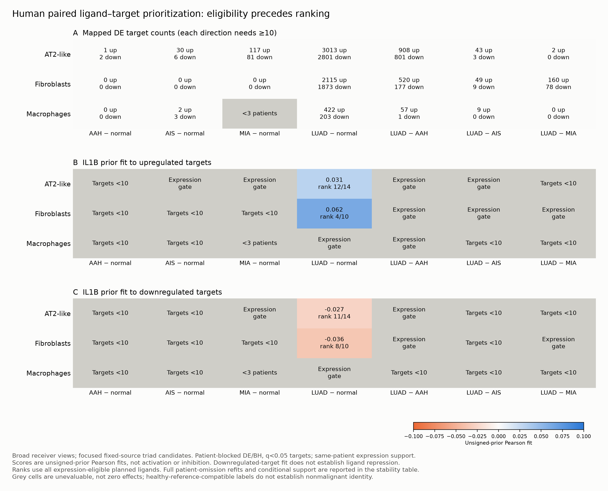

# Paired human ligand–target prioritization

Completed 40 full-data receiver/contrast DE parity checks. Of 80 fitted primary receiver/contrast/direction target sets, 36 pass the ten-mapped-target gate. Expression filtering leaves 943 candidate rows across broad and subtype views and the two planned source scopes; these overlapping views are not independent confirmations.

The statistic is Pearson correlation between the checksum-verified NicheNet v2 unsigned prior and a binary receiver target vector. Each receiver is fit with a patient-blocked design; up- and downregulated q<0.05 target sets remain separate. Every eligible omitted-patient analysis refits filtering, TMM, voom, DE/BH and target selection. Source/receiver expression must retain at least three same-case-histology patients with the same source label, ≥50 cells per group and ≥10% detection of all required subunits. Omission eligibility is checked again.

Canonical IL-1 candidates require IL1R1 and IL1RAP; IL1R2 and SIGIRR do not qualify as activating receptors. All assayed genes in the exact pseudobulks are available for expression gates. Candidate ranks are restricted to planned ligand families; raw prior scores without expression support are not findings. Neither a high rank nor complete omission coverage constitutes causal or independent validation.

The original R log contains an aggregate warning notice. A follow-up reconstruction of all 36 eligible primary target sets reproduced only zero-standard-deviation warnings from constant prior columns. Every undefined primary correlation exactly matches a constant column, and every finite score agrees within 1e-12. Undefined scores are excluded from candidate ranks, not replaced by zero. The audit does not claim that the original run saved each individual warning message.

## Broad-receiver IL-1 stability

| Receiver | Contrast | Targets | Ligand | Rank | Eligible/planned omissions | Rank range |
|---|---|---|---|---:|---:|---|
| AT2 | LUAD − normal | down | IL1B | 11 | 23/23 | 4–11 |
| AT2 | LUAD − normal | up | IL1B | 12 | 23/23 | 9–12 |
| fibroblasts | LUAD − normal | down | IL1B | 8 | 19/22 | 5–10 |
| fibroblasts | LUAD − normal | up | IL1B | 4 | 19/22 | 2–4 |

[Target eligibility](target_eligibility.csv), [plotted gate/fit values](broad_IL1B_figure_values.csv), [full-data DE parity](full_fit_DE_parity.csv), [constant-prior score audit](primary_prior_warning_audit.csv).

[Candidate ranks](primary_candidate_rankings.csv), [omission stability](candidate_ranking_stability.csv), [fixed source support](fixed_source_receiver_support.csv), [prior edge assay coverage](prior_edge_assay_coverage.csv).
