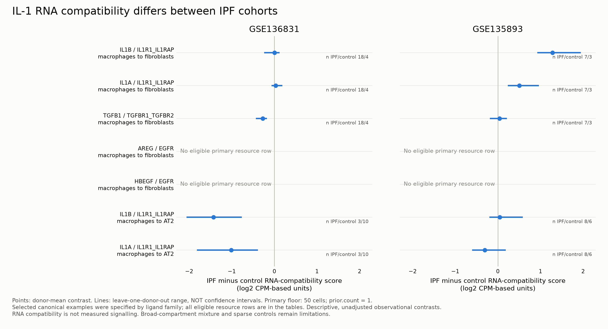

# IPF donor-level RNA compatibility

Completed in two previously inspected observational cohorts. These are descriptive contrasts; no disease-label permutation or FDR claim is made because an adequate exchangeability/covariate model was not established.

## Main result

The canonical macrophage-to-fibroblast IL1B/IL1R1-IL1RAP contrast is near zero in GSE136831 and positive in GSE135893. Macrophage-to-AT2 results also differ. The data therefore do not establish a uniform increase in the proposed IL-1 circuit across IPF cohorts. Low fibroblast control counts, compartment mixture and unmeasured clinical covariates remain alternative explanations.

| Cohort | View | Family | Eligible primary contrasts |
|---|---|---|---:|
| GSE135893 | broad | core | 53 |
| GSE135893 | broad | exploratory | 32 |
| GSE135893 | subtype | core | 6 |
| GSE136831 | broad | core | 39 |
| GSE136831 | broad | exploratory | 23 |
| GSE136831 | subtype | core | 78 |
| GSE136831 | subtype | exploratory | 46 |

## Robustness and interpretation

The run evaluated both resources, 30/50/100-cell floors and prior.count 0.5/1/2. `robustness.csv` reports the range and sign consistency over available consensus configurations. These ranges are not confidence intervals. The 30-cell analysis is conditional on the older cache retaining donors with at least 50 broad-compartment cells. Broad and subtype views are not independent replications.

All primary contrasts were independently reconstructed from individual donor scores, including the leave-one-out ranges. Ligand and receptor-component differences are retained so a combined score cannot conceal opposing changes. Missing assays or compartments were not zero-imputed; unsupported neutrophil/endothelial directions were not evaluated with the triad inputs.

Sources: [frozen specification](specification.json), [all contrasts](contrasts.csv), [eligibility](eligibility.csv), [robustness](robustness.csv), [table checks](validation.json), [run record](run_record.json).

The initial work-package label W1 was changed to the established U5 naming after execution. The original run record and source snapshots are preserved in `.history/original_entrypoints`; [relocation](path_relocation.json) records the change.
