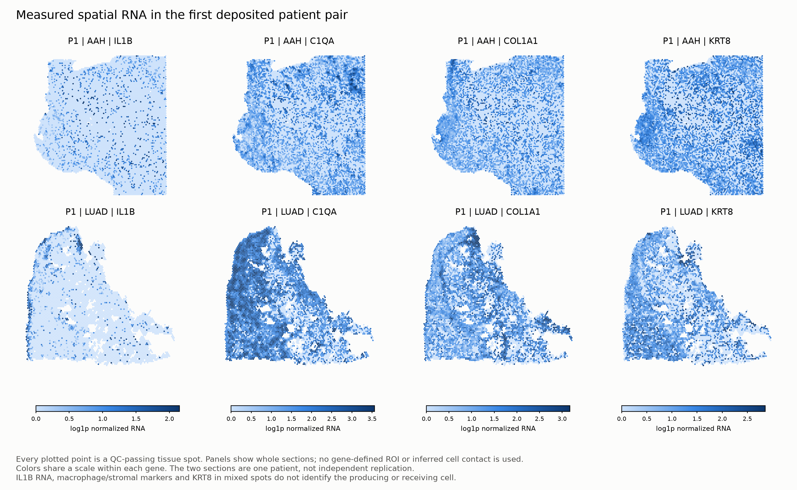

# Spatial context: measured sections and regional inference limits

Processed all 56 deposited GSE307534 sections and all nine deposited post-viral count matrices. Human lesion sections represent 25 source patient labels, with repeated sections nested within patients. This is not additional replication independent of the RNA companion.

## What is evaluable

Both coordinate-file versions agree on their common barcodes in every human lesion section, and all filtered-matrix barcodes map to coordinates. QC uses the deposited tissue mask, at least 500 counts, 200 detected genes and at most 15% mitochondrial RNA. Whole-section programme means and individual paired patient differences are computed for LUAD versus AAH, AIS and MIA separately. Repeated sections are averaged equally, with spot-weighted sensitivity. These are descriptive sample-level comparisons, not an inferred progression trajectory.

The archive inventory contains no verified independent spot-level pathology/ROI annotations. The planned pathological-region enrichment or within-region neighborhood analysis therefore remains unevaluable. Gene-score-derived regions were not substituted. Tissue spots contain mixtures, so co-expression does not assign a ligand source, receptor-bearing cell or physical contact.

## Pathological post-viral context

GSE267226 has three PASC-PF donors and two controls; GSE267228 has two IgG and two anti-CD8 mice. GEO archive inventories supply H5 count matrices and PNG images without coordinate tables; the H5 internal inventory also has no spatial coordinates. The author code loads complete local Space Ranger directories that are not included in these deposited files. Therefore individual whole-sample RNA-program values are available, but neighborhood or anatomical-region inference is not. The mouse intervention is anti-CD8, not anti-IL1B.

[Section QC](section_qc.csv), [archive/H5 inventory](deposited_member_inventory.csv), [assay coverage](program_coverage.csv), [all whole-section values](whole_section_programs.csv), [patient paired values](paired_patient_values.csv), [paired summaries and weighting sensitivity](paired_section_summary.csv), [post-viral individual values](postviral_individual_sample_programs.csv). No threshold was relaxed to make a regional result pass.

## Descriptive post-viral findings

Whole-section IL1B RNA means are lower in the three deposited PASC-PF samples than in the two controls (0.041 versus 0.077 log1p-normalized units), and lower in anti-CD8 than IgG mice (0.352 versus 0.459). These small, unadjusted whole-section comparisons neither localize a pathogenic niche nor establish an IL-1 treatment response. In particular, a whole-section average is not a reproduction of a pathology-region-specific result. [All descriptive contrasts](postviral_descriptive_contrasts.csv) retain every measured gene/program and individual sample values.

Across RNA and spatial companions, all 23 RNA patient labels are present among the 25 spatial patient labels, with consistent deposited age/sex/smoking/ethnicity fields. This is metadata support for linkage, not genotype verification or proof that tissue pieces are identical. [Crosswalk check](RNA_spatial_crosswalk_validation.json). Histology-specific patient counts overlap and must not be summed as independent patients.
