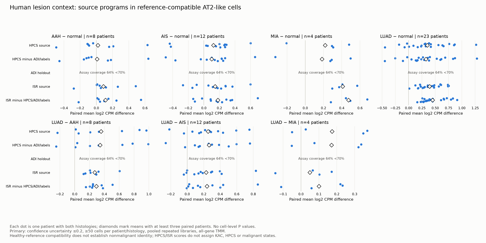

# Human epithelial program contrasts

Frozen source-defined HPCS, ADI, DATP, alveolar, stress and Han ISR programs were scored in healthy-reference-compatible AT2-like pseudobulks. These candidate labels can include lesional cells; they are not an independent malignant-cell classifier.

Each difference retains the same patient on both sides. Repeated libraries are pooled before scoring. All-assay TMM log2 CPM uses prior count 1; primary coverage is 50 cells and uncertainty ≤0.2. The 30/100-cell, uncertainty ≤0.3 and largest-library analyses are separate sensitivities. Source coverage uses the original mouse source-list denominator after strict one-to-one ortholog mapping, with a 0.7 gate. Missing source genes are not zeros.

## Reduced HPCS program

- AAH minus normal: 8 paired patients, mean +0.009 log2 CPM, 3/8 positive; eligible_descriptive_contrast.
- AIS minus normal: 12 paired patients, mean +0.100 log2 CPM, 9/12 positive; eligible_descriptive_contrast.
- MIA minus normal: 4 paired patients, mean +0.183 log2 CPM, 3/4 positive; eligible_descriptive_contrast.
- LUAD minus normal: 23 paired patients, mean +0.327 log2 CPM, 19/23 positive; eligible_descriptive_contrast.
- LUAD minus AAH: 8 paired patients, mean +0.342 log2 CPM, 7/8 positive; eligible_descriptive_contrast.
- LUAD minus AIS: 12 paired patients, mean +0.264 log2 CPM, 10/12 positive; eligible_descriptive_contrast.
- LUAD minus MIA: 4 paired patients, mean +0.170 log2 CPM, 3/4 positive; eligible_descriptive_contrast.

The ADI holdout has 64.1% source coverage and the six-gene DATP/PATS holdout has 66.7%, so both remain ineligible under the 70% rule. Their empty score rows are missing coverage, not zero biological effects. The complete source HPCS list retains 78.0%, and the overlap-reduced HPCS list retains 79.1%; the measured assay subset is disclosed rather than treated as the complete original signature.

These descriptive program contrasts cannot replace the prespecified source-defined KAC/NF-κB association. The public KAC classifier remains unavailable. Similar program scores across lesion, repair or fibrosis contexts establish neither common ancestry nor transformation. Overlapping patients across comparisons are not independent replications.

[All paired summaries](paired_program_summary.csv), [patient values](paired_program_values.csv), [sensitivities](program_sensitivity_comparison.csv), [source modules](module_specification.json).
