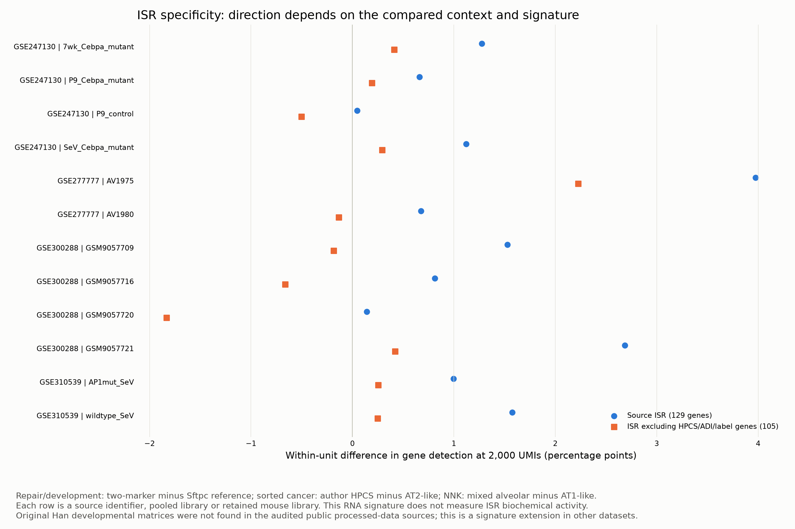

# Source ISR signature extension

Han et al. Supplementary Table 1 supplies 129 unique mouse symbols. The exact source-symbol set is retained; a 105-gene sensitivity removes HPCS, ADI and operational-label overlap. One Ensembl identifier occurs beside two different source symbols in the PDF. That discrepancy is recorded, and symbols were not silently replaced using those identifiers.

This separate run scores existing reusable repair/developmental, sorted neoplastic and NNK inputs using the frozen joint-depth procedure. Its gene panel changes the exact seed realization, so its operational cell groups are not assumed identical to the original HPCS run. No animal-level inferential test is built from pooled wells or sorting gates.

24 primary module/unit contrasts are eligible; 24/24 retain their direction in seed 29. Directions and magnitudes are provided for each unit, including negative results. An ISR RNA score does not establish pathway activation or identify the mechanism of injury.

## Conditional Han comparator

The author repository was pinned to e1cbecd5dc0e36cc3b22f266804597b179096514. It contains code referencing local SHH1–SHH8 10x directories and local RDS objects, but no processed matrices in its file inventory. The paper lists raw-read BioProjects; its small Supplementary Data ZIP contains an ImageJ alveolar-thickness macro. Thus the original Han developmental perturbation comparison remains unavailable from the bounded processed-data sources audited here. Raw-read alignment was outside the authorized staged plan and was not started.

[Source table](han_ISR_source_table.csv), [identifier discrepancy](source_duplicate_identifiers.csv), [within-unit values](within_unit_contrasts.csv), [summary](contrast_summary.csv), [seed checks](seed_robustness.csv), [module specification](module_specification.json). Primary source: [Han et al.](https://doi.org/10.1038/s41586-023-06423-8), [author code](https://github.com/MinhoLee-DGU/2023.Han.et.al.Nature).
