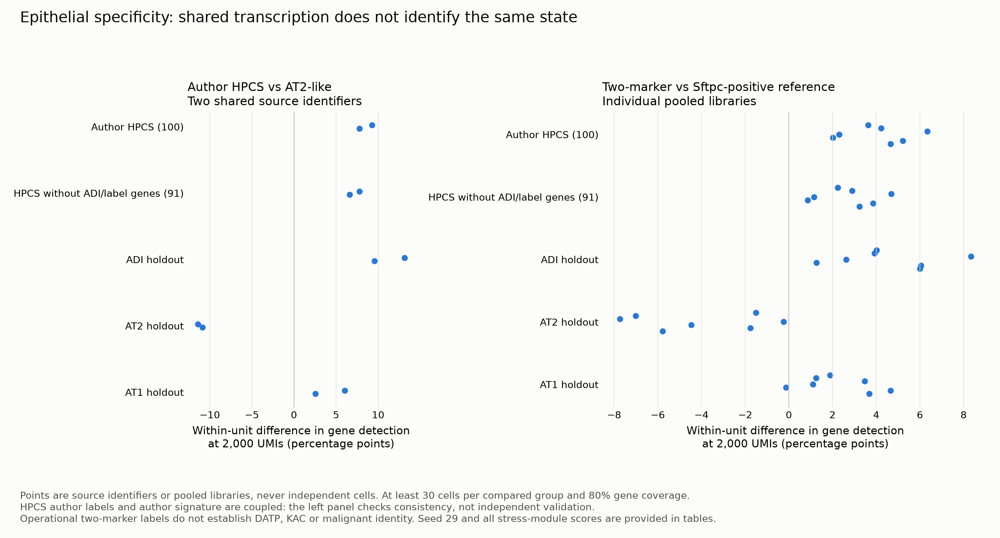

# Epithelial state specificity extension

Computed 980 module-score rows across four cohorts, with joint 2,000-UMI sampling and two technical seeds. 130 seed-17 module/within-unit contrasts pass both 30-cell and 80% assay-coverage gates. These counts are analysis rows, not independent biological replicates.

## What these comparisons can establish

The author HPCS pilot has two shared source identifiers across six sorting gates. Sorting gates are not six independent mice, and the source identifiers have not been promoted to verified experimental replication. Author HPCS labels and the source HPCS signature are coupled; their separation is a consistency check. Removing operational label genes and ADI-overlapping genes tests a narrower signature-overlap explanation, but does not make the author labels independent.

The repair/developmental inputs contain ten pooled libraries. Their differences are descriptive and cannot supply donor-level P values. The two-marker group is defined by Cldn4/Krt8 detection after joint depth sampling, while the reference requires Sftpc. These are conditional operational groups, not validated DATP or KAC populations. Existing source-paper outputs were not changed.

NNK inputs use independently reviewed mixed-alveolar/AT1-like labels; source KAC identities remain unavailable. A shared HPCS or injury score does not establish a common cellular identity, transformation, or an IL-1 causal mechanism.

## Results and robustness

The HPCS signature excluding ADI/operational markers is higher in author HPCS than AT2-like cells in 2/2 eligible source identifiers (differences 6.63 to 7.79 detection percentage points).

The same reduced HPCS signature is higher in the operational two-marker group in 7/7 eligible pooled repair/developmental libraries. Thus the observed signature increase is not specific to the sorted neoplastic context. These conditional group comparisons do not establish the presence of the author-defined HPCS state.

Across 130 contrasts eligible in both technical seeds, 127 retain their direction. This checks sampling robustness, not biological replication. Scores for hypoxia, inflammatory and p53 programs remain in the full table.

Tables: [module scores](module_scores.csv), [within-unit contrasts](within_unit_contrasts.csv), [summary](contrast_summary.csv), [seed robustness](seed_robustness.csv), [module overlap](module_overlap.csv), [source identifier coverage](HPCS_source_identifier_coverage.csv), [retention](retention.csv). The developmental ISR-specific and spatial extensions have separate access/eligibility records and are not silently replaced by these datasets.
