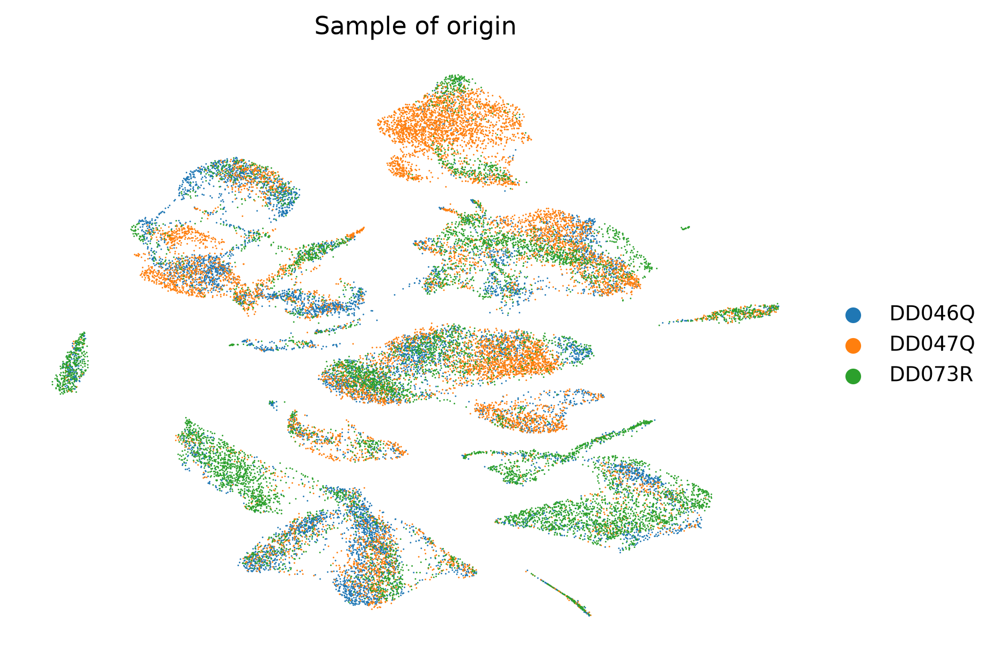
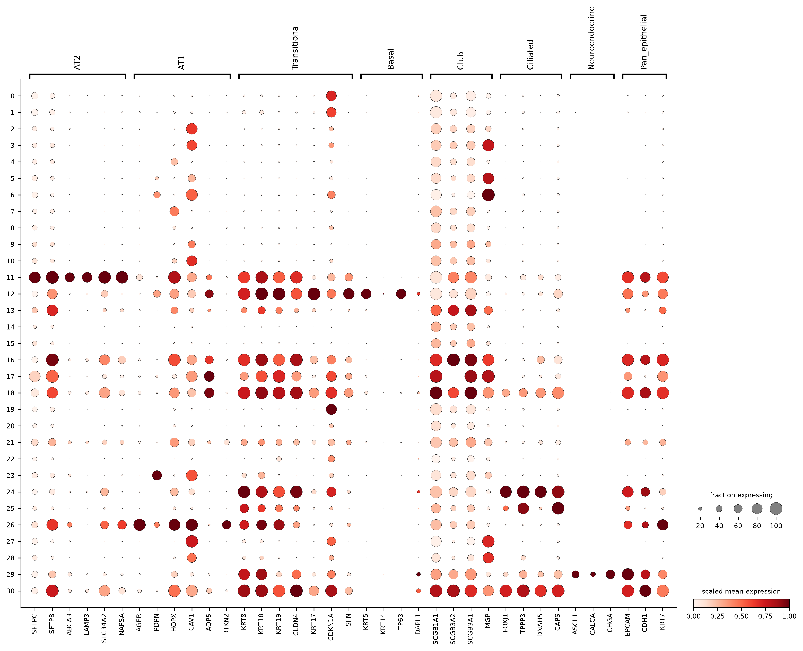

# Kadur Lakshminarasimha Murthy et al. 2022, the source paper of GSE178360

*Nature* 2022, DOI [10.1038/s41586-022-04541-3](https://doi.org/10.1038/s41586-022-04541-3),
PMID [35355018](https://pubmed.ncbi.nlm.nih.gov/35355018/). Human distal lung
maps and lineage hierarchies.

This paper is not on the reading roadmap in [`../README.md`](../README.md);
its deposit was analysed before the roadmap existed, as the human series of
the Stage 0 pipeline, and the HLCA lists it as an extension dataset
(Tata_unpubl), which is why trial S2 of
[`../gate1_04_sikkema_2023_hlca/`](../gate1_04_sikkema_2023_hlca/README.md)
targets it. The folder exists to hold that series beside its source paper;
no study note is written here because the owner has not read the paper for
the roadmap, and the roadmap's rule is that study notes follow reading
(DEVELOPMENT.md, decision 23).

- [`GSE178360/`](GSE178360/README.md): the generated report, figures,
  tables, QC and the epithelial sub-analysis (three healthy donors,
  27,729 cells after QC). Rows C4 to C7 and C9 in `CLAIMS.md`.

## Figure gallery

The human atlas contains three healthy donors. The figures below describe
donor coverage and marker distributions; they do not establish injury-related
states or lineage transitions.

*Sample-of-origin UMAP from the executed human analysis. Mixing and isolated
regions are diagnostics; an embedding alone cannot establish successful batch
correction or a novel cell type. [Dataset report](GSE178360/README.md).*

*Dot size is the fraction expressing a marker; colour is scaled mean
expression. Column groups are marker-panel names, not validated identities
for every row. In particular, shared keratins do not identify an injury
transition. [Marker and annotation tables](GSE178360/tables/).*

The [HLCA gallery](../gate1_04_sikkema_2023_hlca/README.md#figure-gallery) shows
the subsequent reference-label and uncertainty checks on this same cohort.
The [complete original figure directory](GSE178360/figures/) also contains
integration diagnostics, quality-control plots and immune/stromal marker panels.
