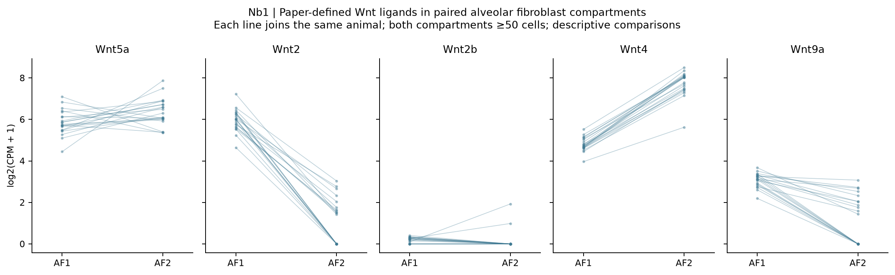
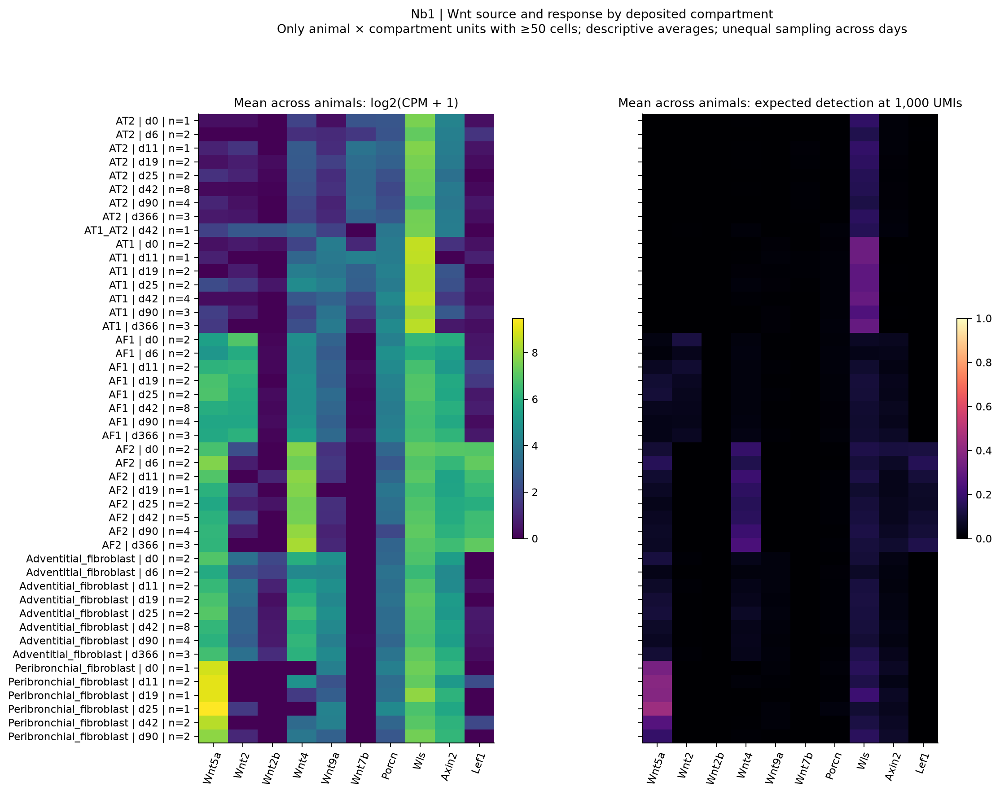
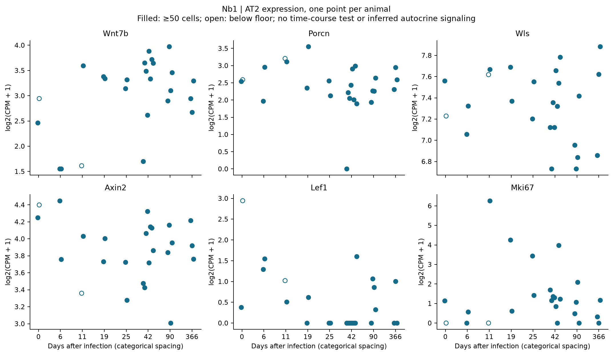
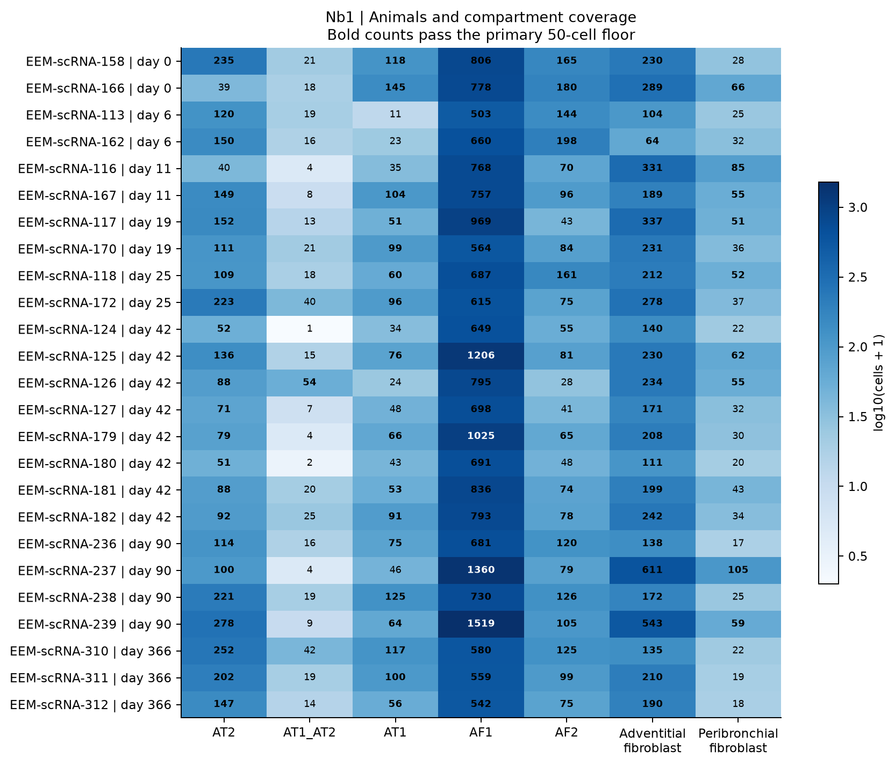

# Nb1: Wnt source and response after viral lung injury

Completed 2026-09-22. **Descriptive only.** Raw-count summaries cover 34,503
cells, seven deposited compartments and 25 animals in GSE262927. The
[protocol](PROTOCOL.md) fixes the questions, panels, units and feasibility
threshold before target-expression analysis. The mechanistic motivation is
[Nabhan et al., 2018](https://doi.org/10.1126/science.aam6603).

## What the data show

**Alveolar fibroblast compartments carry different Wnt transcript profiles.**
Among 21 animals with at least 50 AF1 and 50 AF2 cells, AF1 has higher Wnt2 CPM
in all 21 pairs, while AF2 has higher Wnt4 CPM in all 21. Both directions remain
21/21 after standardizing detection to 1,000 UMIs per eligible cell. Wnt9a is
higher in AF1 in 21/21 CPM comparisons and 20/21 depth-standardized comparisons.
These are descriptive within-animal directions across a heterogeneous time
course, not a differential-expression test or an injury-induced change.



*Each line joins the same animal's deposited AF1 and AF2 compartments. All five
paper-defined fibroblast ligands are displayed. See
[paired measurements](tables/paired_fibroblast_ligands.csv) for both endpoints.*

**Wnt5a does not identify one unique fibroblast population in these data.** It
is detected in every eligible AF1, AF2, adventitial and peribronchial unit
(25/25, 21/21, 25/25 and 9/9 units respectively). The nonalveolar compartments
provide expression context; their RNA is not evidence that they contact AT2
cells. A candidate source is not an established spatial niche.



*Rows retain compartment, day and the number of eligible animals. Each animal
has equal weight in a row mean. Left: log2(CPM+1); right: exact expected
detection after sampling 1,000 UMIs. The low right-panel values reflect sparse
transcripts at a common library depth. Both panels use current counts-layer
library totals; they do not measure the absolute amount of ligand produced.*

**AT2 Wnt7b is detectable at baseline as well as after injury.** All 23 AT2
units passing the primary cell floor contain Wnt7b counts; the single eligible
baseline animal has 15 UMIs across 235 cells. Thus these data do not establish
de novo induction or an injury-specific switch. Porcn is detected in 22/23
eligible AT2 units and Wls in 23/23, without establishing secretion or an
autocrine loop. Wnt7b-positive fractions range from 2.7% to 20.0%; their
depth-standardized median is only 0.85%, illustrating detection dependence.



**The two response markers have unequal coverage.** Axin2 is detected in all
23 eligible AT2 units, Lef1 in only 10/23. Their combined marker summary must
not be described as validated Wnt activity. The AT2 identity panel has
377/398 genes present; the 21 missing symbols are recorded in
[panel coverage](tables/panel_coverage.csv). Historical aliases are not silently
substituted. An alias-harmonization sensitivity would need its own specification.


*One point per animal; labels are sample suffixes. Identity, response and
proliferation panels share no genes. Open points fall below 50 AT2 cells.
These distributions motivate testing whether the dimensions can vary
independently; they do not establish independence or functional stemness.*

## Sampling determines the decision



| Day | Animals represented | AT2 units with at least 50 cells |
|---|---:|---:|
| 0 | 2 | 1 |
| 6 | 2 | 2 |
| 11 | 2 | 1 |
| 19 | 2 | 2 |
| 25 | 2 | 2 |
| 42 | 8 | 8 |
| 90 | 4 | 4 |
| 366 | 3 | 3 |

The day-11 AT2 units contain 40 and 149 cells. Lowering the floor to 20 would
still leave only two animals in each early arm; it cannot create replication.
The [coverage sensitivity](tables/eligibility_sensitivity.csv) reports 20/50/100
cells and heterozygous-only eligibility. Later days have more animals, but day,
genotype, infection round, sex and age are not interchangeable variables.
No time-course or injury-versus-baseline significance test is reported.

The earliest injury sample is day 6. Nabhan's rapid response to DT/hyperoxia
cannot be tested here, and viral injury is a different intervention. Transcript
detection does not validate reporter lineage, AT2-to-AT1 fate, self-renewal,
cell contact, or a productive repair outcome. Sparse epithelial Wnt counts
also remain vulnerable to ambient RNA and doublets; this analysis does not
estimate either contribution.

## Reproduction and integrity

Run from the repository root in the scientific Python environment:

```powershell
python Thesis/gate1_03_nabhan_2018/nb1/test_nb1.py
python Thesis/gate1_03_nabhan_2018/nb1/run_nb1.py
python Thesis/gate1_03_nabhan_2018/nb1/verify_outputs.py
```

If the old virtual-environment launcher fails, use the working Python with
`analysis/scripts/run_with_environment.py --site-packages .venv-x64/Lib/site-packages`
before the script path, as described in the root
[reproducibility guide](../../../REPRODUCIBILITY.md). Required packages are
NumPy, pandas, SciPy, h5py, anndata, Matplotlib and adjustText; exact installed
versions are recorded in [run_record.json](run_record.json).

Inputs are the local GSE262927 counts-layer H5AD, cell metadata, animal
infection-round metadata and the existing published AT2 panel. The run record
hashes all inputs, the protocol, script, tables and figures. Raw data are not
committed. The analysis streams counts, checks integer/nonnegative values and
cell-ID alignment, and verifies aggregation and probability bounds.

The read-only verifier uses only the standard library and runs in CI. It checks
tracked output hashes, code/protocol/panel hashes, eligibility, reported paired
directions and CPM denominators. Add `--with-inputs` to require all local source
files and verify their hashes as well.

The current counts layer contains **1,352 fewer UMIs** than the earlier QC
metadata across these 34,503 cells. The existing processing script applies a
three-cell gene filter before storing this layer; the largest animal ×
compartment loss is 0.00277% of the earlier total. CPM and depth sensitivity
consistently use the current layer, not the pre-filter metadata denominator.

Three mathematical tests check detection probabilities against enumerated
combinations, broadcasting and invalid-library handling. An independent
read-only audit checked alignment, panel overlap, numerators/denominators and
eligibility; the probability calculation agreed with SciPy's hypergeometric
distribution within 2.1e-10 at observed library sizes. No primary-eligible unit
lacks depth-qualified cells. These checks validate the calculation, not the
biological mechanism.

The next decision is the [external-cohort gate](../external_feasibility/README.md).
Ligand-receptor ranking is deferred until source, receiver and sample coverage
support the intended comparison.
