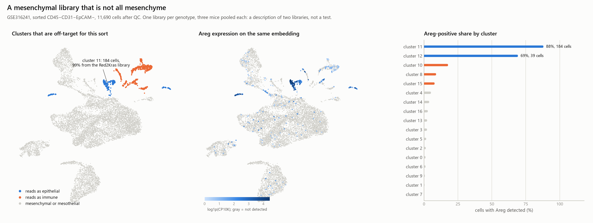
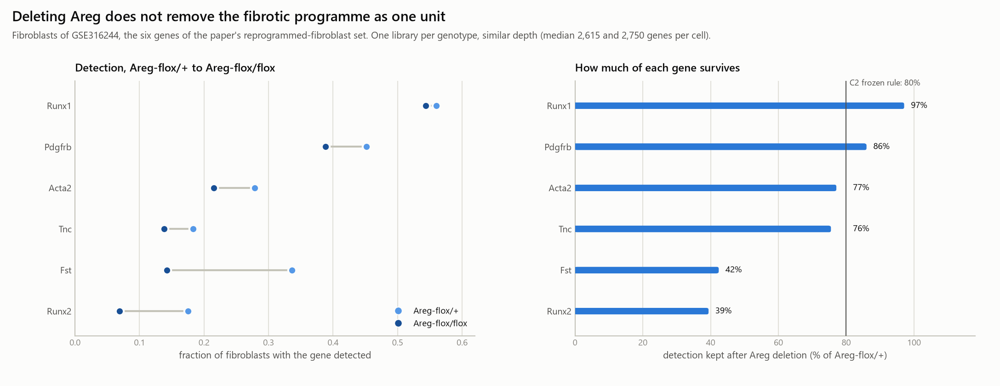
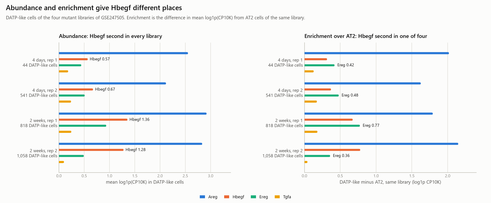

# Why this reanalysis diverges from the paper, what the biology behind each divergence is, and what to do next

Companion to [`ANALYSIS_TRIAL_PLAN.md`](ANALYSIS_TRIAL_PLAN.md), which records what
each gate did and returned. This page answers a different question: given the
same deposited counts, **why** does an independent pipeline land somewhere
slightly different, which of those differences are biology and which are
bookkeeping, and what would settle each one.

Every number here is read from a trial artefact under [`trials/`](trials/).
Status of everything below: Descriptive only or Exploratory, because no
genotype contrast in this paper's deposit carries within-group replication
(trial C0). Owner review pending.

Figures for the three findings are in
[`trials/c5_figures_for_the_three_findings/`](trials/c5_figures_for_the_three_findings/).

According to PubMed for all external citations, with DOIs given inline.

---

## 1. The seven mechanical reasons a reanalysis moves

None of these is a disagreement with the authors. Each is a place where a
decision had to be made, the paper made one, this repository made another, and
the difference is visible in the output.

| # | The decision | The paper | Here | What it changed |
|---|---|---|---|---|
| 1 | Who annotates | expert annotation of Seurat clusters, with unwanted types removed manually | a score over the paper's own published marker sets, assigned by modal argmax, labels never used to fit anything | the caller has no expert veto, so a cluster whose markers are ambiguous stays ambiguous instead of being named |
| 2 | Clustering and integration | Louvain on Harmony-integrated objects | Leiden (igraph, seed 0) with no correction, because library and genotype are one variable here | cluster boundaries and counts differ; the fibrotic population splits across clusters rather than forming one |
| 3 | Quality thresholds | fixed cuts (>1,000 genes, 2,000 to 50,000 UMIs, <10% mitochondrial) | per-library MAD, the repository's standing rule | the paper's rule would drop 29% of the Red2Kras library against 16% of the Confetti one (trial C1), an asymmetry that lands directly in any composition comparison |
| 4 | Doublets | no dedicated caller named | Scrublet per library, with the automatic threshold rejected when it disagrees with the 10x prior | on these libraries the automatic threshold called 0.00 to 0.07%, so the calls fell back to a rank cut: a ranking, not a detection |
| 5 | What counts as a population | expert judgement | a 50% modal-confidence floor | twice the floor scored a real effect as nothing (C1 dropped the candidate clusters; C2 reported 0.0% against 0.0%), which is why C1b and C2b exist |
| 6 | Whether a marker set is compartment-pure | not an issue when a human annotates | it is the whole caller | two of the six genes in the paper's fibrotic set (Acta2, Pdgfrb) are mural markers and a third (Runx1) is also myeloid, so the score peaks on smooth muscle and flags a myeloid contaminant (trial C1b, Question C) |
| 7 | Sequencing depth across compared libraries | handled inside Seurat integration | detection fractions compared directly | the Areg-arm libraries are deeper (median 2,615 and 2,750 genes per cell) than the Confetti and Red2Kras ones (1,824 and 2,111), so cross-series detection is not comparable and only the within-series contrast carries a claim |

The honest summary of the table: **six of the seven differences are
bookkeeping, and they explain essentially all of the divergence in Gate 1.**
The one that is not bookkeeping is number 6, because it says something about
the published marker set that will bite anyone who reuses it.

---

## 2. Finding one: an Areg-high epithelial population inside the mesenchymal sort

**What the data show.** GSE316241 is deposited as CD45-CD31-EpCAM- mesenchyme.
Of its 11,690 cells, 757 (6.5%) sit in clusters that read as off-target for
that sort (trial C1d). Cluster 11 is the one that matters: 184 cells, 99% from
the Red2Kras library, with epithelial keratins in more than 90% of cells and
**Areg detected in 88%**. It is not a generic epithelial leak. It carries the
paper's own DATP-like markers (Cldn4 60%, Itga2 63%, Sox9 48%) alongside AT2
and AT1 markers, which is what the mutant epithelium looks like in the
lineage-labelled series.

**Why it could be there: three explanations, and what the check says.** Trial
C5 measured the markers that separate them.

| Explanation | What it predicts | What cluster 11 shows | Reading |
|---|---|---|---|
| Mutant cells lose Epcam and slip through the EpCAM- gate | low Epcam | Epcam mRNA in 78% of cells | **not supported at the RNA level**; surface protein can still be lower than mRNA, which 3' counts cannot see |
| Epithelial-fibroblast doublets | epithelial and fibroblast transcripts in the same cell | Krt8 and Col1a1 together in 19%; median Scrublet score 0.062 against 0.035 for the object | **a minority, about one cell in five** |
| Ambient RNA from lysed epithelium | low-level epithelial reads spread across all clusters | Krt8 in 0.3% of fibroblast cluster 14 | **not supported**; ambient contamination would not concentrate in one cluster |

The most parsimonious reading is ordinary sort impurity, with a doublet
minority. FACS purity is never 100%, and the DATP-like mutant population is
expanding fast at two weeks, so a small leak rate produces a visible cluster
almost entirely in the tumour arm.

**Why it matters, and why the paper is not affected.** The paper computed
epithelium-to-fibroblast signalling on epithelium imported from the separate
lineage-labelled series, so this contaminant never entered its CellChat
object. A reanalysis that ran ligand-receptor inference inside GSE316241 alone
would be computing Areg signalling from cells the sort was supposed to
exclude, and would find a tumour-specific Areg source that is an artefact of
the gate. That is the practical caution, and it generalises: a sorted
compartment in a tumour lung will carry the fastest-expanding population of
the compartment it was sorted against.

**What would settle it.** Flow cytometry of EpCAM surface protein on
lineage-labelled DATP-like cells, which the lab could answer from existing
panels. From the data in hand: map cluster 11 onto the RFP-sorted epithelium
of GSE316244, which shares its gene space exactly, and ask which mutant state
it matches.

---

## 3. Finding two: the fibrotic programme does not fall as one unit

**What the data show.** In the fibroblasts of GSE316244, comparing
Areg-flox/flox with Areg-flox/+ at similar depth, the six genes of the paper's
own reprogrammed-fibroblast set behave in three tiers rather than two:

| Gene | detection kept after Areg deletion | reading |
|---|--:|---|
| Runx1 | 97% | retained |
| Pdgfrb | 86% | retained |
| Acta2 | 77% | falls by about a quarter |
| Tnc | 76% | falls by about a quarter |
| Fst | 42% | falls by more than half |
| Runx2 | 39% | falls by more than half |

C2's frozen 80% line makes this look binary. It is a gradient, and saying so
is part of the result: the line is where a pre-registered threshold happened to
fall, not where the biology has a joint.

**The biological logic.** The tiers line up with what the genes do rather than
with the label "fibrotic". Runx2 and Fst, the two that mostly disappear, are
the ones tied to the pathological fibroblast programme itself: RUNX2 was shown
to drive an alveolar-to-pathological fibroblast transition and its deletion
reduces pathological fibroblasts and fibrosis (Fang et al., *Nature* 2025,
[DOI](https://doi.org/10.1038/s41586-024-08542-2); note the author correction,
[DOI](https://doi.org/10.1038/s41586-025-09254-x)). Tnc and Acta2, which fall
by about a quarter, are matrix and contractile effectors. Runx1 and Pdgfrb,
which barely move, are the two that other inputs are known to drive: the
alveolar fibroblast lineage passes through an inflammatory state into a
fibrotic one under TGF-beta control, with inflammatory and fibrotic states
separately regulated (Tsukui et al., *Nature* 2024,
[DOI](https://doi.org/10.1038/s41586-024-07660-1)), and Pdgfrb is a receptor rather than a
matrix effector, so its induction reports that the cell has entered an
activated mesenchymal state without saying which ligand put it there.

So the reading that fits both the tiers and the literature is that **Areg-EGFR
is necessary for the matrix and pathological-programme half of fibroblast
reprogramming, and something else drives the Pdgfrb and Runx1 half.** The
paper's own model has candidates for that something else, because its
macrophage arm supplies IL-1beta and its fibroblasts sit next to mutant cells
that make more than one ligand.

**The competing explanation that has to be excluded first.** A retained
detection fraction is also what incomplete deletion looks like. Areg-flox/flox
is a conditional deletion in Sftpc-CreERT2-labelled AT2 cells, so any mutant
cell that escaped recombination still makes Areg, and any fibroblast next to
one still sees it. If escape is common, every gene's retention is inflated and
the tiers could be a dose-response to residual ligand rather than two
pathways. This is checkable in the data: Areg detection in the RFP-sorted
epithelium of the same flox/flox library puts a bound on escape.

**What would settle it.** Within flox/flox fibroblasts, is there a
Runx1-positive Pdgfrb-positive Tnc-negative population, or do all fibroblasts
shift down together? A per-cell co-detection test separates "two programmes"
from "one programme at lower amplitude". That needs the C2 object kept, which
means one re-run.

---

## 4. Finding three: Hbegf is second by abundance, and that is not the same as second in importance

**What the data show, and the correction this forced.** Ranking the four EGFR
ligands by mean expression inside the DATP-like state gives the same order in
all four mutant libraries: Areg, then **Hbegf**, then Ereg, then Tgfa. That was
trial C3's frozen test and it holds. But ranking them by enrichment over the
AT2 cells of the same library gives Areg first and **Ereg** second in three of
the four libraries, with Hbegf third; by the ratio of detection fractions,
Ereg is first in every library and Hbegf is last or second to last. Hbegf is
abundant in the DATP-like state because it is broadly expressed in mutant AT2
cells too.

The earlier session summary said Hbegf "ranks ahead of the ligand the paper
followed into culture". That is true of abundance and misleading as a statement
about the state, and this file is where the correction lives.

**The biological logic, which makes the correction more interesting than the
original claim.** EGFR ligands are not interchangeable at equal abundance,
because they determine what happens to the receptor after binding. HB-EGF
targets essentially all engaged EGFR for lysosomal degradation, whereas
amphiregulin does not target the receptor for degradation and instead drives
recycling, and epiregulin drives complete recycling (Roepstorff et al.,
*Traffic* 2009, [DOI](https://doi.org/10.1111/j.1600-0854.2009.00943.x)).
Epiregulin is also a partial agonist of EGFR dimerisation whose weaker dimers
paradoxically produce **more sustained** signalling and differentiation-type
responses rather than proliferation (Freed et al., *Cell* 2017,
[DOI](https://doi.org/10.1016/j.cell.2017.09.017)).

Read against that, the ranking reverses in meaning. A niche that needs
**sustained** fibroblast EGFR output over days to weeks is better served by a
recycling ligand such as Areg or Ereg than by an abundant degradative one such
as Hbegf, whose own abundance would drive receptor downregulation. The paper's
choice to pursue Areg, and to test Areg together with Ereg in culture, is
consistent with the trafficking biology rather than with the abundance
ranking, and the independent precedent is direct: sustained AREG from
intermediate alveolar stem cells activates fibroblast EGFR and drives
progressive fibrosis, and an anti-AREG antibody blocks it (Zhao et al., *Cell
Stem Cell* 2024, [DOI](https://doi.org/10.1016/j.stem.2024.07.004)).

**So what is Hbegf doing.** Two possibilities, and the data here cannot
separate them. It may be a passenger: a stress-induced EGFR ligand that comes
up with the mutant state and contributes little because it shuts the receptor
down. Or it may be the brake: an abundant degradative ligand that limits how
much fibroblast EGFR signal the niche can sustain, in which case removing
Hbegf would make the Areg axis stronger rather than weaker. The second
possibility is the one worth an experiment, because it predicts the opposite
sign from the obvious one.

**Two further observations from the same table, both thin.** The wild-type YFP
clones of the same 2-week animals contain a few DATP-like cells (21 and 36),
and their ligand order is the same, which hints the ligand profile belongs to
the state rather than to the Kras mutation; 21 cells cannot carry that. And the
two 4-day replicates disagree about 24-fold on how much of the library is
DATP-like (1.2% against 28.2%), so C3's 14.7% median at 4 days describes
neither library, and the 4-day arm of every ligand statement rests on 44 cells
in one of its two replicates.

---

## 5. What to do next, in the order the cost-to-value ratio suggests

### A. Answerable from data already on disk, no new experiment

**All six items are now answered. Section 9.4 carries the outcomes; the table
below is left as written so the questions and their costs stay visible.**

| # | Question | Method | Cost | What a result would mean |
|---|---|---|---|---|
| A1 | Is the mesenchymal-sort contaminant the same state as the RFP-sorted mutant epithelium? | score cluster 11 against the GSE316244 RFP+ states; the two share a gene space exactly, so no intersection is needed | one short trial | if it matches DATP-like, the contaminant is the paper's own signalling population and the sort caution is sharper; if it does not, the leak is something else |
| A2 | Is the fibrotic gradient one programme at lower amplitude, or two? | per-cell co-detection of Runx1, Pdgfrb and Tnc inside flox/flox fibroblasts | one C2 re-run, keeping the object | decides whether "Areg-independent half" is a real subpopulation or a wording artefact |
| A3 | How much residual Areg is there in the flox/flox arm? | Areg detection in the RFP-sorted flox/flox epithelium | minutes, data in hand | bounds the incomplete-deletion explanation that currently competes with A2 |
| A4 | Does the retention result survive depth matching? | downsample the deeper library's counts to the shallower library's median and recompute retention | one short trial | removes the only within-series confound left on claim C29 |
| A5 | Is the Hbegf abundance pattern present in human LUAD? | the paper's own comparison dataset, Kim et al. 2020, GSE131907, public | one trial, one download | a conserved abundance-versus-enrichment split would raise Hbegf from curiosity to candidate |
| A6 | Does the non-oncogenic injury fibroblast state show the same Runx1 and Pdgfrb retention? | Tsukui et al. bleomycin atlas, GSE132771, public | one trial, one download | separates "Areg-independent" from "injury-generic"; this is the comparison the paper itself used for the fibroblast state |

### B. Needs the bench, and is worth asking Choi about

| # | Question | Experiment | Why it is worth doing |
|---|---|---|---|
| B1 | Do DATP-like cells carry less surface EpCAM than their mRNA suggests? | flow cytometry of EpCAM on lineage-labelled RFP+ cells | settles the sort question, and would explain why mutant epithelium appears in an EpCAM-negative gate in any such experiment |
| B2 | Is Hbegf a passenger or a brake on the Areg axis? | dose-matched recombinant AREG against HB-EGF on alveolar fibroblasts, reading Pdgfrb and Acta2 and EGFR surface level over time; then HB-EGF loss of function in the tri-culture | the trafficking literature predicts HB-EGF gives a transient signal and downregulates the receptor, so its removal could strengthen the niche; that is a falsifiable, counter-intuitive prediction |
| B3 | Which input drives Pdgfrb and Runx1 if not Areg? | the existing tri-culture with IL-1beta or TGF-beta blockade on the Areg-deficient background | would close the one real gap this reanalysis found in the paper's cascade |
| B4 | Does fibroblast reprogramming precede macrophage change transcriptionally? | scRNA-seq of the mesenchymal and immune compartments at 1, 2, 4 and 8 weeks | the deposit has no time course in those compartments, so the paper's ordering claim currently rests on imaging alone (trial C0) |

### C. Out of reach with this data type, and worth stating rather than attempting

- **Tnc isoform usage.** The variable FNIII domains of Tnc cannot be resolved
  from 3' short-read counts. Since Tnc is the ligand in the fibroblast to
  macrophage leg, which isoform is made is a real question, and it needs
  long-read or targeted sequencing. Stated as a limitation, not a plan.
- **Anything about who receives a signal.** No communication analysis was run
  here and CellChat cannot run on this machine. Every ligand statement in
  section 4 is about the sending cell only.
- **Any tested genotype difference in this paper's deposit.** One library per
  genotype, three mice pooled. The companion series is the only place with
  replication, and even there n is two libraries per arm.

---

## 6. Status of the claims on this page

| Claim | Status |
|---|---|
| The seven mechanical reasons, and that six are bookkeeping | Descriptive only, from the trial artefacts |
| The contaminant is sort impurity with a doublet minority, not Epcam loss or ambient RNA | Descriptive only; the RNA cannot exclude lower surface protein |
| The fibrotic response to ligand deletion is graded, in three tiers | Descriptive only (one library per genotype) |
| "Areg-EGFR drives the matrix half, another input drives the Pdgfrb and Runx1 half" | Exploratory, and incomplete deletion is not yet excluded (A3) |
| Hbegf is second by abundance and third by enrichment | Descriptive only |
| "Hbegf may be a brake rather than a passenger" | Exploratory hypothesis, from published trafficking biology, untested here |
| The 4-day replicates disagree about 24-fold | Descriptive only, and a caveat on every 4-day statement |
| Everything in section 5 | Proposed, not run |

---

## 7. The Hbegf "brake" idea, checked against the literature (2026-09-13)

Section 4 floated the idea that Hbegf could be a brake on the Areg axis. Checked
against PubMed, **that idea is contradicted for lung**, and it is kept here as
a refuted hypothesis rather than deleted.

**What refutes it.** According to PubMed:

**What refutes it.** According to PubMed, three lung studies make HB-EGF
pro-fibrotic, and the closest one is almost this system:

| Study | What it shows |
|---|---|
| Hult et al., *Am J Respir Cell Mol Biol* 2022, [DOI](https://doi.org/10.1165/rcmb.2022-0174OC) | HB-EGF is raised in IPF and in fibrotic mouse lung; **lung macrophages and transitional alveolar epithelial cells express it**; deleting Hbegf from the myeloid compartment protects mice from bleomycin fibrosis, through less monocyte migration and less fibroblast migration |
| Lai et al., *Lab Invest* 2018, [DOI](https://doi.org/10.1038/s41374-018-0049-0) | HB-EGF drives collagen production in lung fibroblasts and tracks COPD severity |
| Li et al., *BMC Pulm Med* 2021, [DOI](https://doi.org/10.1186/s12890-021-01726-w) | HB-EGF makes airway epithelium secrete IL-8, which drives fibroblast proliferation and migration |

A fourth paper reports that HB-EGF raises collagen and alpha-smooth-muscle
actin yet concludes that it suppresses fibrosis, which is internally
inconsistent, so nothing here rests on it (An et al., *Regen Ther* 2024,
[DOI](https://doi.org/10.1016/j.reth.2024.05.002)).

**And on the cancer side, two findings matter:**

| Study | What it shows |
|---|---|
| Van Hiep et al., *Front Oncol* 2022, [DOI](https://doi.org/10.3389/fonc.2022.963896), corrigendum [DOI](https://doi.org/10.3389/fonc.2022.1106553) | High HBEGF tracks poor survival in lung adenocarcinoma but not squamous carcinoma, and correlates with monocyte, macrophage, neutrophil and dendritic-cell infiltration; single-cell data put HBEGF in tumour cells and myeloid cells |
| Robles-Oteiza et al., *Dis Model Mech* 2021, [DOI](https://doi.org/10.1242/dmm.049072) | EGFR-mutant mouse lung tumours **upregulate Hbegf**, which is the low-affinity diphtheria-toxin receptor in mice, and blocking HB-EGF with CRM197 partly abrogates the effect of diphtheria toxin |

### The revised hypothesis, which is better than the one it replaces

If HB-EGF is pro-fibrotic in lung, and if macrophages and transitional
epithelium both make it, then the reading that fits my own tables is the
opposite of a brake: **Hbegf is a second, Areg-independent driver of the same
fibroblast programme.** That would explain the tier of the fibrotic signature
that survives Areg deletion, since deleting Areg from AT2 cells cannot remove
a ligand that macrophages also make.

This is testable in the deposit with no new data, and trial C6 does it: gate
every niche library by compartment, ask who makes each EGFR ligand, and ask
whether any non-epithelial Hbegf source is still there in the Areg-deleted
library.

### A control the paper's own fibroblast-ablation experiment would benefit from

The paper depletes Pdgfra-positive fibroblasts with intratracheal diphtheria
toxin in Pdgfra-CreERT2;ZsGreen;iDTR mice carrying engrafted mutant organoids,
and reads reduced tumour growth (Extended Data Fig. 8a to d). Mouse HBEGF is
itself the low-affinity diphtheria-toxin receptor, and EGFR-mutant mouse lung
tumours upregulate it enough to become toxin-sensitive without any transgenic
receptor ([DOI](https://doi.org/10.1242/dmm.049072)). Hbegf is also the second
most abundant EGFR ligand in the mutant epithelial state measured here.

The differences from that report are real: this model is Kras-driven rather
than EGFR-mutant, the dose is low, and the route is intratracheal rather than
systemic. So this is not a claim that the result is confounded. It is a claim
that the clean control, diphtheria toxin given to engrafted mice **without**
the iDTR allele, would remove the ambiguity cheaply, and that the question is
worth raising because the ligand in question is high in exactly those cells.

### Extension with other public data, in order of value per unit of work

All four accessions were verified public on 2026-09-13.

| # | Dataset | Accession | The question it answers | Why it is worth it |
|---|---|---|---|---|
| E1 | Kim et al. 2020, human lung adenocarcinoma, the paper's own human comparison | [GSE131907](https://www.ncbi.nlm.nih.gov/geo/query/acc.cgi?acc=GSE131907) | in human LUAD, is HBEGF myeloid-dominant while AREG is epithelial, as the mouse data here suggest | the same split in human tissue would turn a mouse observation into a conserved one, and this dataset is already part of the paper |
| E2 | IPF Cell Atlas, Adams et al. 2020 | [GSE136831](https://www.ncbi.nlm.nih.gov/geo/query/acc.cgi?acc=GSE136831) | which cells carry HBEGF against AREG in human fibrosis, in particular aberrant basaloid cells, the human counterpart of the transitional state | tests Hult's mouse result in human disease and puts the tumour niche and the fibrotic niche on one axis |
| E3 | Habermann et al. 2020, pulmonary fibrosis | [GSE135893](https://www.ncbi.nlm.nih.gov/geo/query/acc.cgi?acc=GSE135893) | the same question in an independent fibrosis cohort | a second cohort is what separates a real split from one dataset's quirk |
| E4 | Tsukui et al. 2020, bleomycin mouse and human IPF mesenchyme | [GSE132771](https://www.ncbi.nlm.nih.gov/geo/query/acc.cgi?acc=GSE132771) | do Runx1 and Pdgfrb behave the same way in non-oncogenic injury fibroblasts | separates "Areg-independent" from "injury-generic", and the paper already used this dataset for the fibroblast comparison |

### What trial C6 found, which refutes the revised hypothesis as well

Artefacts: [`trials/c6_who_makes_egfr_ligands/`](trials/c6_who_makes_egfr_ligands/).
Eight libraries, compartments assigned by marker gates, no clustering.

**The receptor side supports the paper cleanly.** Egfr is a mesenchymal and
endothelial transcript, not an epithelial one: detected in 73% of gated
mesenchymal cells of the Areg-flox/+ niche library against 5% of the
RFP-sorted mutant epithelium. The direction of the paper's axis, epithelium
sends and fibroblast receives, is what the data look like.

**Hbegf does have a non-epithelial source that survives Areg deletion, but it
is not the macrophage.** Detection of Hbegf by compartment in the
Areg-flox/+ niche library, and what is left of it after deletion:

| Compartment | flox/+ | flox/flox | kept | survives the frozen 70% rule |
|---|--:|--:|--:|---|
| endothelial | 24.3% | 18.4% | 76% | yes |
| epithelial | 33.2% | 22.6% | 68% | no |
| mesenchymal | 11.4% | 9.3% | 82% | yes |
| neutrophil | 17.8% | 6.2% | 35% | no |
| alveolar macrophage-like | 8.5% | 2.6% | 31% | no |
| other myeloid | 4.6% | 2.0% | 43% | no |

So the prediction was half right in a way that changes the story. An
Areg-independent Hbegf source exists, and it is the **endothelium** plus the
fibroblasts themselves, which would make part of the axis autocrine. The
myeloid source that Hult's bleomycin work would predict is small here and
falls sharply with Areg deletion, so in this deposit macrophages are not the
Hbegf reservoir.

**The finding that matters more than either hypothesis.** Two things in the
same table constrain every conclusion drawn from the Areg-deletion arm,
including the paper's and mine.

1. **Areg transcript is still detected in 59% of the Areg-flox/flox RFP+
   cells**, against 89% in the haplodeficient control. Short 3-prime counts
   cannot distinguish a floxed transcript from an intact one when the
   remaining exons carry the 3-prime end, so this is not evidence that the
   genetics failed; the paper's functional readouts show it works. It does
   mean transcript detection is a poor proxy for the deletion, and that the
   residual fibrotic tier in trial C2 could partly reflect residual ligand.
   This was check A3 on the earlier list, and it comes back ambiguous rather
   than clean.
2. **Areg detection falls in every compartment of the Hom library, including
   lymphoid cells**, from 4.9% to 0.3%. Sftpc-CreERT2 cannot delete Areg in
   lymphocytes, so that fall is not deletion. The most likely cause is
   ambient RNA from the Areg-high epithelium, which is abundant in the
   control library and scarce once the tumour burden drops. Any per-compartment
   ligand comparison between these two libraries therefore carries an ambient
   term, which is the same warning trial C1d raised about sorted compartments
   and is the reason the paper's decision to run SoupX-free analyses deserves
   a second look in a reanalysis.

**Status.** Both the brake hypothesis and the second-driver hypothesis are
**Not established**, the first refuted by the literature and the second not
supported in the compartment that literature nominated. The endothelial and
autocrine Hbegf source is **Exploratory** and is the part worth carrying into
E1 to E4. The two constraints above are **Descriptive only** and should be
quoted whenever the Areg arm is used.

---

## 8. What the public-data extensions returned (2026-09-13)

Trials E1, E1b and E4 are logged in
[`ANALYSIS_TRIAL_PLAN.md`](ANALYSIS_TRIAL_PLAN.md). This section says what they
mean for the ideas on this page, because two of them cut against ideas written
above and one cuts against a claim of my own.

### 8.1 The first test this folder has been able to run

Every earlier trial here was descriptive by necessity. The Cardoso deposit
pools three mice per library and gives one library per genotype, so the unit
was always the library and no comparison was admissible. GSE131907 has eleven
donors with paired tumour and normal lung, so the unit becomes the donor and a
paired test is legitimate. AREG detection is higher in epithelial than in
myeloid cells within the same donor, median 0.336 against 0.215, paired
Wilcoxon p = 0.0020. That is the first and still the only tested row in the
Cardoso section of the claims register.

It is worth being precise about what it does not establish. It compares
epithelium against a myeloid average, and E1b shows that average hides
structure: CD1c-positive dendritic cells detect AREG in 0.618 of their cells,
above both tumour epithelial states, while monocyte-derived macrophages sit at
0.159. So the human data support "epithelium above the myeloid average" and do
not support "epithelium is the AREG source". The paper's mouse claim is about
an epithelial state, and nothing here contradicts it; what the human data add
is that dendritic cells are a second source that a mouse sort of RFP-positive
epithelium could never have seen.

### 8.2 The Hbegf lead does not transfer across species unchanged

Section 7 ended with the endothelial and autocrine Hbegf source as the
exploratory part worth carrying forward. The human data put it somewhere else.
By median per-donor detection in tumour lung, HBEGF is highest in alveolar
macrophages at 0.712 and in two dendritic-cell subsets at 0.655 and 0.552,
with the tumour epithelial state tS2 at 0.420 and COL13A1-positive matrix
fibroblasts, the alveolar fibroblast counterpart, at 0.087. Two independent
groupings of the same cells agree on this: the marker gates of E1 and the
deposited subtype labels of E1b.

This matters because it is the pattern the published human work predicted
(Hult et al. 2022, doi:10.1165/rcmb.2022-0174OC; Van Hiep et al. 2022,
doi:10.3389/fonc.2022.963896) and the opposite of what trial C6 found in mouse,
where the myeloid compartments were the ones whose Hbegf collapsed and the
endothelial and mesenchymal ones survived. The honest reading is that the cell
that makes HBEGF in human lung adenocarcinoma is myeloid, and the mouse model's
endothelial and autocrine source is a mouse observation until something shows
otherwise. A cross-species claim about the Hbegf axis is not available.

One correction belongs here rather than buried in the trial log. E1's run
record names its top HBEGF compartment "neutrophil". That gate is wrong: this
deposit annotates no neutrophils, because dissociation and droplet capture
lose them, and the gate's crosstab against the deposited labels is 83 per cent
myeloid cells. The gate was reading S100A8 and S100A9 in monocytes. The
outcome is the pre-named myeloid-dominant one, and the label in the record
should be read with that crosstab beside it.

### 8.3 A claim of mine was refuted by a rule I froze in advance

Finding two on this page, and claim C29, rested on the observation that Areg
deletion leaves Runx1 and Pdgfrb almost untouched while Fst and Runx2 lose most
of their detection. Section 3 offered two readings and could not separate them:
a second signal drives the surviving half, or those genes are simply what any
activated lung fibroblast expresses.

Trial E4 separated them on the dataset the paper itself used for its injury
comparison, in sorted Col1a1-GFP mesenchyme from bleomycin-treated mice with no
oncogene anywhere. Runx1 rises from 0.078 and 0.088 in the two untreated
animals to 0.225 and 0.237 in the two bleomycin animals; Pdgfrb rises from
0.117 and 0.126 to 0.225 and 0.208. Both clear the rule frozen before the
matrices were opened, which required every bleomycin value to exceed every
untreated value. The reading fixed in advance for that outcome therefore
applies without any choice on my part: **the persistence of Runx1 and Pdgfrb
after Areg deletion is what an activated lung fibroblast does after injury, not
evidence of a tumour-specific second signal.** Claim C29 keeps its numbers and
loses its interpretation, and the second-signal hypothesis loses the
observation that motivated it.

Two further results from the same trial close off related escapes. Tnc, Fst and
Runx2 are injury-generic too, so the tiers do not divide into an injury half
and a tumour half at all. Hbegf and Egfr are injury-generic as well, 0.118 and
0.135 against 0.072 and 0.062 for Hbegf, so neither is a tumour-specific
feature of the mesenchyme. Acta2 is the one gene that is not injury-generic,
and the reason is mundane: one untreated library reaches 0.423, which is what a
smooth-muscle contribution to a Col1a1-GFP sort looks like, and is the same
contamination pattern trial C1b found in the Cardoso sort.

The figure for this is [`trials/e5_figure_for_the_refutation/e5_retention_against_injury.png`](trials/e5_figure_for_the_refutation/e5_retention_against_injury.png),
and drawing it sharpened the point: five of the six genes are injury-generic,
not only the retained pair, so the tiers carry no tumour-specific information
rather than merely having an innocent explanation for their top two.

Against that, Pdgfra and Col13a1 fall with bleomycin in both replicates, which
is the loss of alveolar fibroblast identity Tsukui et al. describe and is a
useful sign that the trial is reading real injury biology rather than noise.

### 8.4 What this leaves standing

| Idea on this page | Status after E1, E1b and E4 |
|---|---|
| An Areg-high epithelial population contaminates the mesenchymal sort (finding one) | Untouched. It is an internal observation about the Cardoso deposit and no extension bears on it. |
| The fibrotic programme responds in graded tiers (finding two, measurements) | Untouched as measurement. |
| The Areg-independent tier reflects a second tumour signal (finding two, reading) | Refuted by E4. |
| Hbegf is second by abundance in the mouse DATP-like state (finding three) | Untouched; it is a mouse ranking and E4 adds that Hbegf is not tumour-specific in mesenchyme. |
| Hbegf as a brake on the Areg axis | Refuted by the literature in section 7. |
| Macrophages as the second Hbegf driver in mouse | Not supported by C6 in mouse; supported in human by E1 and E1b, which is a species difference rather than a rescue. |
| An endothelial or autocrine Hbegf source | Exploratory in mouse only. The human data put the ligand in myeloid cells. |

### 8.5 What is still worth doing

Two things are now clearly not worth doing. A cross-species Hbegf-source
argument is dead until the mouse and human patterns are reconciled, and the
depth-matched control for the C29 tiers has lost most of its value, because the
interpretation it was meant to protect has already been refuted by a cheaper
route.

### 8.6 The fibrosis cohorts, and the one thing that replicated

E2 on GSE136831 and E3 on GSE135893 asked whether the myeloid HBEGF pattern
holds in a non-tumour injury, and whether the transitional state carries AREG
as Zhao et al. 2024 predicted (doi:10.1016/j.stem.2024.07.004). Full numbers
are in the trial log; three things here.

**The prediction that motivated E2 was not supported.** Its only comparison to
clear the donor floor put HBEGF at 0.366 in pooled myeloid cells against 0.390
in aberrant basaloid cells over seven donors, p = 0.297. Myeloid cells are not
above the transitional state in fibrosis, and the aberrant basaloid state is
rare enough that seven donors is close to the ceiling this atlas allows. That
is a failure to detect, not a demonstration of equality.

**The Zhao prediction could not be tested at all.** Three comparisons, none
clearing the five-donor floor, and the two cohorts disagree in direction:
aberrant basaloid cells sit below ATII cells for AREG, 0.485 against 0.767,
while KRT5-negative KRT17-positive cells sit marginally above AT2, 0.700
against 0.672. All three are reported and none is read.

**What replicated is a source the mouse design cannot see.** Dendritic cells
and monocytes top AREG in both fibrosis cohorts, plasmacytoid dendritic cells
at 0.925 and cDC2 at 0.874 in E2, and E1b found the same thing independently in
adenocarcinoma, where CD1c-positive dendritic cells sat above both tumour
states. Three datasets, two diseases, two annotation vocabularies.

This is the one place where the extensions converge, so it is worth being
careful about what it is. It is not a new fact: leukocyte-derived AREG is
established, and Zaiss et al. 2015 (doi:10.1016/j.immuni.2015.01.020) reviews
mast cells, basophils, ILC2s and tissue-resident regulatory T cells as sources
alongside epithelium and mesenchyme. The mild surprise is which leukocytes,
because dendritic cells and monocytes are not the populations that review
foregrounds, and the regulatory T cells it does foreground sit near the bottom
of the adenocarcinoma ranking at 0.07. The value is negative rather than
positive: an epithelium-to-fibroblast account of this axis in human lung omits
the compartment with the highest ligand detection, and a sort of RFP-positive
epithelium is structurally incapable of seeing it. That is a limit on how far
the paper's mouse model can be read into human disease, and it is the kind of
limit worth putting in a discussion section rather than a result.

One asymmetry is worth carrying too. The receptor does not move with the
ligand. EGFR is mesenchymal in both fibrosis cohorts, fibroblasts at 0.650 and
basal cells at 0.774, matching the mouse at 73 per cent, while in
adenocarcinoma the tumour epithelial states topped it. Receptor placement
tracks the disease; the ligand source tracked the species. Any cross-species
argument has to account for both, and at present neither direction is clean.

Finally, E2 declared a fourth reading, disease against control, and did not
compute it. Trial E2b supplies it from E2's own tracked table, the remedy C2b
applied to C2. AREG is higher in IPF in 24 of 37 cell types with a median
difference of 0.027, HBEGF in 24 of 37 with 0.019, unpaired and not
depth-matched. Neither ligand rises clearly with the injury, which is the same
answer E1 gave for tumour against matched normal lung. Both look like
properties of the cell types that carry them rather than of the disease.

---

## 9. The three jobs of 2026-09-13, and what they leave of this page (2026-09-13)

Trials E6, C7 and C8 are logged in [`ANALYSIS_TRIAL_PLAN.md`](ANALYSIS_TRIAL_PLAN.md).
They closed the two remaining items of list A above and added the first direct
test of the paper's axis that any dataset here could support. All three came
back negative or unresolved, so this section is mostly about what can no longer
be said.

### 9.1 The axis itself, tested for the first time and not detected

Sections 2 to 4 of this page describe where each molecule sits. None of them
tests the link. Trial E6 does, in the weakest form that is still a test: across
22 donors of the Adams fibrosis cohort, do donors with more epithelial AREG
carry more fibroblast EGFR or more activated fibroblasts.

They do not, at any strength this cohort could detect. Epithelial AREG against
fibroblast EGFR gives rho 0.348 at p = 0.112, and against a fibroblast
activation score rho -0.150. Within the 18 fibrosis donors alone, 0.276 and
-0.013. The pre-registered reading obliges reporting the detectable effect
rather than declaring the axis absent: at this sample size a two-sided test
calls rho of about 0.43 and nothing smaller.

Two things follow, and the second matters more than the first. This is a null
for strong donor-level coupling, and it is silent about weak coupling. And it
is not evidence against the paper, because the paper's claim is about a state
inside the epithelium while E6 pools all of it, which is exactly the dilution
trial E1b measured. A version of E6 restricted to the aberrant basaloid state
would be the right follow-up, and trial E2 already showed why it cannot run:
that state clears the cell floor in only seven donors.

The control that fired is worth carrying forward. The only correlation reaching
significance was a control pair, epithelial TGFA against fibroblast activation
at rho 0.432, p = 0.045, and both of its members correlate with their own
compartment's sequencing depth, so the frozen depth rule refuses to read it.
The same number on AREG would have looked like a discovery. Any future
correlational work in this repository should carry that control by default.

### 9.2 Finding one survives, in a weaker and more exact form

Section 2 called cluster 11 an Areg-high epithelial population and left open
which state it is. Trial C7 answers: it is a mixture, not a state. Direct
marker scoring of its 184 cells gives DATP-like 77, AT2 70, cycling 20,
AT1-like 13 and Cd177-positive 4, a modal call of 41.8 per cent that sits below
the 50 per cent floor used elsewhere in this repository.

So the sentence to use is that about four in ten of the contaminating cells
score as the paper's own signalling population, and about four in ten are
ordinary AT2. The practical caution in section 2 holds: a ligand-receptor
analysis run inside GSE316241 alone would read part of the paper's sending
population as a mesenchymal source. What cannot be said is that the contaminant
is the DATP-like state.

The trial also produced a method result worth more than its biology. Rank
correlation of whole mean profiles separated the epithelial query from a
fibroblast control by 0.415 of rho, and separated the epithelial states from
each other by 0.0056. It has compartment resolution and no state resolution,
because 32,163 shared genes are dominated by what all epithelium has in common.
Marker scoring did the job that correlation could not.

### 9.3 The tiers are amplitudes, and the structure is on the other tier

Section 3 asked whether the Areg-independent half is a real subpopulation or a
wording artefact. Trial C8 answers with the gradient: in the deletion arm,
Runx1 and Pdgfrb co-occur in 22.46 per cent of gated fibroblasts against 20.44
per cent expected under independence, a ratio of 1.099 inside the frozen
independence band, and the depth control moves it by only 0.043. The
description trial C5 corrected this page to, a graded response rather than a
split, is the right one.

The mixture test that disagreed is not a second opinion. It prefers two
components because 31.5 per cent of these cells detect neither gene, so the
score has a spike at zero and a continuum, and a two-component fit wins on that
shape regardless of biology. Trial C1 applied the same test to a centred
`score_genes` output where this does not arise; reusing it on a raw two-gene
mean was a poor choice, and it is recorded rather than quietly replaced.

The lead this opens was not pre-registered and is labelled accordingly. The
co-organisation sits on the falling tier, not the retained one. In the control
arm Fst and Runx2 co-occur at 13.78 per cent against 7.94 expected, a ratio of
1.735, so they genuinely mark the same fibroblasts. After deletion that is gone,
ratio 0.816 on 24 double-positive cells of 3,700. Runx1 with Pdgfrb sits inside
the independence band in both arms. Read with trial E4, which showed Runx1 and
Pdgfrb rise with bleomycin alone, the picture is that Areg deletion removes a
co-expressing Fst and Runx2 population while the injury-generic genes stay
spread independently across the compartment. That is the shape a future
pre-registration should target, and it rests on 24 cells in one library today.

### 9.4 What list A now looks like

| # | Question | State |
|---|---|---|
| A1 | Is the contaminant the same state as the RFP-sorted mutant epithelium? | Answered by C7: it is a mixture, about four parts DATP-like to four parts AT2 |
| A2 | Is the fibrotic gradient one programme at lower amplitude, or two? | Answered by C8: one programme at lower amplitude; the co-organisation is on the falling tier |
| A3 | How much residual Areg is there in the flox/flox arm? | Answered by C6: detected in 58.7% of Hom RFP-positive epithelium, with an ambient term |
| A4 | Does the retention result survive depth matching? | Partly answered as a side effect: C8's gate gives 3,637 against 3,612 median genes per cell, the best-matched arms in this deposit, and the ratios hold |
| A5 | Is the Hbegf abundance pattern present in human LUAD? | Answered by E1 and E1b: the ligand is myeloid-dominant in human, so the mouse pattern does not carry over |
| A6 | Does non-oncogenic injury show the same Runx1 and Pdgfrb retention? | Answered by E4: yes, which refuted the second-signal reading |

List A is now empty. Everything left on this page is either list B, which needs
the bench, or list C, which the data type cannot support. The one exception is
the state-resolved version of E6, which is blocked by cell counts rather than
by method, and which a cohort with more transitional cells per donor would
unblock.
