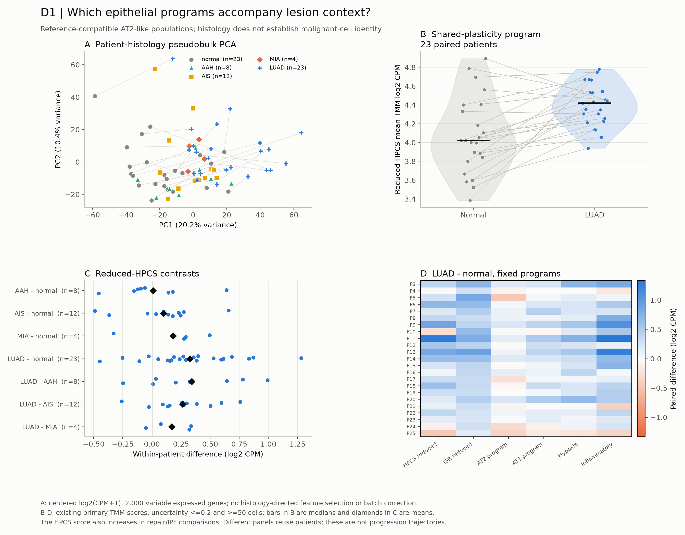
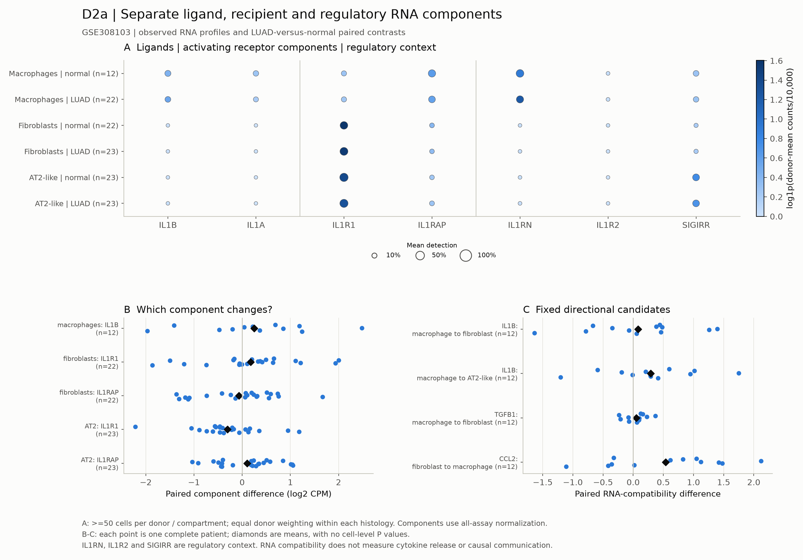
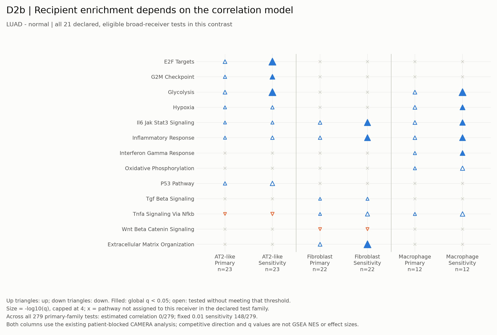
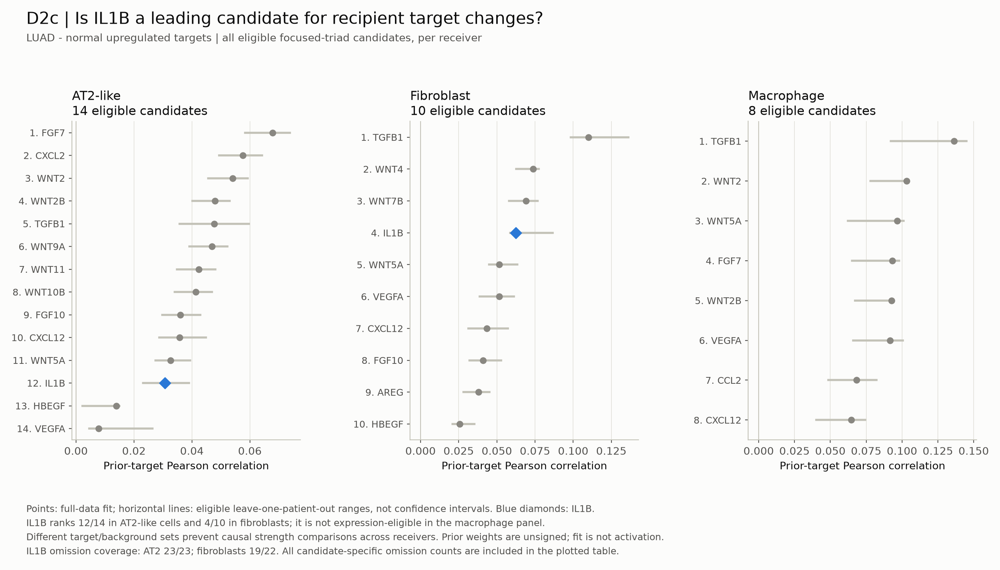
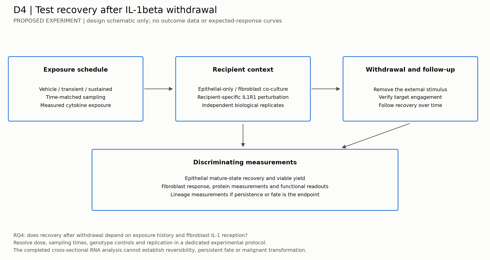
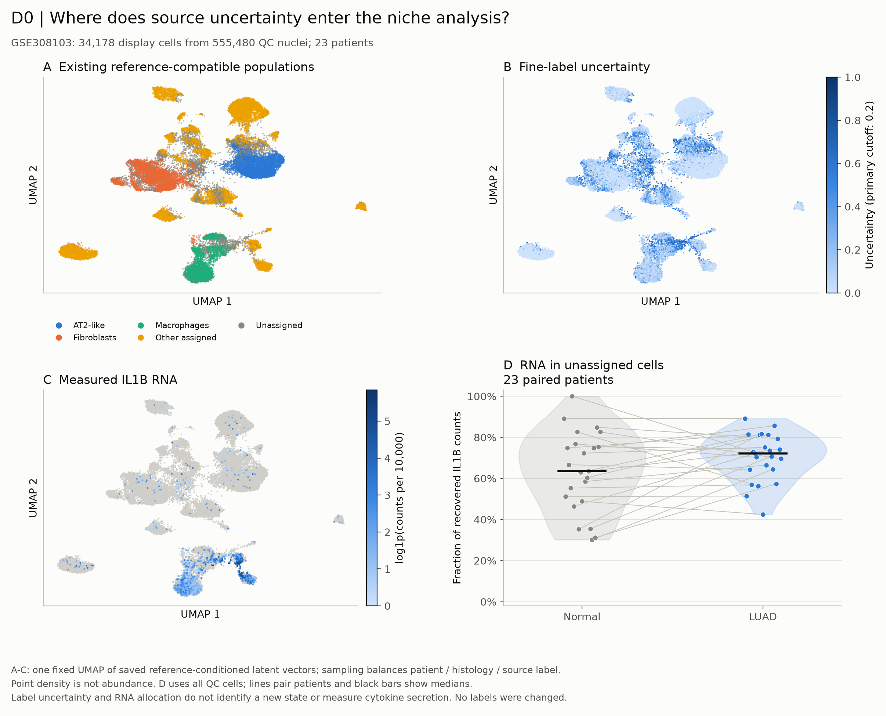

# Derived research questions and proposed figures

24 September 2026; figure package added 25 September 2026.
**Post-analysis exploratory proposal with five generated data figures and one
experimental-design schematic.** New UMAP/PCA diagnostics were computed;
inferential panels reuse completed results. No new hypothesis tests were run.
These questions arise from the completed evidence review.
They supplement the original N1-N5 questions and F01-F07 gallery, without
changing the completed analyses, their thresholds or their conclusions.
They are not claims of literature novelty or retrospectively prespecified tests.

The proposed organizing question is:

> Which macrophage-fibroblast niche features accompany shared epithelial
> plasticity, and which, if any, distinguish neoplasia-associated plasticity
> from non-neoplastic repair and fibrosis?

“Neoplasia-associated” describes tissue context here. The present AT2-like
annotations do not independently identify malignant cells. Persistence,
reversibility and dysplastic fate remain outcomes to measure in additional data.

## Priority and figure overview

New figure identifiers use **D** to keep proposals distinct from the released
F01-F07 gallery. “Replot” means existing results can supply the panel;
“new computation” means a new recorded analysis or embedding is needed;
“new evidence” means the current data cannot supply the intended result.

| Priority | Derived question | Proposed figure | Readiness |
|---|---|---|---|
| Lead: RQ1 | What distinguishes neoplasia-associated epithelial plasticity from a shared injury response? | D1: pseudobulk PCA, paired program violins/contrasts and program heatmap; D0 supplies the reference UMAP | Generated human diagnostic/program figure; independent state validation still needed |
| Core: RQ2 | Does recipient subtype and receptor/inhibitor context explain heterogeneous IL-1-associated responses? | D2a-c: component dot plot, paired expression/compatibility plots, recipient enrichment and ligand-target ranks | Three figures generated from existing results; explanatory association tests would be new |
| Conditional: RQ3 | Do fibroblast inflammatory/recruitment and trophic programs accompany epithelial plasticity beyond the macrophage IL1B measure alone? | D3: donor-aligned niche heatmap, component scatterplots and conditional spatial maps | Existing separate measurements; joint associations require complete-sample eligibility and new analysis |
| Mechanistic follow-up: RQ4 | Does signal withdrawal resolve epithelial plasticity, and does fibroblast IL-1 reception modify that response? | D4: generated experimental-design schematic; future time-course, fate and protein/function plots | Schematic complete; outcome figures require new longitudinal perturbation evidence |
| Enabling question | What accounts for IL1B RNA in cells without confident fine labels? | D0: reference UMAP, uncertainty and IL1B overlays, paired source-fraction violins | Diagnostic figure generated; source identity remains unresolved |

The first package **D0, D1 and D2** is generated and documented in the
[figure report](trials/u7_proposal_figures/REPORT.md). D3 remains conditional
on matched-sample eligibility. D4 is an experimental proposal, shown as a schematic.

## RQ1. Shared plasticity versus neoplasia-associated context

**Question.** Which epithelial programs distinguish lesion-associated AT2-like
cells from repair/fibrotic transitional cells, once the shared HPCS-like
transcriptional component is made explicit?

**Why it follows from the results.** The overlap-reduced HPCS signature rises
in all seven evaluable pooled repair/developmental libraries and all three
eligible IPF donor pairs. It also rises in 19/23 LUAD-versus-normal paired
patients, with mean difference +0.327 log2 CPM. This challenges the specificity
of an elevated score; it does not establish a common cell identity. See the
[completed evidence review](EVIDENCE_REVIEW.md),
[repair comparison](trials/u6_specificity/REPORT.md),
[IPF comparison](trials/u6_ipf_specificity/REPORT.md) and
[human comparison](trials/u6_human_specificity/REPORT.md).

**Working alternatives.** A shared injury/stress program may account for the
overlap; additional epithelial programs may associate with lesion context;
or assay, annotation and sample composition may explain apparent differences.
An extra program is useful only if its association survives independent
evaluation, rather than being defined and tested on the same labels.

**Generated D1:** A, PCA of 70 patient-histology pseudobulks; B, reduced-HPCS
violins for 23 paired patients; C, all seven released paired contrasts;
D, six fixed program differences across 23 LUAD-normal pairs.

**Original panel concepts and optional extensions.** The following design
menu remains broader than the generated figure; dedicated epithelial UMAP
score overlays and gene-component heatmaps have not been generated.

- **A: epithelial UMAP.** Within each cohort, use the same coordinates in
  adjacent panels colored by supported annotation, histology, donor and
  continuous reduced-HPCS/ISR scores. Keep uncertain identities visible.
  No combined repair-to-fibrosis-to-cancer trajectory or cross-cohort distance
  interpretation. This panel localizes heterogeneity; it does not test fate.
- **B: pseudobulk PCA.** Each point is a patient-histology-cell-state aggregate,
  analyzed within cohort and compartment. Show PC variance, patient identity
  and paired normal-lesion connections where verified. Use an unsupervised
  expression-based feature rule, not genes selected for case-control separation.
  PCA is a sample/heterogeneity diagnostic, not a significance test.
- **C: paired program distributions.** Plot individual patient scores and
  paired differences for reduced HPCS and eligible source programs. A violin
  may summarize donor scores where sample size supports a density; retain all
  points. Use dot/slope plots for three IPF pairs and small histology groups.
  Cell-score violins, if added, are descriptive supplements and show donor
  contributions. Do not recalculate a different cell score and present it as
  the released pseudobulk result.
- **D: gene/program heatmap.** Show fixed signature components and overlap
  membership alongside within-study contrasts and measured-gene coverage.
  Separate shared from source-specific members without selecting only positive
  genes. New candidate discriminatory genes remain exploratory and require
  a held-out cohort; no classifier performance claim from these inspected data.

**Decision.** Overlap alone supports a specificity limitation. A defensible
neoplasia-specific extension needs reproducible within-study associations,
independent cell-state validation and validation data not used for selection.
Histology differences are cross-sectional, not a progression time course.

**Reuse now:** [human program figure](figures/human_epithelial_program_specificity.png),
[IPF state figure](figures/ipf_epithelial_state_specificity.png),
[repair/overlap figure](figures/epithelial_specificity_and_signature_overlap.png),
[paired values](trials/u6_human_specificity/paired_program_values.csv).

## RQ2. Recipient context and IL-1 specificity

**Question.** Are differences in fibroblast and epithelial recipient programs
associated with receptor/inhibitor expression and subtype composition, and
how do IL1A/IL1B candidates compare with the frozen alternative ligand families?

**Why it follows from the results.** The canonical macrophage-to-fibroblast
IL1B compatibility contrast is near zero in one IPF cohort and positive in
the other. In human LUAD-versus-normal up-target fits, IL1B ranks 4/10 for
broad fibroblasts and 12/14 for AT2. Different candidate/target backgrounds
make those ranks noncommensurate as effect sizes; they motivate a recipient
question without proving stronger fibroblast signaling or indirect causality.
See [IPF compatibility](trials/u5_ipf_compatibility/REPORT.md) and
[human target fits](trials/u5_human_ligand_targets/REPORT.md).

**Working alternatives.** Changes could originate in ligand RNA, recipient
components, captured subtype mixture, shared inflammation or other ligands.
The current data do not identify which explanation causes cohort disagreement.

**D2 panels.**

- **A: source/recipient dot plot.** IL1A/IL1B in observed sources; IL1R1 and
  IL1RAP in recipients; IL1RN, IL1R2 and SIGIRR in a separate regulatory block.
  Dot size shows the donor-averaged detection fraction and color the
  donor-averaged expression, with eligible n. Keep complex subunits visible.
- **B: paired expression and compatibility plots.** Show patient points or
  donor-score violins with overlaid points for fixed macrophage/fibroblast/
  epithelial labels. Place ligand and receptor component changes beside the
  composite score. Facet independent IPF cohorts; do not connect unpaired
  IPF and control donors. Label omission ranges as robustness, not confidence.
- **C: recipient pathway enrichment dot plot.** Separate fibroblast,
  macrophage and epithelial panels. Include the declared evaluable pathway
  family, with direction, q value, measured set size and sample coverage.
  Show estimated-correlation primary and fixed-0.01 sensitivity side by side.
  The human results are 0/279 versus 148/279 at q<0.05; this model dependence
  is a finding to display, not a reason to hide the primary results.
- **D: ligand-target rank and stability plot.** Compare IL1A/IL1B with eligible
  TGFB1, EGFR-ligand and other prespecified candidates within each receiver's
  fixed comparison. Show candidate denominators, target eligibility and
  omitted-patient rank ranges. An unsigned prior fit is not an activation or
  inhibition measurement. Any ligand-target heatmap must distinguish prior
  weights from observed receiver gene changes.

**Decision.** Look for agreement between within-subtype component changes,
recipient programs and omission stability. RNA agreement remains an
association; NF-kB-like responses and high ligand ranks are not IL-1-specific
causal evidence. The main test includes discordance and ineligible target sets.

**Reuse now:** [human pathway figure](figures/human_paired_recipient_pathways.png),
[human niche figure](figures/human_paired_niche_RNA_contrasts.png),
[target figure](figures/human_ligand_target_eligibility_and_fit.png),
[paired compatibility values](trials/u5_human_niche/primary_compatibility_patient_values.csv).

**Generated RQ2 figures:**

The target figure retains all 32 eligible up-target candidates across the
three broad receivers for LUAD-normal in the focused-triad scope. IL1B does
not pass expression eligibility in the macrophage panel. Full contrast,
direction and sensitivity tables remain available in the original reports.

## RQ3. Fibroblast context and reciprocal niche associations

**Question.** Within eligible patients, do fibroblast recruitment/inflammatory,
matrix and trophic programs associate with epithelial plasticity, and do these
associations differ from those involving macrophage IL1B RNA alone?

This is a new, conditional association question inspired by the heterogeneous
IL-1 results and the Body notes. A reciprocal or fibroblast-mediated mechanism
has not been established by the completed analysis.

**D3 panels.**

- **A: matched-patient heatmap.** Align macrophage IL1B, recipient components,
  fibroblast inflammatory/matrix/trophic programs, eligible CCL2/CCR2 and
  CXCL12/CXCR4 compatibility, and epithelial program scores. Rows are verified
  patient-histology observations; mark missing compartments instead of filling
  them with zero. Separate captured cell fractions from within-state RNA.
- **B: donor-level scatterplots.** Use matched within-patient lesion-normal
  changes where available; show every patient and omission sensitivity.
  Freeze a small set of associations and their multiplicity family before
  fitting. Repeated histologies cannot supply independent patient n.
  “Beyond IL1B” requires an eligible, parsimonious joint model; marginal
  correlations alone cannot establish added explanatory information.
- **C: spatial extension.** Reuse measured human maps as descriptive context.
  Regional enrichment and neighborhood summaries wait for independent
  pathology regions and a suitable patient-level spatial null. Transcript
  hotspots cannot define and then validate their own regions. Mixed spots
  do not identify direct cell contact, and companion assays are not replication.

**Eligibility and decision.** Count complete triads before estimating joint
associations. Existing IPF triad counts (six and three donors) do not reach the
project's ten-unit joint-association floor. Human eligibility must be audited
for the exact variables and paired contrast; 23 cohort patients does not mean
23 complete triads. A floor is not a power guarantee. Weak coverage produces
a coverage panel, not a mediation fit. Replicated association would prioritize
a functional test; it would not demonstrate a feedback loop.

**Reuse now:** [human niche report](trials/u5_human_niche/REPORT.md),
[spatial report](trials/u5_spatial_context/REPORT.md),
[measured maps](figures/human_spatial_measured_maps.png).

## RQ4. Resolution versus persistence after signal withdrawal

**Question.** Does transient versus sustained IL-1beta exposure produce
different recovery after withdrawal, and does fibroblast IL-1 reception modify
epithelial recovery independently of direct epithelial reception?

**Why it matters.** Shared RNA programs cannot distinguish reversible repair
from persistent dysfunction. The current mouse arm lacks the author KAC
classifier and does not supply the required withdrawal/lineage experiment.
This is a mechanistic follow-up, not a claim derived directly from RNA ranks.

**D4 panels, requiring new evidence.**

The experimental layout is now drawn below; outcome panels B-D still require
new data. No anticipated response curve is presented as a result.

- **A: experimental schematic.** Define transient/sustained exposure and
  withdrawal, with epithelial-only and stromal-containing systems and
  recipient-specific IL1R1 perturbations. Add a macrophage-source arm only
  if separating source effects is an explicit experimental aim. Freeze
  endpoints, contrasts and biological replication before acquisition.
- **B: longitudinal response plots.** Epithelial plasticity and mature-state
  recovery alongside fibroblast responses, with independent culture/animal
  replicates and time-matched controls. Connect repeated measures only when
  the same unit was actually measured repeatedly.
- **C: fate and function.** Replicate-level mature-cell yield, viability,
  organoid function and lineage outcomes; show individual replicates rather
  than treating cells or organoids from one preparation as independent animals.
- **D: protein and target engagement.** Measured mature cytokine release and
  recipient response establish exposure/perturbation context. RNA alone cannot
  measure blockade efficacy, biochemical ISR activation or irreversible fate.

**Decision.** Evidence for fibroblast dependence requires an epithelial outcome
change under a fibroblast-specific intervention with appropriate controls.
Persistence after withdrawal requires observation after withdrawal. Neither
result, on its own, establishes malignant transformation.

## D0. Resolve source uncertainty before strong macrophage claims

**Enabling question.** Do IL1B-expressing cells without confident fine labels
represent coherent cell states, mixed profiles or measurement background?

Unassigned cells carry median IL1B count fractions of 52-72% across human
histologies. This is recovered RNA, not a fraction of tissue cytokine secretion.
Cross-lineage RNA also remains substantial in the mapped populations. See the
[annotation review](trials/u5_human_full/ANNOTATION_REVIEW.md) and
[source report](trials/u5_human_sources/REPORT.md).

The generated D0 figure uses 34,178 display cells with a 75-cell cap per
patient/histology/source label, while quantitative source fractions use all
QC cells. The same UMAP coordinates show existing labels, uncertainty and
IL1B RNA; paired source-fraction violins show 23 normal-LUAD patient pairs.

Further annotation-review options: an all-QC UMAP colored by broad identity, confidence,
donor, histology and IL1B; a multi-marker dot plot; QC/confidence violin plots
with donor summaries; and stacked per-patient IL1B count fractions retaining
the unassigned category. Use assay-appropriate background/mixed-profile checks
and independent marker support. A separate UMAP cluster or a relaxed confidence
cutoff does not establish a new macrophage state. Keep original annotations
and any reviewed alternative labels as separately versioned results.

## Common analysis and figure rules

1. **Biological units remain visible.** Cells describe heterogeneity; donors,
   patients or animals support inference. Preserve paired designs. Pooled
   wells/sort gates do not become independent mice. This is consistent with
   the biological-replicate analysis evaluated by
   [Squair et al.](https://www.nature.com/articles/s41467-021-25960-2).
2. **UMAP and PCA need their own reproducible inputs.** Reuse validated
   embeddings where present; otherwise record feature selection, normalization,
   dimensions, neighbors, seed and any display-only donor-balanced sampling.
   Use identical coordinates for overlays and include donor/batch diagnostics.
   Do not optimize embeddings to separate histologies. Statistical summaries
   use all eligible observations, not the display subsample.
3. **Enrichment plots must match the method.** CAMERA returns set size,
   direction and P/FDR values, not a GSEA normalized enrichment score
   ([official limma manual](https://bioconductor.org/packages/release/bioc/manuals/limma/man/limma.pdf)).
   Running-score GSEA curves would require a separately specified exploratory
   analysis and would not replace the completed primary analysis. Current
   primary and sensitivity labels remain unchanged.
4. **Small n stays visible.** Prefer paired points to a smooth violin with
   three donors. No cell-level significance stars as patient-level evidence,
   no inferred confidence intervals from omission ranges, and no pooling of
   distinct studies into a common quantitative trajectory.
5. **Render from saved tables.** New embeddings/models are separate computation
   stages. Each released figure needs its plotted table, input hashes,
   generating script, run record, sample counts and visual review. Use the
   repository palette and PNG/SVG exports under this paper's `figures/` folder.
   The main repository README stays a navigation page.

The original 17 figures remain unchanged. The six new figures add display
geometry, existing quantitative evidence and one experimental schematic.
Source-label review and causal/spatial claims still need additional evidence.
Freeze any new analysis specification before testing these exploratory RQs.
