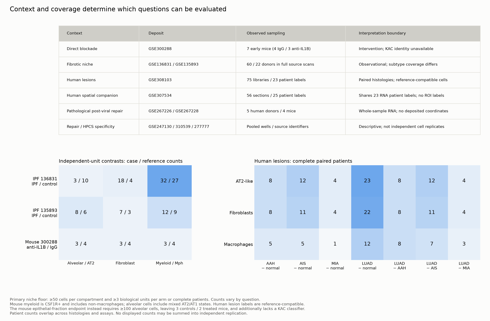
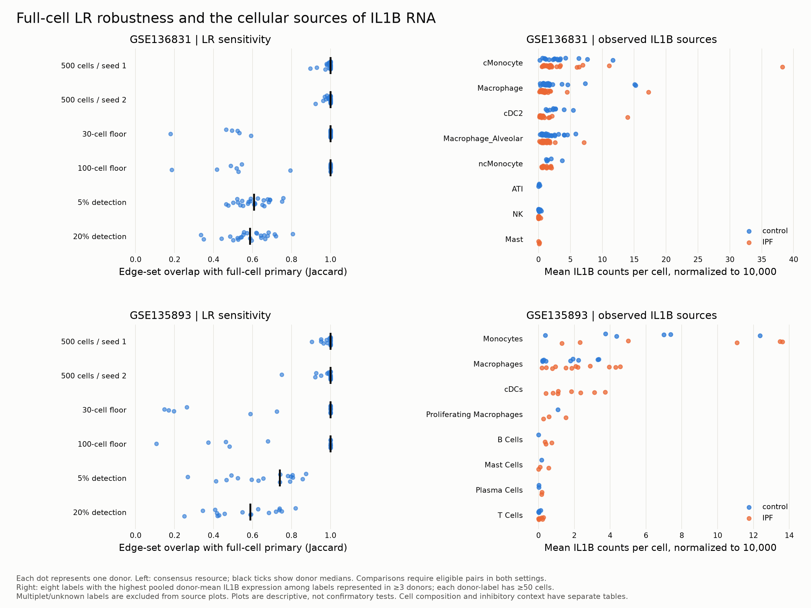
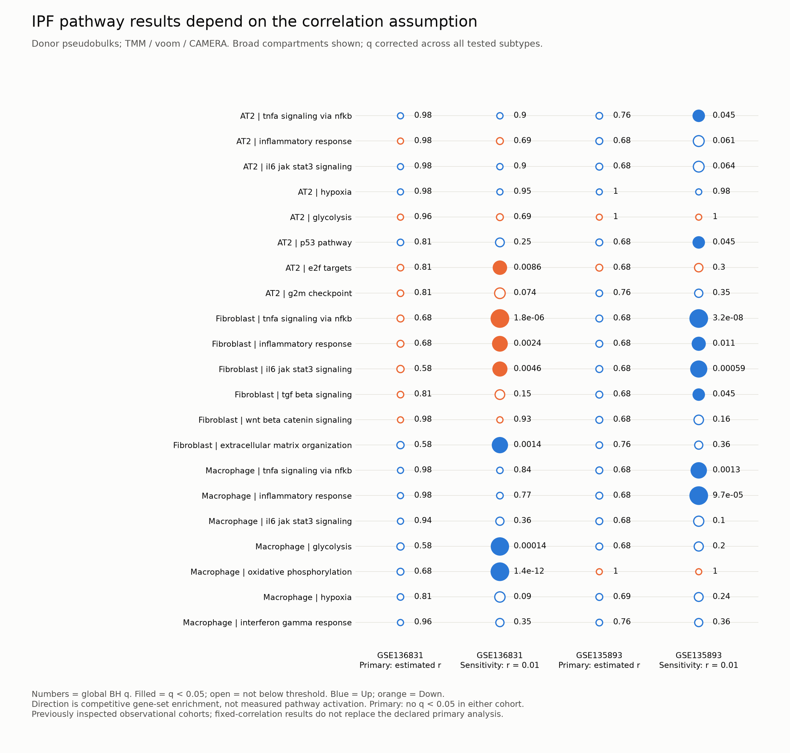
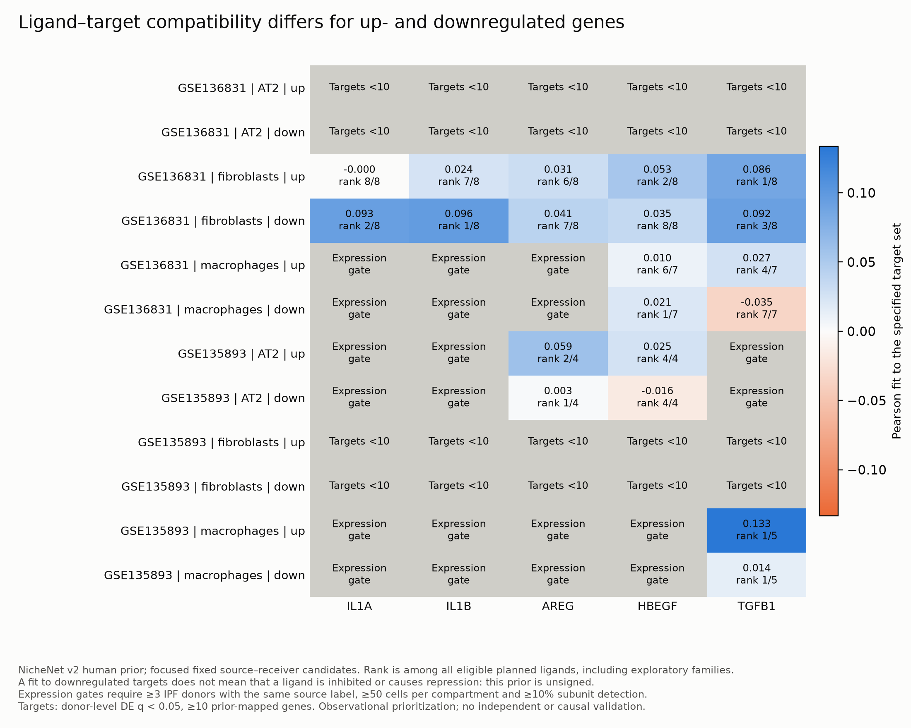
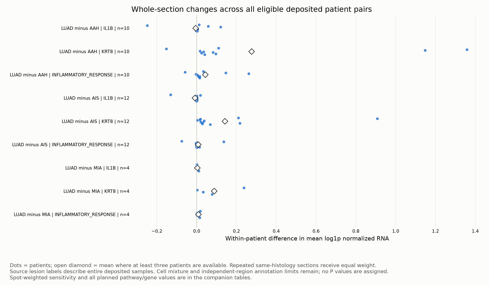
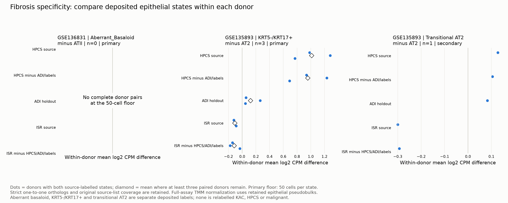
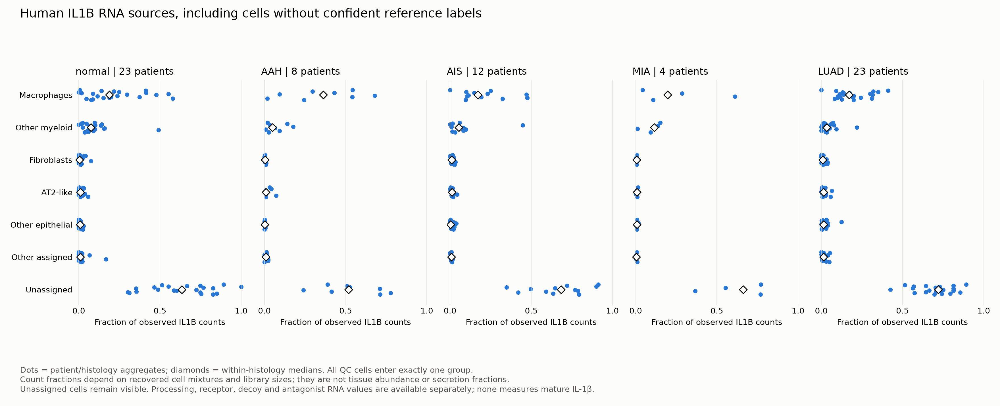
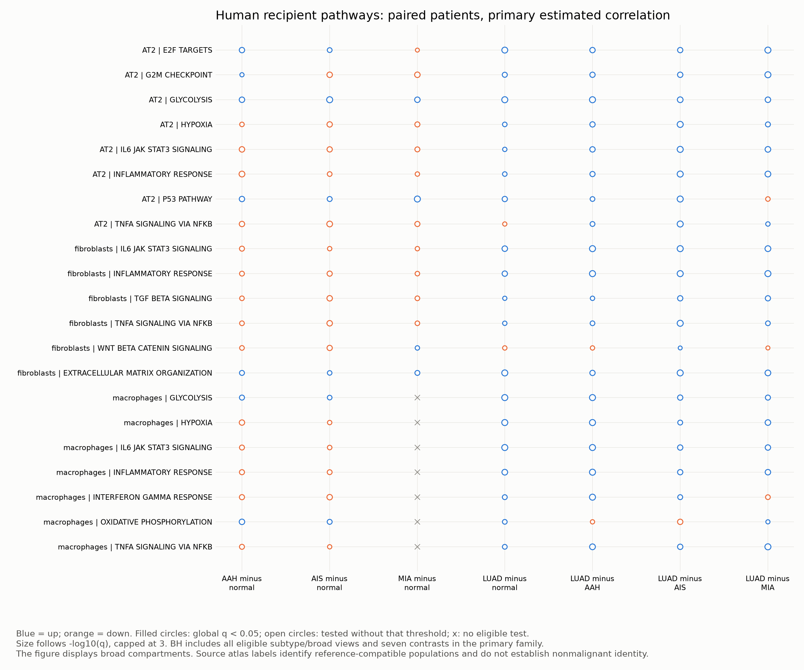
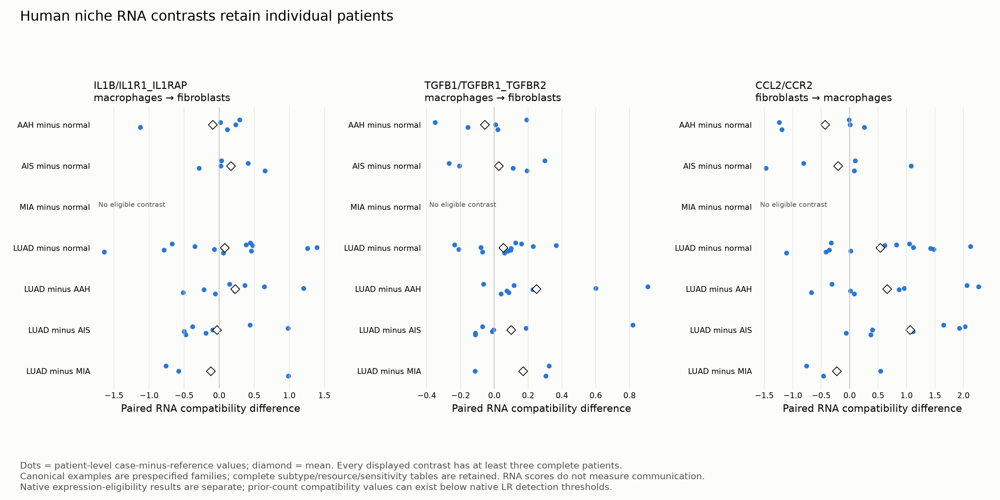

# Yu, Lee, Choi_Min and Choi 2026: IL-1beta and stem-cell plasticity

**IL-1beta signaling as a molecular arbiter of stem cell plasticity:
orchestrating the niches of repair, fibrosis, and cancer.** Sua Yu, Seo Hyeon
Lee, Min Seo Choi and Jinwook Choi. *Seminars in Immunology* 83, 102050.
[DOI](https://doi.org/10.1016/j.smim.2026.102050).

This is branch **2C, item 3**, corresponding to stable roadmap paper **13**.
The folder name follows the owner's instruction of 24 September 2026; the
stable paper number remains 13 in the existing roadmap. The owner has read
the review. The synthesis and proposed analyses below are assistant-authored
and remain open to revision.

**Execution status: feasible analyses complete; evidence ready for joint review.**
The completed run includes both IPF cohorts, eligible early mouse niches,
all 75 human lesion libraries, 56 human spatial sections, nine post-viral
matrices, and the source-program specificity extensions.
Read the [evidence review](EVIDENCE_REVIEW.md) and
[completion register](WORK_PACKAGES.md) for findings, sensitivities and
questions that remain unidentifiable. No criterion was relaxed after
viewing results. The [initial report](INITIAL_RUN_REPORT.md) preserves
the first batch; it is not the current whole-run status.

## Read and review

| Artifact | Purpose |
|---|---|
| [Completed evidence review](EVIDENCE_REVIEW.md) | Cross-context findings and limits for interpretation review |
| [Derived research questions and proposed figures](DERIVED_RESEARCH_QUESTIONS.md) | Post-analysis RQs with UMAP, PCA, violin, enrichment and niche-panel plans; existing results versus new computations/evidence |
| [Evaluation rules](EVALUATION_RULES.md) | Distinguish null, undercovered, unidentifiable and unmeasured questions |
| [Reproducibility](REPRODUCIBILITY.md) | Runtime, stage dependencies, provenance and preserved corrections |
| [Analysis pipeline plan](ANALYSIS_TRIAL_PLAN.md) | Research questions, estimands, stages, controls, decision gates and outputs |
| [Context-specific niche analyses](NICHE_ANALYSIS_PLAN.md) | Required macrophage/fibroblast ligand-receptor and pathway analyses; Body-note context distinctions and conditional ligand-target extension |
| [Public-data shortlist](DATASETS.md) | Ranked new deposits, existing-data roles, unresolved access and design issues |
| [Source and annotation synthesis](SOURCE_SYNTHESIS.md) | What the annotations emphasize, what primary evidence supports, and what remains a hypothesis |
| [Machine-readable dataset manifest](dataset_candidates.json) | Source links, roles, dependencies and release gates |
| [Proposed analysis contract](analysis_contract.json) | Review status, primary estimand, proposed floors and execution boundary |
| [Niche analysis contract](niche_analysis_contract.json) | Context axes, LR/pathway/target methods, eligibility and multiplicity families |
| [Preparation report](trials/PREPARATION_REPORT.md) | What actually ran and what it established |
| [Initial analysis report](INITIAL_RUN_REPORT.md) | Completed modules, null/sensitivity results, remaining gates and execution evidence |
| [Continuation and completion register](WORK_PACKAGES.md) | Completed work packages, active analyses and precise remaining gates |
| [Figure gallery plan](FIGURE_GALLERY_PLAN.md) | Seven figure groups, supporting diagnostics, panel specifications and release criteria |
| [Sample inventory](trials/u0_geo_design_audit/sample_inventory.csv) | All 371 deposited sample records; these are not 371 independent animals or donors |

## Proposed research focus

> Which macrophage-fibroblast-epithelial circuits and recipient programmes
> distinguish supportive from persistent pathological niches, and how does
> their response to IL-1beta blockade relate to epithelial state balance?

Version 3 retains ligand-receptor inference and macrophage/fibroblast pathway
enrichment required analysis arms. It follows the Body notes' distinctions
between source/recipient cells, repair routes, niche mechanics, age/history,
fibrosis and distinct cancer contexts. RNA can test selected associations;
stiffness, secretion, cellular origin and functional suppression require
additional measurements. Cross-organ examples remain labelled hypotheses.

The review supplies the organizing hypothesis. Primary studies supply the
experiments, signatures and data. Persistent injury, dysplastic epithelial
repair, fibrosis and malignancy remain distinct outcomes. KRT8 expression
alone cannot assign any of them.

The first proposed biological dataset is **GSE300288**, which includes direct
anti-IL-1beta treatment. The strongest human extension is **GSE308103**, with
candidate within-patient normal/precursor/LUAD contrasts, followed by its
spatial companion **GSE307534**. These are complementary assays from the same
study and partly the same patients, not independent replication cohorts.
The post-injury spatial series **GSE267226/GSE267228** supplies a different
context, but its deposited mouse intervention is anti-CD8, not anti-IL-1beta.
See [the shortlist](DATASETS.md) for the evidence and limitations.

## Relationship to the existing repository

Existing Choi, Cardoso and England trials remain in their source-paper folders.
This branch references their outputs rather than moving or rerunning them.
The [epithelial specificity project](../epithelial_state_specificity/README.md)
provides traceable state definitions and known limitations. The
[outcome-linked dataset gate](../../docs/NEXT_DATASET_GATE.md) remains an
independent route for organoid growth outcomes; it is not replaced by this plan.

The review does not supply a new experimental dataset or a result to reproduce
as a single analysis. This branch evaluates its proposed links across public
primary studies, including situations that could contradict the unified model.

## Figure gallery

The [gallery plan](FIGURE_GALLERY_PLAN.md) orders figures by the research
questions. Only generated, checked figures are embedded below; planned
figures remain listed with their analysis dependencies.

The [derived-RQ figure proposal](DERIVED_RESEARCH_QUESTIONS.md) adds a proposed
D0-D4 sequence grounded in the completed findings. These new panels have not
been run or added to the released gallery.

| Figure group | Current gallery status |
|---|---|
| F01 Context, design and cell coverage | Completed design and biological-unit coverage figure |
| F02 Sources, recipients and inhibitory context | Completed IPF and all-QC human sources; receptor/inhibitor tables retain assay limits |
| F03 Directional ligand-receptor results | Completed IPF, mouse and paired human RNA compatibility with native LR sensitivities |
| F04 Recipient pathways | Completed IPF, mouse and paired human pathways; eligible IPF/human ligand targets |
| F05 Mouse blockade and epithelial state balance | Early niche measurements complete; KAC identity and primary phenotype remain unidentifiable |
| F06 Human lesion and spatial context | All human libraries and spatial/context matrices processed; independent ROI and post-viral coordinates unavailable |
| F07 Cross-context evidence synthesis | Completed specificity panels and evidence matrix; interpretation review ready |

### F01: context, design and biological-unit coverage

Counts preserve animals, donors and paired patients; companion assays and
repeated histologies do not add independent replication.
[Design table](trials/u6_completion/context_design_map.csv) ·
[generating script](trials/u6_report_context_coverage.py).

### F02/F03: full-cell LR robustness and IL1B sources

Both cohorts, individual donors, observed sources and one-at-a-time sensitivity
checks. These are RNA measurements, not cytokine secretion or activation.
[Report and plotted tables](trials/u5_liana_robustness/REPORT.md) ·
[generating script](trials/u5_report_liana_robustness.py) ·
[GSE136831 run](trials/u5_liana_robustness/GSE136831/run_record.json) ·
[GSE135893 run](trials/u5_liana_robustness/GSE135893/run_record.json).

### F03: donor-level RNA-compatibility contrasts

Points are donor-mean IPF/control contrasts. Lines are leave-one-donor-out
ranges, not confidence intervals. All 277 eligible primary contrasts were
checked; the displayed canonical examples do not replace the complete tables.
[Report and plotted values](trials/u5_ipf_compatibility/REPORT.md) ·
[generating script](trials/u5_report_compatibility.py) ·
[run record](trials/u5_ipf_compatibility/run_record.json).

### F04: initial IPF pathway results

Primary estimated-correlation and fixed-correlation sensitivity results for
the declared broad-compartment pathways. Filled points indicate global
q < 0.05 within the corresponding cohort and analysis family. See the
[initial report](INITIAL_RUN_REPORT.md) for eligibility and interpretation;
neither cohort has a primary pathway passing this threshold.

### F04 extension: eligible ligand-target prioritization

Source-supported candidates are ranked against upregulated and downregulated
receiver targets separately. The unsigned prior cannot establish ligand
activation, inhibition or causal repression. Missing panels retain their
target or expression eligibility reason.
[Report and plotted values](trials/u5_ligand_targets/REPORT.md) ·
[generating script](trials/u5_report_ligand_targets.py) ·
[GSE136831 refits](trials/u5_ligand_targets/GSE136831/run_record.json) ·
[GSE135893 refits](trials/u5_ligand_targets/GSE135893/run_record.json).

### F05: early mouse niche and phenotype eligibility

Individual animal cell counts and descriptive treatment contrasts. At the
primary alveolar floor, three IgG and two treated animals remain; public KAC
annotations are unavailable. Broad myeloid and alveolar labels retain their
documented identity limits. No primary pathway passes q < 0.05.
[Report and plotted values](trials/u4_mouse_niche/REPORT.md) ·
[generating script](trials/u4_report_mouse_niche.py) ·
[validation](trials/u4_mouse_niche/validation.json).

### F07 component: epithelial specificity across contexts

Each dot is a source identifier or pooled library. The HPCS signature also
increases in operational repair/developmental groups, including after ADI
overlap and operational markers are removed. Signature overlap does not
establish a common state or malignant identity. Author HPCS labels and their
signature are coupled, so the author comparison is a consistency check.
[Report and complete values](trials/u6_specificity/REPORT.md) ·
[generating script](trials/u6_report_specificity.py).

### F07 component: source-defined ISR specificity

The full ISR signature and the signature excluding HPCS/ADI/label genes
can give different directions within the same comparison. Points retain
their source unit and context. This is RNA-program specificity, not a
measurement of biochemical ISR activity.
[Report and values](trials/u6_isr_extension/REPORT.md) ·
[generating script](trials/u6_report_isr.py).

### F06: spatial maps and paired whole-section context

The first deposited patient pair is displayed with shared gene-specific
scales. All 56 human sections were processed. These are mixed tissue spots,
without independently released pathology-region labels.

Dots retain individual patients; repeated same-histology sections are
averaged within patients. The RNA and spatial companions overlap in all
23 RNA patient labels and do not provide independent cohort replication.
The nine post-viral matrices have individual expression summaries but lack
deposited coordinates for neighborhood inference.
[Report, source audit and complete values](trials/u5_spatial_context/REPORT.md) ·
[generating script](trials/u5_report_spatial_context.py).

### F07 component: fibrosis epithelial-state specificity

Three paired GSE135893 donors support the primary KRT5-/KRT17+ versus AT2
descriptive comparison. GSE136831 has no paired donors at the primary floor;
its empty panel represents missing coverage, not zero difference. Source
states remain distinct from KAC, HPCS and malignant identities.
[Report and all sensitivities](trials/u6_ipf_specificity/REPORT.md) ·
[generating script](trials/u6_report_ipf_specificity.py).

### F02 extension: human IL1B sources

All QC cells remain in the source scan. Unassigned fine labels carry median
IL1B count fractions of 52–72% across histologies. Confident-subtype results
therefore cannot establish the dominant source across all recovered cells.
[Report and tables](trials/u5_human_sources/REPORT.md) ·
[generating script](trials/u5_report_human_sources.py).

### F04/F06: paired human pathways and RNA niches

Individual patients remain the unit of comparison. Filled pathway symbols
indicate the declared primary global q<0.05 criterion; RNA compatibility
points are descriptive and do not establish communication.
[Report and all sensitivities](trials/u5_human_niche/REPORT.md) ·
[annotation review](trials/u5_human_full/ANNOTATION_REVIEW.md) ·
[generating script](trials/u5_report_human_niche.py).

### F04 extension: paired human ligand targets

Target eligibility precedes source/receiver expression filtering and ranking.
An unsigned-prior fit to downregulated targets does not establish inhibition.
[Report and omission stability](trials/u5_human_ligand_targets/REPORT.md) ·
[generating script](trials/u5_report_human_ligand_targets.py).

### F07 component: human epithelial programs

Paired source-program changes in reference-compatible AT2-like populations
remain distinct from source-defined KAC/HPCS identity and malignant status.
[Report and sensitivities](trials/u6_human_specificity/REPORT.md) ·
[generating script](trials/u6_report_human_specificity.py).

### F07: cross-context evidence for review

[Evidence review](EVIDENCE_REVIEW.md) ·
[complete table](trials/u6_completion/evidence_matrix.csv) ·
[generating script](trials/u6_summarize_evidence.py).

## Layout and execution boundary

`trials/` contains specifications, scripts and compact preparation outputs.
`cache/` is ignored and holds downloaded metadata, count examples and the
private annotation snapshot. Copyrighted papers, full private notes, large
matrices and personal planning are not tracked. Raw inputs elsewhere in the
repository were not changed.

The [reproduction guide](REPRODUCIBILITY.md) indexes the completed stages.
The [release checks](trials/u6_completion/release_validation.json) bind
validated stages, figure reviews and released file hashes. Unidentifiable
endpoints remain explicit in the analysis contracts and evidence register.
