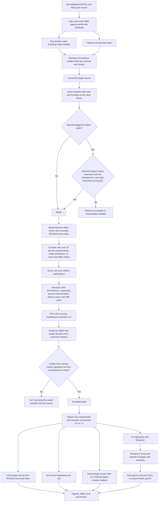
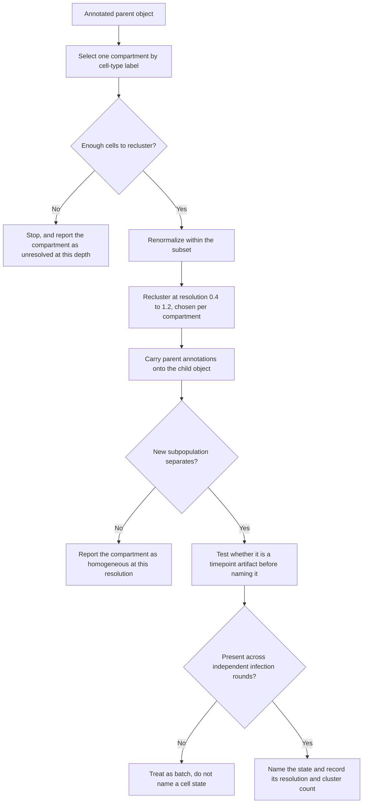
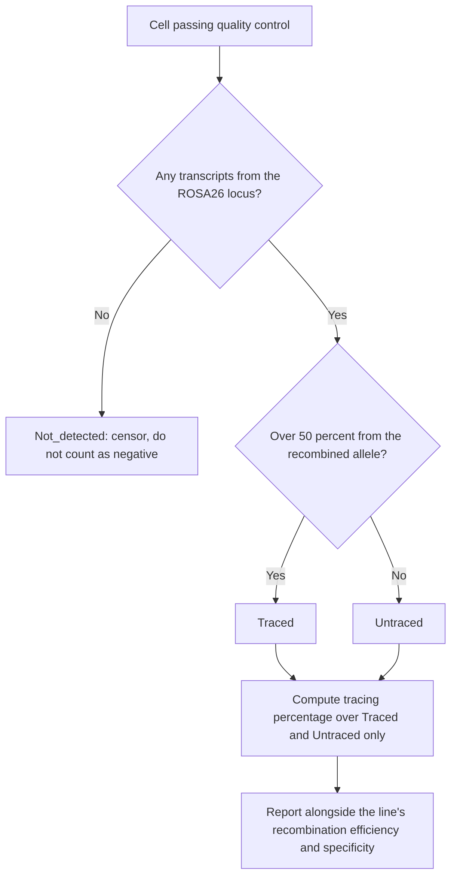

# End-to-end scRNA-seq Workflow

Operational sequence for the analysis of longitudinal lung regeneration after
influenza injury, following Niethamer et al., *Cell Stem Cell* 2025
([doi:10.1016/j.stem.2024.12.002](https://doi.org/10.1016/j.stem.2024.12.002)).

Per-tool schematics live in [`docs/`](docs/README.md). The annotated pipeline
reference, including parameters the paper leaves unspecified, is
[`docs/scRNAseq_workflow_Niethamer2025.md`](docs/scRNAseq_workflow_Niethamer2025.md).

> **This document describes the reference study's workflow, not the analysis in
> this repository.** The analysis that was actually executed is a Python/scanpy
> pipeline that follows this sequence only in part — it performs no ambient-RNA
> correction, uses one doublet caller rather than two, and uses PAGA plus
> diffusion pseudotime instead of Slingshot; no formal trajectory-DE model was
> fitted. See **[`docs/PIPELINE_AS_RUN.md`](docs/PIPELINE_AS_RUN.md)** for
> what was really run, stage by stage, and where it diverges from the paper.

---

## Toolbox

Six tools, each owning one decision the others cannot make.

| Stage | Tool | Owns | Schematic |
|---|---|---|---|
| Alignment | STARsolo 2.7.9a | Barcode, UMI, and gene assignment against mm39 | — |
| Ambient RNA | SoupX 1.6.0 | How much of each count is cell-free background | [`docs/SOUPX.md`](docs/SOUPX.md) |
| Doublets | Scrublet | Whether a barcode looks like a simulated cell pair | [`docs/SCRUBLET.md`](docs/SCRUBLET.md) |
| Doublets | scds | Whether a barcode co-expresses genes that rarely co-occur | [`docs/SCDS.md`](docs/SCDS.md) |
| Cell state | Seurat 4.9 | Normalization, clustering, annotation, marker DE | — |
| Trajectory | Slingshot | Lineage topology and pseudotime ordering | [`docs/SLINGSHOT.md`](docs/SLINGSHOT.md) |
| Trajectory DE | tradeSeq | Which genes change, and in what sense | [`docs/TRADESEQ.md`](docs/TRADESEQ.md) |

Neither doublet caller supersedes the other. scds scores co-expression on
binarized counts; Scrublet scores neighbourhood composition against simulated
doublets. They fail differently, which is the reason for running both.

---

## Ordering constraints

Three orderings are load-bearing. Violating any of them produces a pipeline
that runs to completion and returns wrong answers.

1. **Ambient correction precedes doublet calling.** Cell-free RNA creates
   apparent mixed-lineage expression, which is the exact signal both doublet
   callers key on. Correcting afterwards cannot recover over-called cells.
2. **Both run per library, before merging.** The ambient profile belongs to one
   10x channel and the expected doublet rate belongs to one channel's loading
   density. Pooling first destroys both quantities.
3. **Doublet calling precedes count-based filtering.** Doublets sit in the high
   `nFeature` tail. Trimming that tail first discards the evidence.

---

## End-to-end sequence

---

## Subset and recluster

Every biological result in the reference study comes from the same move. The
injury-induced capillary endothelial state does not separate in the full
123,189-cell clustering; it appears only when capillary endothelium is subset
and reclustered alone. Treat this as the method, not as refinement.

Compartments reclustered in the reference study, and what each resolved:

| Subset | Resolved into |
|---|---|
| Myeloid | `iMON_a`, `iMON_b`, `aMAC_a`, `aMAC_b`, `iMAC`, cDC, pDC, neutrophils |
| Alveolar epithelium | `AT2_a`–`AT2_d`, alveolar transitional, `AT1_AT2`, `AT1_a`–`AT1_c` |
| T and NK lymphocytes | CD8 tissue-resident memory identified |
| Capillary endothelium | `CAP1_a`–`CAP1_d`, `iCAP_a`–`iCAP_c`, `CAP2` |

---

## Lineage-trace calling

Tracing is read from transcripts over the 871 bp region overlapping the 3× SV40
polyA or the 1 kb region overlapping the bGH polyA downstream of tdTomato. Both
were chosen for sequencing depth.

The three-way call is what makes tracing quantitative. Cells with no evidence
are censored rather than scored as untraced. Report percentages with the
line's efficiency and specificity, because those differ per allele:
Car4CreERT2 50.6 percent efficient and 74.6 percent specific;
EdnrbCreERT2 50.1 percent and 91.2 percent.

---

## Quality control acceptance order

In the reference study's workflow, these gates are applied in this order; each
assumes the previous one has run. This is not a checklist of steps completed by
the independent scanpy analysis in this repository.

1. Ambient RNA corrected per channel, with the estimated contamination fraction
   recorded for every library.
2. Doublet scores computed by both callers on the uncorrected feature
   distribution, with the combination rule declared in advance.
3. Cell-level filters: 15 percent mitochondrial ceiling, 50-feature floor,
   MAD-based feature ceiling. State the MAD formulation and whether it was
   computed per library or pooled.
4. Cluster-level culling for absent marker signature, multi-compartment
   markers, or out-of-scope rare types. Record every cluster removed.
5. Confirm that no named cell state is confined to a single library or a single
   infection round.

The 50-feature floor is unusually permissive and deliberately so: stressed,
low-RNA cells are part of the biology in the first week after infection. The
cost is paid at step 4, where clusters near that floor are culled for lacking a
marker signature.

---

## Statistical unit

The biological replicate is the **mouse**, not the cell and not the library.
The reference atlas is one library per mouse, so library and mouse coincide
there; this will not hold for multiplexed designs.

The atlas is unbalanced by construction. Four tamoxifen cohorts converge on the
42 dpi harvest, giving that timepoint four times the library count of 6 dpi.
Any aggregation across timepoints is dominated by 42 dpi unless weighted or
downsampled.

---

## Known gaps in the reference study

Carried here so they are not rediscovered. The annotated reference lists all
twelve.

- Number of principal components, UMAP hyperparameters, and highly variable
  gene count are not reported.
- No integration or batch correction was applied, although the atlas spans
  three separate influenza infection rounds.
- Doublet score cutoffs and the rule combining the two callers are not stated.
- `FindMarkers` test and thresholds are not stated; the Seurat default is
  Wilcoxon.
- Slingshot reduction and dimension count, and the `fitGAM` knot count, are not
  stated.
- Pseudotime was rescaled linearly to 0–1. That is a plotting convenience, not
  a correction making lineages comparable. See
  [`docs/TRADESEQ.md`](docs/TRADESEQ.md).

Confirmed absent, so do not search for them: RNA velocity, bleomycin injury,
CellRanger, reads per cell, and per-timepoint cell recovery counts.
