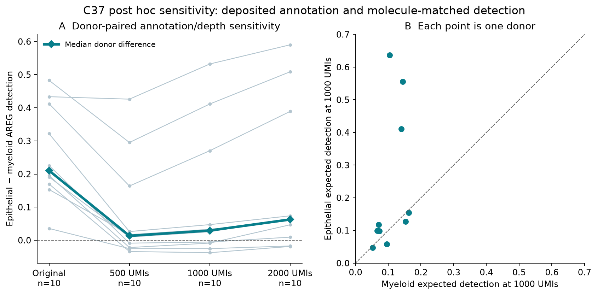
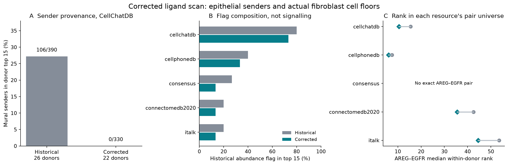

# Completed ligand corrections

These results are a post-audit correction and sensitivity analysis in the same
datasets. They preserve historical trials and do not constitute independent
validation. The prospective specification for this pass is
[specification.json](specification.json); execution and limitations are in
[README.md](README.md).

## C37: annotation survives, RNA-depth robustness does not

The raw UMI pass read **29,634 genes across 208,506 cells**, retaining the
**16,064 annotated tumour epithelial/myeloid cells** relevant to this comparison.
Their original cached AREG detection and raw-count detection agree exactly.

| Measurement | Paired donors | Epithelial median | Myeloid median | Median paired difference | Epithelial higher | Two-sided paired p |
|---|---:|---:|---:|---:|---:|---:|
| Original, deposited major labels | 10 | 0.45908 | 0.27146 | 0.21029 | 10/10 | 0.001953 |
| Expected detection at 500 UMIs | 10 | 0.07249 | 0.06252 | 0.01335 | 6/10 | 0.322266 |
| **Primary sensitivity: 1,000 UMIs** | **10** | **0.12237** | **0.09995** | **0.02933** | **6/10** | **0.130859** |
| Expected detection at 2,000 UMIs | 10 | 0.18856 | 0.14711 | 0.06266 | 8/10 | 0.019531 |

No cells are excluded at either 500 or 1,000 UMIs, so the primary attenuation is
not a cell-retention effect. The 2,000-UMI sensitivity excludes 1,188 cells, while
retaining the same ten paired donors. These are correlated post hoc sensitivity
tests, not three independent confirmations. The primary budget was specified
before the raw-depth results were calculated; the significant higher-budget
result must be reported alongside it, not substituted for it.

Among the ten paired donors, the median of the donor median UMI totals is
10,174 in epithelium and 7,806.5 in myeloid cells. RNA content and technical
sampling both contribute to total UMIs. Molecule-matched detection changes the
estimand; it does not prove that the unadjusted difference is purely technical,
nor does a nonsignificant primary sensitivity prove equal biological production.

**Recommended C37 status:** Descriptive only, with a measurement-dependent
source comparison. **Proposed claim:** “In this LUAD cohort, deposited-label
epithelial AREG detection exceeds myeloid detection in all ten paired donors
before molecule matching (0.459 versus 0.271; p=0.00195). At the specified
1,000-UMI sensitivity, the median paired difference is 0.029, six of ten donors
remain positive, and p=0.131; a depth-independent epithelial hierarchy is not
established.” The original marker-gate result remains the historical calculation,
but its mislabeled gate cannot support a lineage-specific validation claim.

Evidence: [donor table](results/c37/per_donor.csv),
[summary](results/c37/summary.json), [run record](results/c37/run_record.json).

## C12/C14: corrected source scope, persistent resource dependence

The corrected scans use **22 donors**, with an explicit deposited epithelial
source allowlist and Fibroblast/Myofibroblast targets. The deposited Epithelial
category includes Mesothelial; this is still a broad epithelial comparison,
not an alveolar-only one. All scored groups also retain the ten-cell subtype
floor. After that filter, the smallest scored epithelial and fibroblast
compartments contain 65 and 52 cells, respectively.

| Resource | Retained molecular pairs | Historical abundance flag, top 15 | Corrected first pair | AREG median rank | Exact-EGFR ligand order |
|---|---:|---:|---|---:|---|
| CellChatDB | 312 | 11/15 | FN1–CD44 | 10.5 | AREG, HBEGF, EREG, TGFA, BTC |
| CellPhoneDB | 208 | 5/15 | APP–CD74 | 6.0 | AREG, BTC, EREG |
| Consensus | 768 | 2/15 | FGF14–FGFR1 | — | None meets coverage for the canonical exact-EGFR shortlist |
| ConnectomeDB2020 | 386 | 2/15 | HSP90AA1–EGFR | 35.5 | AREG, HBEGF, EREG, BTC, TGFA |
| iTALK | 518 | 2/15 | FGF14–FGFR1 | 44.5 | AREG, HBEGF, EREG, BTC, TGFA |

Corrected CellChatDB has **zero mural senders in 330 donor top-15 positions**,
versus 106/390 historically. It still has **ten CD44 pairs in its aggregated top
15**, so the matrix-associated composition does not disappear after the scope
correction. AREG–EGFR is joint seventh by median rank (10.5, tied with LAMC1–CD44),
versus median rank 15.5 historically. HBEGF–EGFR has median rank 41.0.

CellChatDB shares zero corrected top-15 pairs with iTALK and three with
CellPhoneDB. Consensus, ConnectomeDB2020 and iTALK have pairwise Jaccard indices
0.50, 0.579 and 0.429. Candidate-list dependence therefore remains, within the
corrected scope. This does not demonstrate that a high-scoring pair is functional.

AREG is still first among the retained canonical exact-EGFR pairs in all four
resources containing them. **The full lower-ligand order is no longer identical
in three resources.** Holding a receptor and expression-scoring method fixed
makes shared-candidate ordering largely expected; this is robustness to the
candidate list, not independent evidence that AREG is functionally dominant.

### The consensus result is a receptor-definition and coverage issue

The consensus resource contains AREG, HBEGF, TGFA, EREG, BTC and EGF paired with
**EGFR_ERBB2**. It also contains plain-EGFR pairs. In the corrected output,
AREG–EGFR_ERBB2 and HBEGF–EGFR_ERBB2 are scoreable in only **7/22 donors**, below
the **11-donor** retention floor. Other canonical complex pairs appear in one
to seven donors. Twenty-five other EGFR-containing pairs survive aggregation.
The resource does not lack EGFR-targeting pairs: the old exact-string shortlist
and downstream eligibility rules obscured them.

See [canonical receptor coverage](results/lr/canonical_egfr_receptor_coverage.csv)
for every curated canonical pair, including absent and below-floor candidates.
The code does not infer that an EGFR_ERBB2 string proves a physical heterodimer.

### Exact claim recommendations

| Claims | Proposed status and wording |
|---|---|
| C80 | **Descriptive only, corrected:** “The 22-donor epithelial-to-fibroblast CellChatDB ranking retains ten CD44 pairs among its top 15; 11/15 meet the historical abundance-name flag.” Remove the claim that this proves abundance *instead of* signalling. |
| C81 | **Descriptive at the score level:** six pairs have a lower aggregated median rank than AREG–EGFR. Functional superiority of these pairs is **Not established**. |
| C82 | **Descriptive only, corrected:** AREG leads the five retained exact-EGFR ligands; median rank 10.5 of 312, with HBEGF next at 41.0, across 22 donors. |
| C83 | Preserve only the descriptive agreement of the top two with the mouse abundance order; update the lower-order comparison if retained. |
| C84 | Keep the limitation: these dissociated-expression scores do not establish communication, proximity, protein activation or necessity. |
| C111 | Keep the universal claim **Refuted**; the corrected flag fires in 1/5 resources, with shares 0.733, 0.333, 0.133, 0.133 and 0.133. |
| C112 | **Descriptive only:** AREG ranks first among retained canonical exact-EGFR pairs in all four eligible resources. Remove the “full order identical in three” sentence and any suggestion of independent biological validation. |
| C113 | **Descriptive only, corrected scope:** CellChatDB shares 0/15 with iTALK and 3/15 with CellPhoneDB; name Consensus/ConnectomeDB2020/iTALK explicitly for the 0.429–0.579 agreement range. |
| C114 | **Refuted as a resource-absence claim:** the resource contains EGFR and EGFR_ERBB2 pairs; AREG–EGFR_ERBB2 appears in 7/22 donors and fails the 11-donor coverage floor. |
| C115 | Preserve the limit of the name-based guard. TIMP1–CD63 is still unflagged and remains in the corrected top 15 of three resources (positions 7, 5 and 9), but it no longer tops those resources. Neither this omission nor a passed flag validates or invalidates a biological interaction. |

Evidence: [resource summary](results/lr/resource_summary.csv),
[rank comparison](results/lr/historical_rank_comparison.csv),
[pairwise overlaps](results/lr/top15_overlap.csv),
[run record](results/lr/run_record.json).

## Verification and scope

Five targeted tests pass. Completed-output checks verify all five resources'
sources and targets, actual cell floors before and after subtype filtering,
donor coverage, maximum-scoring winners, ordinal ranks and reconstructed C37
summaries. The 6,505 shared historical CellChatDB winners have unchanged relative
score ordering within each donor; numerical differences are a common
within-donor rescaling after the scoring population changes. Exact hashes and
checks are in [verification.json](results/verification.json). Both figures were
rendered and visually checked.

These corrections do not establish a repair outcome, a tumour-specific ligand,
a physical receptor complex or an epithelial-to-fibroblast causal mechanism.

## Two bounded follow-up questions

1. **Which LUAD epithelial states predict a positive epithelial–myeloid AREG
   gap at a common RNA sampling depth?** The unadjusted gap is positive in ten
   of ten donors; the 1,000-UMI gap is positive in six, with three donors showing
   much larger positive differences than the remainder. The estimand is the
   within-donor, molecule-matched AREG gap decomposed into predefined epithelial
   state proportions and within-state expression. Use a frozen state definition
   and an independent LUAD cohort for confirmation. A prespecified state-mixture
   model that fails to predict the gap in held-out donors would fail this lead.
   This asks about an RNA source hierarchy, not secreted protein or signalling.

2. **Does requiring ERBB2 change the inferred fibroblast receiver population
   because of biology or transcript-detection limits?** Plain AREG–EGFR is scored
   in all 22 donors; the consensus EGFR_ERBB2 encoding permits only seven. First
   estimate donor/subtype-level joint receptor detection and abundance at common
   RNA depths, with receiver identity fixed. Any biological interpretation then
   needs paired surface-protein or receptor-activation evidence. If the apparent
   receiver split disappears with depth matching or fails protein-level
   corroboration, it is a measurement/resource rule rather than evidence for
   distinct receptive niches. No analysis of these follow-up questions has been
   launched here.
