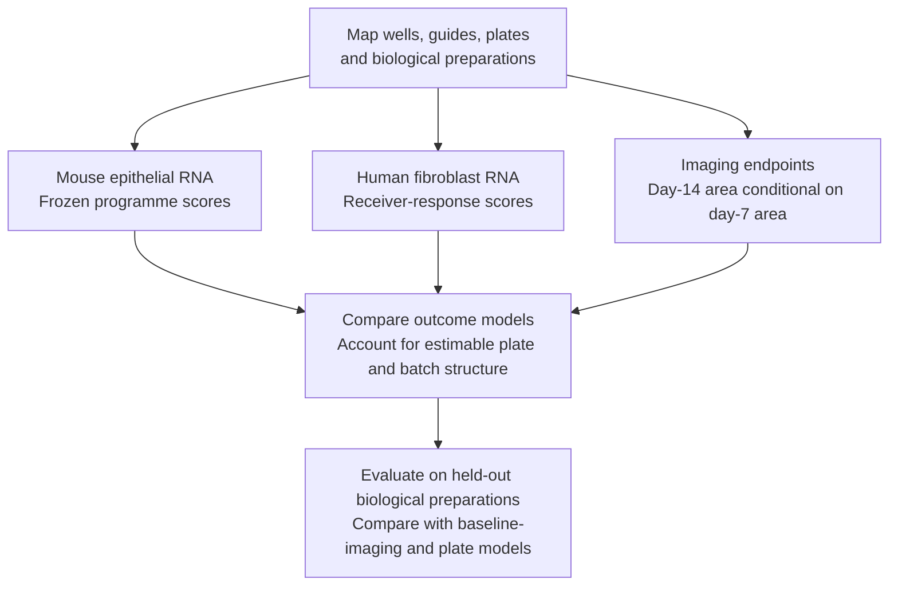

# Research-question figure gallery

25 September 2026. Supporting figures for the [canonical biological questions](../../../RESEARCH_QUESTIONS.md).
Measured observations, measurement diagnostics and proposed designs are labelled
separately. A figure's question ID is a navigation label, not evidence that its
hypothesis has been established. The register contains the current hypotheses;
this gallery retains detailed captions and optional figure designs.

Captions are curated from the previously reviewed register. Scripts generate
assets, plotted tables and panel facts, not the root narrative. The tables linked
in each caption remain the numerical sources. Script 16 owns A1/A3/A4/A5;
script 18 owns the current A2 and A6–A9. Scripts 19–21 prepare/render/validate
A11/A12/A12-S1/A14; see [their report](il1b_context/REPORT.md).
Paper-local A1, Nb1 and ES1 galleries retain their own producers and provenance.

The former `rq_a2_ligands.png` is a historical output, excluded from this current
selection; it must not replace `rq_a2_source_rank.png`. A3's title and display
phase labels now describe days after infection rather than asserted recovery.
Its original image and run record remain preserved; the
[migration record](../../../docs/migrations/2026-09-25-rq-reframing/README.md)
identifies the presentation-only render and preservation checks.

To render selected script-16 panels from existing cached embeddings:

```powershell
python analysis/scripts/16_research_question_figures.py --figures A3 --replot
```

New outputs go to a fresh `analysis/figures/rq/renders/<run>/` directory. A missing
or invalid cache fails instead of silently rebuilding. `--rebuild-embeddings`
is an explicit separate mode. Inspect the new images and their run record before
promoting a selected asset; neither mode replaces curated captions or old runs.

## Figure selection

Depth/resource panels remain available for assessment of the underlying evidence.
The root register specifies the primary endpoint figures needed for each proposed
test; a UMAP, PCA or violin is used only when its inputs and biological unit suit
that purpose. A10/A14 designs are not measured outcomes. A13 joint-model panels
are still conditional on eligibility.

<a id="a1"></a>

## A1. RNA/chromatin measurements — supporting diagnostics

The question-specific [A1 gallery](../../../RQ_Specified/A1_transitional_epithelial_state_distinction/figures/README.md)
now includes verified IRE1α stability, native histone/H3 profiles, one-donor
methylation-domain context and recovered HPCS descendant source composition.
The [second-batch report](../../../RQ_Specified/A1_transitional_epithelial_state_distinction/reports/SECOND_BATCH_REPORT.md)
states their separate experimental units and remaining identity/normalization
holds. These descriptive direct-mark and lineage panels do not upgrade the
historical claim grades attached to the supporting diagnostic below.


*Figure A1. GSE310539 wild-type nuclei: PBS n = 7,340 and SeV n = 8,093. Panels a–d show well, Cldn4/Krt8 co-detection, AT2 RNA score and promoter accessibility on an RNA embedding. Panels e–f compare group scores and detection at matched depth (7,013 RNA UMIs; 3,132 ATAC fragments). Across nine genes with annotated promoter peaks, mean RNA detection is 73% in PBS reference and 57% in SeV transitional nuclei; promoter detection is 7% and 6%. Panels g–i show why per-nucleus accessibility needs depth controls: transitional nuclei have more fragments and fewer zero-signal observations, despite lower accessibility among nuclei with detected signal. These descriptive panels accompany the matched-gene-set and per-well tests for C118/C121/C127; they do not measure cellular fate. Generated by `analysis/scripts/16_research_question_figures.py`; data in `analysis/figures/rq/rq_a1_groups.csv` and `rq_a1_detection_at_budget.csv`.*

<a id="a2"></a>

## A2. AREG sources and ranks — supporting diagnostics


*Figure A2. Panels a–b connect epithelial and myeloid measurements within each of the ten eligible tumour donors, before and after standardization to 1,000 UMIs. Panel c shows AREG–EGFR median donor ranks across four resources in the 22-donor ligand analysis; labels give rank and retained pair-universe size, not a normalized probability. Source detection and ligand ranking use different cohorts. The plots describe expression and resource sensitivity, not secretion or activation. Sources: [per-donor detection](../../../analysis/corrections/ligand/results/c37/per_donor.csv) and [resource summaries](../../../analysis/corrections/ligand/results/lr/resource_summary.csv).*

<a id="a3"></a>

## A3. Population states across infection sampling times — descriptive


*Figure A3. GSE262927. Panels a–d show the myeloid embedding (9,997 cells) by phase, distinguishing alveolar macrophages, interstitial macrophages and inflammatory monocytes. Panels e–h show capillary endothelium (43,359 cells), coloured by the injury-induced capillary score. Panel i shows per-animal iCAP fractions and per-day medians: 2.0% at baseline, 37.5% at 25 dpi and 21.7% at 366 dpi. These are population-composition observations (C3/C12/C13/C15), not evidence that the same cells persist. Data in `analysis/figures/rq/rq_a3_myeloid_by_phase.csv` and `rq_a3_icap_by_day.csv`.*

<a id="a4"></a>

## A4. AT2 Wnt/IL-1 transcript context — descriptive


*Figure A4. GSE310539. Panels a–b show Axin2 and Il1r1 on the wild-type embedding. Panel c shows detection in AT2 nuclei (Sftpc detected; outside the transitional group) across four wells: Axin2 4.4–7.5% and Il1r1 19.3–29.8%. Panel d shows co-detection in 1.0–3.1% of AT2 nuclei. Sparse transcript co-detection does not establish the overlap of pathway activity, reporter history or functional responsiveness (C134–C137/C142). Data in `analysis/figures/rq/rq_a4_detection.csv` and `rq_a4_codetection.csv`.*

#### Wnt source, response and epithelial state after injury

Which fibroblast states carry Wnt-ligand transcripts, and how do epithelial
Wnt transcripts, Wnt-response markers, AT2 identity and proliferation vary
across animals? These measurements separate candidate ligand sources from
receiver responses and functional stemness. They also allow the possibility
that identity maintenance and proliferation vary independently.

[Nb1](../../../Research%20Article/gate1_03_nabhan_2018/nb1/README.md) uses deposited cell labels and
animal-level raw-count summaries in GSE262927. Its earliest injured samples
are day 6; it cannot test the rapid induction described by Nabhan 2018. Only
one baseline and one day-11 AT2 unit pass the primary 50-cell floor, so these
plots support hypothesis generation, not a replicated injury-effect test.
An [independent cohort screen](../../../Research%20Article/gate1_03_nabhan_2018/external_feasibility/README.md)
documents the conditions needed for a follow-up comparison.


*Figure A4b. GSE262927, one point per animal, identified by sample suffix.
The two panels compare the Axin2/Lef1 transcript summary with a published AT2
holdout panel and Mki67/Top2a. Filled points have at least 50 AT2 cells; open
points fall below this eligibility floor. Day is confounded with cohort
characteristics, and the two-gene summaries are not validated pathway or
stemness scores. The [coverage figure](../../../Research%20Article/gate1_03_nabhan_2018/nb1/figures/01_animal_coverage.png)
and [per-gene results](../../../Research%20Article/gate1_03_nabhan_2018/nb1/figures/03_at2_per_animal.png)
show the sampling and transcript-level context.*

<a id="a5"></a>

## A5. Developmental and injury programmes — descriptive motivation


*Figure A5. GSE247130 control wells: P9 n = 12,186; seven weeks n = 7,589; SeV-infected n = 11,773. Panels a–c show an RNA embedding for each well, with Cldn4/Krt8 co-detection at the available depth (12.47%, 2.08% and 1.27%), followed by each transcript separately. Panels d–e compare transcript measurements across wells. The raw detection fractions shown here differ from the common-depth comparison in the text; both require their stated measurement scale. The depth-matched analysis supports the presence of this marker combination during development (C119), without establishing equivalence to an adult injury state. Data in `analysis/figures/rq/rq_a5_wells.csv`.*

#### Source-defined signatures and sample coverage


*ES1 uses 2,000 UMI and label-excluded source definitions. ADI enrichment is
+1.04/+1.21 detection points in neonatal controls and +7.61/+6.53 in injured
adult controls. Only one of 25 external-study animals passes both group floors.
Seven-week control eligibility changes with seed. These are within-well
measurements and coverage checks, not replicated fate inference (C165–C168).*

<a id="a6"></a>

## A6. Macrophage composition — descriptive motivation


*Figure A6. Panels a–b show mean donor cell fractions under each cohort’s deposited macrophage labels. The state labels differ between cohorts and are not treated as harmonized populations. Panel c shows the validation cohort’s proliferating-state share of cells and of E2F/G2M programme transcripts. Values are cohort means, without donor-level uncertainty bars; they motivate composition analysis but cannot establish a within-state effect. Sources: [cell fractions](../../../analysis/corrections/statistics/tables/subtype_cell_fractions.csv) and [transcript contributions](../../../analysis/corrections/statistics/tables/subtype_transcript_contributions.csv).*

<a id="a7"></a>

## A7. Genotype and AT2 identity — descriptive motivation


*Figure A7. GSE247130 AT2 holdout mean gene detection at 2,000 UMIs, shown separately for P9 and SeV-injured adult wells. Lines connect the mean of two technical seeds within each genotype; circles and diamonds show seeds 17 and 29. There is one pooled library per condition, so these points do not supply biological replication or an interaction confidence interval. Reporting both populations reveals how reference shifts affect the labelled–reference contrast. Source: [module scores](../../../Research%20Article/epithelial_state_specificity/results/module_scores.csv).*

<a id="a8"></a>

## A8. Shared/unique programme definitions — supporting diagnostics


*Figure A8. Panel a shows source-list membership: diagonal cells are holdout-list sizes, and off-diagonal cells count shared genes, including 119 between ADI and AT1. Panel b shows labelled-minus-reference detection differences in percentage points, averaged across technical seeds 17 and 29 at 2,000 UMIs. An asterisk marks a sign change between seeds, not statistical significance. All displayed comparisons pass the group floor in both seeds. The external row is one mouse; broad AT1 enrichment and a small late-marker panel do not establish mature fate. Sources: [module overlap](../../../Research%20Article/epithelial_state_specificity/results/module_overlap.csv) and [within-unit effects](../../../Research%20Article/epithelial_state_specificity/results/within_unit_effects.csv).*

<a id="a9"></a>

## A9. Receptor coverage — supporting diagnostics


*Figure A9. Each cell gives the number of scored donors out of 22; retention requires at least 11. Separate rows preserve exact EGFR and EGFR_ERBB2 complex definitions. A dash means no matching row in the inspected canonical coverage table, not biological absence. AREG–EGFR is scored in all 22 donors in four resources, while AREG–EGFR_ERBB2 is scored in seven where listed. The dependence on receptor representation is visible before any activation claim is considered. Source: [receptor coverage](../../../analysis/corrections/ligand/results/lr/canonical_egfr_receptor_coverage.csv).*

<a id="a10"></a>

## A10. Outcome-linked organoid analysis — proposed design



*Figure A10. Conceptual prediction design. Preparation identities define the
validation split; wells from a shared preparation cannot supply independent
validation. Imaging measures organoid growth and morphology, not mature AT1
fate or in vivo repair.*

<a id="a11"></a>

## A11. Epithelial programmes — measured panels and extension menu

**Generated A11:** A, PCA of 70 patient-histology pseudobulks; B, reduced-HPCS
violins for 23 paired patients; C, all seven released paired contrasts;
D, six fixed program differences across 23 LUAD-normal pairs.


**Original panel concepts and optional extensions.** The following design
menu remains broader than the generated figure; dedicated epithelial UMAP
score overlays and gene-component heatmaps have not been generated.

- **A: epithelial UMAP.** Within each cohort, use the same coordinates in
  adjacent panels colored by supported annotation, histology, donor and
  continuous reduced-HPCS/ISR scores. Keep uncertain identities visible.
  No combined repair-to-fibrosis-to-cancer trajectory or cross-cohort distance
  interpretation. This panel localizes heterogeneity; it does not test fate.
- **B: pseudobulk PCA.** Each point is a patient-histology-cell-state aggregate,
  analyzed within cohort and compartment. Show PC variance, patient identity
  and paired normal-lesion connections where verified. Use an unsupervised
  expression-based feature rule, not genes selected for case-control separation.
  PCA is a sample/heterogeneity diagnostic, not a significance test.
- **C: paired program distributions.** Plot individual patient scores and
  paired differences for reduced HPCS and eligible source programs. A violin
  may summarize donor scores where sample size supports a density; retain all
  points. Use dot/slope plots for three IPF pairs and small histology groups.
  Cell-score violins, if added, are descriptive supplements and show donor
  contributions. Do not recalculate a different cell score and present it as
  the released pseudobulk result.
- **D: gene/program heatmap.** Show fixed signature components and overlap
  membership alongside within-study contrasts and measured-gene coverage.
  Separate shared from source-specific members without selecting only positive
  genes. New candidate discriminatory genes remain exploratory and require
  a held-out cohort; no classifier performance claim from these inspected data.

**Decision.** Shared score increases motivate a shared-component hypothesis, while overlap alone cannot establish cell identity. A defensible
neoplasia-specific extension needs reproducible within-study associations,
independent cell-state validation and validation data not used for selection.
Histology differences are cross-sectional, not a progression time course.

**Reuse now:** [human program figure](../../../Research%20Article/gate2_C3_yu_lee_choi_min_2026/figures/human_epithelial_program_specificity.png),
[IPF state figure](../../../Research%20Article/gate2_C3_yu_lee_choi_min_2026/figures/ipf_epithelial_state_specificity.png),
[repair/overlap figure](../../../Research%20Article/gate2_C3_yu_lee_choi_min_2026/figures/epithelial_specificity_and_signature_overlap.png),
[paired values](../../../Research%20Article/gate2_C3_yu_lee_choi_min_2026/trials/u6_human_specificity/paired_program_values.csv).

<a id="a12"></a>

## A12. Recipient components, enrichment and ligand targets — measured panels

**A12 panels.**

- **A: source/recipient dot plot.** IL1A/IL1B in observed sources; IL1R1 and
  IL1RAP in recipients; IL1RN, IL1R2 and SIGIRR in a separate regulatory block.
  Dot size shows the donor-averaged detection fraction and color the
  donor-averaged expression, with eligible n. Keep complex subunits visible.
- **B: paired expression and compatibility plots.** Show patient points or
  donor-score violins with overlaid points for fixed macrophage/fibroblast/
  epithelial labels. Place ligand and receptor component changes beside the
  composite score. Facet independent IPF cohorts; do not connect unpaired
  IPF and control donors. Label omission ranges as robustness, not confidence.
- **C: recipient pathway enrichment dot plot.** Separate fibroblast,
  macrophage and epithelial panels. Include the declared evaluable pathway
  family, with direction, q value, measured set size and sample coverage.
  Show estimated-correlation primary and fixed-0.01 sensitivity side by side.
  The human results are 0/279 versus 148/279 at q<0.05; this model dependence
  is a finding to display, not a reason to hide the primary results.
- **D: ligand-target rank and stability plot.** Compare IL1A/IL1B with eligible
  TGFB1, EGFR-ligand and other prespecified candidates within each receiver's
  fixed comparison. Show candidate denominators, target eligibility and
  omitted-patient rank ranges. An unsigned prior fit is not an activation or
  inhibition measurement. Any ligand-target heatmap must distinguish prior
  weights from observed receiver gene changes.

**Decision.** Look for agreement between within-subtype component changes,
recipient programs and omission stability. RNA agreement remains an
association; NF-kB-like responses and high ligand ranks are not IL-1-specific
causal evidence. The main test includes discordance and ineligible target sets.

**Reuse now:** [human pathway figure](../../../Research%20Article/gate2_C3_yu_lee_choi_min_2026/figures/human_paired_recipient_pathways.png),
[human niche figure](../../../Research%20Article/gate2_C3_yu_lee_choi_min_2026/figures/human_paired_niche_RNA_contrasts.png),
[target figure](../../../Research%20Article/gate2_C3_yu_lee_choi_min_2026/figures/human_ligand_target_eligibility_and_fit.png),
[paired compatibility values](../../../Research%20Article/gate2_C3_yu_lee_choi_min_2026/trials/u5_human_niche/primary_compatibility_patient_values.csv).

**Generated A12 figures:**


The target figure retains all 32 eligible up-target candidates across the
three broad receivers for LUAD-normal in the focused-triad scope. IL1B does
not pass expression eligibility in the macrophage panel. Full contrast,
direction and sensitivity tables remain available in the original reports.

<a id="a12-s1"></a>

### A12-S1. Source identity — enabling diagnostics

**Enabling question.** Do IL1B-expressing cells without confident fine labels
represent coherent cell states, mixed profiles or measurement background?

Unassigned cells carry median IL1B count fractions of 52-72% across human
histologies. This is recovered RNA, not a fraction of tissue cytokine secretion.
Cross-lineage RNA also remains substantial in the mapped populations. See the
[annotation review](../../../Research%20Article/gate2_C3_yu_lee_choi_min_2026/trials/u5_human_full/ANNOTATION_REVIEW.md) and
[source report](../../../Research%20Article/gate2_C3_yu_lee_choi_min_2026/trials/u5_human_sources/REPORT.md).

The generated A12-S1 figure uses 34,178 display cells with a 75-cell cap per
patient/histology/source label, while quantitative source fractions use all
QC cells. The same UMAP coordinates show existing labels, uncertainty and
IL1B RNA; paired source-fraction violins show 23 normal-LUAD patient pairs.


Further annotation-review options: an all-QC UMAP colored by broad identity, confidence,
donor, histology and IL1B; a multi-marker dot plot; QC/confidence violin plots
with donor summaries; and stacked per-patient IL1B count fractions retaining
the unassigned category. Use assay-appropriate background/mixed-profile checks
and independent marker support. A separate UMAP cluster or a relaxed confidence
cutoff does not establish a new macrophage state. Keep original annotations
and any reviewed alternative labels as separately versioned results.

<a id="a13"></a>

## A13. Fibroblast joint associations — proposed panels

**A13 panels.**

- **A: matched-patient heatmap.** Align macrophage IL1B, recipient components,
  fibroblast inflammatory/matrix/trophic programs, eligible CCL2/CCR2 and
  CXCL12/CXCR4 compatibility, and epithelial program scores. Rows are verified
  patient-histology observations; mark missing compartments instead of filling
  them with zero. Separate captured cell fractions from within-state RNA.
- **B: donor-level scatterplots.** Use matched within-patient lesion-normal
  changes where available; show every patient and omission sensitivity.
  Freeze a small set of associations and their multiplicity family before
  fitting. Repeated histologies cannot supply independent patient n.
  “Beyond IL1B” requires an eligible, parsimonious joint model; marginal
  correlations alone cannot establish added explanatory information.
- **C: spatial extension.** Reuse measured human maps as descriptive context.
  Regional enrichment and neighborhood summaries wait for independent
  pathology regions and a suitable patient-level spatial null. Transcript
  hotspots cannot define and then validate their own regions. Mixed spots
  do not identify direct cell contact, and companion assays are not replication.

**Eligibility and decision.** Count complete triads before estimating joint
associations. Existing IPF triad counts (six and three donors) do not reach the
project's ten-unit joint-association floor. Human eligibility must be audited
for the exact variables and paired contrast; 23 cohort patients does not mean
23 complete triads. A floor is not a power guarantee. Weak coverage produces
a coverage panel, not a mediation fit. Replicated association would prioritize
a functional test; it would not demonstrate a feedback loop.

**Reuse now:** [human niche report](../../../Research%20Article/gate2_C3_yu_lee_choi_min_2026/trials/u5_human_niche/REPORT.md),
[spatial report](../../../Research%20Article/gate2_C3_yu_lee_choi_min_2026/trials/u5_spatial_context/REPORT.md),
[measured maps](../../../Research%20Article/gate2_C3_yu_lee_choi_min_2026/figures/human_spatial_measured_maps.png).

<a id="a14"></a>

## A14. Withdrawal and recipient perturbation — proposed experiment

**A14 panels, requiring new evidence.**

The experimental layout is now drawn below; outcome panels B-D still require
new data. No anticipated response curve is presented as a result.


- **A: experimental schematic.** Define transient/sustained exposure and
  withdrawal, with epithelial-only and stromal-containing systems and
  recipient-specific IL1R1 perturbations. Add a macrophage-source arm only
  if separating source effects is an explicit experimental aim. Freeze
  endpoints, contrasts and biological replication before acquisition.
- **B: longitudinal response plots.** Epithelial plasticity and mature-state
  recovery alongside fibroblast responses, with independent culture/animal
  replicates and time-matched controls. Connect repeated measures only when
  the same unit was actually measured repeatedly.
- **C: fate and function.** Replicate-level mature-cell yield, viability,
  organoid function and lineage outcomes; show individual replicates rather
  than treating cells or organoids from one preparation as independent animals.
- **D: protein and target engagement.** Measured mature cytokine release and
  recipient response establish exposure/perturbation context. RNA alone cannot
  measure blockade efficacy, biochemical ISR activation or irreversible fate.

**Decision.** Evidence for fibroblast dependence requires an epithelial outcome
change under a fibroblast-specific intervention with appropriate controls.
Persistence after withdrawal requires observation after withdrawal. Neither
result, on its own, establishes malignant transformation.
