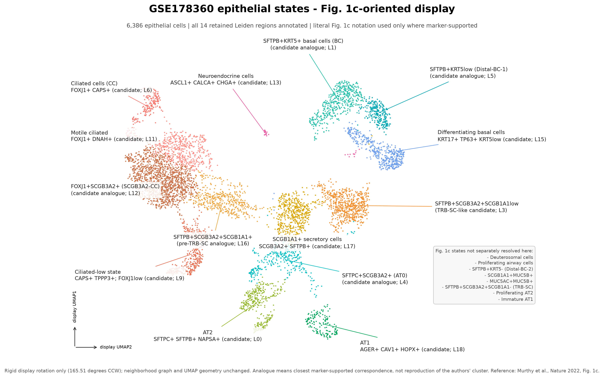
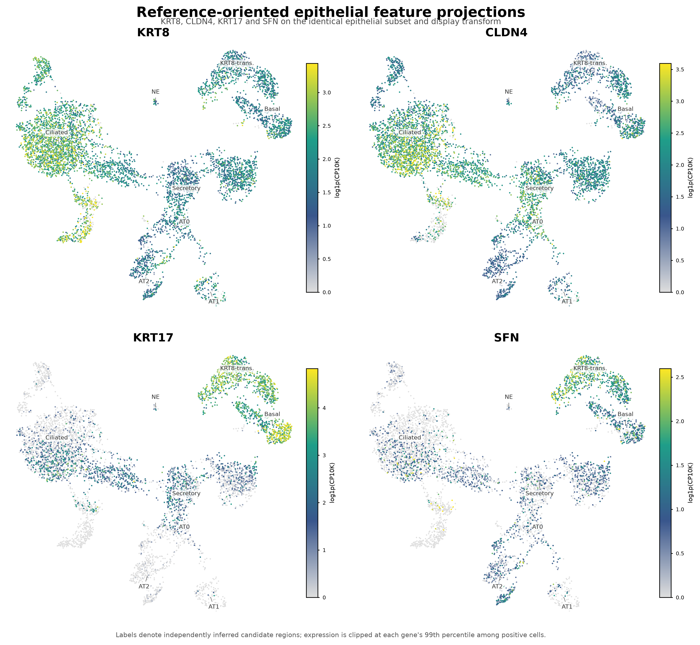

# Displaced narrative: established elsewhere

The material below was part of the repository's main findings (`FINDINGS.md`)
until 2026-09-10. It is established outside this repository, in the owner's
G-SURF submission, which is weighted toward the Krt8-high transitional
epithelial state, and it is kept here as a record of what this repository found
and how. The artefacts and scripts behind it remain in place under `analysis/`
and are still checked by the validator; the narrative is not extended in this
repository. Numbers are quoted exactly as they stood in `FINDINGS.md` on the day
of displacement. Links are relative to this `archive/` directory.

## 1. The alveolar regeneration trajectory is recoverable from raw counts

**Status: Validated** (held-out labels ordered by pseudotime; per-animal
medians).

The paper's central regeneration claim is that AT2 progenitor cells transit
through a Krt8⁺ transitional state on their way to becoming AT1 cells after
injury. Re-derived here on the 25-sample annotated cohort
(5,694 alveolar epithelial cells) with PAGA topology and diffusion pseudotime
rooted in AT2:

With the deposited labels held out, pseudotime orders them exactly as the
model predicts: **AT2 0.013 → transitional 0.179 → AT1/AT2 0.237 → AT1
0.327** (median diffusion pseudotime per label). The transitional state behaves
like a true intermediate in time as well: the **median per-animal proportion**
peaks at **27.4% of alveolar epithelium at 11 dpi** and collapses to **0.3% by
366 dpi**.

Detail: [`analysis/GSE262927/regeneration_focus/`](../analysis/GSE262927/regeneration_focus/) ·
script [`06_regeneration_focus.py`](../analysis/scripts/06_regeneration_focus.py)

## 2. Human epithelial states in the reference orientation

**Status: Descriptive only.** PROGRESS item 15 (trial S2, scArches mapping of
the same cells to the HLCA core) proposes re-wording the AT0 candidate; the
figures below predate that item and still carry the candidate label.

To make the independently derived human epithelial embedding visually
comparable with Murthy et al. Fig. 1c, the epithelial-only object is restricted
to 6,386 epithelial candidates and given a single 165.51-degree display
rotation. No neighbours, UMAP coordinates, distances or cluster memberships
are recomputed. The 1,060 immune, endothelial, plasma and mesothelial
carryover cells are excluded from this figure.

All 14 retained Leiden regions are annotated. Published names are used only
as marker-supported **candidate analogues**, never as transferred author
labels. In particular, Leiden 4 is separated as the thesis-relevant
`SFTPC+SCGB3A2+ (AT0)` candidate, while Leiden 0 is the conventional AT2
candidate. Reference states not separately resolved by this embedding are
listed on the figure rather than invented.

The primary feature panel uses the identical cells and display transform for
`KRT8`, `CLDN4`, `KRT17` and `SFN`. Separate epithelial reference-marker and
off-compartment control panels are provided alongside individual high-resolution
plots under `epithelial_subanalysis/figures/reference_aligned/`.

## 3. Portfolio PDF

The curated portfolio PDF of August 2026
(`lung_scrna_portfolio_thesis_context.pdf`) and the script that wrote it are
archived in [`portfolio_2026-08/`](portfolio_2026-08/). It is a snapshot of the
narrative as it stood then, including the two sections above, and is not
updated.
