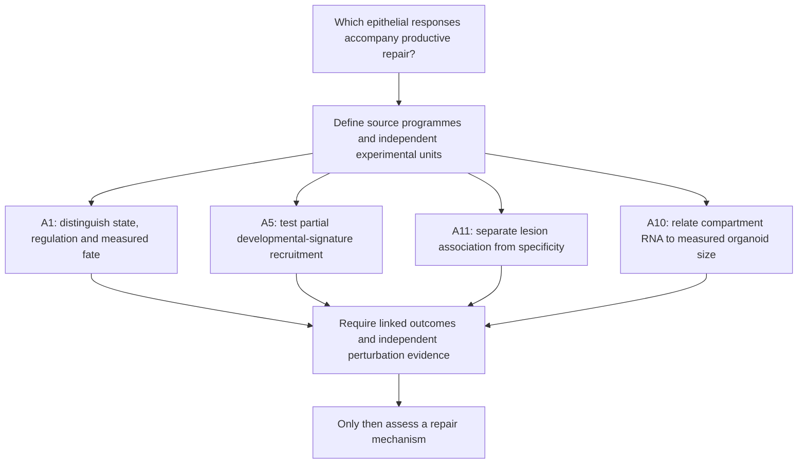

# Logical rationale review after status synchronization

26 September 2026. Reviewed the merged scientific baseline `32ded9b` and its
current documentation. Scope: A1, A5, A11 and A10 evidence chains, their shared
contract, and how they feed the A1–A14 register. This is a logic and implementation
review, not a new raw-data analysis or an independent replication. Historical
claim grades, scripts, frozen specifications and numerical outputs are unchanged.

## Overall assessment

The programme remains biologically motivated, but the supported conclusion is
narrower than a unified repair mechanism. A1 supplies context-sensitive state and
outcome evidence; A5 supports partial recruitment of an external developmental
signature; A11 replicates lesion association without meeting the stronger shared-
response criterion; A10 relates RNA to mean organoid area within an observed screen.
These are complementary questions, not successive stages of one cell lineage.

Biological rationale: AT2 stemness can involve fibroblast Wnt niches and
injury-induced epithelial autocrine Wnt, so the niche source and epithelial
response depend on context. That motivates separate measurements, without
guaranteeing an extra fibroblast RNA signal conditional on epithelial RNA.
[Nabhan et al., primary study](https://pubmed.ncbi.nlm.nih.gov/29420258/).

## Checks that retain the current A1, A5 and A11 interpretations

| Question | Evidence checked | Defensible inference | Remaining logical boundary |
|---|---|---|---|
| A1 | [Regulatory/fate report](../RQ_Specified/A1_transitional_epithelial_state_distinction/reports/REGULATORY_FATE_REPORT.md), mouse-level regional results and source crosswalks | RNA similarity does not by itself identify lineage, regulatory mediation or successful differentiation | The AP-1 regional interaction is descriptive with three mice/genotype and exact p=0.10. HOPX is not mature AT1 function. Resolved HPCS mice do not remove library/chase confounding. |
| A5 | [Revised results](../RQ_Specified/A5_A11_shared_component_contract/reports/REVISED_TEST_RESULTS.md), external module provenance and [plan](../RQ_Specified/A5_developmental_programme_reuse/PLAN.md) | Positive average external-signature detection contrast in 24 mice, surviving specific identity/control exclusions | This is aggregate gene recruitment, not coordinated activation in every cell or developmental identity. Annotation, unlisted stress and single-study generality remain open. |
| A11 | [Revised results](../RQ_Specified/A5_A11_shared_component_contract/reports/REVISED_TEST_RESULTS.md), discovery reproduction and [plan](../RQ_Specified/A11_lesion_programme_addition/PLAN.md) | Lesion association replicates in eight pairs; the stronger criterion remains unmet at beyond-shared BH q=0.0547 | The difference between two score changes is not a nested predictive increment. Tumour epithelium versus normal AT2 changes composition/identity; no non-neoplastic injury arm tests specificity. |
| Shared contract | [Biological logic](../RQ_Specified/A5_A11_shared_component_contract/BIOLOGICAL_LOGIC.md), frozen partition and revised external modules | Common provenance makes definitions comparable | The 12-gene union consists of disjoint 5- and 7-gene overlaps. It is not one demonstrated programme shared by development, injury and lesion. Old 94/51-gene Strunz-filtered modules cannot be treated as independent A5 tests. |

The A5 result does not contradict the prior Strunz observation of poor overall
developmental correspondence: a positive subset average and lack of global identity
can coexist. That counter-observation is already included in the biological logic
and [Strunz primary study](https://pmc.ncbi.nlm.nih.gov/articles/PMC7366678/).
Likewise A11's near-threshold result is uncertainty, not proof of either addition
or absence. There is no reason to change its threshold, comparator or module now.

## A10 corrections

The [revised specification](../RQ_Specified/A10_organoid_growth_outcome/config/a10_revised_specification.json),
[fit implementation](../RQ_Specified/A10_organoid_growth_outcome/scripts/06_fit_revised_grid.py),
[grid](../RQ_Specified/A10_organoid_growth_outcome/tables/revised_grid.tsv),
[per-group table](../RQ_Specified/A10_organoid_growth_outcome/tables/revised_per_unit.tsv)
and [run record](../RQ_Specified/A10_organoid_growth_outcome/tables/revised_run.json)
were checked together. The following corrections qualify the interpretation;
they do not replace the recorded 0.0426 epithelial or -0.0154 fibroblast increment.

1. **Compartment measurement is not causal separation.** Species assignment
   identifies RNA origin. After co-culture, epithelial RNA can include niche
   feedback and fibroblast RNA can reflect abundance or shared conditions. Neither
   is an isolated direct or mediated effect. Conditioning on day-7 area and day-14
   composition proxies also conditions on post-perturbation measurements; it does
   not estimate the perturbation's total effect. The current rationale removes
   the original cell-autonomous interpretation.
2. **The endpoint is mean area.** A larger average organoid is not necessarily
   more total tissue, more viable cells, mature AT1 contribution or functional
   repair. A1 already includes measured non-RNA outcomes, so A10 is not uniquely
   the first outcome-linked question. Both entry-point claims were corrected.
3. **The second specification is adaptive.** It was fixed before its own fits
   but after seeing the original screen results. Cross-validation within that
   same screen does not undo specification selection. In `cells()`, held-out
   outcomes are centred on their own group mean, so the metric answers a
   within-observed-group question, not prospective or unseen-preparation prediction.
   Fifteen deposited groups are not fifteen verified biological preparations.
4. **Margins across scales are not automatically comparable.** Within-group
   centring reduces the outcome total sum of squares. Since
   `delta R2 = (SSE_baseline - SSE_extended) / SST`, a fixed 0.02 requires a
   different absolute error reduction on the new scale. The specification's
   assertion that this is necessarily conservative is unsupported. The frozen
   rule stays intact, and its descriptive pass is retained. The four-cell pattern
   is specification dependence, not a tested biological interaction.
5. **No fibroblast increment does not exclude a niche role.** The epithelial
   block may already encode downstream niche effects; the chosen fibroblast scores
   may omit relevant activity. No uncertainty bound establishes precise absence.
   Global R2 pools well-level squared errors, rather than weighting groups equally.
   Positive increments in 8/15 groups and negative baseline R2 in 7/15 show why the
   pooled result alone cannot establish transport. Plate, target allocation and
   preparation may be confounded; the plate pattern does not identify the cause.
6. **Target-transcript reduction is a limited diagnostic.** The
   [original implementation](../RQ_Specified/A10_organoid_growth_outcome/scripts/03_fit_outcome_models.py)
   compares each targeted transcript with its expression across all other targets,
   without a matched plate/guide contrast. The recorded 58/76 reductions support
   consistency, not editing efficiency in every well, all joins, or a prespecified
   imaging positive control. A binomial count of gene signs does not establish
   independent biological replication. The historical assay-validation language
   was too strong.
7. **Some written tests were not implemented as stated.** The secondary
   specification mentions a BH family, but script 06 emits only increments and
   margin flags, with no p/q values or confidence intervals. It also always adds
   fibroblast features after the epithelial block, and tests secondary blocks after
   both blocks, even when a block was not retained by the stated winner rule.
   Thus these are comparisons against the implemented full baseline, not all the
   proposed retained-model comparisons. This does not change the primary revised
   epithelial comparison, but secondary inference and complete protocol compliance
   must not be claimed. Do not invent an after-the-fact BH procedure.
8. **A limited metadata search is not proof that metadata cannot exist.** The
   [stage 1 report](../RQ_Specified/A10_organoid_growth_outcome/reports/STAGE1_IDENTITY_AUDIT.md)
   inspected three tables and one sample record. This establishes what those
   inspected resources did not resolve; one record cannot establish the absence
   of preparation information from every sample or supplementary source. Keep
   the unit unresolved, and do not declare either independence or impossibility.

## Revised order of follow-up work

These are proposed analysis gates, not newly executed analyses. Each launch should
first reuse the listed precedent and declare the question, comparator and stopping
rule. Later steps can be pruned when an earlier diagnostic makes them uninformative.

| Order | Work and existing reference | What it would resolve / stop rule |
|---|---|---|
| 1 | A10 design/plate diagnostic, starting from the identity audit, joined metadata and per-group errors | Check target and control allocation, day-7/day-14 ranges, RNA quality and missingness by plate. Seek explicit preparation IDs in relevant metadata. If plate and target lack common support, do not label a plate effect biological or fit an unidentifiable correction. |
| 2 | A10 prospective analysis amendment, using the stage 4 specification and code review | Choose the estimand, scale-specific margin, retained baseline and descriptive versus inferential scope; explicitly disposition the unperformed BH and retained-model comparisons. For held-out evaluation, fit transformations on training data wherever appropriate; retain a separate label for metrics requiring held-out outcome means. |
| 3 | A simpler growth comparison and plate holdout, only if order 1 supports them | Predefine a proliferation block versus the remaining growth programmes; correlated single genes are not independent mechanisms. Hold out entire plates and state target overlap. With only four plates and unresolved preparations, this remains a stress test of transport, not independent confirmation. Do not add more pathways solely to rescue a failed comparison. |
| 4 | Target-level checks only when they answer an identified uncertainty | Establish guide/editing efficiency and matched controls before connecting a perturbed member to a module. A marker need not be necessary for organoid growth; a positive knockout effect need not validate the whole programme. |
| Separate data-dependent paths | A1 reference map; A5 and A11 final results | A1 needs matched replicated regulation/outcome measurements; A5 needs another eligible adult-injury cohort for generality; A11 needs comparable human non-neoplastic injury and supported epithelial identity for specificity. A10 is not a substitute for any of these. |

The remaining register questions retain their own gates: A2/A9/A12 need
source/recipient-specific evidence; A3 needs age-comparable sampling; A4 needs
activity history and lineage; A7 needs replicated genotype-by-state data; A8
needs mature endpoints; A13 needs sufficient complete donor triads; A14 needs
withdrawal and recipient-specific interventions. A6 remains a conditional
within-state analysis and was not reinstated as the next priority.

## Review and preservation record

Current entry points were synchronized before this review. Historical plan/run
files are not living status documents: a frozen `declared_not_fitted` field is
retained when a later run record proves execution. Dated interpretation addenda
point to this review so earlier reasoning remains inspectable. The original
reports' numerical tables and all scientific outputs are unchanged. No author
message, Notion expansion or new scientific fit was performed.

Verification: the cited A10 increments, 8/15 positive groups, 7/15 negative
baselines, four passing sensitivity settings and 58/76 transcript reductions
were checked directly against tracked tables. No secondary p/q columns exist.
Repository validation passed 2,388 documentation/artifact checks; the change
contains only Markdown and preserves all scientific code and numerical outputs.
