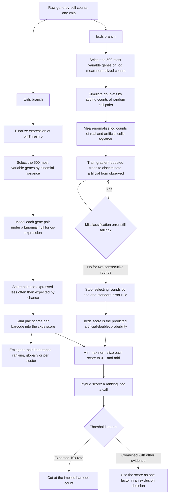

# scds — co-expression and classifier-based doublet scoring

> **Reference only — scds was NOT used in this repository's analysis.**
> This page documents doublet detection as published. The analysis in
> [`analysis/`](../analysis/) performed **no doublet detection**. See
> [`PIPELINE_AS_RUN.md`](PIPELINE_AS_RUN.md) for what was actually executed.

Bais AS, Kostka D. *Bioinformatics* 2020;36(4):1150–1158.
[doi:10.1093/bioinformatics/btz698](https://doi.org/10.1093/bioinformatics/btz698) ·
Bioconductor [scds](https://bioconductor.org/packages/scds/)

Two independent scoring strategies over raw counts, combined into a `hybrid`
score. `cxds` asks whether a barcode co-expresses gene pairs that rarely co-occur;
`bcds` trains a classifier to separate artificial doublets from real data.

**Position:** alongside Scrublet, after ambient correction.
**Scope:** one chip or batch at a time. R, on a `SingleCellExperiment`.

---

## Inputs and outputs

| | |
|---|---|
| Requires | Raw gene-by-cell counts. No clustering, no markers, no dimensionality reduction |
| Returns | Per-barcode `cxds`, `bcds`, and `hybrid` scores; plus a gene-pair importance ranking from `cxds` |
| Does not return | **A doublet call, or a count.** scds ranks; it does not threshold |

That last row is the defining property. The authors state plainly that they do
not estimate the number of doublets in a dataset — they score and rank
barcodes. The threshold is yours to impose and yours to justify.

---

## Schematic

---

## Parameters

| Parameter | Value | Note |
|---|---|---|
| `binThresh` | 0 | Gene counted as expressed when counts exceed the threshold |
| `ntop` | 500 most variable genes | Results are largely robust to this choice |
| `xgboost` settings | Package defaults, untuned | Deliberate: with only four benchmark datasets the authors avoided overfitting. Tuning "could in principle lead to substantial improvements" |
| Training rounds | Five-fold CV with the one-standard-error rule; stop after two rounds without improvement | A fixed seven rounds is used in the timing benchmark |
| `hybrid` combination | Min-max each score to [0,1], then add | No weighting parameter |

Runtime at 12,000 cells on four cores: `cxds` about 2 seconds, `bcds` about 26
seconds. Both are inexpensive enough to run on every library without thought.

---

## Benchmark position

Averaged over four datasets with experimental doublet annotation:

| Method | AUROC | AUPRC |
|---|---|---|
| Library size (baseline) | 0.76 | 0.29 |
| Feature count (baseline) | 0.78 | 0.33 |
| `cxds` | 0.83 | 0.56 |
| Scrublet | 0.83 | 0.60 |
| `bcds` | 0.84 | 0.56 |
| **`hybrid`** | **0.85** | **0.62** |
| DoubletFinder | 0.86 | 0.67 |

`hybrid` beats both of its components on average and beats the naive baselines
on every dataset. **No method dominates all others**, and the ranking changes
between datasets.

---

## Failure modes

| Mode | Consequence |
|---|---|
| Homotypic doublets | Detected far more weakly than heterotypic ones |
| A contributing cell type absent as a singlet | Undetectable, same structural assumption as Scrublet |
| Treating the score as a call | There is no threshold. Silently picking one and not reporting it is the most common misuse |
| Low library size | All methods degrade; performance is best in the upper library-size deciles |

The benchmark's sharpest finding: in every dataset except the species-mixing
control, **a sizeable set of experimentally annotated doublets was recovered by
no method at all**. True positives are largely shared across methods; what
differs between methods is their false positives. A clean doublet score is
therefore weak evidence that a population is genuine.

That is precisely the situation the reference study faced. See
[`WORKFLOW_Niethamer2025.md`](WORKFLOW_Niethamer2025.md) for how it was resolved: an `AT1_AT2`
population was retained because its UMI and feature counts sat in line with
other epithelial cells and the state had been described previously, while a
CAP1/CAP2 mixed endothelial cluster was discarded because its counts were
dramatically elevated.
