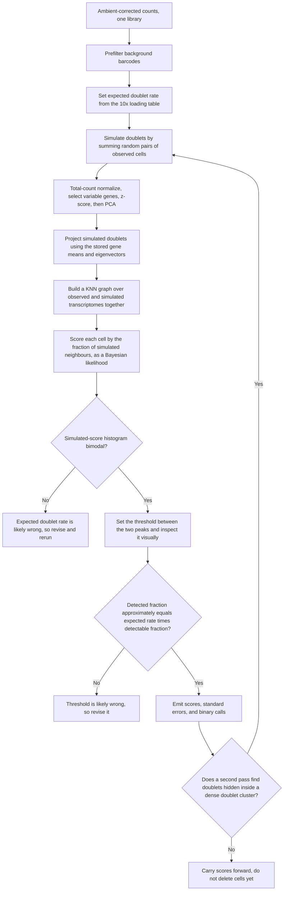

# Scrublet — simulation-based doublet detection

> **Scrublet WAS used in this repository's analysis** — run per 10x capture
> before merging. Note two deviations from this page: the automatic threshold
> was rejected in 32 of 33 mouse samples (non-bimodal score histograms) in
> favour of the 10x expected-rate quantile, and the calls are measurably biased
> against lineage-co-expressing cell types. See
> [`PIPELINE_AS_RUN.md`](PIPELINE_AS_RUN.md).

Wolock SL, Lopez R, Klein AM. *Cell Systems* 2019;8(4):281–291.e9.
[doi:10.1016/j.cels.2018.11.005](https://doi.org/10.1016/j.cels.2018.11.005) ·
[github.com/AllonKleinLab/scrublet](https://github.com/AllonKleinLab/scrublet)

Simulates doublets by summing random pairs of observed transcriptomes, then
asks how many of each real cell's nearest neighbours are simulated. Requires no
clustering, no marker genes, and no expert annotation.

**Position:** after ambient correction, before count-based filtering.
**Scope:** one library at a time. Python; the rest of this pipeline is R.

---

## Inputs and outputs

| | |
|---|---|
| Requires | Raw counts for **called cell barcodes only**, and an expected doublet rate |
| Returns | Per-cell doublet score, its standard error, a binary call, and the detectable doublet fraction `f_D` |
| Does not detect | Doublets of two transcriptionally similar cells |

---

## Schematic

The two consistency checks are free and both should be reported. Note that the
threshold is set on the distribution of **simulated** scores, not observed
ones, and that the final node deliberately stops short of deletion — see
[`../WORKFLOW.md`](../WORKFLOW.md) for the combination rule.

---

## Parameters

| Parameter | Value |
|---|---|
| Expected doublet rate `r̂` | From the 10x loading table, roughly 0.8 percent per 1,000 cells recovered. Set per library, never as a constant |
| `k`, neighbours | `round(0.5 · sqrt(n_cells))` |
| `r`, simulated-to-observed ratio | At least 2; the source paper used 5–10 |
| Variable gene defaults | At least 3 counts in at least 3 cells, top 15 percent by V-score |
| Graph size | `k_adj = round(k · (1 + r))` |
| Threshold | Between the two peaks of the simulated-score histogram; `skimage.filters.threshold_minimum` automates it, but the authors still recommend visual inspection |

The expected doublet rate rescales scores monotonically and preserves cell
ordering, so it does not change AUC — it changes where the threshold lands.

---

## Failure modes

| Mode | Consequence |
|---|---|
| Two cells of the same or similar type | Undetectable. Same-cluster doublets are "virtually indistinguishable from singlets" |
| A contributing cell state absent as a singlet | Undetectable. Demonstrated in sorted KIT+ bone marrow, where macrophage–erythroblast doublets could not be found because macrophages had been sorted out |
| Incomplete dissociation producing stereotyped clumps | Underperforms; the method assumes random co-encapsulation |
| Libraries pooled before scoring | Expected doublet rate no longer corresponds to any channel's loading density |

The neotypic/embedded distinction is **operational, not biological**: it depends
on the dimensionality reduction used. The same doublet can be detectable under
one projection and invisible under another.

Reported performance: ROC AUC 0.99 on a species-mixing control with 98 percent
recall, but recall under 10 percent for poorly separated groups. The detectable
fraction `f_D` predicts recall accurately and should be reported with every run.

---

## Relationship to scds

Scrublet and [scds](SCDS.md) are run together because they fail differently —
Scrublet on neighbourhood composition, scds on gene co-expression. Both share
the same two structural assumptions: doublets are rare, and every cell state
contributing to a doublet is present as a singlet.

Neither is sufficient on its own. In the reference study, doublet score alone
decided neither ambiguous population; the arbiter was score plus UMI and
feature distribution relative to the compartment plus prior literature.
