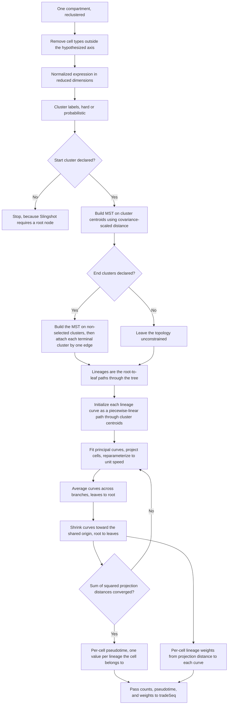

# Slingshot — lineage topology and pseudotime

Street K, Risso D, Fletcher RB, Das D, Ngai J, Yosef N, Purdom E, Dudoit S.
*BMC Genomics* 2018;19(1):477.
[doi:10.1186/s12864-018-4772-0](https://doi.org/10.1186/s12864-018-4772-0) ·
Bioconductor [slingshot](https://bioconductor.org/packages/slingshot/)

Two stages: a minimum spanning tree over cluster centroids gives the lineage
topology, then simultaneous principal curves give per-cell pseudotime and
per-cell lineage weights.

**Position:** after annotation and subclustering, before tradeSeq.
**Scope:** one compartment at a time, on a supervised subset.

---

## Inputs and outputs

| | |
|---|---|
| Requires | **Normalized** expression in a reduced-dimension space, cluster labels, and a declared start cluster |
| Optional | Declared end clusters, which are constrained to a single MST edge |
| Returns | Per-cell pseudotime for each lineage, and per-cell lineage weights |
| Does not return | Any uncertainty estimate. Point estimates only |

Slingshot is deliberately agnostic about what comes before it. It is also not a
remedy for what comes before it: the authors state that while it typically
follows normalization, dimensionality reduction, and clustering, "it is not a
method for addressing these problems."

---

## Schematic

The first node is the supervision step, and it is the most consequential
decision in the diagram. See below.

---

## The two knobs that decide the answer

Neither is reported in the reference study. Both must be chosen and stated.

**Number of clusters K.** In the source paper's own simulations, too few
clusters made Slingshot **miss the branching event entirely** — at K = 3 the
inferred pseudotimes matched neither true lineage. Too many produced spurious
branches, with accuracy degrading slowly as the method began to overfit. The
clustering *algorithm* mattered far less: hierarchical, k-means and
Gaussian mixture models gave similar accuracy distributions. Since the
reference study chooses subclustering resolution "empirically" between 0.4 and
1.2, K is effectively a free parameter. Report the resolution and the resulting
cluster count for every trajectory.

**Dimensionality reduction and dimension count.** Reported as having "a
potentially large impact on the final result". On identical simulated data,
3-dimensional PCA gave highly variable accuracy while 4-dimensional PCA gave
consistently high accuracy. There is no safe default, and Slingshot
deliberately does not choose one for you.

---

## Algorithm details worth knowing

| Element | Choice |
|---|---|
| MST distance | Covariance-scaled, Mahalanobis-like — "essentially a multivariate t-statistic". Full covariance by default, diagonal fallback for small clusters |
| Why not Euclidean | With plain Euclidean distance the olfactory epithelium lineage structure "could not have been recovered" — a spurious early branch appears |
| Curve initialization | Piecewise-linear path through cluster centroids, not the first principal component |
| Parameterization | Unit speed, so arc length equals pseudotime |
| Shrinkage weight | Cosine kernel, bandwidth 1/6, with full shrinkage at the origin so all lineages share a start point. Final curves are "highly robust to the choice of kernel" |
| Outlier rule for the shrinkage window | 1.5 × IQR |

---

## Supervision, and what it means for interpretation

The reference study's trajectories are **supervised**: other cell types were
removed from the data during trajectory identification so that each trajectory
follows a known or hypothesized axis of differentiation. Excluded cells are
rendered grey in the published figures.

This is legitimate and common, but it changes what the result means.
**A supervised trajectory does not discover a lineage — it measures progression
along a lineage you have already asserted.** Every trajectory in the reference
study is a hypothesis test of a pre-specified axis, not unbiased lineage
inference. State this plainly in any methods section.

Trajectories built in the reference study:

| Trajectory | Start → end | Established |
|---|---|---|
| Myeloid A | `iMON_b` → `iMON_a` → `aMAC_b` → `aMAC_a` | Monocyte-derived reconstitution of alveolar macrophages; lipid and surfactant catabolism programs |
| Myeloid B | `iMON_b` → `iMAC` | Contrasting axis; host defence, complement, MHC class II |
| Alveolar epithelium | AT2 → transitional → AT1 | `AT1_c` as an immature, persistent AT1 state |
| Capillary endothelium | CAP1 / CAP2 → iCAP | Bidirectional origin of the injury-induced state |

---

## Failure modes

| Mode | Consequence |
|---|---|
| No start cluster | Will not run. The root is required, not inferred |
| Interior node named as root | Produces two lineages, one per leaf — probably not what was intended |
| Disconnected biology | Outside the model. The MST is a single connected tree by construction |
| Clusters of four cells or fewer | Removed in the source paper's own protocol before rerunning |
| Sharp rather than smooth branching | Disadvantages Slingshot and other smoothness-assuming methods |

Two uncertainty sources are named and neither is quantified: **structural
uncertainty** in assigning cells to lineages, and **temporal uncertainty** in
pseudotime. The authors suggest bootstrapping the whole upstream pipeline if
the supervision can be automated. Downstream, [tradeSeq](TRADESEQ.md) treats
pseudotime as fixed and known, so none of this uncertainty propagates into
p-values.

In the tradeSeq benchmark, Slingshot recovered the correct topology in 10 of 10
bifurcating datasets, against 3 of 10 outright failures for Monocle 2 and 4 of
10 for GPfates.
