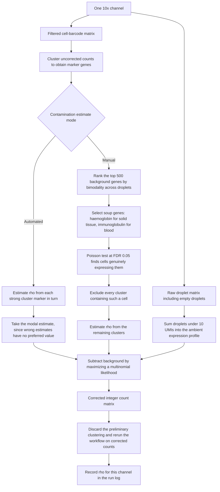

# SoupX — ambient RNA removal

> **Reference only — SoupX was NOT used in this repository's analysis.**
> This page documents ambient-RNA correction as published. The analysis in
> [`analysis/`](../analysis/) performed **no ambient-RNA correction**. See
> [`PIPELINE_AS_RUN.md`](PIPELINE_AS_RUN.md) for what was actually executed.

Young MD, Behjati S. *GigaScience* 2020;9(12):giaa151.
[doi:10.1093/gigascience/giaa151](https://doi.org/10.1093/gigascience/giaa151) ·
[github.com/constantAmateur/SoupX](https://github.com/constantAmateur/SoupX)

Estimates the cell-free RNA background in a droplet experiment and subtracts it,
returning corrected integer counts that drop into any downstream tool.

**Position:** first computational step after alignment, before doublet calling.
**Scope:** one 10x channel at a time. The soup profile is experiment-specific.

---

## Inputs and outputs

| | |
|---|---|
| Requires | Raw droplet matrix **including empty droplets**, the filtered cell matrix from the same channel, and a preliminary clustering |
| Returns | Corrected integer count matrix, plus the estimated contamination fraction ρ |
| Does not return | Imputed values. SoupX subtracts; it does not fill in. |

SoupX is the only tool in this pipeline that needs the unfiltered matrix. Keep
STARsolo's raw output — empty droplets cannot be reconstructed after cell
calling.

---

## Schematic

The preliminary clustering exists only to find marker genes, so it does not
need to be good. Any sensible clustering yields consistent estimates. This does
mean the pipeline contains an unavoidable loop: cluster, correct, recluster.

---

## Parameters

| Parameter | Value | Note |
|---|---|---|
| `N_emp`, UMI ceiling defining an empty droplet | Under 100 works; best under 10 | The paper used ≤ 10 |
| Contamination fraction ρ | Constant within a channel | Highest in the lowest-UMI droplets, near-constant across the rest of the range |
| Estimation mode | Automated modal estimate, or manual soup genes | Manual is preferable when biology supplies a clean zero-expression set |
| Solid-tissue marker choice | Haemoglobin genes | Red cell lysis makes haemoglobin ubiquitous in the soup and exclusive to erythrocytes |
| Cell selection test | Poisson, FDR 0.05 | Then exclude the whole cluster, not just the cell |

Reported contamination in the source paper: roughly 1–2 percent in a
species-mixing control, 5–6 percent in PBMC data.

---

## Why this step is load-bearing in lung tissue

Dissociated AT2 cells release surfactant transcripts — *Sftpc*, *Sftpb*,
*Scgb1a1* — at extreme abundance. These appear as low-level expression in
endothelial and immune cells that never transcribed them.

The reference study's central claim is that capillary endothelial cells acquire
non-canonical programs: MHC class II, glycolysis, *Sparcl1*, *Ntrk2*.
Uncorrected soup is a direct alternative explanation for that observation, so
ambient correction is a control on the result rather than general hygiene.

Two findings from the source paper sharpen the point:

- Widespread *HBB* outside the erythroid lineage in fetal liver was
  **contamination, not doublets**. Ambient RNA and doublets present the same
  way, which is why correction must come first.
- Correcting the soup **increased cross-batch mixing entropy**. Ambient RNA
  manufactures batch effects. Across an eight-timepoint design those would read
  as time-dependent biology.

---

## Failure modes

| Mode | Consequence | Mitigation |
|---|---|---|
| Raw matrix discarded after cell calling | SoupX cannot run at all | Preserve STARsolo raw output per library |
| Channels pooled before correction | Single ρ applied to channels with different soup | Correct per channel, always |
| Marker gene not actually specific | ρ overestimated for that gene | Automated mode's modal estimate is robust to this; individual estimates are not |
| ρ set too high | Genuine low-level expression trimmed | Comparatively safe — background is preferentially removed from genes closest to the soup, so true markers survive. Overcorrecting is the safer error |

The method assumes relative gene abundance in the background does not differ
between cells within a channel.
