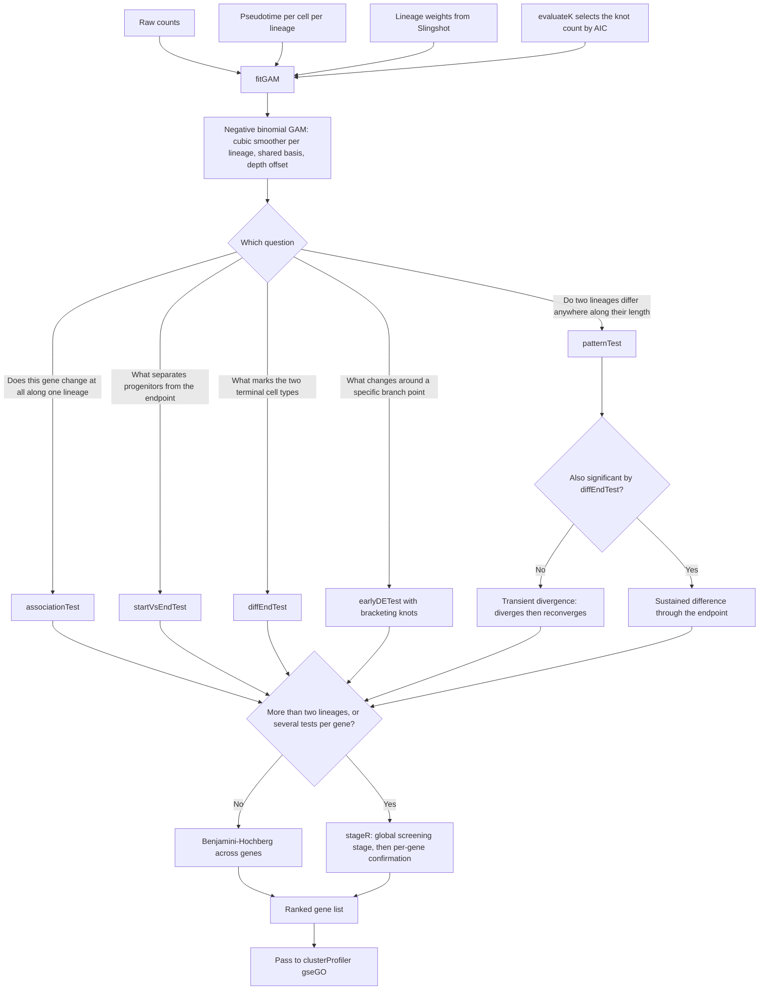

# tradeSeq — trajectory-based differential expression

> **Reference only — tradeSeq was NOT used in this repository's analysis.**
> This page documents trajectory-based differential expression as published. The analysis in
> [`analysis/`](../analysis/) performed **no trajectory-based differential expression**. See
> [`PIPELINE_AS_RUN.md`](PIPELINE_AS_RUN.md) for what was actually executed.

Van den Berge K, Roux de Bézieux H, Street K, Saelens W, Cannoodt R, Saeys Y,
Dudoit S, Clement L. *Nature Communications* 2020;11(1):1201.
[doi:10.1038/s41467-020-14766-3](https://doi.org/10.1038/s41467-020-14766-3) ·
Bioconductor [tradeSeq](https://bioconductor.org/packages/tradeSeq/)

Fits a negative binomial generalized additive model per gene along pseudotime,
then answers different biological questions through different contrasts on the
same fitted smoothers.

**Position:** immediately after [Slingshot](SLINGSHOT.md).
**Scope:** one trajectory set at a time.

---

## Inputs and outputs

| | |
|---|---|
| Requires | **Raw counts**, per-cell pseudotime, and per-cell lineage weights. Exactly three things |
| Optional | A matrix of known cell-level covariates — batch, age, sex — fitted as fixed effects |
| Returns | Fitted smoothers per gene per lineage, and Wald test statistics for the contrast you ask for |

Do not pre-normalize. Sequencing depth enters the model as a `log(N_i)` offset,
not as transformed input. Passing normalized values breaks the count model.

---

## Schematic

`associationTest` is the one matching the reference study's phrase "genes that
varied along the pseudotime trajectory", and is therefore what fed its gseGO
analysis.

---

## Choosing the knot count

| | |
|---|---|
| Package default | `K = 6` |
| Selection | `evaluateK`, using **AIC** |
| Why not BIC | BIC "seemed to favor overly complex models", i.e. an excessively high knot count |
| Knot placement | Quantiles of pseudotime by default |
| Values chosen in the source paper | 3–6 across simulations; both real 10x datasets landed on 6 |

Sensitivity differs by test: `patternTest` is "unaffected by the change in the
number of knots", while `diffEndTest` is "somewhat sensitive" to it.

---

## Model details

The smoothing basis functions are **identical across all genes and all
lineages**, and the smoothing parameter is shared across lineages. This is not
an implementation detail — it is what makes between-lineage contrasts valid at
all. The stated reason is "to ensure that the smoothers are comparable across
lineages."

| Element | Choice |
|---|---|
| Distribution | Negative binomial; dispersion estimated jointly with the regression coefficients |
| Normalization | Cell-specific `log(N_i)` offset |
| Penalization | Smoothing parameter selected by generalized cross-validation |
| Tests | Wald tests on contrasts, chi-squared asymptotic null |
| `patternTest` and `earlyDETest` | Compare at `M = 100` equally spaced pseudotime points, which normalizes for lineage length |
| Zero inflation | Optional, via ZINB-WaVE observation weights. Intended for full-length protocols such as SMART-Seq; not applied to 10x data |

---

## The caveat that bites the reference study

The reference study rescales pseudotime linearly to 0–1 so that trajectories of
different lengths share an axis.

**A linear rescale is not what makes pseudotimes comparable across lineages.**
The tradeSeq authors warn about exactly this: if one lineage is longer, a gene
with a genuinely identical expression pattern can occupy 75 percent of the
short lineage and 25 percent of the long one, and `patternTest` will call it
differentially expressed. Their recommended remedy is **dynamic time warping**
before comparison.

Two things follow. First, `patternTest` already length-normalizes internally by
evaluating at M equally spaced points, so the 0–1 rescale is a plotting
convenience and should not be relied on as a statistical correction. Second,
tradeSeq only ingests pseudotime values, so pre-warped pseudotimes can be
passed straight in if warping is warranted.

---

## Failure modes

| Mode | Consequence |
|---|---|
| Normalized counts passed in | Breaks the count model and its offset |
| Poor upstream trajectory | Dominates everything. `diffEndTest` "performs poorly" downstream of Monocle 2 and GPfates because endpoints are ill-defined or artificially extended |
| Lineages of very different length compared with `patternTest` | False positives, as above |
| Treating p-values as calibrated | See below |
| Convergence failure | About 0.8 percent of 14,261 genes failed to fit in the source paper's own case study |

Pseudotimes are treated as **fixed and known**. The model conditions on them
and "ignores the fact that pseudotimes are typically inferred random
variables." Neither tradeSeq, BEAM nor GPfates propagates that uncertainty.

More pointedly: because the same data are used for trajectory inference and for
differential expression, the authors twice state they "view the p-values simply
as useful numerical summaries for ranking the genes for further inspection."
Adopt that framing.

---

## Multi-condition designs

The 2020 paper has **no `conditionTest`** — it was added to the package after
publication. Its only mechanism for conditions is the fixed-effect covariate
matrix in `fitGAM`, explicitly named for batch, age, sex and treatment.

Comparing trajectories *between* conditions or timepoints is not addressed by
the cited paper. If the analysis requires it, the method needs its own
justification and its own citation.
